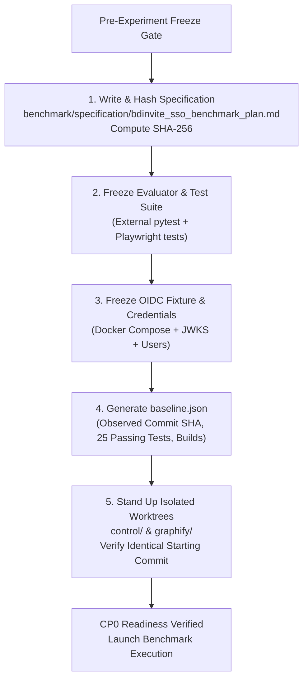
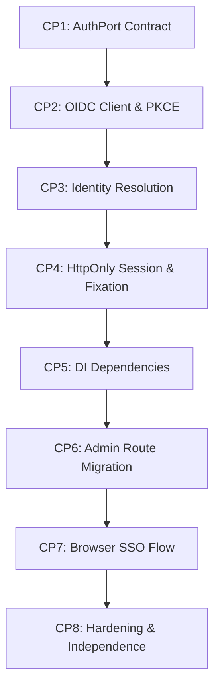

# Implementation Plan: BDInvite SSO Benchmark & Checkpoint Roadmap (Frozen Specification v6)

## Goal Description
Establish a controlled, reproducible A/B benchmark comparing two autonomous agents implementing application-level OpenID Connect (OIDC) Single Sign-On (SSO) in the `bdinvite` repository:
1. **Control Agent**: Standard repository exploration and toolchain (`grep`, `find`, `view_file`, `git`, etc.).
2. **Treatment Agent (Graphify)**: Standard toolchain **plus** Graphify-augmented exploration (`graphify query`, `graphify path`, `graphify explain`, and `graphify update .`).

### Core Architectural Invariant: Hexagonal Authentication Boundary
The benchmark moves authentication from an infrastructure property (Traefik reverse proxy + Authelia ForwardAuth + `Remote-User` header inspection) into a **decoupled application port (`AuthPort`)**:
* **Strict Separation of Authentication vs. Authorization**:
  - **Authentication ("Who are you?")**: Handled by `AuthPort`, which resolves requests into typed `Identity` objects carrying standard attributes and group memberships (`groups: list[str]`).
  - **Authorization ("What are you allowed to do?")**: Handled exclusively by the **Application Domain**, which evaluates application policies against `identity.groups` (e.g., `"bdinvite_admins" in identity.groups`). `AuthPort` does not own authorization decisions.
* **Identity Origin Integrity**: `Identity` contains only claims authenticated and validated by the authentication module. Application code must **never** construct an authenticated `Identity` directly from unvalidated request-controlled data (headers, query parameters, body).
* **OIDC Authentication Module**: Implements `AuthPort` and communicates with any standards-compliant OIDC Provider through a generic OIDC client (discovery, PKCE/state/nonce, token exchange, JWKS signature validation).
* **Deployment Independence**: The exact same codebase runs:
  - Locally / standalone against a disposable standards-compliant OIDC test container.
  - In homelab production against **Authelia configured as an OIDC Provider**, reducing Traefik strictly to TLS termination and reverse-proxy routing (zero ForwardAuth middleware).

---

## Epistemic Roles of Benchmark Artifacts

The experiment maintains a strict division of artifact roles across three distinct locations:

| Artifact | Location | Epistemic Role | Mutability |
| :--- | :--- | :--- | :--- |
| **Canonical Engineering Plan** | `Brain/01-plans/bdinvite/sso-benchmark-roadmap.md` | Vault knowledge graph, project topology, roadmap | Mutable across project lifecycle |
| **Immutable Benchmark Snapshot** | `benchmark/specification/bdinvite_sso_benchmark_plan.md` | Concrete experimental input; hashed (SHA-256) | **Immutable / Frozen** |
| **Machine Event Ledger** | `Brain/00-inbox/commit-log.csv` | Lossless event capture from `commit-logger` | Append-only raw data |

---

## Frozen Experimental Invariants & Decisions

1. **Authentication vs. Authorization Separation**:
   - `AuthPort` defines only authentication mechanics: `current_identity(request)`, `login(request)`, and `logout(request)`.
   - `Identity` carries `subject`, `email`, `name`, and `groups: list[str]`.
   - Group authorization is an application-domain policy: `require_group("bdinvite_admins")` verifies `"bdinvite_admins" in identity.groups`.
2. **Identity Origin Integrity**:
   - Identity fields must be derived exclusively from claims contained in the cryptographically validated ID token / validated OIDC authentication result. Unvalidated userinfo or request data must not be used to construct `Identity`.
3. **Session Contract & Session Fixation Protection**:
   - Browser session uses `HttpOnly: true` and an explicit `SameSite` policy. No bearer tokens exposed to JavaScript.
   - Successful authentication must establish a **new session identifier**; an existing pre-authentication session identifier must not be promoted into an authenticated session (`pre_auth_session_id != post_auth_session_id`).
   - `Secure` flag contract: `Secure=True` in production; configurable (`Secure=False`) in the local HTTP test environment so browsers do not reject cookies over local test ports.
   - Internal storage (client-side encrypted/signed vs server-side SQLite table) is left to the agent's architectural discretion.
4. **Provider Model & Group Claim**:
   - The test fixture uses a standards-compliant disposable OIDC provider container pre-seeded with discovery, JWKS, and standard users.
   - The fixture's group claim is frozen as `"groups": ["bdinvite_admins"]` (for admin) and `"groups": ["guests"]` (for guest). The auth module maps this configured claim to `Identity.groups`.
5. **Git Workflow Invariant (Subagent Delegation)**:
   - At every meaningful implementation milestone required by the roadmap, the primary implementation agent **must recruit the `git-commit` skill via subagent delegation** (`invoke_subagent` with Role: "Git History Custodian").
   - **Both Control and Treatment agents MUST use the identical `git-commit` workflow.**
   - **Graphify is explicitly excluded from the `git-commit` subagent's toolset and prompt.** The experimental variable remains strictly confined to the primary agent's repository exploration.
   - The benchmark harness records the resulting commit SHA, parent SHA, subject, checkpoint, and timing. The harness itself **never** creates implementation commits.
   - Commits created solely to manipulate benchmark metrics without meaningful code/test changes are prohibited.
6. **Graphify Lifecycle Rules**:
   - The Graphify agent may run `graphify update .` whenever repository changes make the existing graph stale.
   - Every graph update, query, path, and explanation is recorded in telemetry under `graph_lifecycle`.
   - The prompt does **not** force the agent to use Graphify; Graphify is simply available as an additional capability alongside standard tools.
7. **Evaluator Immutability Barrier**:
   - Neither agent may alter the roadmap, checkpoint definitions, verification test suite, test credentials, or telemetry logger. All evaluation occurs via an external test runner outside the agents' worktrees.

---

## Pre-Experiment Preparation & Freeze Phase

Before either implementation agent touches a worktree, the experiment harness executes the **Pre-Experiment Freeze Gate**:



1. **Specification Hashing**:
   - Write immutable snapshot to `/home/kiskaadee/Projects/tests/bdinvite-benchmark/specification/bdinvite_sso_benchmark_plan.md`.
   - Calculate and record its SHA-256 hash in `manifest.json`.
2. **Evaluator Freeze**:
   - Scaffold external evaluation scripts and test suites under `benchmark/evaluator/`.
3. **Fixture Freeze**:
   - Stand up the disposable OIDC provider container (pre-seeded with discovery, JWKS, client credentials, and users).
4. **Baseline Manifest Generation**:
   - Record observed starting commit (`42927b9858c1b091bb6e78d3abcf6f9500bd7547`), verify 25 passing backend tests, frontend build, and Docker container build.
5. **Worktree Provisioning**:
   - Create worktree: `/home/kiskaadee/Projects/tests/bdinvite-benchmark/control` (branch `control/feat/sso-auth`).
   - Create worktree: `/home/kiskaadee/Projects/tests/bdinvite-benchmark/graphify` (branch `graphify/feat/sso-auth`).
   - Run initial `graphify extract . --code-only` inside the `graphify` worktree.

---

## Sequential Checkpoint Roadmap (CP1 – CP8)



---

### Checkpoint 1 (CP1): The Authentication Port (`AuthPort`)
* **Objective**: Define the application-facing authentication boundary and identity domain models, decoupling the application domain completely from upstream protocols and proxies.
* **Behavioral Requirements**:
  - Define domain abstraction: `Identity` (holding `subject: str`, `email: str`, `name: Optional[str]`, `groups: list[str]`).
  - Identity Origin Integrity: `Identity` must only be constructed from validated authentication results, never raw client headers.
  - Define `AuthPort` protocol establishing:
    * `current_identity(request: Request) -> Optional[Identity]`
    * `login(request: Request) -> Response`
    * `logout(request: Request) -> Response`
  - Zero application routes or domain models may import or reference OIDC, OAuth, JWT, or proxy headers.
* **Verification & Invariant**:
  - Unit tests verifying `AuthPort` contract with a test mock implementation.
  - **Behavioral Invariant**: **No externally observable application behavior changes during CP1.** (Minimal dependency wiring and unit tests are allowed; existing endpoints behave identically).
  - All 25 baseline tests continue to pass.
* **Exit Criteria**:
  - `AuthPort` abstraction established and testable in isolation.
  - Changes committed via `git-commit` subagent.

---

### Checkpoint 2 (CP2): Generic OIDC Client, PKCE & Cryptographic Verification
* **Objective**: Implement the generic OIDC protocol client capable of communicating with any OIDC provider with strict PKCE, CSRF state, and replay nonce validation.
* **Protocol Invariants & Behavioral Requirements**:
  - Fetch and parse OIDC discovery document (`/.well-known/openid-configuration`).
  - **PKCE (RFC 7636)**:
    * Generate cryptographically random `code_verifier`.
    * Derive `code_challenge` using SHA-256 (`code_challenge_method=S256`).
    * Include `code_challenge` and `code_challenge_method` in the authorization request.
    * Persist `code_verifier` across the transaction and supply it in the token exchange.
  - **Transaction Correlation (`state`)**: Construct authorization URL with a cryptographic `state` parameter; validate `state` on callback to prevent CSRF attacks.
  - **Replay Protection (`nonce`)**: Construct authorization URL with a cryptographic `nonce`; validate that the signed ID token's `nonce` claim matches the initiated request.
  - Exchange authorization code for token response (`/token`).
  - Cryptographically validate ID Token:
    * Signature verification against provider's JWKS endpoint (`/jwks.json`).
    * Issuer validation (`iss` == configured issuer).
    * Audience validation (`aud` == configured client ID).
    * Expiration validation (`exp` > current timestamp).
* **Verification**:
  - Automated tests against the OIDC test container:
    * Valid code exchange returns signed ID token.
    * Authorization request verified to contain PKCE and `state`/`nonce` parameters.
    * Invalid `state` rejected with 400.
    * Mismatched `nonce`, missing PKCE verifier, or expired token rejected with 401.
    * Tampered signature rejected with 401.
* **Exit Criteria**:
  - OIDC exchange passes all cryptographic and protocol validation gates.
  - Changes committed via `git-commit` subagent.

---

### Checkpoint 3 (CP3): OIDC Identity & Group Extraction
* **Objective**: Connect the generic OIDC client to the `AuthPort` identity resolution lifecycle, deriving identity strictly from authenticated claims.
* **Behavioral Requirements**:
  - Extract standard claims (`sub`, `email`, `name`).
  - Extract group membership claims from the frozen fixture claim path (`"groups"`).
  - Authoritative Provenance: `Identity` fields must be derived exclusively from claims contained in the cryptographically validated ID token / validated OIDC authentication result; unvalidated userinfo or request data must not be used to construct `Identity`.
  - Confirm `admin@example.com` produces `groups: ["bdinvite_admins"]` and `guest@example.com` produces `groups: ["guests"]`.
* **Verification**:
  - Test verifying end-to-end extraction from OIDC callback to typed `Identity`.
* **Exit Criteria**:
  - Clean mapping from provider claims to application `Identity`.
  - Changes committed via `git-commit` subagent.

---

### Checkpoint 4 (CP4): Browser Session Management & Session Fixation Protection
* **Objective**: Establish and persist an application-level browser session following successful OIDC authentication with session fixation protection.
* **Behavioral Requirements**:
  - Issue session identifier via `HttpOnly`, `SameSite` cookie upon successful authentication.
  - **Session Fixation Barrier**: Successful authentication must establish a **new session identifier**; an existing pre-authentication session identifier must not be promoted into an authenticated session (`pre_auth_session_id != post_auth_session_id`).
  - Cookie security configuration: `Secure=True` in production, configurable for local HTTP testing.
  - Session resolution: identify returning requests from the session cookie.
  - Expiration: reject expired sessions.
  - Invalidation: `/birthday/api/auth/logout` revokes session and clears cookie.
  - Security Invariant: Session token/cookie must not be readable by client-side JavaScript (`HttpOnly: true`).
* **Verification**:
  - Tests verifying:
    * Pre-authentication session ID is rotated upon login.
    * Request with valid session cookie resolves to authenticated `Identity`.
    * Request without cookie resolves to anonymous (`None`).
    * Tampered cookie rejected (401).
    * Logout clears session.
* **Exit Criteria**:
  - Browser session contract fully functional and verified.
  - Changes committed via `git-commit` subagent.

---

### Checkpoint 5 (CP5): FastAPI Dependency Injection (Isolated Verification)
* **Objective**: Expose authentication and group authorization to FastAPI endpoints via standard dependency injection (`Depends`), verified independently on isolated test harnesses before modifying production admin routes.
* **Behavioral Requirements**:
  - Implement FastAPI dependencies:
    * `get_current_identity -> Optional[Identity]`
    * `require_authenticated -> Identity` (401 if anonymous)
    * `require_group(group_name: str) -> Callable[..., Identity]` (401 if anonymous, 403 if missing group)
  - Application authorization policy:
    * `require_admin = require_group("bdinvite_admins")`
* **Verification**:
  - Verified on dedicated test routes / unit dependency harnesses:
    * Anonymous request $\to$ 401 Unauthorized.
    * Authenticated user without `bdinvite_admins` $\to$ 403 Forbidden.
    * Authenticated user with `bdinvite_admins` $\to$ yields `Identity` object.
* **Exit Criteria**:
  - Dependency injection contract verified in isolation without yet altering production admin routes.
  - Changes committed via `git-commit` subagent.

---

### Checkpoint 6 (CP6): Admin API Route Migration & Negative Barrier
* **Objective**: Migrate all endpoints in `backend/app/routes/admin.py` to use `Depends(require_group("bdinvite_admins"))`, purging `Remote-User` from runtime code.
* **Behavioral Requirements**:
  - Update `/rsvps`, `/export`, `/config`, `/map-preview/generate` to consume the new group authorization dependency.
  - Update `test_admin.py` test suite to use test session injection rather than mock headers.
  - Anonymous requests receive 401 Unauthorized.
  - Authenticated non-admin requests (`guest@example.com`) receive 403 Forbidden.
  - Authenticated admin requests (`admin@example.com`) succeed.
  - **CRITICAL NEGATIVE GATE**:
    ```python
    def test_remote_user_header_strictly_ignored(client):
        # A request containing Remote-User without a valid session MUST be rejected
        res = client.get("/birthday/api/admin/rsvps", headers={"Remote-User": "kiskaadee"})
        assert res.status_code == 401
    ```
* **Exit Criteria**:
  - Negative gate passes.
  - All existing admin functionality (RSVP listing, CSV export, config updates) passes cleanly.
  - Changes committed via `git-commit` subagent.

---

### Checkpoint 7 (CP7): Complete Browser SSO Flow (Playwright Acceptance)
* **Objective**: Integrate the React SPA in `frontend/src/admin` with the OIDC authentication flow and verify the complete browser lifecycle using a real browser automation suite (Playwright).
* **Deterministic Contract & Behavioral Requirements**:
  - An unauthenticated navigation to `/birthday/admin` must initiate authentication by navigating to `/birthday/api/auth/login`.
  - The login endpoint redirects to the configured OIDC authorization endpoint.
  - Callback completes, sets `HttpOnly` cookie, and redirects user into `/birthday/admin`.
  - Admin header displays authenticated user info and a working Logout button.
  - Clicking Logout calls `/birthday/api/auth/logout` and returns UI to unauthenticated state.
* **Verification (Playwright Acceptance Suite)**:
  - Real browser automation validating the entire interactive loop:
    1. Navigate to `/birthday/admin` $\to$ redirected to OIDC login.
    2. Submit test credentials (`admin@example.com` / `password123`).
    3. Browser follows redirect to callback $\to$ receives `HttpOnly` session cookie $\to$ lands on Admin Dashboard.
    4. Confirm RSVPs table renders live data.
    5. Click Logout button $\to$ cookie invalidated $\to$ unauthenticated state confirmed.
  - Frontend TypeScript build compiles with zero errors (`npm run build`).
* **Exit Criteria**:
  - Playwright browser acceptance test passes 100%.
  - Changes committed via `git-commit` subagent.

---

### Checkpoint 8 (CP8): Security Hardening & Deployment Independence
* **Objective**: Subject the completed application to adversarial edge cases, verify cumulative test status, and verify dual-environment deployment.
* **Adversarial & Security Verification**:
  1. Forged / invalid CSRF `state` $\to$ 400 Bad Request.
  2. Forged / tampered ID token $\to$ 401 Unauthorized.
  3. Mismatched / replayed `nonce` $\to$ 401 Unauthorized.
  4. Missing or invalid PKCE `code_verifier` $\to$ 401 Unauthorized.
  5. Expired ID token / expired session $\to$ 401 Unauthorized.
  6. Non-admin user accessing admin APIs $\to$ 403 Forbidden.
  7. Forged `Remote-User` header $\to$ 401 Unauthorized.
* **Deployment Independence Verification**:
  1. **Direct Standalone Mode**: BDInvite + OIDC test container with NO Traefik and NO Authelia $\to$ **PASS**.
  2. **Homelab Production Mode**: BDInvite deployed with Authelia acting as an OIDC provider, with Traefik providing pure TLS/ingress $\to$ **PASS**.
* **Cumulative Verification Definition**:
  The cumulative suite requires 100% pass across:
  - All checkpoint-specific suites (CP1–CP7).
  - All baseline regression tests (25/25 original tests).
  - Playwright end-to-end browser suite.
  - CP8 adversarial security suite.
* **Exit Criteria**:
  - All cumulative verification tests pass.
  - Multi-stage Docker container builds successfully.
  - Changes committed via `git-commit` subagent.
  - Final checkpoint report generated.

---

## Enhanced Telemetry & Metric Capture Protocol

For each subagent across each checkpoint (CP1 to CP8), the experiment harness records granular telemetry into `results/<agent>/<checkpoint>.json`:

```json
{
  "agent": "control | graphify",
  "checkpoint": "CP4",
  "started_at": "2026-10-02T22:30:00Z",
  "ended_at": "2026-10-02T22:45:00Z",
  "duration_wall_clock_seconds": 900,
  "duration_active_seconds": 740,
  "turns": 14,
  "attempts": 2,
  "rework_iterations": 1,
  "status": "PASS | FAIL | BLOCKED",
  "outcome_reason": "none | verification_failure | environment_failure | timeout",
  "verification": {
    "checkpoint_tests": {
      "passed": 8,
      "total": 8
    },
    "cumulative_regression_tests": {
      "passed": 25,
      "total": 25
    },
    "failed_verifications_count": 3
  },
  "git": {
    "commits_created": 2,
    "checkpoint_commit_sha": "a81f3c2...",
    "commit_shas": ["91bc7de...", "a81f3c2..."]
  },
  "tool_calls": {
    "exploration": {
      "view_file": 8,
      "run_grep_or_find": 4,
      "graphify_query": 3,
      "graphify_path": 2,
      "graphify_explain": 1
    },
    "implementation": {
      "replace_file_content": 5,
      "write_to_file": 2
    },
    "verification": {
      "run_test_command": 4
    },
    "graph_lifecycle": {
      "graph_extractions": 1,
      "graph_queries": 3,
      "graph_paths": 2,
      "graph_explains": 1
    },
    "other": {
      "git_status": 2,
      "env_checks": 1
    }
  },
  "tokens": {
    "input_tokens": 42100,
    "output_tokens": 5400,
    "total_tokens": 47500
  }
}
```

---

## Final Independent Evaluation: Static & Behavioral Compliance

At the conclusion of the experiment, an independent evaluator analyzes both worktrees across three objective axes:

1. **Functional Correctness**:
   - 100% pass rate on all cumulative checkpoint verification suites.
   - 100% pass rate on the baseline regression suite (25/25 original tests).
   - Playwright end-to-end browser acceptance suite passes.
2. **Static Architectural Assertions**:
   - Runtime `Remote-User` occurrences across `backend/app/` and `frontend/src/` == 0.
   - Application domain imports of OIDC, OAuth, JWT, or proxy libraries == 0.
   - `Identity` construction sites enumerated and verified to originate strictly from validated claims.
   - `AuthPort` interface implementation exists.
   - Admin routes depend strictly on application group authorization.
   - OIDC issuer is externalized and loaded from configuration.
   - Traefik is strictly an ingress/TLS proxy with zero authentication middleware responsibilities.
3. **Exploration Efficiency**:
   - Side-by-side comparison of exploration tool calls vs implementation tool calls.
   - Total tokens and turns consumed per checkpoint.
   - Frequency of rework iterations when encountering verification failures.
