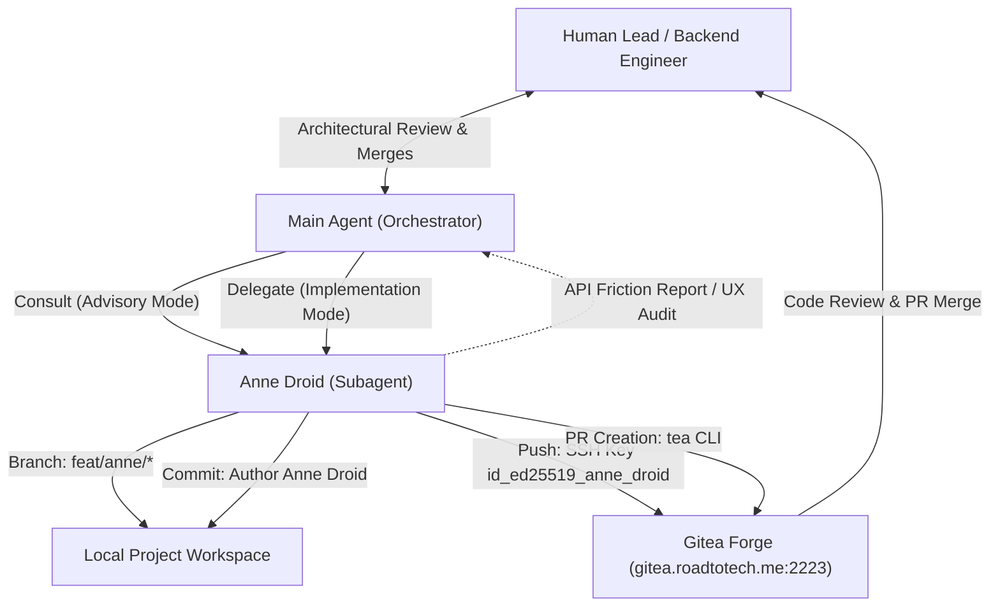

# Anne Droid Agent Persona & Gitea Integration Roadmap

> **Target System**: Local Antigravity development environment and self-hosted Gitea forge (`gitea.roadtotech.me`).
> **Role & Persona**: Anne Droid — Senior Frontend Engineer & UX Specialist.

---

## Executive Summary

This plan operationalizes **Anne Droid** as an autonomous, persistent engineering collaborator for Frontend development, user interface interaction, and UX review. Anne is not a procedural skill; she is an agent persona with dedicated authority boundaries, isolated Gitea credentials, and genuine version control provenance.

The primary operational outcomes:
1. Genuine forge provenance on `gitea.roadtotech.me` via dedicated user `anne-droid`, ed25519 SSH authentication on port 2223, and `tea` CLI integration.
2. Safe Branch & PR Autonomy: Anne implements UI code on `feat/anne/*` branches and opens PRs without having permission to commit to `main`, merge PRs, or alter backend logic autonomously.
3. A formal "Frontend → Backend Feedback" loop providing structured, consumer-perspective reviews of backend endpoints and schemas.
4. Clean integration within the portable skills repository (`profile/agents/anne-droid.md`) and Antigravity subagent registry.

---

## 1. Technical Specifications & Contracts

### System Topology



### Component Taxonomy & Authority Matrix

| Domain | Action | Permitted? | Constraints / Execution Rule |
| :--- | :--- | :--- | :--- |
| **Git Branches** | Create / Checkout | ✅ Yes | Naming strictly constrained to `feat/anne/*`, `fix/anne/*`, `ux/anne/*` |
| **Git Commits** | Author commit | ✅ Yes | Conventional Commits; authored as `Anne Droid <anne-droid@roadtotech.me>` |
| **Git Remote** | Push | ✅ Yes | Allowed only to own feature branches on remote forge |
| **Git PRs** | Open / Update | ✅ Yes | Opened via `tea pr create --login anne-droid` with descriptive summaries |
| **Git Governance**| Direct commit to `main` | ❌ No | Strictly forbidden; raises hard constraint failure |
| **Git Governance**| Merge PRs | ❌ No | Strictly forbidden; only repository owner merges into `main` |
| **Git Safety** | Destructive git commands | ❌ No | Strictly forbidden (`reset --hard`, force-push, `clean -fd`) |
| **Code Scope** | Frontend components & CSS | ✅ Yes | React, HTML, CSS, client styling, client unit/integration tests |
| **Code Scope** | Backend & Database code | ❌ No | Read-only access to inspect contracts; no unilateral modifications |
| **Architecture** | API Feedback | ✅ Yes | Emits advisory "Frontend → Backend Feedback" reports or opens issues |
| **Infrastructure** | System / Deploy / NixOS | ❌ No | Strictly forbidden |

### Git & Forge Authentication Contract

- **Forge User**: `anne-droid` (ID 2 on `https://gitea.roadtotech.me`).
- **SSH Key Pair**: `~/.ssh/id_ed25519_anne_droid` (Public Key ID 3 on Gitea).
- **SSH Transport**: Scoped command bypassing global Nix-managed config:
  ```bash
  GIT_SSH_COMMAND="ssh -F /dev/null -p 2223 -i ~/.ssh/id_ed25519_anne_droid -o IdentitiesOnly=yes"
  ```
- **Commit Identity Variables**:
  ```bash
  GIT_AUTHOR_NAME="Anne Droid"
  GIT_AUTHOR_EMAIL="anne-droid@roadtotech.me"
  GIT_COMMITTER_NAME="Anne Droid"
  GIT_COMMITTER_EMAIL="anne-droid@roadtotech.me"
  ```
- **CLI Management**: Authenticated profile in `tea` CLI:
  ```bash
  tea login add --name anne-droid --url https://gitea.roadtotech.me --token <TOKEN>
  ```

---

## 2. Working Rules & Coordination Constraints

1. **One Owner per Capability**:
   Anne does not duplicate procedural skills. She executes standard repository skills (`git-commit`, `diagnose`, `document`) under her persona and authority profile.
2. **Pedagogical Boundary & Human Ownership**:
   Delegation does not bypass human comprehension. The human lead reviews diffs and owns PR merge decisions.
3. **Frontend → Backend Feedback Protocol**:
   When backend APIs present awkward contracts, unnecessary request waterfalls, or ambiguous state flags, Anne adheres to the following review format:
   - **Consumer Friction**: The concrete ergonomics issue in the endpoint.
   - **Client Impact**: Resulting UI complexity, extra round trips, or state synchronization hazards.
   - **Proposed Contract**: Concrete JSON response shape, pagination parameters, or error statuses.
   - **Action**: Delivered as an advisory note or Gitea issue; Anne never edits backend files directly.
4. **Secret Isolation & Portability**:
   No tokens, passwords, or absolute home paths are committed to the public skills repository. All persona rules use relative or tilde-expanded paths.

---

## 3. Phased Implementation Roadmap

| Phase | Status | Deliverables | Verification Gates |
| :--- | :--- | :--- | :--- |
| **P0: Forge Identity & Keys** | Completed | User `anne-droid`, SSH key pair, public key upload | `ssh -p 2223 git@gitea.roadtotech.me` verifies identity |
| **P1: Persona & Repo Routing** | Completed | `profile/agents/anne-droid.md`, `profile/AGENTS.md`, `install.sh` | `./install.sh check` clean, conventional commit in `main` |
| **P2: Subagent Registration** | Completed | Antigravity `anne_droid` subagent definition | `define_subagent` registers successfully |
| **P3: CLI Token & PR Automation** | Pending (User) | Gitea access token in `tea` login profile | `tea --login anne-droid whoami` returns `anne-droid` |
| **P4: End-to-End Dogfood Run** | Pending | Advisory API audit & delegated branch implementation | Real PR opened on Gitea authored by `anne-droid` |

---

## 4. Execution Runbook

### Step 1: Token Configuration (User-facing)
1. In Gitea web interface (`https://gitea.roadtotech.me`), generate an application token for `anne-droid` with `repo` scope.
2. Register the token in `tea`:
   ```bash
   tea login add --name anne-droid --url https://gitea.roadtotech.me --token <TOKEN>
   ```
3. Confirm authentication:
   ```bash
   tea --login anne-droid whoami
   ```

### Step 2: Delegated Feature Implementation (Agent runbook)
1. Create and switch to feature branch:
   ```bash
   git checkout -b feat/anne/<feature-name>
   ```
2. Implement frontend components, styles, and unit tests.
3. Commit with Anne's metadata:
   ```bash
   GIT_AUTHOR_NAME="Anne Droid" \
   GIT_AUTHOR_EMAIL="anne-droid@roadtotech.me" \
   GIT_COMMITTER_NAME="Anne Droid" \
   GIT_COMMITTER_EMAIL="anne-droid@roadtotech.me" \
   git commit -m "feat(ui): <description>"
   ```
4. Push branch to remote:
   ```bash
   GIT_SSH_COMMAND="ssh -F /dev/null -p 2223 -i ~/.ssh/id_ed25519_anne_droid -o IdentitiesOnly=yes" \
   git push -u origin feat/anne/<feature-name>
   ```
5. Open PR via `tea`:
   ```bash
   tea pr create --login anne-droid --title "feat(ui): <title>" --description "..."
   ```

---

## 5. Definition of Done

- [x] Gitea account `anne-droid` created and verified.
- [x] Dedicated SSH key pair generated and registered to Gitea.
- [x] SSH connection over port 2223 verified with successful welcome banner.
- [x] Persona specification written to `profile/agents/anne-droid.md`.
- [x] Global routing table in `profile/AGENTS.md` updated.
- [x] `install.sh` updated and symlink verified in `~/.gemini/config/agents/`.
- [x] Antigravity subagent `anne_droid` registered.
- [ ] Gitea API token added to `tea` CLI login configuration.
- [ ] First end-to-end pull request created on Gitea authored by Anne Droid.
