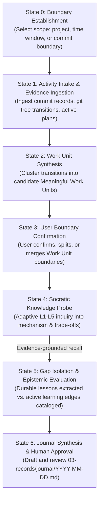

# Architecture & Protocol Specification: Journal Builder (`/journal`)

## 1. Problem & Motivation: Why Activity Narration Fails

In modern software engineering environments accelerated by agentic AI, implementation velocity frequently outpaces human comprehension. When autonomous or semi-autonomous tools handle scaffolding, protocol bindings, test harnesses, and refactoring, code commits enter the repository at a rate that obscures whether the human engineer has internalized the underlying mechanics.

The prevailing failure mode of engineering logs and retrospectives is **Activity Narration**:
* Compiling a chronological list of Git commits or diffs.
* Asking an LLM to "summarize today's progress" from Git history.
* Generating polished prose describing *what was touched* ("Added OIDC endpoints, configured PKCE, and updated test suite").

Activity narration suffers from four fatal flaws:

1. **The Comprehension Illusion**:
   $$\text{Agent writes code} \neq \text{User understands architecture}$$
   Generating an automated summary creates the psychological feeling of completed work without verifying whether the engineer can explain *how* the system behaves or *why* specific constraints were chosen.

2. **Absence of Epistemic Boundaries**:
   Commit logs record the *terminal state* of code, but completely lose:
   - Which alternative designs were considered and rejected.
   - What subtle assumptions proved incorrect during implementation.
   - What cognitive hurdles or conceptual gaps the engineer encountered.

3. **Loss of Operational Ownership**:
   When systems break in production, maintenance requires deep mental models of system failure domains. If an engineer relies on AI to implement changes and AI to narrate what happened, the engineer abdicates mental ownership of the codebase.

4. **Pollution of the Knowledge Graph**:
   Mechanical changelogs duplicate information already preserved with higher fidelity in Git history. They clutter the knowledge repository without adding durable intellectual value.

`/journal` exists to invert this paradigm: **it is not a documentation generator; it is a learning and reflection protocol**.

---

## 2. Purpose and Non-Goals

### Purpose
`/journal` is an interactive retrospective protocol that transforms recorded engineering activity into durable knowledge. It engages the engineer in a structured reflective dialogue, requiring them to reconstruct system mechanisms, justify architectural decisions, and expose unverified assumptions before any record is committed to the Brain knowledge graph.

### Non-Goals
* **Not an automated changelog compiler**: It does not take Git commits and unilaterally write a journal entry without interactive human participation.
* **Not a daily standup bot**: It does not report status or time metrics for management visibility.
* **Not a duplicator of specialized artifacts**: In strict adherence to Brain's **Anti-Overlap Invariant**, `/journal` does not copy full ADR decision narratives (reserved for `03-records/decisions/`), full post-mortems (reserved for `03-records/debug/`), or execution blueprints (reserved for `01-plans/`). It captures the human learning experience and links forward to those artifacts.
* **Not an AI monologue**: The agent must never answer its own reflection prompts or generate self-congratulatory praise. The engineer must drive the technical explanations.

---

## 3. Inputs, Evidence Hierarchy & The Unit of Reflection

### The Lead Question: What is the Unit of Reflection?

A critical design requirement for `/journal` is establishing the proper granularity for retrospective evaluation.

```
       TOO GRANULAR                         OPTIMAL                         TOO COARSE
┌─────────────────────────┐       ┌─────────────────────────┐       ┌─────────────────────────┐
│     Raw Git Commit      │  ───▶ │  Meaningful Work Unit   │ ◀───  │      Calendar Day       │
│  (Noisy, typo fixes,    │       │ (Coherent architectural │       │  (Arbitrary astronomical│
│   checkpoint slices)    │       │  transition / milestone)│       │   boundary, cross-repo) │
└─────────────────────────┘       └─────────────────────────┘       └─────────────────────────┘
```

1. **Why a Git Commit is the wrong unit**:
   Commits in a well-disciplined repository (under Conventional Commits or GitKeeper lineage) are intentionally slice-isolated and atomic. Reflecting commit-by-commit causes cognitive fatigue over trivial changes (e.g., formatting fixes, fixture setup) and obscures the larger architectural movement.

2. **Why a Calendar Day is the wrong unit**:
   A calendar day is an arbitrary planetary interval. Significant engineering initiatives often span multiple days, while a single afternoon might involve three unrelated micro-tasks across different projects. Anchoring reflection purely to midnight creates artificial narrative boundaries.

3. **The Canonical Unit: The Meaningful Work Unit (MWU)**
   The fundamental unit of reflection is the **Meaningful Work Unit**—a bounded architectural transition, capability milestone, or diagnostic resolution that alters system behavior or design invariants.

#### Heuristics for Bounding a Meaningful Work Unit:
An engineering session or range of commits is grouped into a single Work Unit when it satisfies at least one of these boundary conditions:
* **Contract/Invariant Transition**: A change that establishes, replaces, or deprecates a system boundary (e.g., *“Decouple backend admin routes from legacy `Remote-User` header to FastAPI group dependency injection”*).
* **Verifiable Capability Milestone**: A discrete set of commits accompanied by an acceptance gate, integration suite, or green test pass (e.g., *“Complete OIDC PKCE authorization code exchange and cryptographic JWKS token verification”*).
* **Plan or Roadmap Milestone**: Completion or significant progress on a defined phase from an active plan (`01-plans/<project>/...`).
* **Root-Cause Resolution**: The complete arc of diagnosing an anomaly, proving the root cause, and deploying declarative remediation (linking to a `03-records/debug/` record).

---

### Evidence Hierarchy

To ground reflection in empirical reality rather than vague recollection, `/journal` evaluates evidence across four strict tiers:

| Tier | Category | Sources | Semantic Role |
| :---: | :--- | :--- | :--- |
| **Tier 1** | **Ground Truth (Repository State)** | Working tree diffs, Git commit history, test suites (`pytest`, `playwright`), type checks (`pyright`), compiler output. | Immutable physical record of code transitions and verification gates. |
| **Tier 2** | **Machine Provenance** | `00-inbox/commit-log.csv`, CI/CD build runs, agent execution transcripts. | Unbroken audit trail connecting commits, authors, and task contexts. |
| **Tier 3** | **Conceptual Artifacts** | Active plans (`01-plans/`), open discussions (`02-discussions/`), ADRs (`03-records/decisions/`). | The documented intent, constraints, and trade-offs that guided the work. |
| **Tier 4** | **Human Reconstruction** | Interactive dialogue responses, mental models, explanations of mechanisms. | **The primary focus of `/journal`**: proving understanding and surfacing gaps. |

---

## 4. Retrospective Session Lifecycle (The State Machine)

The retrospective session moves through seven deterministic epistemic states:



### Detailed State Transitions

1. **State 0: Boundary Establishment**:
   - The retrospective scope is defined (e.g. current calendar interval, specific project, or milestone boundary).
   - Default: Unjournaled activity recorded in the repository commit ledger and working trees.

2. **State 1: Activity Intake & Evidence Ingestion**:
   - The agent reads immutable evidence from the repository commit ledger and inspects Git history across target workspaces.
   - Cross-references modified codebases with active plans in `01-plans/`, open discussions in `02-discussions/`, and ADRs.

3. **State 2 & 3: Work Unit Synthesis & Boundary Confirmation**:
   - Commits and file transitions are clustered into candidate Meaningful Work Units.
   - The agent presents the proposed clusters to the user before probing begins:
     > *"I observe 12 commits spanning two distinct initiatives today: (1) OIDC PKCE client integration in BDInvite, and (2) dynamic Wi-Fi firewall scripts in NixOS. Shall we reflect on these as two separate work units?"*
   - The user confirms, splits, merges, or adjusts the boundaries.

4. **State 4: Socratic Knowledge Probe**:
   - For each confirmed Work Unit, the agent initiates interactive inquiry following the Learning Assessment Model (Section 5).
   - Probing focuses on data flow, control flow, failure modes, and architectural trade-offs.

5. **State 5: Gap Isolation & Epistemic Evaluation**:
   - The agent evaluates whether the user's explanations are consistent with physical repository evidence.
   - Verified mental models are translated into durable engineering lessons.
   - Unresolved questions, misconceptions, or areas of admitted uncertainty are isolated as active learning edges.

6. **State 6: Journal Synthesis & Human Approval**:
   - The agent drafts the journal entry adhering to the Semantic Slot Contract (Section 6).
   - The draft is presented to the user for collaborative review, critique, and sign-off.

---

## 5. Learning Assessment Model

The heart of the `/journal` interaction is the Socratic Inquiry protocol. The agent does not test trivia; it tests **systems understanding**.

### The L1–L5 Inquiry Hierarchy

```
Level 5: Transfer     ──▶ "How would this behave if we scaled to multiple nodes?"
Level 4: Consequence  ──▶ "What breaks if this dependency or edge condition fails?"
Level 3: Rationale    ──▶ "Why did we choose this design over the alternative?"
Level 2: Mechanism    ──▶ "How does data and control actually flow through this path?"
Level 1: Recall       ──▶ "What changed in the system contract?"
```

| Level | Dimension | Question Pattern | Diagnostic Purpose |
| :---: | :--- | :--- | :--- |
| **L1** | **Recall** | *"What was the key boundary change introduced in this work unit?"* | Verifies basic awareness of the scope of work. |
| **L2** | **Mechanism** | *"How does the session cookie rotation prevent fixation attacks during OIDC callback?"* | Verifies concrete understanding of internal system mechanics. |
| **L3** | **Rationale** | *"What trade-off led us to keep session storage in-memory rather than issuing signed client-side JWTs?"* | Evaluates architectural decision-making and constraint recognition. |
| **L4** | **Consequence** | *"What happens to an active client if the reverse proxy fails to strip the legacy `Remote-User` header?"* | Tests defensive boundary analysis and failure mode reasoning. |
| **L5** | **Transfer** | *"If we needed to support CLI-based API tokens alongside browser SSO in this setup, what would change in our port interface?"* | Verifies generalized architectural mastery applicable to new problems. |

---

### Epistemic Validation Ladder: Working Mental Model vs. "Mastery"

A single retrospective session cannot establish permanent mastery. Probing verifies whether the engineer holds a **demonstrated working mental model** consistent with physical repository evidence.

```text
Observed
   │  (Engineer sees code/test output)
   ▼
Explained
   │  (Engineer articulates control/data flow in own words)
   ▼
Consistent with Evidence
   │  (Explanation matches actual diffs, logs, and assertions)
   ▼
Generalized
   │  (Engineer derives the underlying architectural principle)
   ▼
Recorded as Lesson
      [True Mastery is reserved for repeated transfer across sessions/practice]
```

* **Working Mental Model**: The user can trace mechanics, justify constraints, and predict edge failures accurately.
* **Persistent Mastery**: Reserved for repeated demonstrations across distinct projects or deliberate algorithmic/architectural drills (`04-learning/practice/`).
* **Preserving Learning Edges**: If an explanation falters, the agent avoids manufactured praise or superficial agreement. The boundary of current understanding is explicitly captured.

---

### Failure and Redirection Protocol

When a user provides a superficial, hand-waving, or incorrect explanation during a probe:

```
                  User provides incorrect or superficial answer
                                        │
                                        ▼
                   ┌─────────────────────────────────────────┐
                   │    STRICT INTERVENTION GUARDRAILS:      │
                   │  - NEVER say "That's close enough!"     │
                   │  - NEVER complete the answer for them   │
                   │  - NEVER write textbook explanations    │
                   └─────────────────────────────────────────┘
                                        │
                                        ▼
             Direct user to Tier 1 Ground Truth (Diff / Test / Doc)
             "Inspect backend/tests/test_session.py line 42:
              what does the assertion assert pre_id != post_id check?"
                                        │
                         ┌──────────────┴──────────────┐
                         ▼                             ▼
                 User resolves gap             User remains stuck
                         │                             │
                         ▼                             ▼
                Codify in journal:             Codify in journal:
             "Mistakes & Lessons Learned"   "Still Struggling With / Gaps"
```

1. **No Rubber-Stamping**: The agent is strictly prohibited from accepting hand-wavy buzzwords (e.g., "We added security headers to make it secure").
2. **Ground-Truth Redirection**: The agent responds by citing specific lines of code, failing test assertions, or architecture diagrams, prompting the user to observe the physical mechanics:
   > *"Notice in `backend/app/auth/oidc.py` that `validate_token` takes the JWKS client. What specific check prevents an attacker from signing a token with their own private key?"*
3. **Explicit Preservation of Gaps**: If the user cannot resolve the question or prefers not to spend immediate time investigating, the agent **does not cover up the ignorance**. It records it cleanly under `### Unresolved Questions & Learning Gaps`. Honesty in the knowledge graph is paramount.

---

## 6. Journal Output Semantic Contract

Every journal entry created by `/journal` is stored at `03-records/journal/YYYY-MM-DD.md`. To maintain durability without enforcing an overly brittle typographical template, entries must satisfy a **Semantic Slot Contract**.

### Semantic Mapping of the Work Unit

The journal's sections directly reflect the epistemic dimensions of each confirmed Work Unit:

```text
Meaningful Work Unit (MWU)
    │
    ├── What happened?                  ──▶ ## Wins (Capabilities & Invariants)
    │
    ├── What went wrong or surprised?   ──▶ ## Mistakes and Discoveries
    │
    ├── What did I actually understand? ──▶ ## Lessons Learned (Working Mental Models)
    │
    ├── What don't I understand yet?    ──▶ ## Questions & Learning Edges (Active Gaps)
    │
    ├── What artifacts were touched?    ──▶ ## Planning & Specifications (Cross-links)
    │
    └── What should happen next?        ──▶ ## Reflection & Next Actions (Forward Intent)
```

### Frontmatter Specification
```yaml
---
type: journal
project: optional-primary-project   # e.g. bdinvite, homelab, brain
date: YYYY-MM-DD
tags:
  - list
  - of
  - relevant
  - topics
---
```

### Required Semantic Slots

1. **Title**:
   `# Daily Journal: YYYY-MM-DD`

2. **Accomplishments & Meaningful Work Units (`## Wins`)**:
   - Subdivided by Project or Primary Initiative (`### <Project / Initiative Name>`).
   - Bulleted summary describing verified capabilities delivered, architectural milestones achieved, and key invariant transitions.
   - Markdown links to relevant code repositories, forge commits, or project entrypoints (`06-projects/<project>/README.md`).

3. **Mistakes, Discoveries & Technical Lessons (`## Mistakes and Lessons Learned`)**:
   - Concrete incidents, debugging discoveries, or design fallacies exposed during the session.
   - Each entry must articulate:
     - **The Initial Misconception / Failure Mode**: What was assumed or what broke.
     - **The Discovered Reality**: What the ground truth actually demonstrated.
     - **The Durable Takeaway**: The generalizable rule or heuristic to carry forward.

4. **Active Gaps & Open Inquiries (`## Questions & Learning Edges`)**:
   - Unresolved architectural questions, concepts requiring further deliberate practice, or areas where the user's mental model was incomplete.
   - Pointers to candidate practice drills (`04-learning/practice/`) or reading.

5. **Associated Knowledge & Artifact References (`## Planning & Specifications`)**:
   - Cross-references to all Brain artifacts created or informed by the work:
     - Plans: `01-plans/...`
     - Discussions: `02-discussions/...`
     - Decisions: `03-records/decisions/...`
     - Debug Records: `03-records/debug/...`
     - Guides & SOPs: `04-learning/guides/...`
   - *Invariant*: Summarize the relationship to the artifact in 1–2 lines; do not reproduce the artifact's body.

6. **Synthesis & Strategic Outlook (`## Reflection & Next Actions`)**:
   - High-level perspective on engineering velocity, collaboration dynamics (e.g. human-AI pairing observations), and cognitive load.
   - Immediate primary and secondary objectives for the subsequent session.

---

## 7. Initial Validation

Before packaging the protocol as `journal-builder/SKILL.md`, it will be executed manually against the Graphify SSO Benchmark Experiment.

The purpose is not to establish a formal test suite, but to expose obvious protocol defects while the design is still inexpensive to change.

The session should be evaluated qualitatively:
* Did the Meaningful Work Unit boundaries make sense?
* Did the questions expose actual understanding rather than test trivia?
* Did the protocol preserve genuine learning gaps?
* Did the resulting journal contain information that would not have existed in a conventional activity summary?
* Was the interaction cost justified by the resulting record?

Any substantive problems discovered during this run should be incorporated into this specification before final skill implementation.

---

## 8. Implementation Notes & Invocation Interface

The following details describe how the abstract protocol maps to concrete tools and interfaces in future automated skill packaging, without constraining the protocol itself:

* **Invocation CLI Interface**:
  - `/journal` — Defaults to unjournaled commits for today.
  - `/journal --since <date>` — Scans backward to a specified date boundary.
  - `/journal --project <name>` — Scopes evidence ingestion to a single project hub.
  - `/journal --commits <range>` — Evaluates an explicit Git SHA range.
* **Commit Ledger Integration**:
  - Consumes `00-inbox/commit-log.csv` as an audit trail of verified commits.
  - Does not replace Git commit history; uses the ledger as an ingestion index.
* **Git Commit Delegation**:
  - When the final journal document is reviewed and approved by the user, the agent invokes the `git-commit` skill to package the change as an atomic Conventional Commit (`journal: record daily log for YYYY-MM-DD`).
