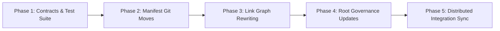

# Brain Taxonomy & Lifecycle Migration Plan

## 1. Executive Summary & Intent

This document records the completed execution plan for migrating the **Second Brain** knowledge repository (`~/Brain`) from an organically grown, technology-siloed folder structure into a structured, numbered lifecycle taxonomy (`00-inbox/` through `06-projects/`).

The primary intent was not merely cosmetic re-organization or directory renaming; it was to establish an **epistemic lifecycle architecture** enforced by automated pre-commit validation and to synchronize all distributed agent contracts operating against the Brain across the workstation.

The conceptual rationale and trade-offs that motivated this architecture are recorded in the companion architectural discussion: [Brain Epistemic Lifecycle Taxonomy](../../02-discussions/brain/taxonomy-and-lifecycle-architecture.md).

---

## 2. Target Taxonomy & Architectural Principles

The repository is partitioned into seven numbered lifecycle directories where the directory prefix encodes the document's epistemic role in the engineering lifecycle, frontmatter encodes document state and context, and relative Markdown links encode graph relationships.

| Directory | Semantic Role | Structural Contract (`DirectoryContract`) | Expected Document Type |
| :--- | :--- | :--- | :--- |
| `00-inbox/` | **Capture** | `allow_unclassified=True`, exempt from link and frontmatter validation | *Unclassified / Ephemeral* |
| `01-plans/` | **Intent** | `max_depth=3` (allows project subsystems: `<project>/[subsystem/]<slug>.md`) | `type: plan` |
| `02-discussions/` | **Exploration** | `max_depth=2` (`<project>/<slug>.md`) | `type: discussion` |
| `03-records/` | **History** | Sub-contracted: `journal/` (`YYYY-MM-DD.md`), `debug/` (`YYYY-MM-DD-<slug>.md`), `decisions/` (`<slug>.md`) | `type: journal \| debug \| decision` |
| `04-learning/` | **Understanding** | Sub-contracted: `knowledge/` (`concepts/`, `technologies/`, `methods/`), `guides/` (`<project>/<slug>.md`), `practice/` (`LeetCode/`) | `type: knowledge \| guide \| practice` |
| `05-agents/` | **Machine Context** | Sub-contracted: `profiles/` (`<slug>.md`), `skills/` (`<slug>.md`) | `type: agent` |
| `06-projects/` | **System Hubs** | `max_depth=2`, `require_filename="README.md"` (navigation/index nodes only) | `type: project` |

---

## 3. Migration Safety Model & Invariants

To guarantee zero data loss, broken links, or architectural regressions across 188 tracked files, the migration was governed by eight strict invariants:

1. **Total Source Coverage**: Every version-controlled file in the pre-migration repository must appear exactly once as a `source` in [`scripts/migration_manifest.json`](../../scripts/migration_manifest.json).
2. **Destination Uniqueness**: No two distinct sources may map to the same `destination` path (collision-free guarantee).
3. **Source Pre-existence**: Every declared `source` path must exist on disk prior to migration execution.
4. **Target Clean Slate**: No declared `destination` path may pre-exist on disk prior to migration unless it is a non-moving root file.
5. **Type Compatibility**: The document frontmatter `type` must match the declared semantic role of the target directory.
6. **Contract Satisfaction**: All target paths must satisfy the structural constraints of `DirectoryContract` (nesting depth, filename rules, and required filenames).
7. **Complete Deprecation Elimination**: Post-migration, no deprecated legacy top-level or nested directories may remain in the working tree.
8. **Link Graph Resolution**: Every intra-vault relative Markdown link must resolve cleanly to a valid target file after path rewriting.

---

## 4. Execution Phases: Planned vs. Executed

The migration was planned and executed in five deterministic phases:

### Phase 1: Structural Contracts & Validator Refactoring
* **Planned**: Refactor `scripts/validate-brain.py` to replace loose path checking with declarative `DirectoryContract` tuples and write a dedicated regression test suite.
* **Executed**:
  - Implemented `DirectoryContract` in `scripts/validate-brain.py` with typed fields: `prefix`, `expected_type`, `max_depth`, `require_filename`, `filename_regex`, and `allow_unclassified`.
  - Added repository-relative sets `DEPRECATED_ROOT_DIRS` and `DEPRECATED_NESTED_PATHS` to prevent partial substring false positives.
  - Implemented `scripts/test_validator.py` covering 10 distinct failure and success scenarios (contract satisfaction, depth violations, filename regex matching, deprecated directory detection, and code-fence scanning).
* **Evidence**: Commit `8a59b09`.

### Phase 2: Manifest Generation & Tree Relocation
* **Planned**: Generate a complete, machine-readable migration manifest and execute file relocations using `git mv` to preserve git file history.
* **Executed**:
  - Authored [`scripts/migration_manifest.json`](../../scripts/migration_manifest.json) containing 188 explicit `source` $\to$ `destination` mappings with epistemic rationales.
  - Executed atomic `git mv` relocations across all files without leaving orphaned artifacts.
* **Evidence**: Commit `8a59b09` (188 files moved, zero added/deleted content).

### Phase 3: Relative Link Graph Rewriting
* **Planned**: Programmatically rewrite intra-vault relative Markdown links using the manifest mapping table so that all links resolve correctly under new relative depths.
* **Executed**:
  - Iterated through all markdown files and rewrote 199 relative link occurrences across 49 markdown files.
  - Verified that cross-directory navigation paths (e.g. from `03-records/journal/` to `01-plans/homelab/`) correctly calculated directory depth changes (`../../` instead of `../`).
* **Evidence**: Commit `4e0dfe0`.

### Phase 4: Root Governance & Catalog Updates
* **Planned**: Update repository governance documents to reflect the 00-06 numbered lifecycle taxonomy.
* **Executed**:
  - Rewrote root [AGENTS.md](../../AGENTS.md) and [README.md](../../README.md) to define directory contracts, frontmatter schemas, link rules, semantic commit conventions, and curation protocols.
  - Updated [05-agents/README.md](../../05-agents/README.md) to catalog profiles and skills.
* **Evidence**: Commit `798c953`.

### Phase 5: Distributed Integration Surface Synchronization
* **Planned**: Ensure external tools and localized agent configurations across the laptop reflect the new structure.
* **Executed**:
  - **Gemini Config**: Updated global capture rule in `~/.gemini/config/AGENTS.md` and capture script `~/.gemini/config/scripts/inbox-capture.sh` (`INBOX_DIR="${HOME}/Brain/00-inbox"`).
  - **Workstation Docs**: Updated reference guide in `~/Config/docs/reference/antigravity.md`.
  - **Homelab Operations**: Updated `/home/kiskaadee/Homelab/AGENTS.md` (workflow mermaid diagram, staging path, `03-records/debug/`, `03-records/journal/`, and learning links).
  - **Homelab Core**: Updated `/home/kiskaadee/Homelab/Core/AGENTS.md` (Section *## Brain Vault*).
  - **Appctl Refactor Worktree**: Updated `/home/kiskaadee/Projects/active/appctl-refactor/AGENTS.md`.
  - **Internal Profiles**: Updated [homelab-core.md](../../05-agents/profiles/homelab-core.md), [homelab-operations.md](../../05-agents/profiles/homelab-operations.md), and [second-brain.md](../../05-agents/profiles/second-brain.md).
* **Evidence**: Commit `72c7945` in `~/Brain` and proposed atomic commits in `~/Homelab/Core` and `~/Projects/active/appctl-refactor`.

---

## 5. Key Classification Decisions & Edge Cases

1. **Elimination of `projects/homelab/archive/`**:
   - *Problem*: Archived roadmaps lived in `projects/homelab/archive/`, breaking historical links when moved.
   - *Resolution*: Moved to `01-plans/homelab/architecture-consolidation-roadmap-v2.md` and updated frontmatter to `status: completed` or `status: abandoned`.
2. **Separation of Discussions from Historical Records**:
   - *Problem*: `records/discussions/` held prospective option evaluations alongside retrospective incident post-mortems in `records/debug/`.
   - *Resolution*: Moved to `02-discussions/<project>/`, typed as `discussion`, with `status: resolved` linking forward to resulting plans.
3. **Praxis Platform Categorization**:
   - *Problem*: Praxis blueprints sat ambiguously between `projects/praxis/` and top-level plans.
   - *Resolution*: Architecture blueprint moved to `01-plans/praxis/praxis-implementation-blueprint.md`, project hub established at `06-projects/praxis/README.md`.
4. **Project Subsystem Nesting**:
   - *Problem*: Complex subsystems like `appctl` under `homelab` required multi-file roadmaps and guides.
   - *Resolution*: Configured `DirectoryContract(prefix="01-plans", max_depth=3)` and `DirectoryContract(prefix="04-learning/guides", max_depth=3)` to allow `01-plans/homelab/appctl/` while forbidding arbitrary deep nesting elsewhere.
5. **Rejection of Root Symlink (`inbox -> 00-inbox`)**:
   - *Problem*: A symlink was proposed to avoid updating external capture scripts.
   - *Resolution*: Rejected due to traversal ambiguity, link alias pollution, and tool confusion. Updated external scripts and configs directly.

---

## 6. Verification and Final Status

### Automated Verification
* `python3 scripts/validate-brain.py`: Executed across the complete vault. Result: **0 errors, 0 warnings, 100% clean graph**.
* `python3 scripts/test_validator.py`: Executed test suite. Result: **10/10 tests passed**.
* Pre-commit and post-commit hooks verified: commits automatically push to canonical origin `ssh://git@gitea.roadtotech.me:2223/kiskaadee/second-brain`.
* Workspace Grep: Zero stale references to `Brain/inbox` across `~/Homelab`, `~/Projects`, `~/Config`, and `~/.gemini/config`.

### Status
* **Status**: `completed`
* **Artifacts Created / Maintained**:
  - Manifest: [`scripts/migration_manifest.json`](../../scripts/migration_manifest.json)
  - Validator: [`scripts/validate-brain.py`](../../scripts/validate-brain.py)
  - Test Suite: [`scripts/test_validator.py`](../../scripts/test_validator.py)
  - Architectural Discussion: [Brain Epistemic Lifecycle Taxonomy](../../02-discussions/brain/taxonomy-and-lifecycle-architecture.md)
