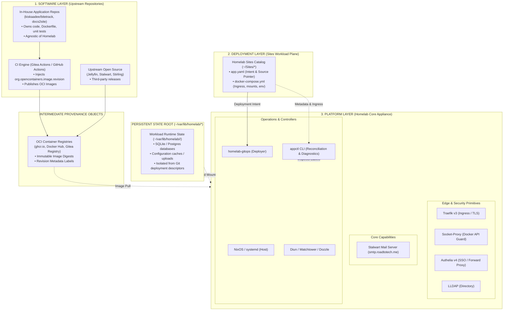
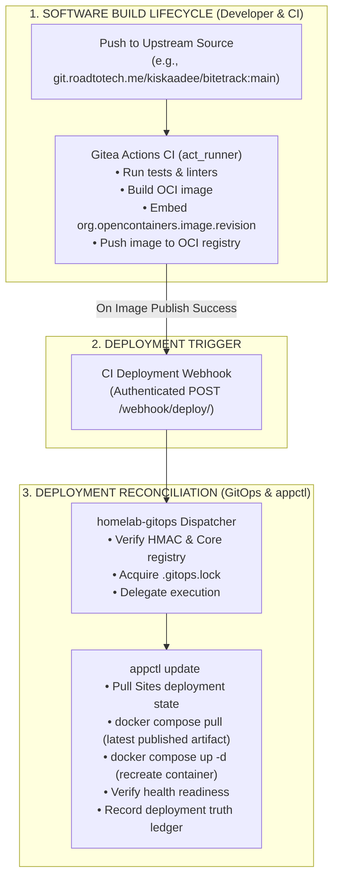

# Architecture Consolidation & Hardening Roadmap v4

> **Supersedes**: [Architecture Consolidation & Hardening Roadmap v3](architecture-consolidation-roadmap-v3.md)
>
> **Current Platform Baseline**: Commit `246b587` (NixOS standalone appliance, consolidated docs, Portainer deprecated, Stalwart mail & SMTPS submission, Dozzle auth, Diun jitter/worker pool, Gitea Actions CI).
>
> 📋 **Companion Execution Guide**: [`architecture-consolidation-implementation-guide-v4.md`](architecture-consolidation-implementation-guide-v4.md)

---

## Executive Summary

Roadmap v3 established a rigorous operational baseline: clarifying controller authority, inverting GitOps trust boundaries, isolating mail capabilities, and establishing parallel seams for the `appctl-v2` modernization.

However, Roadmap v3 still inherited an obsolete assumption from early homelab prototypes: **it treated each workload directory in `~/Sites/<app>` as an individual Git repository cloned directly from Gitea**. 

This coupled model created three fundamental architectural liabilities:
1. **Source Repository Pollution**: In-house applications (e.g., `doc2site`, `bitetrack`) carried Homelab-specific Traefik labels, Docker bridge network names, and host path mounts directly inside their application source trees.
2. **Repository Inflation**: Off-the-shelf applications (e.g., `jellyfin`, `stirling`) required their own standalone Git repositories merely to store a 20-line `docker-compose.yml` and a minimal `app.yaml`.
3. **Ambiguous Freshness Semantics**: `appctl`'s Git status inspection was coupled to `Sites/<app>/.git`. It could only report whether local deployment files had uncommitted edits or differed from their origin branch; it could not report whether the running container was built from the latest upstream source code.

**Roadmap v4 decouples software development from deployment configuration and platform orchestration.** It formalizes a clean **3-Tier Architecture**, introduces **declarative source provenance**, defines **two workload deployment classes** (Source-Backed vs. Image-Only), and establishes **two operational inspection axes with three independent revision identities**.

---

## Core Architectural Principles

1. **3-Tier Separation of Concerns**:
   - **Software Layer (Application Repositories)**: Owns code, tests, Dockerfiles, and CI workflows. Completely agnostic of Homelab infrastructure.
   - **Deployment Layer (Sites Workload Plane)**: Owns deployment declarations (`app.yaml`), Compose definitions (`docker-compose.yml`), Traefik ingress labels, and environment secrets bindings.
   - **Platform Layer (Homelab Core & NixOS Appliance)**: Owns host lifecycle, networking, edge security, shared capabilities, and operational engines (`appctl`, GitOps receiver).
2. **Artifact as an Intermediate Provenance Object**: The container image is not an independent architectural tier; it is an intermediate build product / provenance artifact produced by the Software Layer (via CI) and consumed by the Platform Runtime.
3. **Pure Git Provenance Over Forge Coupling**: Manifests declare canonical Git URLs and refs (`source.url`, `source.ref`). Manifests remain forge-agnostic; platform-level forge integrations (API tokens, webhooks) belong strictly to Core.
4. **Explicit Ref Semantics**: Moving branches (e.g. `ref: main`) track upstream development; pinned tags (`ref: v1.4.2`) or commit SHAs declare intentional release locks.
5. **Two Workload Deployment Classes**: Source-backed workloads declare upstream provenance; off-the-shelf workloads declare no `source` block and rely on registry image tags/digests.
6. **Platform Legibility Over Elaboration (Minimal Control Paths & KISS)**: Simplicity is defined by the fewest independent concepts and control paths. Delivery remains strictly linear (`source push -> CI -> GitOps -> appctl update -> Compose`), avoiding secondary orchestration subsystems, message queues, or deployment databases.
7. **Core Registry Authority**: The repository being admitted must never define its own admission trust boundary. Core authoritatively owns admission paths and alias resolution.
8. **Single Manifest Contract**: Exactly one typed schema and parser (`core_manifest.py`) is consumed across `appctl`, `gitops_dispatcher`, and dashboard sync tooling.
9. **Two Operational Inspection Axes with Three Revision Identities**: Operational inspection is evaluated across two orthogonal axes: **Deployment Configuration State** (Sites checkout freshness) and **Software Provenance State** (upstream source vs. deployed container). The system ledger records three distinct, independent identity facts: `deployment_config_revision` (Sites commit SHA), `source_revision` (upstream source commit SHA), and `artifact_digest` (immutable OCI image SHA256 digest).
10. **Zero-Data-Loss Migration**: State-bearing components are relocated across architectural boundaries through staged, reversible migrations with verified pre-flight snapshots and non-destructive cutovers.

---

## Part 1: The 3-Tier Architecture & System Taxonomy

The platform decouples into three clean layers connected by intermediate artifacts:



### The Two Workload Deployment Classes

| Workload Class | Manifest Contract (`app.yaml`) | Upstream Tracking Strategy | Freshness Indicator | Example Workloads |
| :--- | :--- | :--- | :--- | :--- |
| **Class A: Source-Backed** | `source:` block present (`type: git`, `url`, `ref`) | `git ls-remote <url> <ref>` compared against container OCI label `org.opencontainers.image.revision` | Exact match vs. Remote Revision Changed | `bitetrack`, `doc2site`, `courses` |
| **Class B: Image-Only (Off-the-shelf)** | `source:` block omitted | Image tag and SHA256 digest tracked via Docker daemon and Diun/Watchtower | Registry tag update / Digest drift | `jellyfin`, `stirling`, `snappymail`, `mongodb` |

---

## Part 2: Controller Authority Matrix

With decoupled software repositories and deployment descriptors, the controller matrix explicitly defines authority across the entire build, admission, and deployment lifecycle:

| Resource / Lifecycle Stage | Authoritative Controller | Permitted Secondary Actors | Prohibited Actors | Conflict Resolution Policy |
| :--- | :--- | :--- | :--- | :--- |
| **Application Software & Tests** | Developer Git (`main`) | CI Runner (`act_runner`) | GitOps, `appctl` | Software repo is source of truth. Homelab cannot alter source code. |
| **Container Image Building** | CI Engine (Gitea Actions) | Operator manual `docker build` | Runtime GitOps receiver | CI publishes immutable tagged image with OCI revision label. |
| **Host System Configuration** | NixOS (`configuration.nix`) | Manual `nixos-rebuild` by operator | `appctl`, GitOps, containers | Git repository is desired state; local rebuild applies. Direct editing of `/etc` prohibited. |
| **Host Secrets** | SOPS (`secrets.yaml`) | `sops` CLI with host age key | Unprivileged users, CI runners | Secrets decrypted directly to `/run/secrets/` via `sops-nix`. |
| **Core Compose Stack** | Core Git (`main` branch) | Operator via `appctl --core` / `docker compose` | GitOps webhook (auto-deploy disabled for Core) | Core updates require human operator validation. |
| **Workload Deployment Intent** | Sites Git (`main` branch) | Operator via `appctl` | Direct container modification over SSH | Sites repository owns Compose and `app.yaml`. |
| **Workload Runtime Execution** | `homelab-gitops` & `appctl` | Docker daemon (auto-restart) | Watchtower (for pinned workloads) | Per-target filesystem lock (`.gitops.lock`) serializes `appctl` and GitOps. |
| **Workload Persistent State** | Workload Container / System | Backup automation | Git tracking | Runtime state lives in `~/var/lib/homelab/<app>/`; excluded from Sites Git. |
| **Dashboard Catalog** | `appctl sync` / engine | Homepage container (consumes config) | Direct edits to Homepage YAML | Generated deterministically from Core inventory + discovered Sites manifests. |

### Resource & State Ownership Matrix

| Resource | Owner | Location | Desired State Source | Runtime State Form |
| :--- | :--- | :--- | :--- | :--- |
| **Application Source** | Dev / Git | External Git repo | Upstream Git | Git commit graph |
| **Application Artifact** | Registry | OCI Registry / Local Cache | CI build of Source | Docker image with `org.opencontainers.image.revision` |
| **Deployment Compose** | Sites | `Sites/<app>/docker-compose.yml` | Sites Git | Container runtime |
| **Workload Manifest** | Sites | `Sites/<app>/app.yaml` | Sites Git | Parsed by `core_manifest.py` at deployment |
| **Workload Persistent State** | Workload | `~/var/lib/homelab/<app>/` | — (runtime-generated) | Filesystem / persistent storage |
| **Stalwart mail store** | Stalwart | `Core/config/stalwart/data` | — (runtime-generated) | Filesystem |
| **SnappyMail client state**| SnappyMail | `~/var/lib/homelab/snappymail/` | — (runtime-generated) | Workload filesystem |
| **NixOS host config** | Core | `Core/nixos/` | Core Git | Applied via `nixos-rebuild` |
| **SOPS secrets** | Core | `Core/nixos/secrets.yaml` | Core Git (encrypted) | `/run/secrets/` (decrypted) |

---

## Part 3: Mail Architecture Rework & Zero-Data-Loss Relocation

### Topology Separation

Stalwart remains in Core as a platform capability (`smtp.roadtotech.me`); SnappyMail moves to `~/Sites/snappymail` as an **Image-Only Class B Workload** (`mail.roadtotech.me`).

```text
                     HOMELAB CORE
                          │
                  ┌───────▼────────┐
                  │    Stalwart    │
                  │  Mail Platform │
                  │ smtp.roadtotech.me
                  └───────┬────────┘
                          │
         ┌────────────────┴────────────────┐
         │ (SMTP 465 / SMTPS)              │ (IMAP 993 / TLS)
         ▼                                 ▼
   HOMELAB CORE                      SITES WORKLOAD
┌─────────────────┐               ┌─────────────────┐
│      Diun       │               │   SnappyMail    │
│ Platform Alerts │               │  Webmail Client │
│                 │               │ mail.roadtotech.me
└─────────────────┘               └─────────────────┘
```

Persistent mailbox data (`Core/config/stalwart/data`) remains in Core. SnappyMail user settings (`/var/lib/snappymail/_data_`) migrate to `~/var/lib/homelab/snappymail/` under verified pre-flight archive, hash verification, and a 14-day rollback retention window.

---

## Part 4: GitOps Trust Boundary, CI Triggers & Deployment Reconciliation

### The Source-Build $\to$ Deployment Reconciliation Pipeline

Under the decoupled 3-tier model, the platform formalizes an authoritative end-to-end event chain from software commit to running container:



### The Invariant Contract for `appctl update`

`appctl update` is authoritatively defined as a **Deployment Reconciliation Operation**:
- **Role**: Reconciles a deployed workload with its declared desired state and the newest available container artifact.
- **Actions Performed**:
  1. Pulls the latest deployment configuration from the Sites repository.
  2. Executes `docker compose pull` to retrieve the latest published container image.
  3. Executes `docker compose up -d` to recreate containers with updated images/configurations.
  4. Runs post-deployment health probes.
  5. Records the 3-axis deployment truth ledger (`deployment_config_revision`, `source_revision`, `artifact_digest`).
- **Prohibited Behavior**: `appctl update` **never** clones application source code or compiles software on the Homelab appliance host. All source code compilation belongs 100% to CI runners (`act_runner`).

### Trust Boundary Invariants

1. **Inverted Registry Authority**: Workload manifests cannot expand admission trust boundaries or register arbitrary aliases. All routing decisions rely strictly on Core's authoritative registry (`Core/config/deployments.yaml`).
2. **Systemd Sandboxing**: `homelab-gitops.service` runs under dedicated sandboxing (`ProtectSystem=strict`, `NoNewPrivileges=true`, restricted `ReadWritePaths`).
3. **Pre-Deployment Compose Policy**: GitOps validates `docker-compose.yml` against strict security invariants (no privileged mode, no host networking, no Docker socket mounts) before execution.

---

## Part 5: Manifest Contract Convergence (Schema v1.0)

### Manifest Specification

`app.yaml` declares workload metadata, source provenance, and deployment policy:

```yaml
schemaVersion: "1.0"
name: "bitetrack"
displayName: "BiteTrack"
description: "Nutritional tracking and pantry inventory"
category: "Productivity"

# Optional: Present for Source-Backed workloads, omitted for Image-Only
source:
  type: git
  url: "https://git.roadtotech.me/kiskaadee/bitetrack.git"
  ref: "main"

network:
  ingress: true
  domain: "bitetrack.roadtotech.me"
  publishedPort: 8080
  internalOnly: false

deployment:
  strategy: compose
  preflight:
    filesRequired:
      - docker-compose.yml
  healthcheck:
    type: http
    path: "/api/health"
    expectedStatus: 200
    timeoutSeconds: 30
```

### Explicit `source.ref` Tracking Semantics

| `source.ref` Pattern | Semantic Meaning | `appctl` Remote Inspection Behavior |
| :--- | :--- | :--- |
| **Branch** (`main`, `stable`, `refs/heads/*`) | Moving upstream line of development | Queries remote ref SHA on `--fetch` via `git ls-remote`. Compares with deployed container's revision label. |
| **Tag** (`v1.4.2`, `refs/tags/*`) | Pinned release tag | Treated as a pinned version. Deployed container revision must match the tag's commit SHA; moving branch HEADs are ignored. |
| **Commit SHA** (40-char hex string) | Immutable commit pin | Static pin. No remote network checks needed. |

### Transport Security & Remote Timeout Invariants

To prevent protocol injection, SSRF, or denial of service during inspection:
1. **Permitted Git Transport Schemes**: `source.url` must strictly match one of:
   - `https://` (e.g. `https://git.roadtotech.me/user/repo.git`)
   - `ssh://` (e.g. `ssh://git@git.roadtotech.me:2223/user/repo.git`)
   - `git@` (SCP syntax, e.g. `git@git.roadtotech.me:user/repo.git`)
2. **Prohibited Schemes**: `file://`, `ext::`, custom helper schemes, or relative filesystem paths are rejected with `ManifestError`.
3. **Execution Timeout**: Any network call invoking `git ls-remote` must be wrapped in a strict timeout (maximum 10 seconds). Failure to reach remote upstream degrades gracefully to an error badge without hanging the CLI.

---

## Part 6: Two Operational Inspection Axes & Source Provenance

### The Inspection Contract in `appctl`

`appctl` separates local deployment configuration checks from upstream software provenance checks:

```text
Axis 1: Deployment Configuration State (Local Sites Repository)
   git status --porcelain & git rev-list HEAD...@{u}
   --> ✓ Synced | ⬆ Ahead | ⬇ Behind | * Dirty

Axis 2: Software Provenance State (Upstream Source vs. Runtime Container)
   If source is omitted:
       --> ⚪ Image Only (displays image tag)
   If source is declared:
       Deployed Revision SHA (from container label org.opencontainers.image.revision)
       Remote Ref SHA (from git ls-remote <source.url> refs/heads/<source.ref>, gated behind --fetch)

       Comparison:
       • Remote SHA == Deployed SHA  --> ✓ Up to date (<sha>)
       • Remote SHA != Deployed SHA  --> ⚡ Revision Changed (deployed: <d_sha>, remote: <r_sha>)
       • Without --fetch             --> 🏷 Deployed: <d_sha> (cached runtime state)
```

> [!IMPORTANT]
> **Performance Invariant**: `git ls-remote` is **never** executed during default `appctl list`. It is strictly gated behind `appctl list --fetch` / `-f` or `appctl info <app>`.

---

## Part 7: Parallel Track Coordination (Architecture vs. appctl-v2)

Track A (Architecture Consolidation on `main`) and Track B (`appctl-v2` in worktree `~/Projects/active/appctl-refactor` on `refactor/appctl-rework`) coordinate via five stable integration seams:

```text
                    ┌─────────────────────────┐
                    │   appctl-v2 refactor    │
                    │ (refactor/appctl-rework)│
                    │  Models SourceConfig &  │
                    │   Provenance Engine     │
                    └────────────┬────────────┘
                                 │
                                 │ integration point
                                 ▼
                    ┌─────────────────────────┐
                    │ Manifest / domain model │
                    │ + Core inventory model  │
                    └─────────────────────────┘

main
 │
 ├── P1: Mail topology migration
 │      └── minimal compatibility patch to legacy appctl
 │
 ├── P2: GitOps authority hardening
 │      └── does not require appctl-v2
 │
 └── P3: Manifest convergence
        └── integrate appctl-v2 here (CONVERGENCE POINT)
```

### The 5 Stable Seams
1. **CLI Invocation Syntax**: Preserved identically.
2. **`resolve` JSON Contract**: `cmd_resolve` output schema unchanged.
3. **Canonical Identity**: Workload identifiers remain stable.
4. **Taxonomy**: Strict classification between Core platform capabilities and Sites workloads.
5. **Homepage Sync Semantics**: Compiles `services.yaml` from Core inventory + discovered Sites manifests without schema breaks.

---

## Part 8: Roadmap Execution Phases

```text
┌─────────────────────────────────────────────────────────────┐
┌ P0: Architecture Re-Baseline & 3-Tier Separation            │
│     - Formalize 3-Tier Taxonomy & Ownership Matrices        │
│     - Define Source-Backed vs Image-Only Workload Classes   │
│     - Establish Provenance Contract & OCI Label Standard    │
└──────────────────────────────┬──────────────────────────────┘
                               │
┌──────────────────────────────▼──────────────────────────────┐
│ P1: Mail Topology Realignment & Zero-Data-Loss Migration    │
│     - Stalwart to smtp.roadtotech.me (Core Platform)        │
│     - SnappyMail State Backup & Transfer to ~/Sites         │
│     - SnappyMail as Image-Only Class B Workload             │
│     - Minimal compatibility patch to legacy appctl_engine   │
└──────────────────────────────┬──────────────────────────────┘
                               │
┌──────────────────────────────▼──────────────────────────────┐
│ P2: GitOps Privilege & Authority Hardening                  │
│     - Authoritative Repository Registry (Core-owned)        │
│     - Decoupled CI Build Webhooks vs GitOps Deploy Webhooks │
│     - Second Brain Read-Only Data-Vault Policy              │
│     - Workload Compose Security Policy Enforcement          │
│     - Systemd Service Confinement & Sandboxing              │
└──────────────────────────────┬──────────────────────────────┘
                               │
┌──────────────────────────────▼──────────────────────────────┐
│ P3: Manifest Contract Convergence & appctl-v2 Integration   │
│     - Schema v1.0 & Single Typed Parser (core_manifest.py)  │
│     - SourceConfig Domain Model & Manifest Validation       │
│     - CONVERGENCE: appctl-v2 replaces legacy engine on main │
│     - Core Service Inventory Normalization                  │
└──────────────────────────────┬──────────────────────────────┘
                               │
┌──────────────────────────────▼──────────────────────────────┐
│ P4: Platform Lifecycle & Readiness Contracts                │
│     - Service Healthchecks & condition: service_healthy     │
│     - Diun / Stalwart / LLDAP Startup Serialization         │
│     - Watchtower / Image Update Governance                  │
└──────────────────────────────┬──────────────────────────────┘
                               │
┌──────────────────────────────▼──────────────────────────────┐
│ P5: Deployment Truth & Historical Ledger                    │
│     - Two Inspection Axes & Three Revision Identities:      │
│       * deployment_config_revision (Sites Git commit)       │
│       * source_revision (org.opencontainers.image.revision) │
│       * artifact_digest (immutable OCI RepoDigest sha256)   │
│     - Atomic Status Ledger (duration, phase, failure cause) │
│     - appctl deployment status & history views              │
└─────────────────────────────────────────────────────────────┘
```

> [!NOTE]
> **Authoritative Definition of `artifact_digest`**:
> `artifact_digest` is defined as the immutable OCI registry digest (`sha256:...`) of the exact image manifest from which the running container was created. In Docker inspect, it corresponds to the container image's `RepoDigests` entry, distinctly separating it from local daemon image IDs or mutable release tags.

---

## Part 9: Definition of Done

1. **3-Tier Separation & Clean State Isolation**:
   - In-house software projects maintain independent Git repositories free of Homelab infrastructure configuration.
   - `~/Sites` maintains clean deployment descriptors referencing software sources or off-the-shelf container images.
   - Mutable application runtime state resides strictly under `~/var/lib/homelab/<app>/`, isolated from version-controlled Git deployment trees.
2. **Mail Separation**:
   - `smtp.roadtotech.me` serves Stalwart administration, JMAP, and protocol routing.
   - `mail.roadtotech.me` serves SnappyMail from `~/Sites/snappymail`.
   - 100% of user settings, contacts, and sessions survive cutover with zero data loss.
3. **Trust & Admission**:
   - Webhook admission decisions rely exclusively on Core's authoritative registry.
   - Workload Compose definitions are validated against security invariants before execution.
   - `homelab-gitops` runs under restricted systemd sandboxing.
   - `appctl update` operates strictly as a deployment reconciliation primitive, never compiling source code on the appliance host.
4. **Contract Unification & Provenance**:
   - `core_manifest.py` authoritatively parses and validates Schema v1.0 manifests across `appctl`, GitOps, and tests, enforcing permitted transport schemes (`https://`, `ssh://`, `git@`).
   - `appctl-v2` cleanly resolves local deployment status and remote upstream source provenance without breaking CLI caller contracts.
5. **Operational Verification**:
   - All architecture invariant tests pass, plus new tests enforcing provenance validation and Compose security invariants.
   - Pure Nix `flake check` and Gitea Actions CI pass with zero warnings.
