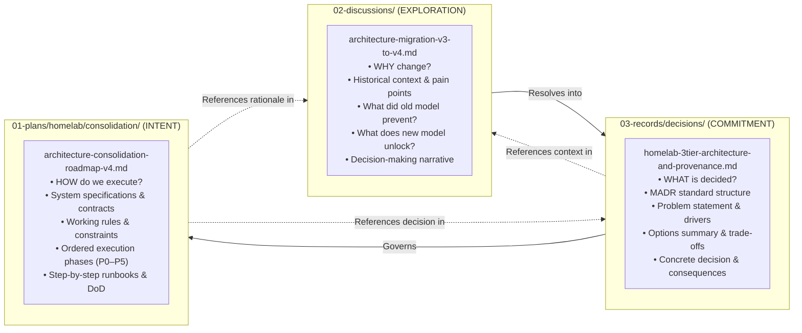

# Implementation Plan: Homelab Architecture Consolidation Documents Reorganization

## Goal Description

Establish a clear, non-overlapping epistemic taxonomy across the Homelab Architecture Consolidation triad (**ADR**, **Plan**, and **Discussion**), standardize the ADR using standard MADR conventions, link the three documents bidirectionally, and relocate the architecture consolidation/hardening artifacts into a dedicated subsystem folder inside `01-plans/homelab/`.

---

## 1. Epistemic Separation of Concerns: The Three Document Types

To prevent duplicated content and keep each document focused on its distinct cognitive role (as defined in [`AGENTS.md`](../../AGENTS.md)):



### Precise Document Boundaries & Responsibilities

| Dimension | Architectural Decision Record (ADR) | Actionable Plan / Specification | Epistemic Discussion |
| :--- | :--- | :--- | :--- |
| **Directory** | `03-records/decisions/` | `01-plans/homelab/consolidation/` | `02-discussions/homelab/` |
| **Type** | `decision` | `plan` | `discussion` |
| **Core Question** | *"What did we decide, and what are the point-in-time trade-offs?"* | *"What do we intend to build, and in what exact sequence?"* | *"Why was this change necessary, and how did the reasoning evolve?"* |
| **Standard Format** | **MADR 4.0 Standard** (Context, Decision Drivers, Options, Decision Outcome, Pros/Cons, Consequences) | **Actionable Roadmap / Spec** (Principles, System Spec, Working Rules, Phased Execution P0–P5, Runbooks, DoD) | **Inquiry & Rationale Analysis** (Problem Context, Root Friction Points, What Old Model Prevented, What New Model Enables, Justification) |
| **Content Included** | Decision statement, decision drivers, high-level tier definitions, options considered table, positive/negative consequences. | Pure technical specifications, schema contracts, sequence of ordered milestones, operational runbooks, rollbacks, and verification gates. | Deep dive into operational friction, evolution from v1/v2/v3 to v4, design dilemmas (e.g. why `git ls-remote` vs full clone, linear vs broker orchestrator), before/after comparison. |
| **Content Removed / Excluded** | Detailed bash execution runbooks, step-by-step phased checklists, extensive design dilemmas. | Redundant philosophical debate, historical options matrix, lengthy justifications of why we didn't pick RabbitMQ or full Git cloning. | Phased execution step-by-step instructions, operational runbooks, shell scripts. |

---

## 2. Standardizing the ADR (MADR 4.0 Alignment)

Restructure [`homelab-3tier-architecture-and-provenance.md`](../../03-records/decisions/homelab-3tier-architecture-and-provenance.md) according to the widely adopted Markdown Architectural Decision Records (MADR) format:

1. **Title**: `ADR: Homelab 3-Tier Architecture & Deployment Provenance Model`
2. **Status**: `accepted` (with date: `2026-09-28`)
3. **Context and Problem Statement**: Concise framing of the four core issues (source pollution, repo inflation, ambiguous freshness, orchestrator sprawl risk).
4. **Decision Drivers**:
   - Clean separation of concerns between code development and platform deployment.
   - Elimination of repository inflation for off-the-shelf software.
   - Independent verification of deployment configuration state vs. application code freshness.
   - Adherence to KISS primitives by strictly bounding control paths (no brokers, queues, or deployment databases).
   - Absolute protection of mutable runtime data from version-controlled trees.
5. **Considered Options**:
   - *Option 1*: Monolithic / Single-Repo Deployment (v1–v3 status quo)
   - *Option 2*: Miniature Cloud Platform (ArgoCD/Kubernetes style with brokers and DB)
   - *Option 3*: Bounded 3-Tier Platform with OCI Provenance Labels & Linear Control Path
6. **Decision Outcome**:
   - Chosen option: *Option 3*.
   - Crisp summary of the four key architectural commitments:
     - 3-tier decoupling (Software, Deployment, Platform) with OCI image as intermediate build artifact.
     - Two workload classes (Source-Backed with explicit `source:` block vs. Image-Only).
     - Two operational inspection axes with three revision identities (`deployment_config_revision`, `source_revision`, `artifact_digest`).
     - Minimal linear control path (`Source Push -> CI -> GitOps -> appctl update -> Compose`).
     - Persistent state root isolation (`~/var/lib/homelab/<app>/`).
7. **Pros and Cons of the Options**:
   - Evaluation of each option against the decision drivers.
8. **Consequences**:
   - *Positive Consequences* (decoupled lifecycle, precise truth, clean state, bounded surface).
   - *Negative Consequences / Accepted Trade-offs* (two repos for custom apps, commit equality without distance counts).
9. **Links & Cross-References**:
   - Link forward to the Plan: [`01-plans/homelab/consolidation/architecture-consolidation-roadmap-v4.md`](consolidation/architecture-consolidation-roadmap-v4.md)
   - Link to the Discussion: [`02-discussions/homelab/architecture-migration-v3-to-v4.md`](../../02-discussions/homelab/architecture-migration-v3-to-v4.md)
   - Link to Project Hub: [`06-projects/homelab/README.md`](../../06-projects/homelab/README.md)

---

## 3. Deepening the Discussion (`02-discussions/homelab/...`)

Expand [`architecture-migration-v3-to-v4.md`](../../02-discussions/homelab/architecture-migration-v3-to-v4.md) to provide comprehensive justification and narrative evolution:

1. **The Evolution of the Model (From v1/v2/v3 to v4)**:
   - Walk through why v1/v2 focused on NixOS appliance and basic separation, v3 focused on mail/controller authority, and why v3 still failed to solve the fundamental workload coupling.
2. **Deep Dive into the Friction Points & Concrete Operational Failures**:
   - Detailed breakdown of each friction point with real-world examples:
     - *Source Pollution*: What happened when developing `doc2site` or `bitetrack`—having host Traefik rules and Docker networks in Git prevented sharing code, running standalone tests, or open-sourcing.
     - *Repository Inflation*: Why creating whole Git repos for 20-line Compose files for Jellyfin and Stirling cluttered Gitea and CI pipelines.
     - *Ambiguous Freshness in `appctl`*: Why `git rev-list HEAD...@{u}` could only detect uncommitted changes to `app.yaml`, giving false confidence that the container was running current code.
     - *Host Build Overhead*: Why compiling on the deployment host created ambient toolchain dependencies and violated least-privilege appliance principles.
3. **What the Old Model Prevented**:
   - Inability to open-source or modularize internal tools without stripping Homelab configuration.
   - Inability to verify if a deployed container had critical upstream security patches.
   - Inability to maintain clean, reproducible Git trees without accidental database/upload commits.
4. **What the New Model Unlocks**:
   - Independent application lifecycles and modern CI pipelines.
   - Dual-axis diagnostic transparency: knowing exactly whether config is dirty vs. whether code is stale.
   - Stateless deployment repositories (`~/Sites`) backed by isolated runtime state roots (`~/var/lib/homelab`).
   - Clean, lightweight onboarding of off-the-shelf software with zero repo overhead.
5. **Architectural Dilemmas & How Decision Making Occurred**:
   - *The Image Question*: Is an OCI image a 4th tier or an intermediate provenance artifact? (Resolved: Artifact).
   - *The Ancestry Dilemma*: Why calculate commit distance when `git ls-remote` commit equality solves the staleness problem with zero disk bloat?
   - *The Anti-Sprawl Principle*: Why reject queues/databases in favor of a strictly linear control path?
6. **Bidirectional Links**:
   - Explicit links to both the ADR ([`03-records/decisions/homelab-3tier-architecture-and-provenance.md`](../../03-records/decisions/homelab-3tier-architecture-and-provenance.md)) and the Plan ([`01-plans/homelab/consolidation/architecture-consolidation-roadmap-v4.md`](consolidation/architecture-consolidation-roadmap-v4.md)).

---

## 4. Refining the Plan (`01-plans/homelab/consolidation/...`)

In [`architecture-consolidation-roadmap-v4.md`](consolidation/architecture-consolidation-roadmap-v4.md):
- **Cross-Reference in Header**: Link to BOTH the ADR and the Discussion:
  ```markdown
  > **Architectural Decision Record**: [`03-records/decisions/homelab-3tier-architecture-and-provenance.md`](../../03-records/decisions/homelab-3tier-architecture-and-provenance.md)
  >
  > **Architectural Discussion & Rationale**: [`02-discussions/homelab/architecture-migration-v3-to-v4.md`](../../02-discussions/homelab/architecture-migration-v3-to-v4.md)
  ```
- **Trim Duplicated Philosophical Rationale**: Reference the Discussion for the deep dive on pain points and options evaluation, keeping Part 1 through Part 7 focused on technical specifications, contracts, domain models, and working rules.
- **Retain & Polish the Actionable Plan**: Keep Part 8 (Phased Implementation Plan P0–P5) as the authoritative, ordered sequence of execution steps, complete with verification gates and non-destructive runbooks.

---

## 5. Subdirectory Reorganization in `01-plans/homelab/`

### Subdirectory Structure
A dedicated subsystem directory was established to organize the consolidation roadmap series:
`01-plans/homelab/consolidation/`

Organizing all 6 consolidation artifacts into this folder:
```text
01-plans/homelab/consolidation/
├── architecture-consolidation-roadmap.md                   (v1 - superseded)
├── architecture-consolidation-roadmap-v2.md                (v2 - superseded)
├── architecture-consolidation-implementation-guide-v2.md   (v2 - superseded)
├── architecture-consolidation-roadmap-v3.md                (v3 - superseded)
├── architecture-consolidation-implementation-guide-v3.md   (v3 - superseded)
└── architecture-consolidation-roadmap-v4.md                (v4 - ACTIVE CANONICAL BLUEPRINT)
```

### Validator & Depth Contract Compliance
In `scripts/validate-brain.py`:
```python
DirectoryContract(prefix="01-plans", expected_type="plan", max_depth=3)
```
- Path: `01-plans/homelab/consolidation/architecture-consolidation-roadmap-v4.md`
- Depth relative to `01-plans`: `homelab` (1) / `consolidation` (2) / `roadmap-v4.md` (3) = **depth 3**.
- **Result**: Complies with `max_depth=3`. Note that `02-discussions` and `03-records/decisions` remain at `max_depth=2` per the repository taxonomy rules.

### External References & Relative Links
Intra-vault links updated across:
- `06-projects/homelab/README.md`
- `02-discussions/homelab/architecture-migration-v3-to-v4.md`
- `03-records/decisions/homelab-3tier-architecture-and-provenance.md`
- Recent journal entries (`03-records/journal/2026-09-28.md`, `2026-09-27.md`, `2026-09-14.md`, `2026-09-13.md`)

---

## 6. Verification Plan

### Automated Verification
1. Run structural validator:
   ```bash
   python scripts/validate-brain.py
   ```
   Must pass with zero errors (all links resolve, frontmatter valid, code fences and Mermaid diagrams valid, depth contracts satisfied).
2. Run validator test suite:
   ```bash
   python scripts/test_validator.py
   ```

### Manual Verification
1. Verify bidirectional navigation:
   - `01-plans/homelab/consolidation/architecture-consolidation-roadmap-v4.md` $\leftrightarrow$ `03-records/decisions/homelab-3tier-architecture-and-provenance.md` $\leftrightarrow$ `02-discussions/homelab/architecture-migration-v3-to-v4.md`.
2. Inspect content balance:
   - Ensure the ADR has no step-by-step shell runbooks.
   - Ensure the Plan has no redundant pros/cons evaluation debates.
   - Ensure the Discussion thoroughly captures the justification, operational pain points, and unlocked capabilities.
