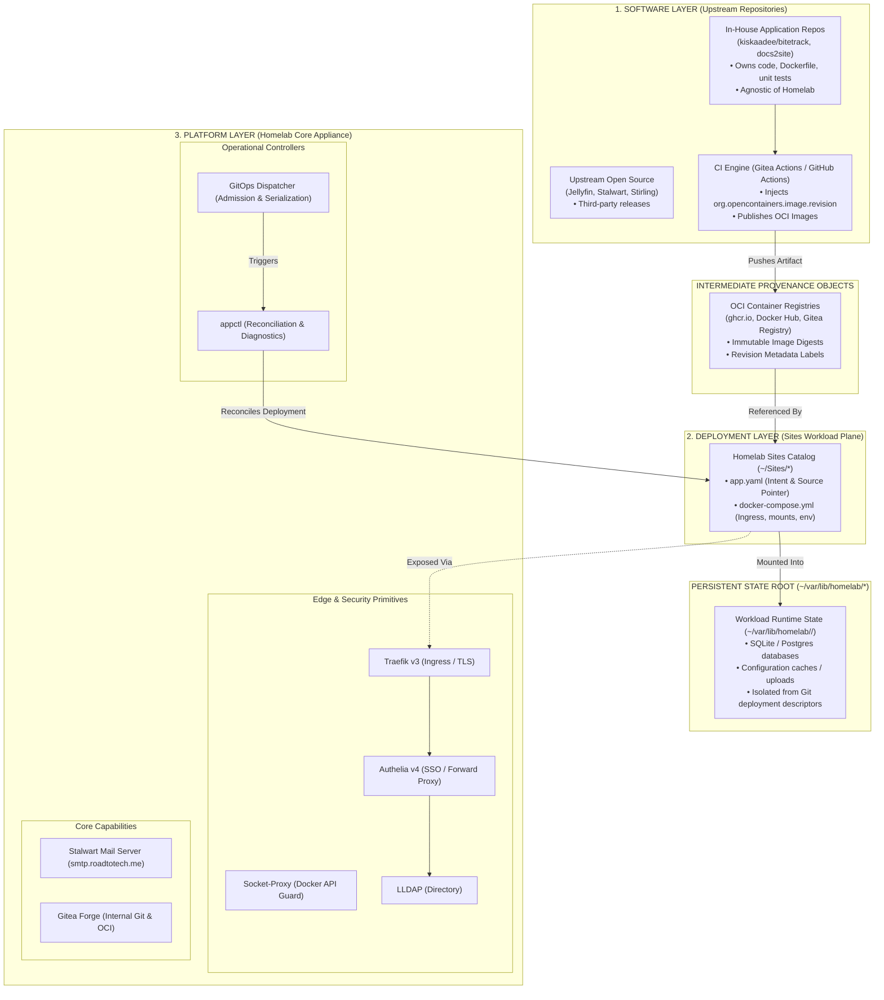

# Architecture Consolidation & Hardening Roadmap & Execution Plan v4

> **Supersedes**: [Architecture Consolidation & Hardening Roadmap v3](architecture-consolidation-roadmap-v3.md) and [Architecture Consolidation Implementation Guide v3](architecture-consolidation-implementation-guide-v3.md)
>
> **Current Platform Baseline**: Commit `246b587` (NixOS standalone appliance, consolidated docs, Portainer deprecated, Stalwart mail & SMTPS submission, Dozzle auth, Diun jitter/worker pool, Gitea Actions CI).
>
> **Architectural Decision Record**: [`03-records/decisions/homelab-3tier-architecture-and-provenance.md`](../../../03-records/decisions/homelab-3tier-architecture-and-provenance.md)
>
> **Architectural Discussion & Rationale**: [`02-discussions/homelab/architecture-migration-v3-to-v4.md`](../../../02-discussions/homelab/architecture-migration-v3-to-v4.md)
>
> **Target System**: `roadtotech.me` (NixOS appliance `Core/`, application workloads `Sites/`)

---

## Executive Summary

Roadmap v4 formalizes the **3-Tier Architecture**, introduces **declarative source provenance**, defines **two workload deployment classes** (Source-Backed vs. Image-Only), and establishes **two operational inspection axes with three independent revision identities**.

This document serves as the authoritative implementation specification and phased execution roadmap (P0 through P5) for the homelab architecture consolidation. For the deep-dive analysis of legacy multirepo friction and rejected alternatives, see the companion [Architectural Discussion](../../../02-discussions/homelab/architecture-migration-v3-to-v4.md); for the architectural commitments and trade-offs, see the [ADR](../../../03-records/decisions/homelab-3tier-architecture-and-provenance.md).

---

## Core Architectural Principles

1. **3-Tier Separation of Concerns**:
   - **Software Layer (Application Repositories)**: Owns code, tests, Dockerfiles, and CI workflows. Completely agnostic of Homelab infrastructure.
   - **Deployment Layer (Sites Workload Plane)**: Owns deployment declarations (`app.yaml`), Compose definitions (`docker-compose.yml`), Traefik ingress labels, and environment secrets bindings.
   - **Platform Layer (Homelab Core & NixOS Appliance)**: Owns host lifecycle, networking, edge security, shared capabilities, and operational engines (`appctl`, GitOps receiver).
2. **Artifact as an Intermediate Provenance Object**: The container image is not an independent architectural tier; it is an intermediate build product / provenance artifact produced by the Software Layer (via CI) and consumed by the Platform Runtime.
3. **Pure Git Provenance Over Forge Coupling**: Manifests declare canonical Git URLs and refs (`source.url`, `source.ref`). Manifests remain forge-agnostic; platform-level forge integrations (API tokens, webhooks) belong strictly to Core.
4. **Explicit Ref Semantics**: Moving branches (e.g. `ref: main`) track upstream development; pinned tags (`ref: v1.4.2`) or commit SHAs declare intentional release locks.
5. **Two Workload Deployment Classes**: Source-backed workloads declare upstream provenance; off-the-shelf workloads declare no `source` block and rely on registry image tags/digests.
6. **Platform Legibility Over Elaboration (Minimal Control Paths & KISS)**: Simplicity is defined by the fewest independent concepts and control paths, not fewest files. Delivery remains strictly linear (`source push -> CI -> GitOps -> appctl update -> Compose`), avoiding secondary orchestration subsystems, message queues, or deployment databases.
7. **Core Registry Authority**: The repository being admitted must never define its own admission trust boundary. Core authoritatively owns admission paths and alias resolution.
8. **Single Manifest Contract**: Exactly one typed schema and parser (`core_manifest.py`) is consumed across `appctl`, `gitops_dispatcher`, and dashboard sync tooling.
9. **Two Operational Inspection Axes with Three Revision Identities**: Operational inspection is evaluated across two orthogonal axes: **Deployment Configuration State** (Sites checkout freshness) and **Software Provenance State** (upstream source vs. deployed container). The system ledger records three distinct, independent identity facts: `deployment_config_revision` (Sites commit SHA), `source_revision` (upstream source commit SHA), and `artifact_digest` (immutable OCI image SHA256 digest).
10. **Zero-Data-Loss Migration**: State-bearing components are relocated across architectural boundaries through staged, reversible migrations with verified pre-flight snapshots and non-destructive cutovers.

---

## Part 1: The 3-Tier Architecture & System Taxonomy

The platform decouples into three clean layers connected by intermediate artifacts:



### The Seven Platform Primitives

| Primitive | Epistemic Role | Operational Responsibility |
| :--- | :--- | :--- |
| **Software Repository** | Source | Application code, unit tests, `Dockerfile`, CI workflows. Zero Homelab coupling. |
| **CI Engine (Gitea Actions)** | Build | Compiles code, runs tests, injects `org.opencontainers.image.revision`, publishes OCI images. |
| **OCI Container Image** | Artifact | Immutable intermediate build product and provenance object linking commit SHA to image digest. |
| **Sites Catalog (`~/Sites`)** | Desired Deployment | Environment-specific manifests (`app.yaml`) and Compose definitions (`docker-compose.yml`). |
| **GitOps Dispatcher** | Ingress & Admission | HMAC webhook authentication, Core registry admission control, and deployment serialization. |
| **`appctl` Engine** | Inspection & Reconciliation | Manifest parsing, two-axis inspection, and declarative deployment reconciliation (`appctl update`). |
| **Core Appliance (`~/Core`)** | Platform & Runtime | Declarative NixOS host, edge ingress (Traefik), Docker API proxy, SSO (Authelia/LLDAP), and shared capabilities (Stalwart). |

---

## Part 2: Declarative Source Provenance & Workload Classes

The manifest contract (`app.yaml`) formalizes the relationship between the deployment declaration and the software source code via an explicit `source:` block.

### Class A: Source-Backed Workloads
Used for custom backend projects, internal utilities, and forked codebases where upstream Git revisions must be tracked directly:

```yaml
schemaVersion: "1.0"
name: "bitetrack"
displayName: "BiteTrack"
description: "Nutrition & Recipe Management API"
category: "Productivity"

# Declarative Upstream Software Provenance
source:
  type: git
  url: "https://gitea.roadtotech.me/kiskaadee/bitetrack.git"
  ref: "main"

network:
  ingress: true
  domain: "bitetrack.roadtotech.me"
  publishedPort: 8080
  internalOnly: false

deployment:
  strategy: compose
  preflight:
    filesRequired:
      - docker-compose.yml
  healthcheck:
    type: http
    path: "/healthz"
    expectedStatus: 200
    timeoutSeconds: 30
```

### Class B: Image-Only Workloads
Used for standard off-the-shelf applications (e.g. Jellyfin, SnappyMail, Stirling PDF) where Homelab is strictly deploying third-party container images:

```yaml
schemaVersion: "1.0"
name: "snappymail"
displayName: "SnappyMail"
description: "Lightweight Webmail Client"
category: "Communication"

# source: omitted entirely

network:
  ingress: true
  domain: "mail.roadtotech.me"
  publishedPort: 8888
  internalOnly: false

deployment:
  strategy: compose
  preflight:
    filesRequired:
      - docker-compose.yml
  healthcheck:
    type: http
    path: "/"
    expectedStatus: 200
    timeoutSeconds: 30
```

---

## Part 3: Explicit `source.ref` Semantics

The `source.ref` field governs how `appctl` and GitOps evaluate software freshness:

| `source.ref` Value | Target Semantic | Freshness Evaluation (`--fetch`) | Intended Use Case |
| :--- | :--- | :--- | :--- |
| `main`, `master`, `develop` | **Moving Branch** | Resolves remote branch HEAD commit via `git ls-remote`. Reports `⚡ Revision Changed` if remote SHA != container label SHA. | Active internal projects under continuous deployment. |
| `v1.2.3`, `release-2026.09` | **Release Tag** | Resolves tag target commit SHA. Pinned release; reports `📌 Pinned (<tag>)`. | Production services tracking stable release milestones. |
| `a1b2c3d4e5...` (40-char SHA) | **Immutable Commit** | Validates exact commit SHA against container label. Static lock; no remote queries performed. | Strict reproducible testing and forensic debugging. |

---

## Part 4: Remote Revision Verification & `git ls-remote` Constraint

Remote provenance inspection MUST evaluate commit equality using `git ls-remote` rather than performing on-host source cloning or commit-distance traversal.

```text
git ls-remote <source.url> refs/heads/<source.ref>
```

- **Resolution Invariant**:
  - `Remote SHA == Deployed SHA`: Running container is up to date (`✓ Up to date (<sha>)`).
  - `Remote SHA != Deployed SHA`: Running container is stale (`⚡ Revision Changed (deployed: <d_sha>, remote: <r_sha>)`).
- **Transport Security**: `source.url` MUST strictly use `https://`, `ssh://`, or `git@`. Schemes such as `file://`, `ext::`, or relative paths are rejected with `ManifestError`.
- **Execution Timeout**: Any network call invoking `git ls-remote` MUST be bounded by a strict 10-second timeout and degrade gracefully to an error badge on failure without blocking CLI execution.

---

## Part 5: Clean Persistent State Root (`~/var/lib/homelab/<app>/`)

To prevent accidental Git commits of SQLite databases, session tokens, or uploaded assets, **all mutable application runtime state is isolated from version-controlled directories**:

```text
~/Sites/<app>/                      --> Version-Controlled Git Deployment Directory
    ├── app.yaml                    --> Pure Manifest
    └── docker-compose.yml          --> Declarative Compose Spec

~/var/lib/homelab/<app>/            --> Host State Root (Outside Git)
    ├── data/                       --> Workload SQLite / Data Files
    └── config/                     --> Dynamic Runtime Configuration
```

Docker Compose files reference host state explicitly via:
```yaml
services:
  app:
    volumes:
      - /home/kiskaadee/var/lib/homelab/snappymail/data:/var/lib/snappymail/_data_
```

---

## Part 6: Two Operational Inspection Axes & Source Provenance

`appctl` separates local deployment configuration checks from upstream software provenance checks:

```text
Axis 1: Deployment Configuration State (Local Sites Repository)
   git status --porcelain & git rev-list HEAD...@{u}
   --> ✓ Synced | ⬆ Ahead | ⬇ Behind | * Dirty

Axis 2: Software Provenance State (Upstream Source vs. Runtime Container)
   If source is omitted:
       --> ⚪ Image Only (displays image tag)
   If source is declared:
       Deployed Revision SHA (from container label org.opencontainers.image.revision)
       Remote Ref SHA (from git ls-remote <source.url> refs/heads/<source.ref>, gated behind --fetch)

       Comparison:
       • Remote SHA == Deployed SHA  --> ✓ Up to date (<sha>)
       • Remote SHA != Deployed SHA  --> ⚡ Revision Changed (deployed: <d_sha>, remote: <r_sha>)
       • Without --fetch             --> 🏷 Deployed: <d_sha> (cached runtime state)
```

> [!IMPORTANT]
> **Performance Invariant**: `git ls-remote` is **never** executed during default `appctl list`. It is strictly gated behind `appctl list --fetch` / `-f` or `appctl info <app>`.

---

## Part 7: Mandatory Working Rules & Parallel Track Coordination

### Mandatory Working Rules

1. **Rule 1 — One Production Transition at a Time**: Never combine mail infrastructure relocation, GitOps privilege modifications, and manifest schema refactors into single sweeping production changes. Keep each architectural phase isolated on dedicated git branches.
2. **Rule 2 — Absolute Preservation of Application State**: State-bearing workloads must never be modified using destructive commands (`rm -rf`, `docker compose down -v`, or unverified moves). State directory migrations require an explicit pre-flight freeze, recursive archive with preserved timestamps/permissions, and parallel staging before live cutover.
3. **Rule 3 — Single Source of Truth**: Never duplicate service definitions or trust boundaries across disparate files. Core owns the platform catalog; the authoritative registry owns admission paths; `core_manifest.py` owns workload manifest parsing.
4. **Rule 4 — The User Controls Production Transitions**: The agent investigates, crafts local code changes, and verifies tests locally. The user reviews atomic commit proposals, merges to `main`, and runs production deployments (`nixos-rebuild switch`, container recreation).
5. **Rule 5 — Immutable Integration Seams Across Tracks**: The interfaces connecting Track A (`main`) and Track B (`appctl-v2`) must not undergo uncoordinated drift: CLI syntax, `resolve` JSON contract, canonical service identifiers, and Homepage generation semantics remain stable until Milestone P3 convergence.
6. **Rule 6 — Minimal Control Path & Orchestrator Restraint (KISS)**: The deployment delivery pipeline must remain strictly linear and minimal:
   $$\text{Source Push} \longrightarrow \text{CI Build} \longrightarrow \text{GitOps Ingress} \longrightarrow \text{appctl update} \longrightarrow \text{Compose Up}$$
   Do not introduce secondary orchestration systems, message brokers, queues, deployment databases, or rollback controllers around `appctl`. `appctl update` operates strictly as a declarative, standalone deployment reconciliation primitive.

### Parallel Track Coordination (Architecture vs. appctl-v2)

Two major engineering tracks are active concurrently:
- **Track A (Production Architecture)**: Based on `main` in `/home/kiskaadee/Homelab/Core`. Owns host configuration, service topology (P1 mail migration), GitOps privilege separation (P2), and platform readiness (P4).
- **Track B (Implementation Modernization)**: Based on `refactor/appctl-rework` in `/home/kiskaadee/Projects/active/appctl-refactor`. Implements typed domain hierarchy (`SitesApp`, `CoreService`, `SourceConfig`), PyYAML ingestion, Docker label inspection, and TDD unit tests.

```text
                    ┌─────────────────────────┐
                    │   appctl-v2 refactor    │
                    │ (refactor/appctl-rework)│
                    │  Models SourceConfig &  │
                    │   Provenance Engine     │
                    └────────────┬────────────┘
                                 │
                                 │ integration point
                                 ▼
                    ┌─────────────────────────┐
                    │ Manifest / domain model │
                    │ + Core inventory model  │
                    └─────────────────────────┘

main
 │
 ├── P1: Mail topology migration
 │      └── minimal compatibility patch to legacy appctl
 │
 ├── P2: GitOps authority hardening
 │      └── does not require appctl-v2
 │
 └── P3: Manifest convergence
        └── integrate appctl-v2 here (CONVERGENCE POINT)
```

---

## Part 8: Phased Implementation Plan & Technical Execution

### Phase Status Overview

| Phase / Workstream | Status | Target Scope / Key Deliverables | Verification Gates |
| :--- | :--- | :--- | :--- |
| **P0: Architecture Re-Baseline** | **📐 DRAFTED** | 3-Tier taxonomy, source vs image-only workload classes, controller authority matrix, resource ownership matrix, dependency graphs. | Documentation reviews, structural linting. |
| **P1: Mail Topology Realignment** | **🎯 UP NEXT** | Move Stalwart to `smtp.roadtotech.me`; move SnappyMail to `~/Sites/snappymail` (`mail.roadtotech.me`) with zero data loss. | Verified rollback archive, state parity proof, IMAP/SMTP auth, address book survival, Diun delivery test. |
| **P2: GitOps Privilege & Authority** | **⏳ PENDING** | Authoritative Core repository registry, decoupled CI vs deploy webhook routing, Brain pull-only policy, workload Compose security policy, systemd sandboxing. | Flake check, unit tests for admission and containment, path traversal tests, Compose policy validation tests. |
| **P3: Manifest Convergence** | **⏳ PENDING** | Schema v1.0, single typed parser library (`core_manifest.py`), `SourceConfig` domain model & ref semantics, integrate `appctl-v2`. | Manifest validation in CI, schema lint tests, unit tests for `SourceConfig`. |
| **P4: Platform Lifecycle & Health** | **⏳ PENDING** | Service readiness probes in Core Compose, `condition: service_healthy` startup gating, image update policy. | Docker health inspects, dependency startup ordering tests. |
| **P5: Deployment Truth & Ledger** | **⏳ PENDING** | Two operational inspection axes with three revision identities (`deployment_config_revision`, `source_revision`, `artifact_digest`), atomic status record, `appctl history`. | Dispatcher status test fixtures, ledger serialization accuracy tests. |

---

### Phase 0: Architecture Re-Baseline & Structural Catalog

- **Deliverable 0.1: Service Taxonomy & 3-Tier Architecture**:
  Update `Core/docs/architecture.md` formalizing Tier 1 (Software), Intermediate Artifacts (OCI), Tier 2 (Sites Deployment), and Tier 3 (Platform Core), along with Class A (Source-Backed) and Class B (Image-Only) classifications.
- **Deliverable 0.2: Controller Authority Matrix**:
  Document authoritative control loops across systemd, Docker Compose, GitOps, CI runners, and `appctl`.
- **Deliverable 0.3: Resource & State Ownership Matrix**:
  Formalize persistent state ownership for every component: owner, filesystem location (`~/var/lib/homelab/<app>/`), desired state source, and runtime state form.

---

### Phase 1: Mail Topology Realignment & Zero-Data-Loss Migration Runbook

#### Architectural Invariants
- **Stalwart**: Remains in Core as platform capability. Public endpoint moves to `smtp.roadtotech.me`. Persistent mail store (`Core/config/stalwart/data`) is never moved.
- **SnappyMail**: Moves from `Core/docker-compose.yml` to `~/Sites/snappymail` as an **Image-Only Class B Workload** (`mail.roadtotech.me`). Persistent state (`Core/config/snappymail/data`) is migrated to `~/var/lib/homelab/snappymail/`.

#### Execution Runbook
1. **Pre-Migration Health Audit**:
   ```bash
   docker ps --filter "name=stalwart" --filter "name=snappymail" --format "table {{.Names}}\t{{.Status}}\t{{.Ports}}"
   ```
2. **State Freeze**: Halt SnappyMail to prevent database mutation during backup:
   ```bash
   docker stop snappymail
   ```
3. **Verified Pre-Cutover Backup Archive**:
   ```bash
   mkdir -p ~/backups/pre-mail-cutover-$(date +%F)
   tar -czpf ~/backups/pre-mail-cutover-$(date +%F)/snappymail-data.tar.gz -C ~/Homelab/Core/config/snappymail data
   sha256sum ~/backups/pre-mail-cutover-$(date +%F)/snappymail-data.tar.gz > ~/backups/pre-mail-cutover-$(date +%F)/snappymail-data.tar.gz.sha256
   tar -tzf ~/backups/pre-mail-cutover-$(date +%F)/snappymail-data.tar.gz | head -n 10
   ```
4. **Workload Scaffolding & State Directory Provisioning**:
   - Provision isolated persistent state root:
     ```bash
     mkdir -p ~/var/lib/homelab/snappymail
     ```
   - Create `~/Sites/snappymail/app.yaml` declaring schema v1.0 (Class B Image-Only).
   - Create `~/Sites/snappymail/docker-compose.yml` mounting `/home/kiskaadee/var/lib/homelab/snappymail:/var/lib/snappymail/_data_`, connected to `proxy-net`, with Traefik ingress labels for `mail.roadtotech.me`.
5. **Non-Destructive State Replication & Parity Proof**:
   ```bash
   cp -a ~/Homelab/Core/config/snappymail/data/* ~/var/lib/homelab/snappymail/
   diff -r ~/Homelab/Core/config/snappymail/data ~/var/lib/homelab/snappymail
   ```
6. **Stalwart Endpoint Cutover in Core**:
   - Update `Core/docker-compose.yml`: Change Stalwart domain Traefik labels from `mail.roadtotech.me` to `smtp.roadtotech.me`, set `STALWART_PUBLIC_URL=https://smtp.roadtotech.me`, and remove SnappyMail service block.
   - Apply Core changes:
     ```bash
     cd ~/Homelab/Core && docker compose up -d stalwart
     ```
7. **Workload Launch & Live Verification**:
   - Launch SnappyMail:
     ```bash
     cd ~/Sites/snappymail && docker compose up -d
     ```
   - Verify webmail at `https://mail.roadtotech.me`, user logins, contact address books, IMAP/SMTP connectivity to Stalwart, and Diun SMTPS alert delivery on port 465.

---

### Phase 2: GitOps Privilege & Authority Hardening

- **Deliverable 2.1: Authoritative Core Repository Registry**:
  Establish `Core/config/deployments.yaml` as the sole authority for admitted deployment repositories. Manifests in `Sites` cannot declare aliases or alter admission paths.
- **Deliverable 2.2: The CI-to-Deployment Reconciliation Pipeline**:
  Formalize the authoritative event flow from software build to live runtime:
  1. Pushes to Application Source repositories trigger Gitea Actions CI to test and build container images, embedding `org.opencontainers.image.revision`.
  2. On successful image publishing, CI emits an authenticated deployment event to GitOps (`POST /webhook/deploy/<app>`).
  3. GitOps verifies HMAC admission against Core's registry, acquires `.gitops.lock`, and invokes `appctl update <app>`.
  4. `appctl update` reconciles the deployment: pulls Sites deployment descriptors, pulls the published image (`docker compose pull`), recreates containers (`docker compose up -d`), runs healthchecks, and writes the ledger.
  5. *Prohibited*: Host appliance never compiles code or clones application source trees.
- **Deliverable 2.3: Second Brain Read-Only Data-Vault Policy**:
  Designate `~/Brain` as a read-only vault with `strategy: pull-only`, isolated from Docker socket access.
- **Deliverable 2.4: Workload Compose Security Policy**:
  Implement pre-flight Compose AST validation in `Core/scripts/gitops_dispatcher.py` to reject:
  - `privileged: true`
  - Direct Docker socket bind mounts (`/var/run/docker.sock`)
  - `network_mode: host` or `pid: host`
  - Host root mounts outside `~/var/lib/homelab/<app>/`
- **Deliverable 2.5: Systemd Service Sandboxing**:
  Update `Core/nixos/modules/gitops.nix` with strict systemd execution constraints (`ProtectSystem=strict`, `NoNewPrivileges=true`, restricted `ReadWritePaths`).

---

### Phase 3: Manifest Contract Convergence & appctl-v2 Integration

- **Deliverable 3.1: Manifest Schema v1.0 & Parser Library (`core_manifest.py`)**:
  Implement the single authoritative parser on `main`:
  - Strongly-typed parsing using PyYAML and `@dataclass`.
  - Implements `SourceConfig(type, url, ref)`: validates `source.type == "git"`, permitted transport schemes (`https://`, `ssh://`, `git@`), enforces 10s timeout on remote Git inspections, and resolves `source.ref` tracking semantics.
  - Rejects unknown top-level keys.
- **Deliverable 3.2: Workload Catalog Migration**:
  Audit all `~/Sites/*/app.yaml` files:
  - Source-backed apps (`doc2site`, `courses`): declare `source: { type: git, url: ..., ref: main }`.
  - Image-only apps (`snappymail`, `jellyfin`, `stirling`): omit `source:` block.
- **Deliverable 3.3: In-House Application Source Migration Runbook**:
  For workloads where source code was previously co-located with deployment configs (e.g. `doc2site`):
  1. Create standalone upstream Git repository on Gitea (e.g., `git.roadtotech.me/kiskaadee/doc2site`).
  2. Move application source, `Dockerfile`, and tests to the new repo; strip all Homelab host/Traefik configuration.
  3. Configure Gitea Actions CI workflow injecting `org.opencontainers.image.revision` and pushing to the local registry.
  4. Update `Sites/doc2site/app.yaml` and `docker-compose.yml` referencing the published image.
- **Deliverable 3.4: appctl-v2 Convergence**:
  1. Cherry-pick `core_manifest.py` from `main` into `refactor/appctl-rework`.
  2. Connect `appctl_engine_v2.py` to `core_manifest.py`.
  3. Verify test suite passes (`pytest`, `ruff`, `pyright`).
  4. Promote `appctl_engine_v2.py` to `appctl_engine.py` on `refactor/appctl-rework` and merge into `main`.

---

### Phase 4: Platform Lifecycle & Readiness Contracts

- **Deliverable 4.1: Service Healthchecks & Dependency Gating**:
  Add deterministic healthchecks in `Core/docker-compose.yml` and enforce `condition: service_healthy` across dependent chains:
  - Traefik depends on socket-proxy healthy.
  - Authelia depends on LLDAP healthy.
  - Diun depends on Stalwart healthy.
  - Dozzle/Homepage depend on Authelia healthy.
- **Deliverable 4.2: Startup Serialization**:
  Ensure clean platform restarts without authentication deadlocks or dropped alerts.
- **Deliverable 4.3: Watchtower / Image Update Governance**:
  Standardize automated container image updates and notifications.

---

### Phase 5: Deployment Truth & Historical Ledger

- **Deliverable 5.1: Two Operational Inspection Axes & Three Revision Identities in GitOps Dispatcher**:
  Record true deployment facts in `~/.local/state/homelab/gitops/ledger/<app>.json`:
  ```json
  {
    "workload": "bitetrack",
    "deployment_config_revision": "c8f12a4",
    "source_revision": "e4a81b2",
    "artifact_digest": "sha256:7b9c45e812a...",
    "deployed_at": "2026-09-28T20:25:00Z",
    "duration_seconds": 12.4,
    "status": "success",
    "failure_stage": null
  }
  ```
  *Note: `artifact_digest` is extracted directly from container inspect `RepoDigests`, capturing the immutable OCI registry digest.*
- **Deliverable 5.2: `appctl history` Command**:
  Implement CLI inspection of the deployment ledger in `appctl_engine.py`.

---

## Part 9: Definition of Done

1. **3-Tier Separation & Clean State Isolation**:
   - In-house software projects maintain independent Git repositories free of Homelab infrastructure configuration.
   - `~/Sites` maintains clean deployment descriptors referencing software sources or off-the-shelf container images.
   - Mutable application runtime state resides strictly under `~/var/lib/homelab/<app>/`, isolated from version-controlled Git deployment trees.
2. **Mail Separation**:
   - `smtp.roadtotech.me` serves Stalwart administration, JMAP, and protocol routing.
   - `mail.roadtotech.me` serves SnappyMail from `~/Sites/snappymail`.
   - 100% of user settings, contacts, and sessions survive cutover with zero data loss.
3. **Trust & Admission**:
   - Webhook admission decisions rely exclusively on Core's authoritative registry.
   - Workload Compose definitions are validated against security invariants before execution.
   - `homelab-gitops` runs under restricted systemd sandboxing.
   - `appctl update` operates strictly as a deployment reconciliation primitive, never compiling source code on the appliance host.
4. **Contract Unification & Provenance**:
   - `core_manifest.py` authoritatively parses and validates Schema v1.0 manifests across `appctl`, GitOps, and tests, enforcing permitted transport schemes (`https://`, `ssh://`, `git@`).
   - `appctl-v2` cleanly resolves local deployment status and remote upstream source provenance without breaking CLI caller contracts.
5. **Operational Verification**:
   - All architecture invariant tests pass, plus new tests enforcing provenance validation and Compose security invariants.
   - Pure Nix `flake check` and Gitea Actions CI pass with zero warnings.
