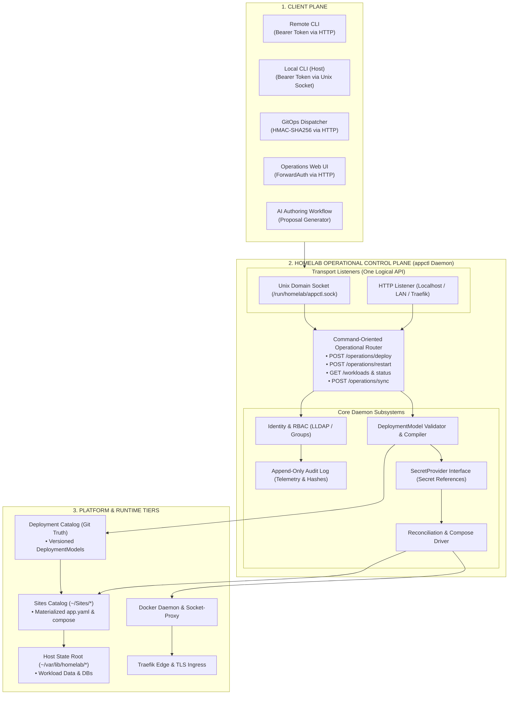

# Architecture Consolidation & Control Plane Roadmap v5

> **Supersedes**: [Architecture Consolidation Roadmap v4](architecture-consolidation-roadmap-v4.md) and [appctl Engine V2 Refactoring Plan](../appctl/appctl-engine-v2-refactoring.md)
>
> **Current Platform Baseline**: Consolidated Git baseline combining NixOS appliance (`Core/`), modernized type-safe metadata engine (`appctl-v2`), and validated provenance domain models.
>
> **Architectural Decision Records**:
> - [`homelab-3tier-architecture-and-provenance.md`](../../../03-records/decisions/homelab-3tier-architecture-and-provenance.md)
> - [`homelab-appctl-control-plane-architecture.md`](../../../03-records/decisions/homelab-appctl-control-plane-architecture.md)
>
> **Target System**: `roadtotech.me` (NixOS appliance `Core/`, application workloads `Sites/`, persistent state `~/var/lib/homelab/`)

---

## Executive Summary

Roadmap v5 establishes the unified engineering roadmap for Homelab Core. It integrates the **3-Tier Architecture & Provenance Model** with the transition of **`appctl` into the authoritative Homelab Core Operational Control Plane**.

Under this roadmap, `appctl` is no longer a collection of local shell scripts invoked over SSH; it is an authenticated, command-oriented control plane daemon exposed over Unix domain socket and HTTP. The platform maintains **Git as the authoritative declarative truth for deployment state**, reconciles implementation-agnostic **Deployment Models**, projects secrets via a provider interface, and serves heterogeneous clients (local CLI, remote CLI, GitOps dispatcher, Operations UI, and AI authoring workflows) with complete telemetry.

---

## 1. System Topology & Control Plane Architecture



---

## 2. Core Architectural Invariants

1. **One Logical API Across Transports**: The control-plane API is a single logical command-oriented contract. Unix domain socket vs. HTTP is merely transport. Local and remote CLIs invoke identical operation schemas.
2. **Host Access Does Not Confer Authority**: Entering via SSH does not bypass control-plane authentication. **Every mutating operation requires an explicit, authenticated user-scoped token.**
3. **Git is the Authoritative Source of Deployment State**: Approved `DeploymentModels` are committed to the version-controlled deployment repository. `appctl` reconciles desired Git state into running containers, preserving rollback capability (`git revert`) and historical auditability.
4. **Five-Stage Model Lifecycle (Intent vs. Implementation)**:
   $$\text{Repository} \xrightarrow{\text{Investigation}} \text{Application Profile} \xrightarrow{\text{Proposal}} \text{DeploymentProposal} \xrightarrow{\text{Human Selection}} \text{DeploymentModel (Git)} \xrightarrow{\text{appctl Materialize}} \text{Deployment Definition} \xrightarrow{\text{Reconcile}} \text{Containers}$$
   `DeploymentModel` captures implementation-agnostic intent (ports, domains, volumes, dependencies); `Deployment Definition` captures the concrete platform descriptors (`app.yaml` + Compose).
5. **AI Authoring Boundary**: The AI is strictly an upstream authoring client with zero mutation authority. The AI analyzes repositories and emits `DeploymentProposals`. After human approval, the AI is completely out of the loop.
6. **KISS Primitives & Linear Control Paths**: The deployment pipeline remains strictly linear:
   $$\text{Source Push} \longrightarrow \text{CI Build} \longrightarrow \text{GitOps Ingress} \longrightarrow \text{appctl Reconcile} \longrightarrow \text{Compose Up}$$
   No distributed message brokers or deployment databases.
7. **Secret Reference Invariant**: Deployment definitions contain secret references (`secretKeyRef`), never secret material. References are resolved at runtime via the `SecretProvider` interface.
8. **Clean Persistent State Root**: Mutable application data lives strictly under `~/var/lib/homelab/<app>/`, isolated from Git repositories.
9. **Client Independence**: `appctl` owns the control-plane contract, not its clients. Homepage is a read-only dashboard consumer, not an interactive administration cockpit.

---

## 3. Phased Implementation Roadmap

### Overview

| Phase | Title | Focus Area | Key Deliverables | Verification Gates |
| :--- | :--- | :--- | :--- | :--- |
| **P0** | **Baseline Consolidation** | Git & Architecture | Merge `refactor/appctl-rework` into `main`, unify history, supersede old plans. | Clean git working tree, `./scripts/test` passing, flake check green. |
| **P1** | **Mail Realignment** | Topology & State | Move Stalwart to `smtp.roadtotech.me`, SnappyMail to `~/Sites/snappymail`. | Zero data loss, verified rollback archive, state parity diff, Diun SMTPS delivery. |
| **P2** | **GitOps Hardening** | Ingress Security | Authoritative Core repo registry, HMAC validation, systemd sandboxing. | Flake check, path traversal rejection tests, Compose AST security validator. |
| **P3** | **Manifest Contract** | Domain Engine | Schema v1.0, `core_manifest.py`, source provenance resolution (`git ls-remote`). | Regression tests for domain invariants, schema linting in CI. |
| **P4** | **Control Plane Daemon** | API & Dispatch | `homelab-appctl.service`, dual transport (socket + HTTP), thin-client CLI, append-only audit log. | Hermetic API test suite, explicit token validation tests, audit log telemetry verification. |
| **P5** | **Identity & Secrets** | Auth & Providers | Authelia header auth, user-scoped API tokens, `SecretProvider` reference resolver. | RBAC permission matrix tests, secret reference materialization tests. |
| **P6** | **Deployment Model & AI**| Intent Authoring | Capability model, `DeploymentProposal` $\to$ `DeploymentModel` compiler, Git commit pipeline. | Intent validation tests, platform security invariant enforcement tests. |
| **P7** | **Operations UI & Portal** | Client Integration | Dedicated Operations UI client, Homepage status integration widgets. | End-to-end deployment verification via UI and CLI. |

---

### Phase 0: Baseline & Architectural Consolidation (Completed)
* **Deliverable 0.1**: Record Architectural Decision Record (`homelab-appctl-control-plane-architecture.md`).
* **Deliverable 0.2**: Merge `refactor/appctl-rework` into `main` and synchronize baseline back to working branch.
* **Deliverable 0.3**: Mark superseded roadmaps (v2, v3, v4) and legacy refactoring plans as `status: superseded`.
* **Deliverable 0.4**: Run `./scripts/test` and `nix flake check` to confirm baseline integrity.

---

### Phase 1: Mail Topology Realignment & Zero-Data-Loss Migration Runbook
* **Deliverable 1.1: Pre-Migration Snapshot**:
  Freeze SnappyMail container, generate timestamped SHA256-verified backup archive of `Core/config/snappymail/data`.
* **Deliverable 1.2: Workload Provisioning & State Cutover**:
  - Provision `~/var/lib/homelab/snappymail/`.
  - Replicate state with `cp -a` and prove byte parity (`diff -r`).
  - Create `~/Sites/snappymail/app.yaml` (Class B Image-Only) and `docker-compose.yml`.
* **Deliverable 1.3: Stalwart Endpoint Re-homing**:
  Update Stalwart public Traefik labels in `Core/docker-compose.yml` to `smtp.roadtotech.me`. Remove SnappyMail from Core stack.
* **Deliverable 1.4: Cutover Verification**:
  Verify webmail logins, address book persistence, IMAP/SMTP mail flow, and Diun SMTPS alert delivery on port 465.

---

### Phase 2: GitOps Privilege & Authority Hardening
* **Deliverable 2.1: Authoritative Core Repository Registry**:
  Define `Core/config/deployments.yaml` as the sole authority for admitted deployment targets.
* **Deliverable 2.2: Second Brain Read-Only Data Vault Policy**:
  Designate `~/Brain` with `strategy: pull-only`, isolated from Docker execution.
* **Deliverable 2.3: Workload Compose Security Policy**:
  Implement pre-flight Compose AST inspection rejecting privileged containers, Docker socket mounts, and host root mounts.
* **Deliverable 2.4: Systemd Service Sandboxing**:
  Apply `ProtectSystem=strict`, `NoNewPrivileges=true`, and private temporary directories to `homelab-gitops.service`.

---

### Phase 3: Manifest Contract Convergence & Provenance Engine
* **Deliverable 3.1: Manifest Schema v1.0 & Authoritative Parser (`core_manifest.py`)**:
  - Implement strongly-typed domain dataclasses: `SitesApp`, `CoreService`, `SourceConfig`.
  - Enforce explicit `source.ref` semantics: moving branch (`main`), release tag (`v1.2.3`), immutable commit SHA (`a1b2c3...`).
  - Strict transport scheme validation: permitted `https://`, `ssh://`, `git@`; reject `file://` and path traversals.
* **Deliverable 3.2: Two-Axis Inspection**:
  - Axis 1: Local Sites deployment checkout state (`✓ Synced`, `* Dirty`, `⬆ Ahead`, `⬇ Behind`).
  - Axis 2: Upstream software provenance state (via `git ls-remote` bounded by 10s timeout during `--fetch`).
* **Deliverable 3.3: Engine Promotion**:
  Promote `scripts/appctl_engine_v2.py` to `scripts/appctl_engine.py` with complete behavioral test coverage.

---

### Phase 4: appctl Control Plane Daemon & Command-Oriented API
* **Deliverable 4.1: Control Plane Service (`homelab-appctl.service`)**:
  Implement command-oriented daemon listening on dual transports: Unix domain socket (`/run/homelab/appctl.sock`) for local host clients and unified HTTP listener (localhost, LAN, and Traefik edge ingress) for network clients.
* **Deliverable 4.2: Command-Oriented Operational Endpoints**:
  - `POST /operations/deploy` (reconcile deployment for target workload)
  - `POST /operations/restart` (restart workload containers)
  - `POST /operations/pull` (pull latest images)
  - `GET /workloads` (list workloads with two-axis inspection)
  - `GET /workloads/{id}/status` (inspect specific workload diagnostics)
  - `GET /workloads/{id}/logs` (stream logs via Server-Sent Events)
  - `POST /operations/sync` (recompile dashboard status)
* **Deliverable 4.3: Thin-Client CLI**:
  Update `scripts/appctl` to act as a lightweight client dispatching commands to the local daemon socket with zero duplicate operational code.
* **Deliverable 4.4: Append-Only Audit Log**:
  Record every mutating command to `~/.local/state/homelab/appctl/audit.jsonl` with restricted `0600` permissions. Telemetry captures `principal`, `action`, `target`, `transport`, `origin`, `client`, `timestamp`, and `result`.

---

### Phase 5: Identity, RBAC & SecretProvider Interface
* **Deliverable 5.1: Authentication Gateway**:
  - Web requests: Accept trusted identity headers from Traefik/Authelia (`Remote-User`, `Remote-Groups`).
  - CLI requests (both remote and local): Require explicit user-scoped API tokens (`Authorization: Bearer <token>`).
  - Webhook requests: Validate HMAC-SHA256 signature against webhook secret.
* **Deliverable 5.2: Role-Based Authorization Engine**:
  Enforce group policies (`homelab-admin`, `homelab-operator`, `homelab-viewer`) on incoming operations.
* **Deliverable 5.3: SecretProvider Interface**:
  - Define `SecretProvider` contract in the control plane:
    ```python
    class SecretProvider(Protocol):
        def resolve_secret(self, ref: str) -> str: ...
        def project_environment(self, refs: dict[str, str]) -> dict[str, str]: ...
    ```
  - Deployment definitions store secret references (`secretKeyRef: ...`), never plaintext material.
  - Workload application secrets are projected dynamically at container recreation without Git history pollution.

---

### Phase 6: Homelab Deployment Model & AI Authoring Workflow
* **Deliverable 6.1: Platform Capability Catalog & Invariants**:
  Formally define machine-readable specification of Core capabilities (HTTP routing, persistent mounts, networks, healthchecks) and invariants (no privileged containers, isolated state root).
* **Deliverable 6.2: `DeploymentProposal` Schema**:
  Define candidate model structure emitted by AI discovery workflows from repository inspection.
* **Deliverable 6.3: `DeploymentModel` Git Pipeline & Materialization**:
  - Operator selects/edits proposal into an approved `DeploymentModel`.
  - The model is committed to the version-controlled deployment repository (Git).
  - `appctl` validates the model, provisions `~/var/lib/homelab/<app>/`, compiles the Deployment Definition (`app.yaml` + Compose), and triggers deployment.
* **Deliverable 6.4: Human Approval Invariant**:
  Enforce interactive operator signature/approval before model creation. AI possesses zero execution authority.

---

### Phase 7: Operations Web Client & Dashboard Integration
* **Deliverable 7.1: Operations UI Client**:
  Deploy lightweight, browser-based management console as a client of the control plane API (proposals review, approval, real-time log streaming, token management).
* **Deliverable 7.2: Homepage Status Integration**:
  Maintain Homepage as read-only portal, querying `appctl` live status endpoints or compiled `services.yaml`.

---

## 4. Definition of Done

1. **Unified Control Plane**: All platform operations execute through `homelab-appctl.service`. No secondary deployment scripts exist.
2. **Explicit Authentication Everywhere**: Host SSH access does not confer appctl authority. Every operation has an authenticated principal and is recorded in the append-only audit log with transport and origin telemetry.
3. **Declarative Git Truth**: All workloads are governed by version-controlled `DeploymentModels` committed to Git. Deployments are fully reproducible and auditable.
4. **Secret Hygiene**: Deployment manifests contain zero plaintext credentials; workload secrets resolve via `SecretProvider` without Git history pollution.
5. **Safe Deployment Authoring**: AI agents act strictly as proposal generators; all mutations require human approval and conform to Core invariants.
6. **Zero Data Loss**: Mail realignment preserves 100% of user data, mailboxes, and address books.
7. **Invariant-Driven Regression Coverage**: All defined domain, authorization, deployment, and security invariants have automated regression coverage.
