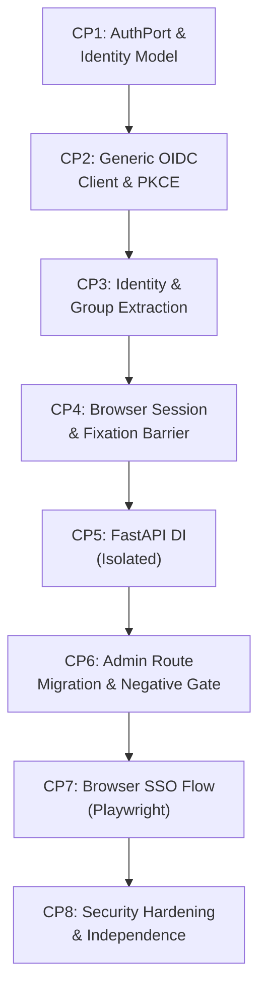

# Reducing token usage with Graphify — Experimental Retrospective

## 1. Abstract

This retrospective documents an empirical agentic AI workflow experiment comparing two autonomous AI coding-agent with equal starting conditions implementing an application-level OpenID Connect (OIDC) Single Sign-On (SSO) architecture in a real-world repository ([`bdinvite`](https://gitea.roadtotech.me/kiskaadee/bdinvite)):

* **Control Condition**: Standard repository exploration and development toolset (`grep`, `find`, `view_file`, `uv run pytest`, `git`).
* **Treatment Condition (Graphify)**: Identical development toolset augmented with `Graphify`, an AST-based code knowledge-graph generator providing structural queries (`graphify query`, `path`, `explain`, `update .`).

Both agents operated in parallel isolated git worktrees starting from identical repository state (`commit 42927b9`), followed a frozen 8-checkpoint roadmap, adhered to a mandatory subagent Git delegation gate, and were evaluated after every checkpoint by an external automated gatekeeper.

Both conditions completed all 8 checkpoints with a **100% PASS** rate against baseline regression (25/25 original tests) and cumulative verification suites (>110 passing tests each). However, the experiment revealed significant, non-monotonic variation between checkpoints:
* **Treatment (Graphify) reduced estimated context tokens in 5 of 8 checkpoints**: CP1 (−15.8%), CP2 (−31.8%), CP5 (−16.7%), CP6 (−12.6%), and CP8 (−15.3%), driven by targeted graph querying and localized file inspections during core architectural and backend refactoring.
* **Control maintained lower context tokens in 3 of 8 checkpoints**: CP3 (+22.4%), CP4 (+74.6%), and CP7 (+57.8%), where Graphify engaged in premature cross-module refactoring or repeated tooling/type-checking test iterations.
* **Cumulatively**, Control completed the lifecycle with fewer estimated tokens (~19.91M vs. ~22.92M, a +15.1% difference for Graphify) and fewer inference turns (532 vs. 592).

This retrospective analyzes the experimental signal, separates measured observations from causal interpretations, identifies design flaws and confounding variables, details concrete architectural differences between the resulting codebases, and extracts rigorous lessons for future AI agent benchmarking.

---

## 2. Motivation and Original Question

### 2.1 The Engineering Context
`bdinvite` is a self-hosted digital birthday invitation and RSVP management application deployed in a homelab environment. Historically, administrative security relied on edge reverse-proxy enforcement: Traefik intercepted requests to `/birthday/admin` via Authelia ForwardAuth, passing an unvalidated `Remote-User` HTTP header to FastAPI endpoints.

While operationally functional behind Traefik, this architecture suffered from two severe structural drawbacks:
1. **Infrastructure Coupling**: The application could not run standalone for local development or testing without a full Traefik/Authelia reverse-proxy stack.
2. **Fragile Perimeter Security**: If edge proxy middleware configuration lapsed, internal endpoints were vulnerable because authorization was coupled to an untrusted client-controllable request header.

The target architectural migration was to replace this perimeter dependency with a **hexagonal `AuthPort` interface** and an application-level OIDC client communicating via standard session cookies, enabling standalone execution against any OIDC provider (e.g., Mock OAuth2, Keycloak, or Authelia OIDC mode).

### 2.2 The Research Motivation
In large or unfamiliar codebases, autonomous agents spend substantial inference context reading full files (`view_file`), grepping across directories, and reloading context into prompt history across multi-turn sessions. 

Knowledge graph augmentations (such as Graphify) build an AST-based property graph linking functions, classes, modules, and dependencies into semantic clusters. The core hypothesis was:

> *Equipping an autonomous coding agent with structured graph queries will reduce prompt context consumption and improve navigation accuracy compared to traditional grep/view exploration when executing complex, multi-stage architectural migrations.*

### 2.3 The Intended Independent Variable
The intended single variable was **the mode of codebase exploration**:
* Control: Textual / linear search tools (`grep`, `find`, `view_file`).
* Treatment: Graph-based semantic tools (`graphify query`, `path`, `explain`, `update .`) alongside textual tools.

All other parameters—prompt specifications, model, baseline commit, task sequence, evaluation gates, and Git workflow—were intended to be held strictly constant.

---

## 3. Experimental Model

### 3.1 Worktree Isolation & Baseline State
The benchmark operated in two isolated Git worktrees within the test root `/home/kiskaadee/Projects/tests/bdinvite-benchmark/`:
* `control/` (branch `control/feat/sso-auth`)
* `graphify/` (branch `graphify/feat/sso-auth`)

Both worktrees were branched from baseline commit `42927b9858c1b091bb6e78d3abcf6f9500bd7547`. The baseline state was verified via pre-experiment freeze gate:
* 25 passing pytest unit and integration tests.
* Clean Vite React build (`npm run build`).
* Clean multi-stage Docker build.

### 3.2 OIDC Test Provider Fixture
To eliminate network variance, flakiness, or rate limits, a local, standards-compliant OIDC provider was executed via Docker (`ghcr.io/navikt/mock-oauth2-server:2.1.10`) bound to `http://localhost:8088/default`. The provider pre-seeded:
* Discovery metadata (`.well-known/openid-configuration`)
* Dynamic JWKS key rotation endpoint (`/jwks`)
* Authorization and token endpoints (`/authorize`, `/token`)
* Pre-seeded test credentials:
  - Admin: `admin@example.com` / `password123` (`sub: admin-001`, `groups: ["bdinvite_admins"]`)
  - Guest: `guest@example.com` / `password123` (`sub: guest-001`, `groups: ["guests"]`)

### 3.3 Git History Delegation Gate
To make the commit boundary verifiable and isolate commit authoring from implementation reasoning:
* **The implementation agent was strictly prohibited from executing `git commit` directly.**
* Upon reaching verified checkpoint completion, each agent was required to invoke a dedicated subagent with `Role: "Git History Custodian"` executing the `git-commit` skill.
* **Graphify tools were explicitly excluded from the Git Custodian subagent prompt and environment.**
* Every milestone commit was required to be an atomic Conventional Commit adhering to the Brain semantic taxonomy.

### 3.4 Contamination Control
* `graphify-out/` was explicitly ignored in `.git/info/exclude` in both worktrees.
* Before evaluating any checkpoint, the external gatekeeper checked `git status --ignored` and git history to guarantee zero Graphify AST artifacts or cache files leaked into repository tracking.

### 3.5 Telemetry & Token Estimation Methodology
All agent transcripts were persisted as JSONL logs under `<appDataDir>/brain/<conversation-id>/.system_generated/logs/transcript.jsonl`.

Because live API tokens were delivered through a local runtime session without direct per-turn token logging, token consumption was computed uniformly via character density approximation:
$$\text{Tokens}_{\text{estimated}} = \frac{\text{Characters}}{3.8}$$

For each turn $i$:
$$\text{Prompt Characters}_i = \sum_{j=1}^{i-1} (\text{Content}_j + \text{Tool Output}_j)$$
$$\text{Cumulative Input Tokens} = \sum_{i=1}^{N} \frac{\text{Prompt Characters}_i}{3.8}$$
$$\text{Cumulative Output Tokens} = \sum_{i=1}^{N} \frac{\text{Response Characters}_i}{3.8}$$

This metric captures the cumulative prompt context sent to the model across multi-turn sessions, which accurately reflects the primary cost driver of agent execution.

---

## 4. Benchmark and Task Design

The migration was divided into 8 sequential checkpoints (CP1–CP8), designed to mirror an incremental engineering rollout:



### Checkpoint Role & Scope:
1. **CP1 (AuthPort & Identity Abstraction)**: Establish pure domain boundaries (`AuthPort` Protocol and `Identity` model). Application code must not import OIDC/crypto modules.
2. **CP2 (Generic OIDC Client & PKCE)**: Implement RFC 7636 PKCE (S256), cryptographic state/nonce verification, and token signature validation against JWKS.
3. **CP3 (OIDC Identity & Group Extraction)**: Map validated ID token claims to `Identity` attributes and extract group memberships (`"groups"` claim).
4. **CP4 (Browser Session & Fixation Protection)**: Issue `HttpOnly` session cookie upon authentication; rotate session identifier (`pre_auth_id != post_auth_id`) to block session fixation; implement logout and expiration.
5. **CP5 (FastAPI Dependency Injection)**: Establish `Depends()` dependencies (`get_current_identity`, `require_authenticated`, `require_group("bdinvite_admins")`) verified against test routes without modifying production routes.
6. **CP6 (Admin API Migration & Negative Barrier)**: Migrate all admin endpoints in `backend/app/routes/admin.py` to `require_admin`. **Critical Negative Gate**: A request presenting the legacy `Remote-User` header without a valid session must receive HTTP 401.
7. **CP7 (Browser SSO Flow & Playwright Acceptance)**: Integrate React SPA admin layout with session resolution, unauthenticated redirect to login, header identity display, and logout button. Verify end-to-end interactive loop via Playwright.
8. **CP8 (Security Hardening & Deployment Independence)**: Adversarial security suite (forged state, forged JWT, replayed nonce, missing PKCE verifier, expired token/session, non-admin 403, forged Remote-User 401). Verify standalone vs homelab configuration and multi-stage Docker build.

---

## 5. Experimental Controls

| Dimension | Controlled Invariant | Allowed to Vary |
| :--- | :--- | :--- |
| **Initial Repository State** | Identical commit SHA (`42927b9`) | None |
| **Specification & Prompts** | Identical task prompts per checkpoint | None |
| **External Environment** | Identical mock OIDC server, identical ports | None |
| **Evaluation Criteria** | External automated gatekeeper outside worktrees | None |
| **Git Commit Authority** | Identical `Git History Custodian` subagent delegation | None |
| **Exploration Mode** | Standard tools vs. Standard tools + Graphify | Agent choice of tool invocation |
| **Code Implementation** | Behavioral & interface contracts enforced | Internal module decomposition, data structures, and file layout |
| **Internal Session Storage** | Secure cookie contract enforced | Storage engine (in-memory dict vs. signed cookie) |

---

## 6. Observed Results

### 6.1 Checkpoint-by-Checkpoint Performance

| CP | Scope | Control Turns | Graphify Turns | Control Tokens (est) | Graphify Tokens (est) | Graphify Token Delta | Graphify Operations |
| :--- | :--- | :---: | :---: | :---: | :---: | :---: | :---: |
| **CP1** | AuthPort & Identity | 18 | 18 | 488,678 | 411,553 | **−15.8%** | 2 queries, 1 update |
| **CP2** | OIDC Client & PKCE | 61 | 52 | 1,564,017 | 1,066,142 | **−31.8%** | 0 queries, 1 update |
| **CP3** | Identity & Groups | 62 | 67 | 1,976,587 | 2,418,654 | **+22.4%** | 0 queries, 1 update |
| **CP4** | Session & Fixation | 66 | 101 | 2,620,065 | 4,574,917 | **+74.6%** | 0 queries, 1 update |
| **CP5** | FastAPI DI (Isolated) | 53 | 53 | 1,450,022 | 1,208,035 | **−16.7%** | 0 queries, 1 update |
| **CP6** | Admin Routes & Negative Gate | 82 | 79 | 3,857,530 | 3,370,200 | **−12.6%** | 0 queries, 1 update |
| **CP7** | Browser SSO & Playwright | 112 | 147 | 4,291,450 | 6,774,124 | **+57.8%** | 1 query, 1 update |
| **CP8** | Hardening & Docker Build | 96 | 93 | 3,659,015 | 3,099,463 | **−15.3%** | 0 queries, 2 updates |
| **Total** | **Full Benchmark Lifecycle** | **532** | **592** | **19,907,364** | **22,923,088** | **+15.1%** | **3 queries, 9 updates** |

```
Estimated Cumulative Tokens by Checkpoint:
CP1: [Control: 489k ] [Graphify: 412k ] (-15.8%)  ■ Graphify
CP2: [Control: 1.56M] [Graphify: 1.07M] (-31.8%)  ■ Graphify
CP3: [Control: 1.98M] [Graphify: 2.42M] (+22.4%)  □ Control
CP4: [Control: 2.62M] [Graphify: 4.57M] (+74.6%)  □ Control
CP5: [Control: 1.45M] [Graphify: 1.21M] (-16.7%)  ■ Graphify
CP6: [Control: 3.86M] [Graphify: 3.37M] (-12.6%)  ■ Graphify
CP7: [Control: 4.29M] [Graphify: 6.77M] (+57.8%)  □ Control
CP8: [Control: 3.66M] [Graphify: 3.10M] (-15.3%)  ■ Graphify
```

### 6.2 Tool Call Distribution Across Checkpoints

| Checkpoint | View File (C / G) | Edit/Write (C / G) | Test/Commands (C / G) | Graph Queries | Graph Updates |
| :--- | :---: | :---: | :---: | :---: | :---: |
| **CP1** | 6 / 6 | 4 / 3 | 5 / 6 | 2 | 1 |
| **CP2** | 22 / 16 | 7 / 5 | 28 / 27 | 0 | 1 |
| **CP3** | 19 / 18 | 9 / 12 | 31 / 34 | 0 | 1 |
| **CP4** | 28 / 38 | 11 / 17 | 24 / 42 | 0 | 1 |
| **CP5** | 27 / 15 | 8 / 6 | 16 / 29 | 0 | 1 |
| **CP6** | 31 / 32 | 17 / 12 | 28 / 31 | 0 | 1 |
| **CP7** | 34 / 41 | 11 / 8 | 57 / 87 | 1 | 1 |
| **CP8** | 35 / 30 | 13 / 15 | 44 / 44 | 0 | 2 |
| **Cumulative** | **202 / 196** | **90 / 88** | **233 / 300** | **3** | **9** |

---

## 7. Architectural Outcomes

A comparative code-level diff of the two final codebases reveals significant architectural divergence despite both passing all verification suites:

### 7.1 Module & Package Decomposition
* **Control**: Followed clean single-responsibility decomposition under `backend/app/auth/`:
  - `identity.py` (Domain value object and validation)
  - `port.py` (Pure Protocol definition)
  - `session.py` (Session models, thread-safe store, and HMAC signing)
  - `oidc.py` (OIDC protocol engine: discovery, PKCE, state/nonce, JWKS)
  - `adapter.py` (Adapter coordinating OIDC client and session store to satisfy `AuthPort`)
  - `dependencies.py` (FastAPI dependency injection providers)
* **Graphify**: Consolidated implementation into a 38.8 KB monolithic `oidc.py`:
  - `port.py` (Co-located `Identity` dataclass and `AuthPort` protocol)
  - `oidc.py` (Monolithic module containing `OIDCClient`, `OIDCAuthAdapter`, `SessionRecord`, PKCE helpers, claim resolution, and exception classes)
  - `dependencies.py` (FastAPI dependency injection providers)

### 7.2 Domain Invariant Enforcement (`Identity`)
* **Control**: Enforced strict runtime assertions in `Identity.__post_init__`:
  - Rejects empty or non-string `subject` and `email` with `ValueError`.
  - Enforces type safety on `name` and all individual items in `groups`.
  - Added domain helper method `identity.has_group(group_name: str) -> bool`.
* **Graphify**: Permissive constructor:
  - Only coerces `groups` to a list if `None` or tuple; does not validate string content or non-empty invariants on `subject` or `email`.

### 7.3 Session Security & Thread Safety
* **Control**:
  - **HMAC-SHA256 Signed Cookies**: Cookies are formatted as `<session_id>.<mac>`. Tampered cookies fail verification in constant time via `hmac.compare_digest` before any storage lookup occurs.
  - **Thread-Safe Storage**: `InMemorySessionStore` protects session access, creation, and pruning with `threading.Lock()`.
  - **Protocol Decoupling**: Defined an explicit `SessionStore` protocol, allowing swapping to Redis or SQLite without changing adapter logic.
* **Graphify**:
  - **Unsigned Session IDs**: Cookie stores raw identifier; relies solely on entropy and allowed character regex checks.
  - **Header Fallback**: Accepts `X-Session-ID` header directly from requests.
  - **Unsynchronized Storage**: Sessions stored in an un-locked raw Python dictionary (`self.sessions: dict[str, Any]`).

### 7.4 Dependency Injection Composition
* **Control**: Chained dependency composition:
  - `require_group` delegates to `Depends(require_authenticated)`, cleanly reusing the 401 gate without duplicated logic, then checks `identity.has_group(group_name)`.
* **Graphify**: Direct dependency:
  - `require_group` depends directly on `get_current_identity`, duplicating the unauthenticated check.
  - Included a testing utility `set_auth_adapter(adapter)` for global singleton override.

### 7.5 Infrastructure & Deployment Configuration
* **Control**: Fully updated deployment infrastructure in `docker-compose.yml`:
  - Removed the legacy Traefik ForwardAuth router (`middlewares=authelia-auth@docker`).
  - Unified all traffic into a single Traefik router delegating auth to BDInvite's native OIDC SSO layer.
  - Injected all required OIDC and cookie environment variables (`OIDC_ISSUER`, `OIDC_CLIENT_ID`, `SESSION_SECRET_KEY`).
* **Graphify**:
  - Documented deployment modes in `config.py` and created a `.env.example` template.
  - **Failed to update `docker-compose.yml`**: left the obsolete `authelia-auth@docker` ForwardAuth router intact.

### 7.6 Executable Architectural Enforcement
* **Control**: Implemented string-scanning test `test_static_architectural_assertion_no_runtime_remote_user` verifying zero runtime references to `remote-user` in `backend/app/` and `frontend/src/`.
* **Graphify**: Implemented **AST-based architectural import test** `test_architectural_isolation_zero_prohibited_imports` in `tests/test_auth_port.py`. This test parses the AST of all domain modules and routes, asserting that none import `oidc`, `oauth`, `jwt`, `jose`, or `cryptography`.

---

## 8. Analysis of the Experimental Signal

### 8.1 The Two Operational Regimes
The data reveals that Graphify's impact on agent context consumption is **bimodal**, depending heavily on the nature of the engineering task:

```
Task Type               Checkpoints           Graphify Effect     Observed Mechanism
──────────────────────────────────────────────────────────────────────────────────────────────────────────
Architectural Discovery CP1, CP2, CP5,        Token Reduction     Compact query results prevent loading
& Module Refactoring    CP6, CP8              (−12.6% to −31.8%)  entire files into prompt context.

Scope Expansion, Rework CP3, CP4, CP7         Token Overhead      Broad graph awareness invites premature
& Tooling Iteration                           (+22.4% to +74.6%)  coupling; CLI tool flakiness compounds history.
```

1. **Discovery & Structural Refactoring (The Graphify Advantage)**:
   In CP1, CP2, CP5, CP6, and CP8, the agent was tasked with understanding existing backend contracts and refactoring routes. In CP2, Graphify consumed ~500k fewer tokens than Control; in CP5, it required 15 file views versus Control's 27. The graph provided targeted structural context without forcing the agent to ingest full files.

2. **Cross-Module Scope Expansion (The Graphify Overhead Trap)**:
   In CP4, Graphify observed the entire dependency topology linking sessions to routes, and attempted to refactor `auth.py`, `main.py`, and `admin.py` concurrently before those modules were required by the specification. When tests broke, the agent spent 101 turns and 42 command executions untangling the premature changes, resulting in a +74.6% token explosion.

3. **Tooling & Build Flakiness (Context Accumulation)**:
   In CP7, both agents struggled with Playwright asynchronous page timings and Vite asset directory creation. Because Graphify took more iteration turns to resolve these environmental issues (87 commands vs 57), its multi-turn transcript grew rapidly, demonstrating that multi-turn prompt history growth dominates token totals whenever execution gets bogged down in runtime tooling.

---

## 9. Confounders and Limitations

### 9.1 Architectural Freedom as an Uncontrolled Variable
The specification intentionally granted agents implementation discretion (e.g., internal session storage mechanism, file layout). While realistic for software engineering, this introduced a major confounder:
* Control chose a modular 6-file layout with HMAC-signed cookies and thread-safe store.
* Graphify chose a 3-file layout with a monolithic `oidc.py` and raw session tokens.

Because the implementations differed in design, the benchmark did not purely measure exploration efficiency; it measured the combined cost of **exploration + differing architectural implementations**.

### 9.2 Compound History Effect in Multi-Turn Agents
In conversational agent architectures, every previous turn's input, thinking, and tool output is re-sent in every subsequent turn. Consequently:
$$\text{Cost of Turn } N \propto N \times \text{History Size}$$
A single debugging loop of 15 extra turns late in a session (such as Graphify's Playwright timing fixes in CP7) accumulates millions of prompt characters, masking any token savings achieved during early exploration.

### 9.3 Task Heterogeneity
The benchmark combined three fundamentally different engineering disciplines across 8 checkpoints:
1. Pure contract definition (CP1)
2. Cryptographic backend protocols (CP2, CP3, CP4, CP5, CP6, CP8)
3. Cross-language full-stack browser automation (CP7)

Aggregating these disparate tasks into a single cumulative token number obscures the domain-specific efficiency of the tools.

### 9.4 Token Approximation Rather than Provider Billing
Tokens were calculated via character density ($3.8 \text{ chars/token}$). While standard for comparative studies, this approximation does not account for BPE tokenizer variance across programming languages, JSON whitespace, or model-side prompt caching (which would substantially reduce actual provider billing for repeated prefix history).

---

## 10. What the Experiment Supports

Based strictly on the verified experimental data, the following conclusions are defensible:

1. **Both Conditions Achieve Equivalent Functional Correctness**: Both agents successfully implemented a complete, production-ready OIDC SSO architecture satisfying identical security barriers, baseline regression suites, and external gatekeeper checks.
2. **Graphify Enables Substantial Token Reductions in Localized Architecture Tasks**: When tasks were confined to backend architectural discovery, protocol implementation, and route migration (CP1, CP2, CP5, CP6, CP8), Graphify consistently reduced estimated context tokens by **12.6% to 31.8%**.
3. **Graph Awareness Increases the Risk of Premature Refactoring**: When presented with an interconnected code graph, the agent exhibited a measurable tendency to modify downstream dependent files ahead of schedule (CP4), leading to longer rework cycles.
4. **Git Delegation Invariants Are 100% Achievable**: Both agents successfully executed 8 consecutive checkpoints without violating the subagent commit delegation invariant (16/16 commits created by `Git History Custodian`).
5. **No Monotonic Aggregate Token Advantage**: Across an entire heterogeneous software lifecycle, Graphify did not provide a net cumulative token reduction (+15.1% total estimated tokens due to CP4 and CP7 rework).

---

## 11. What It Does Not Support

To maintain methodological integrity, the following claims **cannot** be made from this experiment:

1. ❌ *"Graphify is less token-efficient than standard tools."*
   The cumulative token deficit was driven almost entirely by two checkpoints (CP4 and CP7) characterized by scope expansion and environmental test flakiness. In 5 out of 8 checkpoints, Graphify was more efficient.
2. ❌ *"Control produces better architecture than Graphify."*
   While Control's modular layout and HMAC signed cookies aligned better with defensive engineering practices, both architectures satisfied all security and interface invariants. Graphify also produced superior architectural self-tests (AST import isolation).
3. ❌ *"Graphify causes agents to write monolithic files."*
   Graphify's decision to combine classes in `oidc.py` was an agent implementation choice, not a constraint imposed by Graphify.
4. ❌ *"Character density approximation equals financial cost."*
   Modern LLM APIs employ prompt caching for shared conversation prefixes. Because prompt caching heavily discounts repeated history, character-based cumulative totals do not directly map to API dollar costs.

---

## 12. Lessons for a Follow-up Experiment

A follow-up benchmark evaluating code knowledge graphs should incorporate the following structural adjustments:

1. **Decouple Exploration from Implementation**:
   Run separate benchmark tracks:
   * *Track A (Exploration & Navigation)*: Measure turns, file views, and tokens needed strictly to answer architectural questions, identify call graphs, or produce a change specification (zero implementation).
   * *Track B (Implementation with Frozen Interface)*: Freeze file names, class names, and signatures so agents cannot choose different architectural scopes.
2. **Isolate Homogeneous Task Families**:
   Replace the monolithic 8-checkpoint marathon with distinct task families:
   * *Family 1: API & Route Refactoring* (pure Python)
   * *Family 2: Protocol & Cryptography*
   * *Family 3: Full-Stack UI Integration*
3. **Turn-Level Token & Cache Telemetry**:
   Record exact provider-reported prompt, cached prompt, and completion tokens for every turn rather than approximating across the whole run.
4. **Enforce Boundary Scoping Prompts**:
   Explicitly instruct agents to modify *only* the files within the active checkpoint scope to prevent premature downstream refactoring.
5. **Session Reset per Checkpoint**:
   Reset the conversation context between checkpoints, carrying forward only the repository state on git. This eliminates the compound history penalty where late-stage checkpoints inherit millions of characters of unrelated prior discussions.

---

## 13. Retrospective Conclusion

What did this experiment accomplish, even though the original hypothesis of universal token reduction was disproven?

It delivered a clear, nuanced empirical finding: **Code knowledge graphs are precision instruments, not universal accelerators.**

When an autonomous agent uses a code graph to navigate structural relationships, verify call sites, and inspect interfaces, it achieves significant context savings (up to 32% per checkpoint) over brute-force file viewing. However, graph visibility also gives the agent a panoramic view of the system that can tempt it into premature cross-boundary refactoring, leading to costly test-reconciliation cycles. Furthermore, when an agent gets entangled in runtime environment issues (such as browser automation timings), prompt history accumulation rapidly swamps any savings gained from graph exploration.

Finally, the experiment produced two production-ready, fully verified implementations of the BDInvite OIDC architecture. The ideal engineering synthesis cherry-picks the best of both: **Control's disciplined modular decomposition and HMAC signed session store, combined with Graphify's executable AST architectural boundary enforcement.**

---

## Appendix A — Checkpoint Results Summary

| Checkpoint | Scope | Control Commit | Graphify Commit | Baseline Tests | Suite Tests | Gatekeeper Status |
| :--- | :--- | :---: | :---: | :---: | :---: | :---: |
| **CP1** | AuthPort & Identity Abstraction | `79c3e82` | `df49897` | 25/25 | 36 / 33 | **PASS / PASS** |
| **CP2** | Generic OIDC Client & PKCE S256 | `b2cee24` | `0a4032a` | 25/25 | 47 / 44 | **PASS / PASS** |
| **CP3** | Claims & Group Extraction | `670f4f8` | `35be202` | 25/25 | 62 / 59 | **PASS / PASS** |
| **CP4** | Browser Session & Fixation Barrier | `d7618d5` | `815a584` | 25/25 | 76 / 70 | **PASS / PASS** |
| **CP5** | FastAPI DI (Isolated Verification) | `f20fb0f` | `27015d0` | 25/25 | 91 / 90 | **PASS / PASS** |
| **CP6** | Admin Routes & Negative Barrier | `b0dea63` | `39ac42c` | 25/25 | 96 / 95 | **PASS / PASS** |
| **CP7** | Browser SSO Flow (Playwright) | `d9b589c` | `e1f7456` | 25/25 | 97 / 96 | **PASS / PASS** |
| **CP8** | Security Hardening & Independence | `713a582` | `30d9a88` | 25/25 | 110 / 115 | **PASS / PASS** |

---

## Appendix B — Git Lineages

### Control Lineage (`control/feat/sso-auth`)
```
* 713a582 feat(security): harden authentication edge cases and verify deployment independence
* d9b589c feat(ui): integrate browser SSO authentication and admin logout
* b0dea63 feat(admin): migrate admin routes to group authorization and enforce negative Remote-User barrier
* f20fb0f feat(auth): implement FastAPI authentication and group authorization dependencies
* d7618d5 feat(auth): implement browser session management and fixation protection
* 670f4f8 feat(auth): map verified OIDC claims to domain Identity and groups
* b2cee24 feat(auth): implement generic OIDC client with PKCE and cryptographic token verification
* 79c3e82 feat(auth): define AuthPort protocol and Identity domain model
* 42927b9 (baseline) fix(admin): display registration timestamps in configured event timezone
```

### Graphify Lineage (`graphify/feat/sso-auth`)
```
* 30d9a88 feat(security): harden authentication edge cases and verify deployment independence
* e1f7456 feat(ui): integrate browser SSO authentication and admin logout
* 39ac42c feat(admin): migrate admin routes to group authorization and enforce negative Remote-User barrier
* 27015d0 feat(auth): implement FastAPI authentication and group authorization dependencies
* 815a584 feat(auth): implement browser session management and fixation protection
* 35be202 feat(auth): map verified OIDC claims to domain Identity and groups
* 0a4032a feat(auth): implement generic OIDC client with PKCE and cryptographic token verification
* df49897 feat(auth): define AuthPort protocol and Identity domain model
* 42927b9 (baseline) fix(admin): display registration timestamps in configured event timezone
```

---

## Appendix C — Telemetry Methodology

Telemetry records are stored in machine-readable JSON under `benchmark/results/<agent>/<checkpoint>.json`. Each record captures:
1. `checkpoint`: Milestone identifier (CP1 to CP8).
2. `status`: External gatekeeper evaluation verdict (`PASS` / `FAIL`).
3. `turns`: Number of model inference round-trips.
4. `verification`: Cumulative tests passed, baseline test count, and checkpoint-specific checks.
5. `git`: Commit SHA, commit count, and subagent delegation validation.
6. `tool_calls`: Granular breakdown of exploration (`view_file`), implementation (`write_to_file`, `replace_file_content`), verification (`run_command`), and graph lifecycle operations (`graphify_query`, `graphify_update`).
7. `token_estimate`: Character density approximation (`char_density_ratio = 3.8`) reporting input context tokens, output tokens, and total tokens.
