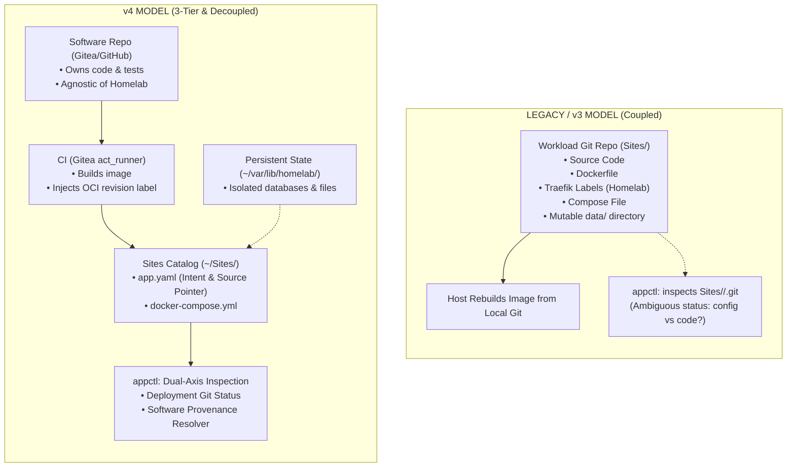

# Architectural Discussion: Migrating from Legacy Multirepo (v3) to 3-Tier Provenance Architecture (v4)

## 1. Problem Statement

The initial architecture of the `roadtotech.me` homelab followed an intuitive multirepo pattern:
- The platform host was organized under `/home/kiskaadee/Homelab`.
- Core platform capabilities (NixOS, Traefik, Authelia, LLDAP) lived in `Core/`.
- Every application workload lived in its own folder under `Sites/<app>/`, where each folder was an independent Git repository cloned from Gitea.
- The `appctl` CLI and the `homelab-gitops` dispatcher interacted directly with these local Git repositories: `appctl` checked Git ahead/behind counts via `git rev-list HEAD...@{u}`, and GitOps deployed changes via `git pull origin main`.

While minimal on paper, scaling this setup to in-house projects (`doc2site`, `bitetrack`), automated container CI (`act_runner`), and invariant testing exposed severe architectural friction across five key areas:

| Friction Area | Legacy / v3 Multirepo Assumption | Concrete Operational Failure |
| :--- | :--- | :--- |
| **Source Pollution** | The application repository *is* the deployment repository. | In-house software projects (`doc2site`, `bitetrack`) had to commit Homelab-specific Traefik labels, Docker bridge networks (`proxy-net`), and host path mounts directly into their source trees. The software could not be open-sourced or run elsewhere without Homelab artifacts. |
| **Repository Inflation** | Every workload requires its own dedicated Git repository. | Off-the-shelf applications (`jellyfin`, `stirling`, `snappymail`) required entire standalone Git repositories simply to store a 20-line `docker-compose.yml` and a small `app.yaml`. |
| **Semantic Ambiguity in `appctl`** | Freshness = `git rev-list HEAD...@{u}` in `Sites/<app>/.git`. | `appctl` could only answer: *"Has this deployment directory changed relative to Git?"* It could never answer whether the running container was running the latest application code, whether a Traefik label changed, or whether an upstream release was available. |
| **Git / State Conflation** | Workload mutable state lived inside `Sites/<app>/data/`. | Mutable runtime data (SQLite databases, session caches) lived directly inside the version-controlled directory tree, creating dirty Git working trees and risking accidental commits of persistent data. |
| **Coupled Build Execution** | GitOps ran `compose_build` on the deployment host. | The deployment host was responsible for pulling source and compiling software, violating least-privilege host principles and creating ambient dependency requirements on the host. |

---

## 2. Context & Analysis: The KISS Principle in Systems Design

A central dilemma was evaluated: **Does migrating to v4 introduce unnecessary complexity, or does it represent true systems simplification?**

In systems engineering, KISS is not measured merely by the count of files or commands; it is measured by **minimizing uncoordinated coupling and ambiguous control loops**.

- **The Old Model was "Simple on Paper, Coupled in Practice"**: Pushing source code, deployment declarations, and runtime state into one folder looked simple, but it forced one Git commit SHA to represent three completely independent concepts.
- **The v4 Model is "Strictly Decoupled with Few Primitives"**: It establishes a clean **3-Tier Architecture** where each component has exactly one owner:
  - **Software Layer**: Owns code, Dockerfiles, and tests (agnostic of Homelab).
  - **Deployment Layer**: Owns environment-specific compose stacks and ingress rules (`~/Sites/*`).
  - **Platform Layer**: Owns host lifecycle, edge routing, and deployment controllers (`~/Core`).
  - **State Root**: Owns mutable data, isolated outside Git trees (`~/var/lib/homelab/<app>/`).

---

## 3. Options Evaluation

| Dimension | Option A: Retain & Patch v3 | Option B: Migrate to 3-Tier v4 (Adopted) | Analysis & Rationale |
| :--- | :--- | :--- | :--- |
| **Separation of Concerns** | Low. Software and environment configuration remain coupled. | High. Software, deployment, and platform remain completely independent. | v4 allows in-house software to be reused or published publicly without refactoring. |
| **Workload Taxonomy** | Homogeneous. Treats all apps as identical Git repositories. | Explicit. Distinguishes *Source-Backed* (custom code) from *Image-Only* (off-the-shelf). | Off-the-shelf apps (Jellyfin, Stalwart) do not need fake source repositories. |
| **Inspection Meaning** | Fragile. A "behind" Git badge could mean a doc change or a bugfix. | Accurate. Two operational inspection axes resolve deployment state vs. software provenance. | `appctl` inspects real runtime facts (`org.opencontainers.image.revision`). |
| **Control Path Complexity** | Uncontrolled. Host builds images on demand over SSH or webhook. | Bounded. Source pushes trigger CI; CI publishes image; `appctl update` reconciles deployment. | Host appliance never clones source or compiles software. |
| **State Hygiene** | Poor. Mutable data co-located with versioned files in `Sites/<app>/data`. | Clean. Runtime state provisioned strictly under `~/var/lib/homelab/<app>/`. | Prevents unversioned databases from dirtying Git trees. |

---

## 4. Consensus & Resolutions Incorporated into v4

The architectural migration from v3 to v4 was approved and frozen with four specific design guardrails:

1. **Artifact as Provenance Object, Not a 4th Architectural Tier**:
   The container image is treated as an intermediate build product connecting the Software Layer to the Platform Runtime, keeping the architecture strictly 3-tiered.
2. **`appctl update` Defined as Deployment Reconciliation**:
   `appctl update` was explicitly protected from becoming an on-host source compiler. Its sole responsibility is: pull deployment descriptors, pull published image, recreate containers (`docker compose up -d`), verify readiness, and record the truth ledger.
3. **Downgrading `git ls-remote` to a Remote Revision Resolver**:
   Rather than building a complex commit-distance/ancestry engine, `git ls-remote` simply answers: *Does the remote ref match the deployed container's SHA?* (`exact match` vs. `different revision`), strictly gated behind `--fetch`.
4. **Two Operational Axes with Three Independent Revision Identities**:
   - *Operational Inspection Axes*: Deployment Configuration Status & Software Provenance Status.
   - *Cryptographic Identities Recorded*:
     1. `deployment_config_revision` (Sites Git commit)
     2. `source_revision` (Upstream Git commit from OCI label)
     3. `artifact_digest` (Immutable OCI `RepoDigests` SHA256)

### Successor Plans & Decisions
* **Unified Blueprint**: [`01-plans/homelab/architecture-consolidation-roadmap-v4.md`](../../01-plans/homelab/architecture-consolidation-roadmap-v4.md)
* **Architectural Decision Record**: [`03-records/decisions/homelab-3tier-architecture-and-provenance.md`](../../03-records/decisions/homelab-3tier-architecture-and-provenance.md)
* **Active Refactoring**: [`01-plans/homelab/appctl/appctl-engine-v2-refactoring.md`](../../01-plans/homelab/appctl/appctl-engine-v2-refactoring.md)
