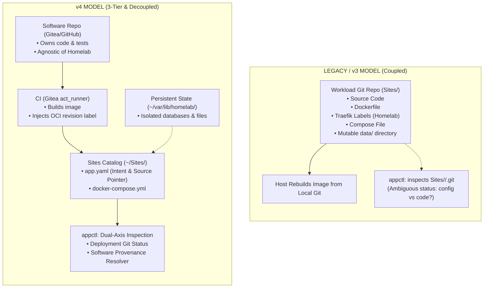

# Architectural Discussion: Migrating from Legacy Multirepo (v3) to 3-Tier Provenance Architecture (v4)

## 1. Problem Statement & Historical Context

The initial architecture of the `roadtotech.me` homelab followed an intuitive multirepo pattern:
- The platform host was organized under `/home/kiskaadee/Homelab`.
- Core platform capabilities (NixOS, Traefik, Authelia, LLDAP) lived in `Core/`.
- Every application workload lived in its own folder under `Sites/<app>/`, where each folder was an independent Git repository cloned from Gitea.
- Operational tooling (`appctl`, `homelab-gitops`) interacted directly with these local Git repositories: `appctl` checked Git ahead/behind counts via `git rev-list HEAD...@{u}`, and GitOps deployed changes via `git pull origin main`.

### Why the Original Model Looked Attractive
In the early days of the homelab, the multirepo pattern appeared minimal and elegant:
- **One Folder = One Repo**: Developers could `cd ~/Sites/my-app`, edit files, run `git commit`, and push.
- **Uniformity**: Every service looked identical to operational tools—they were all Git checkouts containing a `docker-compose.yml` and an `app.yaml`.
- **Zero Central Coordination**: Deploying a new service simply meant cloning a new Git repository into `Sites/`.

### The Concrete Operational Failures
As the homelab matured from simple containers to in-house software development, automated CI (`act_runner`), and invariant testing, this coupled model began to break down across five critical areas:

1. **Source Repository Pollution (`doc2site`, `bitetrack`)**:
   When developing custom software like `doc2site` (a documentation generator) or `bitetrack` (a nutrition tracking API), the application source code had to live directly inside the deployment repository. This forced private Homelab-specific Traefik labels, Docker bridge network names (`proxy-net`), host bind-mount paths, and environment secrets into the application's source tree.
   *The Friction*: Hosting infrastructure co-located with code made clean open-sourcing, code sharing, or isolated testing difficult without stripping Homelab configuration.

2. **Repository Inflation (Off-the-Shelf Applications)**:
   Standard third-party services like `jellyfin`, `stirling-pdf`, and `snappymail` are distributed as pre-built container images. Yet, under the multirepo model, each required a full standalone Git repository on Gitea simply to track a 20-line `docker-compose.yml` and a small `app.yaml`. Gitea became cluttered with dozens of near-empty repositories whose sole purpose was satisfying the convention that every workload directory had to be an independent Git clone.

3. **Semantic Ambiguity in `appctl`**:
   `appctl` determined whether an application was "up to date" by running `git rev-list HEAD...@{u}` inside `Sites/<app>/.git`.
   *The Blind Spot*: This check could only answer: *"Has someone pushed a change to the deployment configuration files in Git?"* It could never answer:
   - Is the running container executing the latest release of the application code?
   - Was the container built from a commit with critical bug fixes?
   - Has a new upstream image tag been published?
   Operators were left with a false sense of confidence: `appctl list` would report a green "✓ Up to date" badge even when the running container was running months-old, stale code.

4. **Conflation of Versioned Descriptors and Mutable State**:
   Because `Sites/<app>` was a Git checkout, workloads frequently stored runtime state inside `Sites/<app>/data/`. Mutable SQLite databases, session tokens, and dynamic uploads sat right inside the working tree. This dirtied the Git working tree, caused merge conflicts during automated deployments, and increased the risk of accidentally committing sensitive or volatile state to the forge.

5. **Host-Bound Build Execution**:
   Because the application repository was cloned directly onto the deployment host, the GitOps dispatcher often triggered `docker compose build` on the server itself. This required installing build tools and runtime compilers on the appliance host, consuming substantial CPU/RAM during builds and violating the principle of a hardened, minimal host appliance.

---

## 2. Context & Analysis: The KISS Principle in Systems Design

A central architectural debate emerged: **Does moving away from the single-repo pattern introduce unwarranted complexity, or does it represent true systems simplification?**

In systems engineering, KISS ("Keep It Simple, Stupid") is often misunderstood as "the fewest files" or "the fewest directories." However, shoving fundamentally different concerns into a single directory is not simplicity—it is uncoordinated coupling.

* **Legacy Multirepo: Simple on Paper, Coupled in Practice**:
  Treating `Sites/<app>` as both the software repository and the deployment declaration looked simple, but it forced a single Git commit SHA to represent three orthogonal concepts simultaneously: the software source code, the deployment environment configuration, and the runtime state.
* **3-Tier Decoupling: Modular Simplicity with Few Primitives**:
  True systems simplicity is achieved by decoupling into three core tiers connected by intermediate artifacts and an isolated state boundary, where each component has exactly one clear responsibility:
  - **Software Layer (Tier 1)**: Owns application code, unit tests, and Dockerfiles. Agnostic of Homelab.
  - **Intermediate Artifacts**: Immutable OCI container images produced by CI, carrying cryptographic provenance (`org.opencontainers.image.revision`).
  - **Deployment Layer (Tier 2)**: Owns environment manifests and Compose definitions (`~/Sites/*`).
  - **Platform Layer (Tier 3)**: Owns host lifecycle, edge routing, and operational controllers (`~/Core`).
  - **Persistent State Root (Filesystem Boundary)**: Owns mutable databases and caches isolated outside Git trees (`~/var/lib/homelab/<app>/`).

---

## 3. Evaluated Dilemmas & Rejected Alternatives

### A. The Upstream Cloning Dilemma: Ahead/Behind Counts vs. `git ls-remote`
An initial proposal explored calculating exact commit distance (e.g. `"3 commits behind upstream"`) for source-backed applications. 

* **The Problem**: Git cannot calculate commit distance or ancestry without access to the commit graph. This would require the deployment host to clone or fetch full Git histories for every in-house application.
* **Resulting Direction**: The exploration ultimately converged on rejecting local cloning on the appliance host in favor of **commit equality verification via `git ls-remote`**.
  By querying `git ls-remote <url> refs/heads/<ref>`, the host asks one crisp question: *Does the remote ref match the commit SHA stamped into the container's OCI label?*
* **The Trade-Off Rationale**: Foregoing commit distance counts eliminates repository bloat, disk overhead, and credential propagation on the deployment host, providing instant staleness detection with zero on-host git state.

### B. The Orchestrator Sprawl Dilemma: Miniature Kubernetes vs. Linear Reconciliation
Another alternative considered was adopting a dynamic container management architecture modeled after enterprise systems (e.g. RabbitMQ/Redis event queues, a PostgreSQL deployment state store, and background rollback daemons).

* **The Problem**: A single 24/7 home server cannot justify running complex distributed brokers just to start and stop containers. It increases memory pressure, introduces distributed state split-brain scenarios, and makes disaster recovery painful.
* **Resulting Direction**: The exploration ultimately converged on strictly bounding the control path to a **linear, deterministic chain**:
  $$\text{Source Push} \longrightarrow \text{CI Build} \longrightarrow \text{GitOps Ingress} \longrightarrow \text{appctl update} \longrightarrow \text{Compose Up}$$
* **The Trade-Off Rationale**: `appctl update` operates purely as a local reconciliation primitive. Simplicity is preserved by having zero background daemons managing deployment state.

---

## 4. What Became Possible After the Architectural Separation

| Dimension | Legacy Coupled Model (Historical Constraint) | 3-Tier Provenance Model (Engineering Motivation) |
| :--- | :--- | :--- |
| **Open Source & Code Sharing** | Hosting infrastructure co-located with code made clean open-sourcing or external sharing cumbersome. | Allows the software repository to remain free of Homelab-specific infrastructure and be tested or open-sourced independently. |
| **Off-the-Shelf Workloads** | Deploying third-party apps required creating dummy Git repositories on Gitea to satisfy the workload structure. | Workloads without custom source declare an Image-Only manifest directly in `Sites/` with zero repository overhead. |
| **Deployment Truth & Visibility** | Inspection in `appctl` was limited to local working tree status, leaving operators unaware of running container staleness relative to source. | Two operational inspection axes independently report local deployment configuration status and container code provenance. |
| **Host Appliance Hygiene** | On-host image compilation consumed appliance resources and mutable runtime data risked dirtying version-controlled directories. | Appliance runtime relies on pre-built container artifacts, with mutable state provisioned strictly under `~/var/lib/homelab/<app>/`. |

---

## 5. Convergence & Successors

This exploratory inquiry resolved the tension between structural simplicity and architectural coupling: true simplicity lies in clear boundaries and minimal control paths, not monolithic folder cramming.

The exploration converged on the three-tier provenance architecture formalized in the ADR:
* **Architectural Decision Record**: [`03-records/decisions/homelab-3tier-architecture-and-provenance.md`](../../03-records/decisions/homelab-3tier-architecture-and-provenance.md)

The concrete technical specifications, contracts, and phased execution roadmaps (P0 through P5) are specified in the companion plan:
* **Authoritative Implementation Plan**: [`01-plans/homelab/consolidation/architecture-consolidation-roadmap-v4.md`](../../01-plans/homelab/consolidation/architecture-consolidation-roadmap-v4.md)
* **Homelab Project Hub**: [`06-projects/homelab/README.md`](../../06-projects/homelab/README.md)
