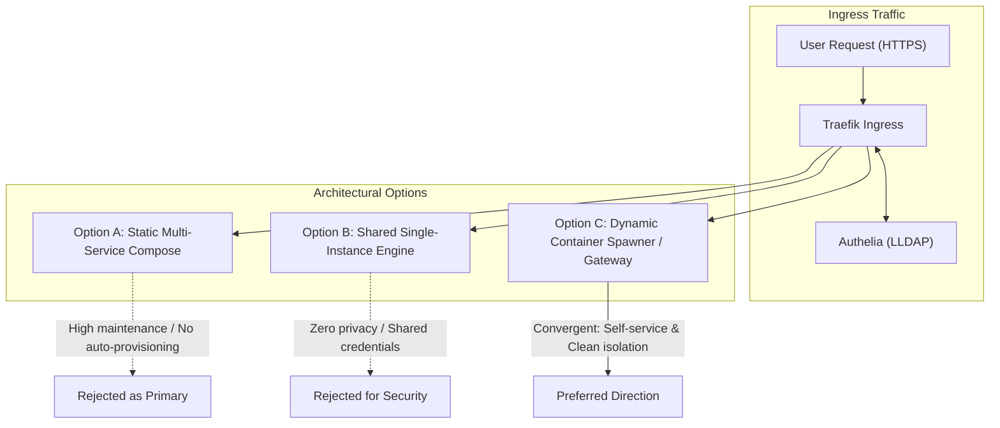
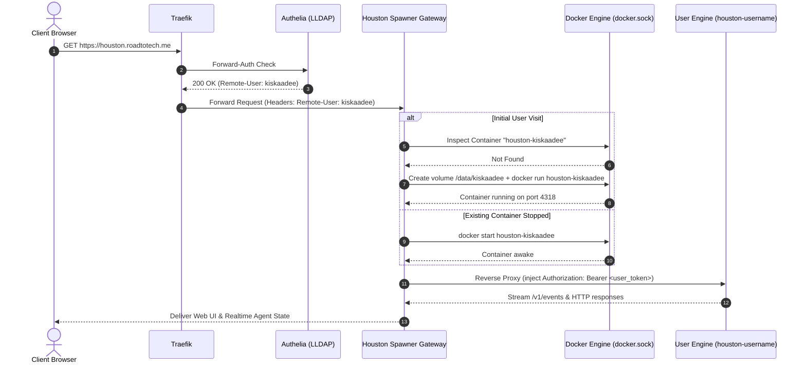

# Architectural Discussion: Multi-User Houston Architecture via Dynamic Container Spawner and LLDAP/Authelia

## 1. Problem Statement & Context

Houston is designed around a single shared engine runtime (`packages/runtime`) and host (`packages/host`). In the self-hosted appliance container (`ghcr.io/gethouston/houston-engine-pod`), the engine runs as a single-tenant daemon:
* All agent state, SQLite databases, memory, skills, and routines reside in a single shared directory tree (`/data/workspaces/`).
* API authorization is governed by a single static shared secret (`HOUSTON_HOST_TOKEN`).
* The engine does not implement internal user tables, access control lists (ACLs), or directory service protocols (LDAP, OIDC, SAML).

In a homelab environment where central identity is governed by **LLDAP** and authenticated via **Authelia** (through Traefik forward-auth), deploying Houston as a shared multi-user service presents an architectural challenge:

1. **Lack of Isolation in Shared Deployments**: If multiple users access a single self-hosted Houston instance through Authelia, all users inevitably share the same workspaces, conversation history, API keys, and background routines.
2. **Headless Engine vs. Graphical Interface**: The official container image (`houston-engine-pod`) provides only the headless HTTP/SSE/WebSocket server on port 4318; it does not serve the web frontend (`packages/web`) out of the box.
3. **Manual Provisioning Friction**: Manually pre-configuring distinct container definitions in `docker-compose.yml` for every family or team member in LLDAP introduces administrative overhead and wastes system memory on idle daemons.

The goal of this inquiry is to explore an architecture that turns a self-hosted Houston deployment into an automated, multi-user appliance where authenticated users automatically receive their own isolated agent runtime on their first login.

---

## 2. Context & Analysis: Core Dilemmas

### A. Single-Tenant Engine vs. Multi-User Demands
Houston Cloud resolves multi-tenancy not by making the engine multi-tenant internally, but through an external Go-based Gateway that manages Kubernetes pods and PVCs on a per-user/per-agent basis. In a Docker-based homelab, Kubernetes is disproportionate; however, the fundamental design principle remains valid: **isolation at the container boundary rather than inside the application code**.

### B. Identity Brokering & Token Concealment
Authelia authenticates users against LLDAP and injects identity headers (`Remote-User`, `Remote-Email`, `Remote-Groups`) downstream into Traefik. However, Houston’s REST/WebSocket endpoints require an `Authorization: Bearer <token>` header matching `HOUSTON_HOST_TOKEN`. Asking users to manually copy and paste backend tokens into the web UI compromises the consumer user experience and breaks zero-touch onboarding. The proxy tier must bridge this gap by acting as an identity broker.

### C. Resource Contention vs. Always-On Routines
Each Houston engine instance runs a Node.js process and spawns pi agent runtimes lazily. While baseline memory consumption is relatively modest (~60–80 MB idle), running dozens of static containers continuously consumes system RAM. A dynamic lifecycle model (Scale-to-Zero after inactivity) must be balanced against Houston's background routine scheduler (`packages/host/src/schedule/scheduler.ts`), which requires running containers to execute scheduled tasks.

---

## 3. Evaluated Approaches & Rejected Alternatives

### Option A: Static Pre-Allocated Services in Docker Compose
* **Description**: Pre-define a dedicated service in `docker-compose.yml` for each user (`houston-alice`, `houston-bob`), mapping distinct volumes (`/data/alice`, `/data/bob`) and distinct subdomains with Traefik router rules.
* **Limitations**:
  - No self-service: Adding a user in LLDAP requires manual edits to `docker-compose.yml`, recreating the stack, and configuring DNS/Traefik rules.
  - Idle resource consumption: Containers run indefinitely regardless of user activity.
  - Stiff coupling between directory accounts and infrastructure manifests.

### Option B: Shared Engine Instance with Forward-Auth Gate
* **Description**: Place a single `houston-engine-pod` behind Traefik + Authelia. Any valid LLDAP user passes authentication and reaches the app.
* **Limitations**:
  - Complete absence of privacy: All authenticated users read and modify the same agents, files, and chat logs.
  - Security risk: Connected app credentials (e.g., personal Gmail or GitHub tokens) become accessible to all authenticated directory members.

### Option C: Dynamic Container Spawner & Identity Gateway (Convergent Pattern)
* **Description**: Introduce a lightweight gateway service that mounts `/var/run/docker.sock`, serves the static frontend SPA, and acts as an intelligent reverse proxy.
* **Mechanism**:
  1. Traefik verifies the user session against Authelia and passes `Remote-User: <username>` to the Gateway.
  2. The Gateway inspects Docker via Docker API/socket:
     - If `houston-<username>` does not exist: Automatically initializes `/data/users/<username>`, generates a per-user internal secret, and spawns the container connected to `proxy-net`.
     - If the container exists but is stopped: Starts the container.
  3. The Gateway proxies the HTTP/SSE/WebSocket traffic to `http://houston-<username>:4318`, transparently injecting the user's specific bearer token.
* **Precedents**: Matches the battle-tested architecture of JupyterHub (`dockerspawner`) and Coder workspaces.

---

## 4. What Becomes Possible After Architectural Separation

| Dimension | Option B (Shared Monolith) | Option C (Dynamic Spawner Gateway) |
| :--- | :--- | :--- |
| **Privacy & Multi-Tenancy** | Zero isolation; shared agent pool. | Strict sandbox isolation; private `/data` volumes per user. |
| **Onboarding Experience** | Manual configuration per user. | Zero-touch; account created on first LLDAP login via Authelia. |
| **Credential Management** | Shared LLM API keys. | Users configure their own provider keys or local Ollama endpoints. |
| **Resource Efficiency** | Low memory, but single point of failure. | Scale-to-zero capable; inactive user engines can be idled. |
| **Upstream Compatibility** | Requires intrusive code changes to host. | 100% upstream compatible; uses official unmodified `engine-pod` images. |

---

## 5. Architectural Blueprint: The Spawner Gateway

### Key Responsibilities of the Spawner Gateway
1. **Static Web Serving**: Serves the compiled `packages/web` bundle on root (`/`) with client-side routing fallback (`try_files index.html`).
2. **Dynamic Provisioning Engine**:
   - Sanitizes `Remote-User` to prevent path traversal or invalid container names (`[a-zA-Z0-9_-]+`).
   - Maintains a lightweight state mapping (SQLite or JSON in gateway volume) recording user tokens and last-active timestamps.
   - Interacts with Docker daemon through a Unix socket library (e.g., `dockerode` in Node.js or `moby/client` in Go).
3. **Full Protocol Proxying**:
   - Streams SSE connections (`/v1/events`, `/agents/:slug/events`) without buffer delays (`flush_interval: -1`).
   - Upgrades WebSocket connections (`/v1/ws`).
   - Rewrites authentication headers so the frontend operates without credential configuration cards.

---

## 6. Convergence & Successors

This discussion establishes that dynamic container spawning at the reverse proxy layer is the cleanest architectural fit for running Houston multi-user with LLDAP in a homelab environment. It achieves parity with Houston Cloud's pod isolation without mutating upstream source code.

* **Successor Artifacts**:
  - **ADR**: Define the formal architectural commitment to the Spawner Gateway pattern, selecting the implementation language and proxy engine (e.g., Node.js + `http-proxy` + `dockerode`).
  - **Plan**: Create the implementation specification in `01-plans/homelab/houston-spawner-gateway-implementation.md` detailing the Docker Compose configuration, Traefik labels, volume hierarchy, and idle reaping policy.
