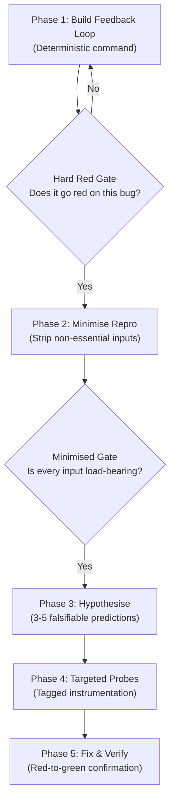

# How to Build Effective Agent Skills

When we repeatedly find ourselves guiding an AI coding agent through the same engineering workflow, the natural next step is to bundle those instructions into an agent skill. Whether it is diagnosing an elusive bug, executing test-driven development, reviewing a pull request, or conducting an architectural interview, capturing that workflow as a reusable skill seems straightforward: write down what a good engineer does, save it as a `SKILL.md` file, and let the agent run it.

In practice, that first attempt often produces frustrating results. The agent starts out following the instructions, but midway through it skips an essential diagnostic step. It reads a few files and jumps straight to an unverified theory. It announces that tests passed when it only checked syntax, or it generates hundreds of lines of code while forgetting the architectural constraints we carefully wrote into the prompt.

The problem is rarely that the model lacked intelligence. The problem is that we treated the skill as a large prompt rather than an engineering component.

---

## 1. The Intuitive First Approach and Why It Breaks

When most of us write our first skill, we write a descriptive essay. We describe the ideal behavior in prose:

```markdown
# My Bug Debugger Skill

You are an expert software debugger. When given a bug:
1. Carefully inspect the codebase.
2. Form sound hypotheses.
3. Be thorough and make sure you do not guess.
4. Write tests to verify your fix.
5. Make sure the fix does not break anything else.
```

This looks reasonable to a human reader because a human brings an implicit operational discipline to the task. A human knows that "do not guess" means setting up a debugger or writing a reproduction script before touching application logic. 

An LLM agent does not bring that operational discipline. Instead, several specific failure modes emerge:

### A. Premature Completion (The Pull of Later Steps)
LLMs generate text sequentially, and when all future steps are visible in context, the model experiences an attention pull toward "being done." If Step 1 is "find the problem" and Step 4 is "write the fix," the agent will often perform a superficial inspection, convince itself it spotted the bug, and rush straight to proposing changes. The presence of the downstream steps actively undermines the legwork required by the current step.

### B. The Attention Tax (The "Coin-Flip" Bug)
If we try to fix the rush by adding more instructions, reference tables, styling guidelines, and output templates into the main skill document, we trigger a different failure. As the document expands to hundreds of lines, the agent's attention thins across the excess. Static reference material (such as full HTML layouts or mock examples) buries the procedural steps, turning compliance into a coin-flip.

### C. Conversational Drift
If the skill relies on conversational memory to track where it is in a multi-step workflow, state degrades with every turn. After six or seven tool calls, terminal outputs and file diffs push the initial plan out of the model's high-attention window. The agent loses the thread of which hypotheses were eliminated and which remain active.

Notice what is happening: **We are asking text generation to do the work of operational control.** A prompt describes what a good outcome looks like; it does not regulate the transitions required to get there.

---

## 2. The Core Mental Model: A Skill is a State Machine

What clarified this for me was changing how I think about a skill's purpose:

> **A skill is not a prompt that asks for good work. A skill is a bounded operational state machine that restricts agent variance.**

Instead of asking, *"What should I tell the agent to do?"*, the engineering question becomes:
* What discrete states does this workflow pass through?
* What observable evidence proves the current state is complete before entering the next?
* What must be impossible for the agent to skip?
* Where does the agent hold state when conversational context gets crowded?



When an engineering workflow is modeled this way, the skill stops being an open-ended conversational suggestion and becomes an enforceable procedure.

---

## 3. Mechanisms of an Effective Skill

Studying robust real-world skills reveals several concrete structural mechanisms that produce reliable behavior.

### 3.1 Negative Boundaries Are as Important as Positive Ones
An agent with an unbounded mandate will instinctively expand its scope. A skill must define what it explicitly refuses to own.

For example, when authoring an engineering specification from an ongoing discussion, an agent that is allowed to ask questions will often trap the user in recursive interview loops. A well-bounded specification skill states its negative boundary up front:

```markdown
# To Spec
Turn the current conversation context and codebase understanding into an engineering spec.
Do NOT interview the user; just synthesize what has already been established.
```

Similarly, in test-driven development, an agent will frequently try to refactor nearby architecture while writing a test. An effective TDD skill places an explicit boundary:

```markdown
Refactoring is not part of this loop. Refactoring belongs to the review stage,
not the red-to-green implementation cycle.
```

By explicitly taking certain actions off the table, we remove the branches where the agent most frequently wanders.

### 3.2 Anti-Skipping Invariants (Hard Pre-Condition Gates)
Telling an agent "be thorough" does not work. What works is inserting an explicit stopping condition between phases that forbids advancing until an observable artifact exists.

In debugging, for example, the primary failure mode is reading code to construct a clever theory before proving how the bug fails. An effective debugging skill halts this with a hard gate:

```markdown
### Completion Criterion: A tight loop that goes red
Phase 1 is done only when you can name ONE command that you have already run at least once,
and that is red-capable, deterministic, and fast.

If you catch yourself reading code to build a theory before this command exists, stop:
jumping straight to a hypothesis is the exact failure this skill prevents.
No red-capable command, no Phase 2.
```

The capitalized instruction is not rhetorical decoration. It is an operational invariant that gives the agent an unambiguous test for done versus not-done.

### 3.3 The Information Hierarchy and Progressive Disclosure
Every line added to a skill's main instruction file consumes a portion of the agent's attention window on every turn. 

A clean skill organizes material across a three-tier ladder:
1. **In-File Steps**: The primary, ordered procedure the agent executes.
2. **In-File Reference**: Short definitions and rules consulted on demand across all paths.
3. **Disclosed Reference**: Detailed schemas, branch-specific procedures, code templates, or format examples pushed out into sibling files (e.g. in a `references/` directory) and reached via a context pointer.

```text
skills/my-feature/
├── SKILL.md                 # Primary operational steps and gates
├── references/
│   ├── format-schema.md     # Output template, loaded only when generating output
│   └── branch-logic.md      # Edge-case rules, loaded only if Branch B fires
└── scripts/
    └── run-checks.sh        # Deterministic verification script
```

Progressive disclosure is not merely an optimization to save tokens. It protects the primary procedural sequence from being diluted by static reference text. If a section of reference only matters when a specific branch is taken, moving it behind a pointer keeps the main path legible.

### 3.4 Externalizing State
When a workflow involves multiple steps, storing state in conversation turns is fragile. Robust skills anchor state in external, durable structures:

* **Task Graphs over Step Lists**: Instead of a flat list of steps, represent work as a directed acyclic graph where items have explicit dependencies. Unblocked items form an active "frontier" that can be tackled, while blocked items wait.
* **Persistent Markdown Files**: Store notes, hypothesis lists, and eliminated causes in lightweight files on disk rather than relying on the agent remembering what it tried four turns ago.
* **Git Worktrees**: For complex implementations, running separate subagents in isolated Git worktrees against a shared integration branch prevents concurrent edits from polluting the working tree.

### 3.5 Asymmetric Context Pressure
Different tasks require different amounts of working memory. 

An implementation agent has high context pressure: it must explore the repository, understand types, inspect call sites, and write code. 

A code review agent has low context pressure: it receives a static diff and a set of standards.

If we load fifty style guidelines, architectural rules, and code smell checklists into the implementation agent, we crowd out the tokens it needs to understand the problem. A better design decouples the roles: keep the implementation skill focused on red-green testing, and let a separate review skill enforce coding standards against the resulting diff.

---

## 4. The Mental Picture: The Assembly Jig

Think of an effective skill not as an instructional manual, but as a **physical assembly jig or an airlock**.

In a precision manufacturing workshop, a jig does not advise the machinist on how to hold the wood straight. The jig is a physical frame that mechanically prevents the blade from cutting at the wrong angle. 

Similarly, in an airlock, Door B physically cannot open until Door A is sealed and the chamber pressure equalizes. The airlock does not rely on the occupant's memory or discipline; the mechanism enforces the sequence.

An effective skill acts as an airlock for the agent:
* It clamps the boundaries so the agent cannot wander.
* It locks Phase 2 until Phase 1 produces its physical key (a failing test, a verified reproduction command, an agreed seam).
* It moves extraneous reference material outside the chamber until the specific stage that needs it arrives.

---

## 5. The Trade-Offs and Costs

Engineering skills into state machines with external references and strict gates introduces real trade-offs. It is not always the right choice.

| Dimension | Informal Prompt / Ad-Hoc Instructions | Engineered Skill Component |
| :--- | :--- | :--- |
| **Initial Setup Time** | Seconds to write. Zero file overhead. | Hours to design, test, and split into references. |
| **Maintenance Burden** | None. Disposable after the session. | Requires ongoing curation as project tools evolve. |
| **Flexibility** | High. Easy to pivot mid-stream. | Rigid. Forces adherence to the encoded state machine. |
| **Execution Reliability** | Low to moderate. Prone to skipping steps. | High. Gates prevent premature completion. |
| **Best Used For** | One-off exploratory tasks and routine edits. | Recurring, high-friction, error-prone workflows. |

### When NOT to Build a Skill
* **One-Off Tasks**: If a task will not be performed repeatedly, writing a formal skill is pure overhead. Give direct instructions in the session.
* **Simple Rules**: If the requirement is a universal constraint (e.g. "always use 2-space indentation" or "never commit secrets"), encode it as an always-loaded system rule, not a procedural skill.
* **Premature Fragmentation**: Breaking a simple 3-step script into five tiny separate skills creates excessive cognitive load for the human and complicates inter-skill routing without adding reliability.

---

## 6. One Principle to Remember

When designing a skill for an engineering workflow, avoid asking what you want the agent to do. 

Instead, ask this question:

> **"Before allowing the agent to move to the next step, what observable artifact proves the current step actually succeeded?"**

If the skill cannot name that artifact, it does not yet have a gate. It only has a suggestion.
