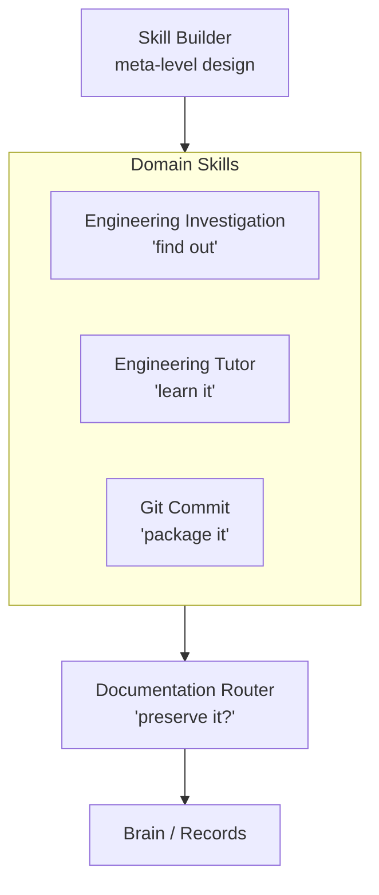
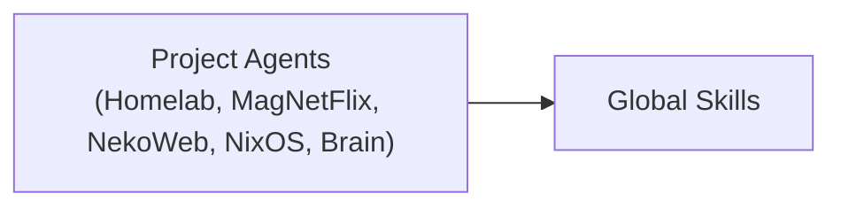
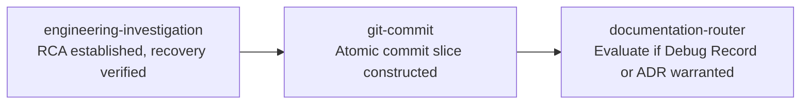
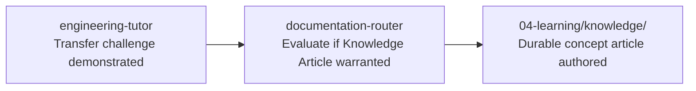
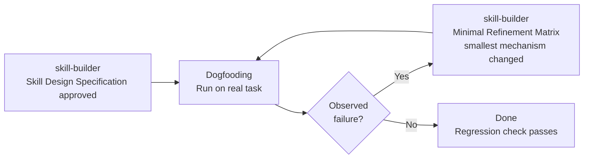

# Global Skill Collection

> **This index describes the skill collection as a system rather than a list of individual capabilities.**

---

## System Architecture

The global skills form a layered behavioral architecture. `skill-builder` governs the collection's design quality. Four domain skills provide reusable behaviors that project agents invoke. `documentation-router` sits at the output boundary, evaluating whether anything produced by the other skills is worth preserving.

Project agents sit above this layer, providing context while the global skills provide reusable behavior:

---

## Skill Interaction Matrix

Each cell describes the pairwise relationship between the **row** skill and the **column** skill.

| From \ To | Investigation | Tutor | Git Commit | Docs Router | Skill Builder |
| :--- | :--- | :--- | :--- | :--- | :--- |
| **Investigation** | — | yields (learner drives) | delegates commit packaging | hands off if RCA warrants it | — |
| **Tutor** | yields (agent takes over for production incidents) | — | learner-controlled; proposes message only | optional handoff for knowledge articles | — |
| **Git Commit** | packages remediation result | learner-controlled | — | delegates if commit warrants documentation | — |
| **Docs Router** | consumes investigation outcome | consumes practice milestones | evaluates commit significance | — | — |
| **Skill Builder** | — | — | delegates all commits | delegates all vault documentation | applies to itself (deletion test) |

---

## Canonical Transition Workflows

These are the three most common multi-skill sequences. They describe normal flows, not mandatory pipelines — each step is independently optional.

### 1. Investigation to History

**Trigger**: A non-trivial bug, infrastructure incident, or regression is diagnosed and fixed.

**Handoff gates**:
- `engineering-investigation` terminates only after verified runtime recovery.
- `git-commit` packages the fix; does not re-examine whether it was the right fix.
- `documentation-router` evaluates whether non-obvious RCA, architectural insights, or operational heuristics justify a durable artifact. Most fixes do not.

---

### 2. Learning to Knowledge

**Trigger**: A tutoring session reaches a demonstrated-mastery milestone (transfer challenge solved, novel mechanism understood).

**Handoff gates**:
- The practice session record (`type: practice`) is an optional offer, not a prerequisite.
- `documentation-router` applies the Gatekeeper: does this concept generalize across system boundaries? If not, no artifact.

---

### 3. Skill Design Loop

**Trigger**: A new or modified skill is scaffolded and needs empirical validation.

**Invariant**: The Mandatory Review Gate in Stage 4 must fire before any file is created. No files before human approval.

---

## Governing Maintenance Criterion

> **Ownership over mentions.**

When adding any new rule, ask: *"Where does this rule belong?"* — not *"Where should I mention this rule?"*

Each rule has one authoritative owner. Other documents may link to it. They must not redefine it.

The primary threat to this collection's health is **duplicate authority**, not missing instructions.

---

## Package Index

| Skill | Human API | Runtime Engine | References |
| :--- | :--- | :--- | :--- |
| [Inbox Curation](inbox-curation/README.md) | [README](inbox-curation/README.md) | [SKILL.md](inbox-curation/SKILL.md) | — |
| [Engineering Investigation](engineering-investigation/README.md) | [README](engineering-investigation/README.md) | [SKILL.md](engineering-investigation/SKILL.md) | — |
| [Engineering Tutor](engineering-tutor/README.md) | [README](engineering-tutor/README.md) | [SKILL.md](engineering-tutor/SKILL.md) | — |
| [Git Commit](git-commit/README.md) | [README](git-commit/README.md) | [SKILL.md](git-commit/SKILL.md) | — |
| [Documentation Router](documentation-router/README.md) | [README](documentation-router/README.md) | [SKILL.md](documentation-router/SKILL.md) | [5 authoring specs](documentation-router/references/) |
| [Skill Builder](skill-builder/README.md) | [README](skill-builder/README.md) | [SKILL.md](skill-builder/SKILL.md) | [Evaluation checklist](skill-builder/references/skill-evaluation-checklist.md) |
