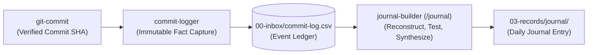

# 📝 Commit Logger

**Commit Logger** is a lightweight, single-pass operational skill responsible for capturing verified Git commit events into Brain's machine-readable ledger (`00-inbox/commit-log.csv`).

It serves as the deterministic capture boundary between Git repository operations and Brain's historical reflection lifecycle.

---

## 🏛️ System Role & Architectural Position

The knowledge capture pipeline cleanly separates mechanical event logging from retrospective synthesis:



* **`commit-logger` preserves evidence**;
* **`journal-builder` creates meaning**.

---

## 🔑 Core Guarantees & Invariants

1. **Authoritative Event Identity**: The full 40-character commit SHA is the authoritative event identity. The CSV row is only its durable representation.
2. **Pure Fact Capture (Zero Interpretation)**: Captures only immutable Git metadata. It does not infer rationale, assign semantic lineage, query the user, or synthesize prose.
3. **Brain Recursion Guard**: Commits inside the `Brain` repository (`/home/kiskaadee/Brain`) are strictly non-loggable to prevent recursive logging loops.
4. **Authoritative Project Mapping**: Maps repositories to `06-projects/` only when an authoritative directory or README reference exists; otherwise leaves `project` empty (`""`) without guessing.
5. **Idempotency Barrier**: Appends strictly unique commit SHAs. Duplicate invocations for the same commit are silent no-ops.

---

## 📊 Ledger Schema (`00-inbox/commit-log.csv`)

```csv
committed_at,repository,project,branch,commit_sha,parent_sha,subject
```

| Column | Description | Example |
| :--- | :--- | :--- |
| `committed_at` | Committer timestamp (ISO-8601 with timezone) | `2026-10-02T16:42:13-05:00` |
| `repository` | Repository root directory name | `bdinvite` |
| `project` | Brain project slug (from `06-projects/`) or `""` | `bdinvite` |
| `branch` | Current branch name | `feat/gitops` |
| `commit_sha` | Full 40-character commit SHA | `a81f3c2e9b7d84f...` |
| `parent_sha` | First parent SHA (or `""` if initial commit) | `91bc7de41f2a34b...` |
| `subject` | RFC 4180 escaped commit subject line | `"validate manifest after pull"` |

---

## 🛠️ Usage & Invocations

### Inter-Skill Invocation
Invoked programmatically by [`git-commit`](../git-commit/README.md) after verifying the resulting commit SHA:

```bash
bash /home/kiskaadee/Brain/05-agents/skills/commit-logger/scripts/log-commit.sh [COMMIT_SHA]
```

### Manual / Catch-up Run
Can be executed in any repository workspace to capture the current `HEAD` or a specific commit:

```bash
# In any project workspace:
bash ~/Brain/05-agents/skills/commit-logger/scripts/log-commit.sh
```

---

## 🔗 Related Components

* 📦 **[Git Commit](../git-commit/README.md)**: Upstream producer that constructs and verifies atomic commits.
* 📥 **[Inbox Directory](../../../00-inbox/README.md)**: Housing location for `commit-log.csv`.
* 🧭 **[Skill Collection Catalog](../README.md)**: Index and architectural matrix of all configured skills.
