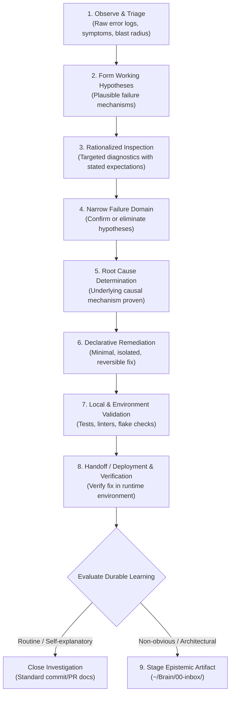

# Engineering Investigation & Epistemic Knowledge Skill

Canonical store of the global agent skill for engineering investigations, diagnostic checkpoint reviews, and conditional epistemic knowledge capture.

* **Runtime Customization Path**: `~/.gemini/config/skills/engineering-investigation-and-knowledge/SKILL.md`
* **Applicable Workspaces**: Global (workstation-wide across all repositories and directories).

---

## 1. The Investigative Lifecycle & Scientific Method

Engineering troubleshooting must follow a disciplined, empirical scientific progression:



### Core Epistemic Principles
* **Preserve Investigative Reasoning**: Document how the evidence led from the initial observation to the explanation, not merely what final patch fixed the bug.
* **Separate Observation from Inference**: Strictly distinguish what the system reported (raw logs, error outputs, exit codes) from what the operator inferred.
* **Explain Diagnostic Command Rationale**: Before running inspections, be clear on why the command is run, what layer of the stack it tests, and what result supports or refutes the working hypothesis.
* **No Hindsight Bias**: Avoid fabricating a tidy, linear narrative after the fact. Distinguish working hypotheses held during the investigation from insights discovered retrospectively.
* **Proportional Depth**: Scale the depth of investigation and reporting to the learning value. Do not manufacture complex hypotheses or ceremonial boilerplate for trivial syntax errors or routine typos.
* **Transferable Diagnostic Knowledge**: Surface heuristics, architectural invariants, and debugging techniques that generalize across system boundaries.
* **Zero Secret Leakage**: Never log credentials, API tokens, HMAC keys, or raw secrets. Verify security matches via redacted signatures or non-sensitive metadata.

---

## 2. The Interactive Checkpoint Protocol

To maintain human-in-the-loop alignment and prevent unchecked autonomous divergence, halt at meaningful investigation transitions rather than stopping after every individual command:

* The failure domain has been materially narrowed.
* An important hypothesis has been confirmed or eliminated.
* A meaningful local configuration or code change has been made.
* Local validation establishes a new state.
* An atomic commit boundary has been reached.
* A production or deployment step is ready for user execution.
* Post-deployment evidence confirms recovery or reveals regressions.

### The 6-Part Checkpoint Format:
1. **Current State**: What is empirically known from evidence; what remains uncertain.
2. **Reasoning**: Current working hypothesis, why the evidence supports it, and what alternatives have been eliminated.
3. **Changes**: What has been changed locally, which files are affected, and what invariant the change establishes.
4. **Validation**: What has already been tested, including expected versus actual results.
5. **Next Action**: What should happen next, why it is appropriate, and what evidence is expected.
6. **Recovery**: How the change or deployment can be rolled back if validation fails.

*Rule*: Present the checkpoint concisely, and **pause before crossing user-controlled state boundaries** (such as committing, merging, pushing, or executing production deployments).

---

## 3. Conditional Knowledge Capture Decision

> **Rule: Investigation is procedural; documentation is conditional.**

Routine maintenance, straightforward typos, and self-explanatory fixes **do not require an external knowledge artifact**. They should be documented normally in Git commit messages or repository-local comments.

Capture an incident into the knowledge system only when troubleshooting produces:
* Non-obvious diagnostic reasoning or surprising failure modes.
* Architectural insights or incorrect system assumptions dispelled.
* A reusable operational or troubleshooting lesson applicable across systems.
* A security posture or threat model clarification.

---

## 4. Staging & Epistemic Reporting Protocol

When an incident qualifies for durable capture, stage an epistemic incident report in the knowledge inbox:

### Staging Destination:
`~/Brain/00-inbox/YYYY-MM-DD-<slug>-debug.md`

### Staging Frontmatter:
```yaml
---
type: inbox
created: YYYY-MM-DD
project: <project-name>
tags:
  - operations
  - troubleshooting
  - debugging
  - <relevant-subsystems>
---
```

### Subsequent Curation (Second Brain Lifecycle):
During subsequent knowledge vault curation:
1. The artifact is validated and normalized to `type: debug`.
2. Moved to its permanent location: `~/Brain/03-records/debug/YYYY-MM-DD-<slug>.md`.
3. Cross-referenced in the day's engineering journal: `~/Brain/03-records/journal/YYYY-MM-DD.md`.
