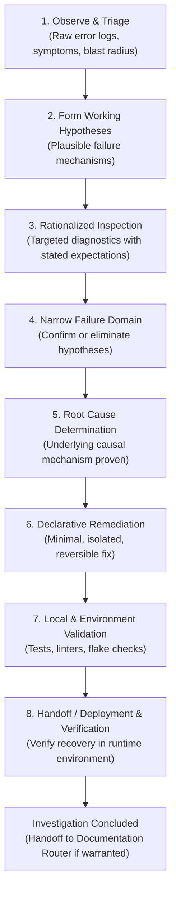

# Engineering Investigation

> **Engineering Investigation establishes a disciplined, empirical scientific lifecycle for diagnosing bugs, regressions, or system anomalies, terminating cleanly upon verified runtime recovery.**

---

## 1. Identity
**Engineering Investigation** is the universal diagnostic workflow for the engineering workspace. It replaces intuition-driven trial-and-error with a hypothesis-driven scientific progression, ensuring that every diagnostic action is rationalized, observable evidence precedes theory, and state transitions are guarded by interactive checkpoints.

## 2. User Value
Ad-hoc debugging often leads to chaotic trial-and-error, premature patches, residual probe code, leaked credentials in terminal output, and unclear root causes. Engineering Investigation ensures:
- **Evidence-First Discipline**: Observable system evidence (raw logs, error outputs, traces) precedes working hypotheses.
- **Traceable Reasoning**: Preserves the diagnostic chain from symptom to underlying cause rather than simply presenting a patch.
- **Zero Diagnostic Leakage & Pollution**: Diagnostic probes, mocks, and flags have explicit cleanup boundaries; sensitive tokens and credentials are automatically redacted.
- **Human-in-the-Loop Alignment**: Employs concise 6-part checkpoints at meaningful transitions rather than spamming after every single shell command.
- **Verified Recovery**: Terminates only when the fix is empirically validated in the execution environment.

## 3. Invocation
### When to use it:
- Diagnosing broken builds, failing test suites, runtime exceptions, 5xx server errors, performance degradation, or deployment regressions across any repository or host.
- When an unexpected system behavior requires systematic isolation before attempting a fix.

### When NOT to use it:
- **Routine implementation & typos**: Straightforward fixes, simple syntax errors, or minor edits where the root cause is immediately self-evident.
- **Direct code tutoring**: When the learner wants to drive the diagnosis themselves to build conceptual understanding (use [`engineering-tutor`](../engineering-tutor/README.md)).
- **Durable post-mortem authoring**: Investigation is procedural; durable documentation after recovery is evaluated by [`documentation-router`](../documentation-router/README.md).

### Slash Command Shortcut:
- `/diagnose [optional symptom or error message]` immediately activates this lifecycle with initial triage framing.

## 4. Behavior
When activated, the investigation progresses through the 8-phase scientific method lifecycle, pausing at meaningful boundaries:

### The 6-Part Interactive Checkpoint Protocol
Checkpoint depth scales with investigation risk. For low-complexity cases (single-line fixes, obvious test failures), a single-sentence status note is sufficient. For multi-system failures, infrastructure incidents, or unclear blast radius, the full 6-part format is required before crossing any state boundary:
1. **Current State**: What is empirically verified; what remains uncertain.
2. **Reasoning**: Current working hypothesis, supported by evidence, with eliminated alternatives noted.
3. **Changes**: Files modified locally and the invariants they establish.
4. **Validation**: Test results, commands run, and expected vs. actual behavior.
5. **Next Action**: Immediate next step, why it is appropriate, and expected outcome.
6. **Recovery**: Rollback procedure if validation fails.

## 5. Outputs
Engineering Investigation produces the following concrete outcomes:

| Output | Description |
| :--- | :--- |
| **Root Cause Determination** | Proven causal mechanism explaining why the failure occurred under specific conditions. |
| **Declarative Remediation** | Minimal, isolated, reversible code or configuration diff restoring expected behavior. |
| **Interactive Checkpoints** | Structured 6-part synchronization summaries at key investigative milestones. |
| **Cleaned Environment** | Verification that all temporary probes, debug logging, and mutations were removed. |
| **Documentation Handoff** | Structured transition to `documentation-router` if durable lessons or ADRs were uncovered. |

## 6. Boundaries
- **Terminates at recovery**: The investigation concludes once runtime recovery is verified. It does not author post-mortems autonomously.
- **Does not execute destructive operations**: Destructive Git resets, hard drops, or irreversible migrations are strictly blocked without explicit user approval.
- **No autonomous protected-branch commits**: Commits follow [`git-commit`](../git-commit/README.md) rules and require user checkpoint confirmation.
- **No teaching mode replacement**: When the user requests practice or wants to solve the issue themselves, it yields to [`engineering-tutor`](../engineering-tutor/README.md).

---

## 7. Package Structure
- [`SKILL.md`](SKILL.md) — Operational instructions, scientific method progression, and interactive checkpoint protocol executed by the AI agent runtime.
