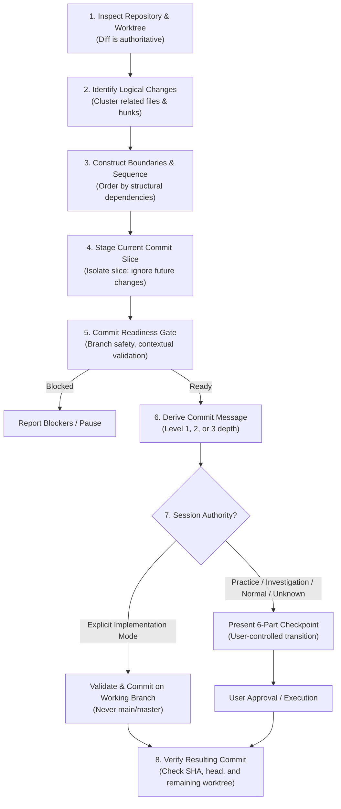

# Git Commit & History Construction Skill (GitKeeper Lineage)

Canonical store of the global agent skill for Git history hygiene, atomic commit construction, Conventional Commits 1.0.0 derivation across 3 depth levels, and protected-branch readiness gates.

* **Runtime Customization Path**: `~/.gemini/config/skills/git-commit/SKILL.md`
* **Applicable Workspaces**: Global (workstation-wide across all repositories and directories).

---

## 1. Governing Axioms & Invariants

1. **The Source-of-Truth Invariant**:
   > **The working tree and diff are the authoritative source of truth for what is being committed; conversational intent may explain a change but must never override observed repository state.**
2. **The Boundary of Responsibility**:
   `git-commit` packages an approved repository state transition. It does **not** decide what work ought to have been done (no rewriting code, inventing tests, or manufacturing documentation).
3. **Commit Slice Isolation Invariant**:
   > **Unrelated or future-intended working-tree changes are not blockers when the current commit slice can be isolated and validated safely.**
4. **Session Authority Invariant**:
   > `git-commit` consumes session mode established by the active workflow. It **MUST NOT** infer autonomous implementation authority solely from code changes. If session mode is unknown, it defaults to **Normal / Direct** behavior.

---

## 2. Core Triad & The GitKeeper Algorithm

* **Commit Boundary**: *What belongs together?* (Semantic cohesion of a state transition).
* **Commit Sequence**: *In what order should boundaries enter history?* (Dependency lineage and incremental intelligibility).
* **Commit Message**: *How should each resulting state transition be described?* (Durable historical clarity).

---

## 3. The Four Operational Responsibilities

### 1. State Inspection
Establish ground truth before proposing Git operations: repo root, branch status, tracking upstream, staged/unstaged/untracked inventory, authoritative diff (`git diff`, `git diff --cached`), and local commit conventions (`AGENTS.md`, recent `git log`).

### 2. Commit-Boundary Reasoning & History Sequencing
An atomic commit represents one coherent repository state transition that can be understood, reviewed, reverted, or cherry-picked as a unit. Decompose multi-intent working trees into ordered narrative sequences and surface accidental coupling.

### 3. Commit Message Derivation across 3 Depth Levels

#### Type Vocabulary Hierarchy
1. **Conventional Commits 1.0.0 Baseline**:
   * `feat` MUST be used for new features.
   * `fix` MUST be used for bug fixes.
   * Other types MAY be used; CC 1.0.0 does not prescribe a universal taxonomy.
2. **Repository Overrides**:
   * Repository-local conventions (e.g. Brain's `plan`, `discussion`, `decision`, `journal`, `debug`, `agent`, or project package scopes) take precedence.
3. **Session Context & Standard Defaults**:
   * Standard industry terms (`refactor`, `docs`, `test`, `build`, `ci`, `perf`, `style`, `chore`) provide clear defaults.

#### Message Depth Levels
* **Level 1 (Subject only)**: Trivial, self-explanatory changes (`docs(readme): add architecture section`).
* **Level 2 (Subject + body)**: Multiple concrete sub-changes needing explicit listing.
* **Level 3 (Subject + body + rationale)**: Architectural trade-offs, constraints, or non-obvious reasoning.

### 4. Commit Readiness Gate (Slice-Level Verification)
10-point readiness checklist:
1. Correct repository root confirmed.
2. Target branch is intentional.
3. Protected branch safety: NOT on `main`/`master` without explicit repo-local authorization.
4. Commit slice contains only intended changes for this commit (unrelated/future changes isolated).
5. Atomic boundary established (single coherent logical unit).
6. Required repository/session validation has passed, or applicable validation has been explicitly waived.
7. Repository conventions satisfied (scope rules, issue references).
8. Message depth matches semantic significance (Level 1, 2, or 3).
9. Diff confirms message accuracy (no hallucinations).
10. Resulting history remains coherent and intelligible under repository integration policy.

---

## 4. History Manipulation & Integration Safety

* **Squash**: Collapse intermediate churn into single coherent units; never blindly squash rich narrative histories.
* **Rebase**: Encouraged for local unshared branches; prohibited on published/shared branches without explicit user authorization.
* **Cherry-Pick**: Self-contained logical commits with verified dependencies; inspect diff and validate.
* **Merge**: Preserve merge commits when branch topology conveys meaningful lifecycle information; follow repo policy.
* **Reset & Restore Safety Barrier**: Distinguish non-destructive (`reset --soft`, unstage) from destructive (`reset --hard`, `restore`). The agent **MUST NEVER** execute destructive reset/restore commands autonomously.
