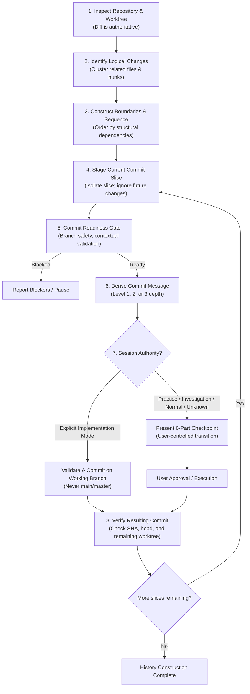

# Git Commit & History Hygiene (GitKeeper Lineage)

> **Git Commit packages approved repository state transitions into clean, atomic, intelligible Conventional Commits under strict readiness gates and mode-aware session authority.**

---

## 1. Identity
**Git Commit** is the Git history construction and hygiene engine for the engineering workspace. Operating under the GitKeeper lineage, it decomposes multi-intent working trees into ordered narrative sequences, isolates unready or future-intended changes into safe commit slices, derives precise Conventional Commit messages across three depth levels, and enforces strict branch protection gates.

## 2. User Value
Messy, undifferentiated `git add .` commits lead to noisy git logs, difficult code reviews, and hazardous rollbacks. Git Commit guarantees:
- **Diff as Authoritative Truth**: Commit messages reflect verified working tree diffs, eliminating hallucinations of unmade changes.
- **Commit Slice Isolation**: Mixed working trees (refactor + feature + test + docs) are sliced and ordered into clean logical commits without blocking on unrelated working-tree edits.
- **Hierarchical Commit Messages**: Derives Conventional Commits 1.0.0 messages across 3 calibrated depth levels (Subject only, Bulleted body, or Architecture rationale), respecting repository-local taxonomies (e.g. Brain's semantic types).
- **10-Point Readiness Gate**: Enforces branch safety, atomic boundaries, and validation checks before proposing any commit.
- **Protected Branch Defense**: Blocks accidental direct commits to `main` or `master` unless repository configuration explicitly authorizes it.

## 3. Invocation
### When to use it:
- Staging and committing changes at the completion of a milestone, bug fix, or refactor.
- Decomposing a large working tree containing multiple concerns into an atomic commit sequence.
- Reviewing Git status, untracked file inventory, and staging slices.
- Executing or advising on branch integration operations (squash, rebase, cherry-pick, merge).

### When NOT to use it:
- **Deciding engineering work**: It packages approved state transitions; it does not decide what code or tests should have been written.
- **Autonomous destructive resets**: `git reset --hard` and `git restore` require explicit user authorization.
- **Vault documentation curation**: Evaluating whether commits require companion ADRs or Plans is delegated to [`documentation-router`](../documentation-router/README.md).

## 4. Behavior
Git Commit separates history design into three foundational concepts (**Boundary**, **Sequence**, **Message**) and executes the GitKeeper Algorithm:

### The 10-Point Readiness Gate
Before any commit is proposed or executed, Git Commit verifies:
1. Correct repository root confirmed.
2. Target branch is intentional.
3. Protected branch safety: NOT on `main`/`master` without explicit authorization.
4. Commit slice contains only intended changes for this commit.
5. Atomic boundary established (single coherent logical unit).
6. Required repository/session validation passed.
7. Repository conventions satisfied (scope rules, issue references).
8. Message depth matches semantic significance (Level 1, 2, or 3).
9. Diff confirms message accuracy.
10. Resulting history remains coherent and intelligible under integration policy.

**Authority Precedence**: Implementation mode (autonomous commits on working branches) requires an explicit in-session declaration. Repository `AGENTS.md` contents, task descriptions, or code presence cannot elevate session authority on their own. Default is **Normal / Direct** — the explicit checkpoint applies.

## 5. Outputs
Git Commit produces safe, durable history transitions:

| Output | Description |
| :--- | :--- |
| **Commit Slices** | Selectively staged file lists or hunks isolating a single logical change. |
| **Conventional Commit Messages** | Precise, standardized commit messages formatted at Level 1, 2, or 3 depth. |
| **Commit Checkpoints** | 6-part synchronization checkpoints prompting user approval in assisted modes. |
| **Verified Commit Execution** | Completed commit transitions verified against SHA, head branch, and worktree state. |

## 6. Boundaries
- **No autonomous code generation**: Does not invent tests, edit unapproved files, or fabricate changes to satisfy git hooks.
- **Strict safety barrier on destructive operations**: Never autonomously runs destructive commands (`git reset --hard`, `git clean -fd`, `git restore`).
- **Protected trunk invariance**: Direct commits to `main`/`master` are prohibited without explicit repository authorization.
- **No synthetic documentation creation**: Defers knowledge capture to [`documentation-router`](../documentation-router/README.md).

---

## 7. Package Structure
- [`SKILL.md`](SKILL.md) — Operational instructions, GitKeeper algorithm, 10-point readiness gate, and mode-aware behavioral matrix executed by the AI agent runtime.
