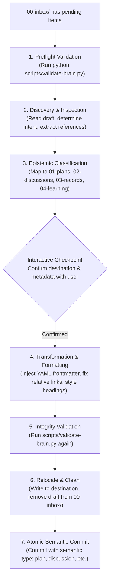

# Inbox Curation Skill

> **Inbox Curation standardizes the process of scanning, triaging, formatting, validating, and relocating raw captures from `00-inbox/` into the canonical lifecycle directories of the Brain knowledge graph.**

---

## 1. Identity

**Inbox Curation** is an operational capability for the Second Brain knowledge graph. It provides a structured, reproducible procedure for transforming unstructured, zero-friction captures into first-class graph citizens adhering to vault taxonomy, metadata contracts, link conventions, and atomic git commit standards.

## 2. User Value

The `00-inbox/` directory provides zero-friction capture without worrying about filenames, frontmatter schemas, or directory contracts during the flow of thinking. However, without deliberate curation, raw notes accumulate, fragment, or degrade into an unmaintained digital dumping ground.

Inbox Curation ensures:
- **Zero Drift**: Staged drafts are brought into full compliance with `validate-brain.py` before entry into the graph.
- **Epistemic Integrity**: Content is classified strictly by its *epistemic role* (Intent $\to$ `01-plans/`, Exploration $\to$ `02-discussions/`, History $\to$ `03-records/`, Understanding $\to$ `04-learning/`, Navigation $\to$ `06-projects/`).
- **Human Authority**: Ambiguous classifications are elevated to the user with actionable recommendations before moving files.
- **Atomic History**: Every curated document transition is isolated and committed with the repository's semantic commit taxonomy (`plan:`, `discussion:`, `knowledge:`, `guide:`, `debug:`).

## 3. Invocation

### When to use it:
- During periodic vault maintenance passes when raw drafts exist in `00-inbox/`.
- When explicitly asked to "process the inbox", "curate notes", or "triage captures".
- After a research or capture session where rough notes were temporarily staged in `00-inbox/`.

### When NOT to use it:
- **Active capture**: When the user is currently drafting ideas in `00-inbox/`. The inbox is intentionally exempt from rules while writing.
- **Session knowledge routing**: At the conclusion of a coding or debugging session when synthesizing thoughts directly from session context. Use [`documentation-router`](../documentation-router/README.md) instead.
- **Arbitrary file moving**: Reorganizing existing, already-committed files in `01-plans/` through `06-projects/`.

## 4. Behavior

When invoked, Inbox Curation progresses through a 5-phase operational pipeline:

## 5. Outputs

Inbox Curation produces concrete transformations in the knowledge graph:

| Output | Description | Destination |
| :--- | :--- | :--- |
| **Curated Artifact** | Formatted Markdown file with valid YAML frontmatter and portable relative links. | Target lifecycle directory (`01-` to `06-`) |
| **Clean Inbox** | Removal of the staged draft from `00-inbox/`. | File deletion in `00-inbox/` |
| **Semantic Git Commit** | Single atomic commit isolating the curated addition. | Git history (`<type>(<scope>): <message>`) |

## 6. Boundaries

- **Never bypass validator**: A curated file must never be committed if `python scripts/validate-brain.py` fails.
- **Never delete without destination write**: The draft in `00-inbox/` is only removed after the curated version is successfully written and verified at its target destination.
- **Never guess ambiguous intent**: If a draft contains mixed concerns (e.g. an incident post-mortem combined with a future plan), the skill prompts the user to split the note or confirm the primary role.
- **Preserve authorial substance**: Formatting, frontmatter, and link adjustments elevate the document's structure without altering the core insights, observations, or conclusions of the original draft.

---

## 7. Package Structure

- [`SKILL.md`](SKILL.md) — Operational instructions, progressive procedure, and behavioral invariants executed by the AI agent runtime.
