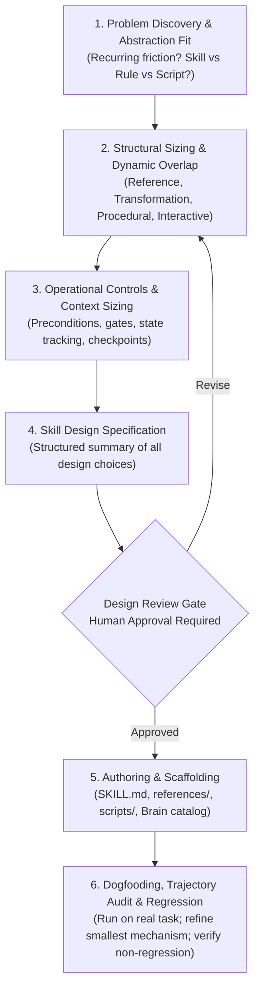

# Skill Builder Meta-Skill

Canonical store of the global agent skill for designing, sizing, authoring, and iteratively refining agent skills through interactive diagnostic coaching.

* **Runtime Customization Path**: `~/.gemini/config/skills/skill-builder/SKILL.md`
* **Applicable Workspaces**: Global (workstation-wide across all repositories and directories).

---

## 1. Governing Axioms & Division of Labor

1. **The Human is the Architectural Authority**: The human decides architectural intent, approves boundaries, accepts or rejects trade-offs, and owns the final design. `skill-builder` investigates, structures, challenges, proposes, drafts, and validates.
2. **Proportional Structure (Anti-Overengineering)**: A skill is sized to the problem it solves. Do not force every skill to be a phased state machine. Diagnose the required structural mode and apply operational controls only where justified.
3. **Change the Smallest Relevant Mechanism**: When refining an existing skill after observing a failure, avoid sweeping rewrites. Modify the smallest mechanism (a gate, a promoted rule, a negative boundary) that addresses the observed variance.
4. **Boundary of Responsibility**:
   * Governs the meta-level problem: *how to design an effective skill*.
   * Does *not* execute the downstream engineering tasks the authored skill will perform.
   * Does *not* bypass `documentation-router` for vault documentation.
   * Does *not* execute Git commits autonomously (delegated to `git-commit`).

---

## 2. Epistemic Architecture of Skills

The skill evaluates proposed skills across four distinct tiers:

* **Tier 1: Universal Engineering Invariants**: Explicit responsibility and ownership, explicit boundary and handoffs, one authoritative owner per rule/procedure, behaviorally meaningful instructions, and observable definition of completion where state changes occur.
* **Tier 2: Platform & Runtime Constraints**: Gemini runtime invocation metadata (`disable-model-invocation: true`), context pointer descriptions for model-invoked skills, co-located `references/` and `scripts/`, and explicit tool calling conventions.
* **Tier 3: Contextual Design Heuristics**: Operational state machines, hard anti-skipping gates, externalized state, progressive disclosure (`references/`), asymmetric context pressure, and behavioral anchors.
* **Tier 4: Authoring Quality Heuristics**: Side-by-side learner voice, rhetorical restraint, behavioral deletion test, explanatory guidance, and clean GitHub-flavored markdown formatting.

---

## 3. The 6-Stage Skill-Engineering Lifecycle

---

## 4. The Minimal Refinement Matrix

When dogfooding a skill against real-world tasks, adjust the smallest relevant mechanism:

| Observed Trajectory Failure | Likely Root Cause | Architectural Refinement |
| :--- | :--- | :--- |
| **Agent skips a required verification step** | Premature completion pull; fuzzy completion boundary | Strengthen the pre-condition gate; make the required artifact observable. |
| **Agent ignores a critical behavioral rule** | Rule is buried in static reference or offloaded too deep | **Promote the rule into the primary SKILL.md execution path.** |
| **Supporting detail overwhelms the procedure** | Token sprawl; in-file reference dilutes attention | Disclose detailed formats, examples, or branch rules into `references/`. |
| **Agent wanders into adjacent tasks** | Unbounded responsibility | Tighten the negative boundary; specify what it refuses to do and where it hands off. |
| **Agent repeats unnecessary boilerplate** | Prompt micro-manages standard LLM defaults | Prune the instruction or replace verbose paragraphs with a compact behavioral anchor. |
| **Agent behaves correctly without the instruction** | Instruction is a no-op | Delete the instruction entirely. |

### Regression Verification
After applying any refinement:
1. Re-run a representative scenario to confirm the target failure disappeared.
2. Verify that previously successful behaviors remain intact.
