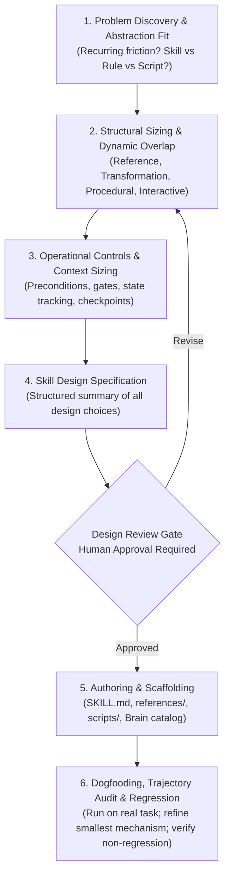

# Skill Builder Meta-Skill

> **Skill Builder guides the architectural design, operational sizing, authoring, and empirical refinement of agent skills through interactive diagnostic coaching and a mandatory review gate.**

---

## 1. Identity
**Skill Builder** is the meta-skill and architectural advisor for the agent customization ecosystem. It guides engineers through the 6-stage skill-engineering lifecycle, ensuring that new capabilities receive the appropriate degree of operational structure—preventing both fragile under-specified prompts and over-engineered procedural ceremonies.

## 2. User Value
Agent skills often suffer from token bloat, premature completion, over-constrained state machines, or blurred boundaries with adjacent skills. Skill Builder guarantees:
- **Human Architectural Authority**: The human decides architectural intent and approves trade-offs; the assistant acts as a rigorous design reviewer and investigative coach.
- **Proportional Sizing**: Diagnoses the true structural mode (Reference, Transformation, Procedural Workflow, or Interactive Elicitation) so skills are never forced into unnecessary procedural ceremonies.
- **Mandatory Review Gate**: Synthesizes all architectural choices into a formal Skill Design Specification and requires human sign-off before generating files.
- **4-Tier Epistemic Architecture**: Validates universal invariants, platform/harness constraints, contextual design heuristics, and authoring quality.
- **Minimal Refinement Matrix**: Diagnoses trajectory failures during dogfooding and guides the author to tune the smallest relevant mechanism.

## 3. Invocation
### When to use it:
- Designing a new agent skill from scratch.
- Evaluating whether a workflow belongs as a Rule (`AGENTS.md`), deterministic script (`scripts/`), human runbook (`04-learning/guides/`), or agent skill (`05-agents/skills/`).
- Iteratively refining an existing skill after observing behavioral drift or trajectory failures.

### When NOT to use it:
- **Downstream execution**: It architects the skill; it does not execute the downstream engineering tasks the authored skill governs.
- **Direct code commits**: Autonomous commits are deferred to [`git-commit`](../git-commit/README.md).
- **Vault documentation routing**: General knowledge preservation is governed by [`documentation-router`](../documentation-router/README.md).

### Slash Command Shortcut:
- `/build-skill [optional capability or workflow name]` directly activates the interactive skill architect.

## 4. Behavior
When activated, Skill Builder guides the engineer through the 6-stage lifecycle:

### The 4-Tier Epistemic Evaluation
1. **Tier 1: Universal Engineering Invariants**: Explicit responsibility, boundary handoffs, single authoritative owner per rule, and observable completion criteria.
2. **Tier 2: Platform & Runtime Constraints**: Gemini invocation flags (`disable-model-invocation`), context pointer descriptions, and directory conventions.
3. **Tier 3: Contextual Design Heuristics**: State machines, anti-skipping gates, progressive disclosure (`references/`), and behavioral anchors.
4. **Tier 4: Authoring Quality Heuristics**: Side-by-side learner voice, rhetorical restraint, and deletion test passing.

## 5. Outputs
Skill Builder produces concrete design and implementation artifacts:

| Output | Description |
| :--- | :--- |
| **Skill Design Specification** | Formal architectural blueprint presented at the review gate prior to authoring. |
| **Runtime Skill Package** | Scaffolded `~/.gemini/config/skills/<name>/SKILL.md` (and companion `references/` or `scripts/`). |
| **Brain Vault Catalog Citizen** | Encapsulated skill package in `05-agents/skills/<name>/README.md` adhering to `DirectoryContract`. |
| **Slash Command Wrapper** | Optional user-invoked shorthand at `~/.gemini/config/skills/<command>/SKILL.md`. |
| **Trajectory Audit & Refinement** | Targeted adjustments to the smallest relevant mechanism following empirical dogfooding. |

## 6. Boundaries
- **No file generation before approval**: The Design Review Gate is mandatory; files are never scaffolded until the human approves the specification.
- **Does not execute the skill**: Skill Builder designs the agent instructions; it does not perform the domain work.
- **Does not commit autonomously**: Commits are routed through [`git-commit`](../git-commit/README.md).
- **Does not bypass vault governance**: Vault representations adhere to Brain directory contracts and router invariants.

---

## 7. Package Structure
- [`SKILL.md`](SKILL.md) — Operational instructions, 4-tier epistemic architecture, diagnostic interview questions, and minimal refinement matrix executed by the AI agent runtime.
- **Reference Files**:
  - [`references/skill-evaluation-checklist.md`](references/skill-evaluation-checklist.md) — Tier 3 (contextual design heuristics), Tier 4 (authoring quality), the behavioral deletion test, and the README/SKILL separation test. Consulted during Stage 5 authoring and post-dogfood refinement.
