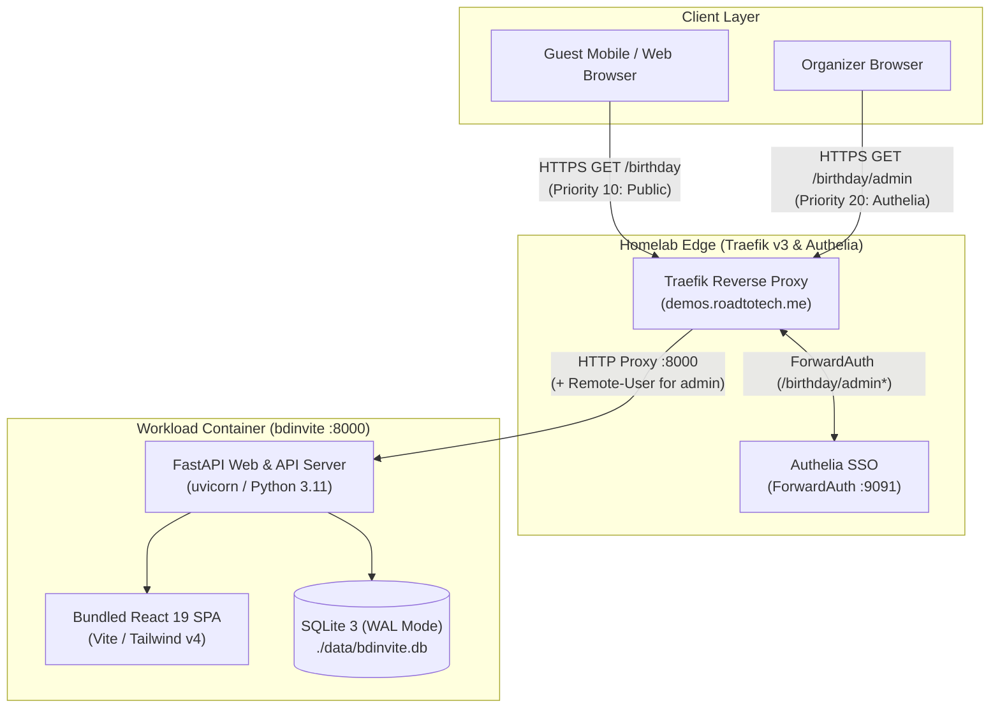

# 💌 BDInvite — Interactive Digital Birthday Invitation & Guest RSVP

**BDInvite** is a self-hosted, interactive digital birthday invitation application featuring event countdowns, venue mapping, Colombian phone number normalization, guest RSVP registration, and an Authelia-protected administration dashboard for guest list review and live event configuration.

The application runs as an autonomous workload in the homelab environment under `demos.roadtotech.me/birthday`.

---

## 🏛️ System Topology & Architecture

BDInvite is packaged as a high-efficiency single-container service combining a modern React 19 frontend and an asynchronous FastAPI backend:

* **Client & UI Tier**:
  - React 19 SPA bundled via Vite with Tailwind CSS v4.
  - Interactive animations powered by Motion and `canvas-confetti`.
  - Self-hosted typography (`Playfair Display` and `Plus Jakarta Sans`) bundled directly in static distribution assets, eliminating runtime calls to third-party font CDNs.
* **Application & API Tier**:
  - FastAPI running on Python 3.11 with `uvicorn`, managed via `uv`.
  - Serves REST API routes under `/birthday/api/*` and acts as the SPA static web server for `/birthday/*`.
* **Persistence Tier**:
  - SQLite 3 with Write-Ahead Logging (`PRAGMA journal_mode=WAL;`), persisted on a volume mount at `./data/bdinvite.db`.
  - Stores unique guest RSVPs and singleton event configuration (`invitation_config`).
* **Edge & Identity Gateway**:
  - **Traefik v3**: Handles path-based ingress on `demos.roadtotech.me` with priority-based route separation.
  - **Authelia ForwardAuth**: Intercepts requests to administrative routes (`/birthday/admin*`), providing multi-factor SSO before traffic reaches the container.

---

## 📍 Source Code & Locations

| Component | Location / URL | Description |
| :--- | :--- | :--- |
| **Gitea Forge** | [bdinvite](https://gitea.roadtotech.me/kiskaadee/bdinvite) | Canonical Git repository housing `frontend/`, `backend/`, and `specs/` |
| **Clone (SSH)** | `ssh://git@gitea.roadtotech.me:2223/kiskaadee/bdinvite.git` | Developer clone URL using SSH port 2223 |
| **Workstation Path** | `~/Homelab/Sites/bdinvite` | Local development checkout with Nix devShell |
| **Production Target** | `server-remote:~/Sites/bdinvite` | Production workload checkout orchestrated via `appctl` |
| **Public URL** | [demos.roadtotech.me/birthday](https://demos.roadtotech.me/birthday) | Public invitation and RSVP interface |
| **Admin Portal** | [demos.roadtotech.me/birthday/admin](https://demos.roadtotech.me/birthday/admin) | Authelia-protected guest list and live configuration dashboard |

---

## 🔑 Key Invariants & Architectural Commitments

1. **Single-Container Multi-Stage Packaging**:
   - A multi-stage Dockerfile utilizes `node:20-alpine` to compile the Vite React application, copying the resulting `dist/` directory into a lightweight `python:3.11-bookworm-slim` image powered by `uv`.
   - FastAPI serves both the JSON API and the static SPA fallback from a single process on port 8000, avoiding multi-container operational overhead for lightweight micro-sites.

2. **Split Path-Based Routing & Ingress Priority**:
   - Deployed on the shared demo domain `demos.roadtotech.me` under the `/birthday` path prefix.
   - Public guest access uses a Traefik router at priority `10` (`PathPrefix(`/birthday`)`).
   - Admin access uses an overlapping Traefik router at priority `20` (`PathPrefix(`/birthday/admin`)`) with `authelia-auth@docker` ForwardAuth middleware. Traefik matches the more specific rule first.

3. **Defense-in-Depth Authentication Invariant**:
   - While Authelia gates the edge reverse proxy, every admin API endpoint (`/birthday/api/admin/*`) independently checks for the presence of the `Remote-User` HTTP header injected by Authelia.
   - Administrative endpoints reject requests with HTTP 401 if the header is absent, preventing accidental data exposure if proxy middleware configuration lapses.

4. **Colombian Phone Normalization & Deduplication**:
   - RSVPs normalize phone inputs by stripping whitespace/delimiters, stripping the `+57` country prefix if 12 digits, and enforcing a 10-digit mobile number format starting with `3`.
   - The unique normalized phone acts as the natural deduplication key backed by a unique database constraint (`rsvps.phone`).

5. **Live Singleton Event Configuration**:
   - Event metadata (honoree name, venue address, event date/time, Google Maps preview links, custom RSVP headings, and celebration messages) is stored in a singleton configuration table (`invitation_config`).
   - Edits via the admin dashboard update the singleton row and reflect immediately across all connected guest clients without container restarts or code redeployments.

---

## 🏛️ Related Documents & Decisions

* 🗺️ **Implementation Plans & Specifications**:
  - [BDInvite Implementation Plan](../../01-plans/bdinvite/implementation-plan.md) — Phased technical execution plan (P0–P5) covering Docker packaging, FastAPI backend, React 19 frontend, Traefik split routing, and deployment.
  - [Digital Invitation Frontend Specification](../../01-plans/bdinvite/frontend-specification.md) — Responsive design principles, particle canvas architecture, typography, and guest/admin state transitions.
  - [SSO Authentication Benchmark Roadmap](../../01-plans/bdinvite/sso-benchmark-roadmap.md) — Controlled A/B benchmark (Control vs Graphify) for portable Hexagonal AuthPort & OIDC migration.
* 💡 **Explorations & Discussions**:
  - [Graphify Agent Experiment Retrospective](../../02-discussions/bdinvite/graphify-agent-experiment-retrospective.md) — Empirical post-mortem comparing Control vs Graphify agent conditions across the 8-checkpoint OIDC migration.
* 🏛️ **Architectural Decision Record**:
  - [BDInvite Single-Container Architecture, Split Traefik Routing & ForwardAuth Integration](../../03-records/decisions/bdinvite-architecture-and-deployment.md) — MADR 4.0 capturing container topology, Traefik priority routing, defense-in-depth auth, and self-hosted fonts.
* 🌐 **Platform Context**:
  - [Homelab Ecosystem & Core Infrastructure](../homelab/README.md) — System topology and workload specifications for `roadtotech.me`.

