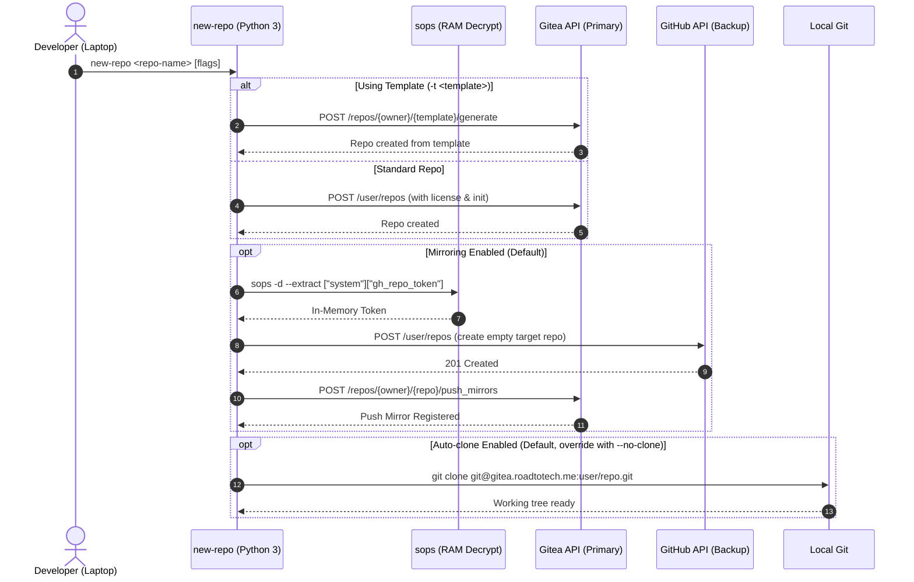

# 🚀 new-repo — Automated Repository Provisioning CLI

## 🎯 Overview

`new-repo` is a lightweight, zero-dependency Python 3 command-line utility integrated directly into the laptop's workstation configuration (`~/Config/home/scripts/new-repo.py`). It automates the creation of new repositories across a hybrid Git topology:
- **Primary Forge**: Self-hosted Gitea instance (`gitea.roadtotech.me`).
- **Offsite Backup Forge**: GitHub (`github.com`) via automated push mirroring.

It eliminates repetitive manual setup by providing sensible defaults (Gitea as primary, automated GitHub push mirroring, `UNLICENSE` default, private visibility, auto-clone to `$PWD/<name>`) while supporting Gitea repository templates and optional standalone configurations.

---

## 🏛️ System Architecture & Workflow

---

## 🔒 Security Model

1. **In-Memory Token Handling**: Tokens are extracted strictly in-memory using `sops -d --extract` from `~/Config/secrets.yaml` (falling back to tea config and Homelab secrets).
2. **Zero Command-Line Leaks**: Secrets are transmitted exclusively via native HTTPS request headers (`Authorization: token ...` / `Authorization: Bearer ...`), preventing token visibility in `/proc/$PID/cmdline` or system process listings (`ps`).
3. **Decoupled Workstation Secrets**: Encryption is managed via `~/Config/.sops.yaml` with the laptop's Age key, decoupling laptop provisioning from Homelab server infrastructure.

---

## 📑 Project Documents & Plans

- [**Repository Provisioning CLI Plan**](../../01-plans/new-repo/provisioning-cli-plan.md) — Specification and evolution record.
- **Implementation**: `/home/kiskaadee/Config/home/scripts/new-repo.py` (exposed as `~/.local/bin/new-repo`).

