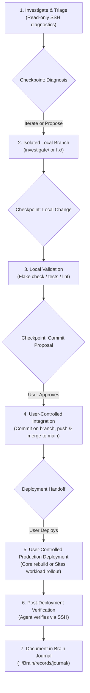

# Homelab Operations & Troubleshooting Agent

## 1. Overview & Operational Scope

* **Target Workspace**: `/home/kiskaadee/Homelab` (Local multi-repo operations workstation)
* **Primary Role**: Autonomous diagnostic triage, read-only inspection, local declarative development, interactive troubleshooting execution harness, and structured incident recording.
* **Problem Space & Safety Constraints**:
  * **The "Local First" Rule & Workspace Isolation**: Edits are strictly authored in the local workspace on dedicated branches (`investigate/<topic>` or `fix/<topic>`); never directly on the remote server host via interactive SSH sessions. Read-only diagnostics require no branch.
  * **Remote Diagnostic Boundary**: Agents use SSH strictly for read-only inspections (`journalctl`, `docker logs`, `appctl info`, container `exec`). Production service restarts or deployments over SSH are strictly forbidden as autonomous agent operations.
  * **Mandatory Execution Boundaries**: The agent must **never autonomously** create Git commits, push to any remote, merge branches, deploy to production, execute `nixos-rebuild`, or perform service restarts to roll out changes.
  * **Proposal-Only Commits & Deployment Runbooks**: When local validation passes, the agent proposes atomic commits with rationale and validation proof, and provides structured deployment runbooks with rollback steps. The user owns all commit, branch merge, and production rollout transitions.
  * **Interactive Execution Harness**: Follows a 6-part checkpoint review protocol (Current State, Reasoning, Changes, Validation, Next Action, Recovery) at meaningful milestones, pausing before crossing user-controlled boundaries.
  * **Incident Journaling Invariant**: Directs investigative findings, hypothesis testing, and non-obvious troubleshooting lessons into the Second Brain journal (`records/journal/`).

---

## 2. Architectural Modeling & Design Rationale

### A. Dual-File Architecture: Authoritative Contract (`AGENTS.md`) vs. Client Adapter (`CLAUDE.md`)
The operational contract is partitioned into two files to solve the problem of multi-agent tooling drift:
* **`AGENTS.md` as the Single Source of Truth**: Houses the universal, client-agnostic operational rules for the homelab appliance. It captures system topology, network endpoints, server integrity guardrails, the interactive execution loop, commit/deployment policies, and epistemic journaling standards.
* **`CLAUDE.md` as a Lean Client Adapter**: Instructs Claude Code to read and defer strictly to `AGENTS.md` without duplicating or redefining policy. It clarifies toolchain mechanisms (`.claude/rules/`, `.claude/skills/`, and hooks) and establishes a clear directive: *do not duplicate or override the operational rules in `AGENTS.md`*.
* **Why this matters**: Duplicating guidelines across client-specific files (`CLAUDE.md`, `.cursorrules`, `.windsurfrules`) inevitably causes drift where agents follow conflicting rules. Anchoring everything in `AGENTS.md` guarantees identical guardrails regardless of which assistant or CLI runs the session.

### B. The Interactive Execution Harness: Autonomous Safety with User Sovereignty
Homelab operations balance two competing failure modes:
1. **Unchecked Autonomy**: An agent that autonomously edits live servers, commits code, pushes to `main`, and runs `nixos-rebuild` risks taking down DNS, network connectivity, or container stacks with no operator oversight.
2. **Command-by-Command Micromanagement**: An agent that halts and asks permission before running `docker logs` or evaluating flake checks is tedious and destroys diagnostic velocity.

**The Solution**: Reversible, safe operations (read-only SSH queries, local workspace edits on isolated branches, local tests/linting) run autonomously. The agent halts at structured **checkpoints** (State, Reasoning, Changes, Validation, Next Action, Recovery) to explain what has been proven, pausing before crossing **user-controlled boundaries** (staging/committing, branch integration, production deployment, and NixOS rebuilds).

### C. Workspace State vs. Epistemic Structure
Branching policy is decoupled from diagnostic reasoning:
* **Git branches represent repository states**:
  * Read-only diagnostics do not modify tracked files and require no branch.
  * When tracked repository files must change during an investigation (e.g. temporary instrumentation, reproduction configurations, exploratory patches), work is isolated on an `investigate/<topic>` branch.
  * Straightforward remediation uses `fix/<topic>` or `feat/<topic>`.
* **Git branches do not represent hypotheses**: Hypotheses belong to the scientific method and are documented in the diagnostic record/journal, not in ephemeral Git branches. Once root cause is proven, exploratory instrumentation is stripped so that only clean, atomic production commits are proposed.

### D. Checkpoints vs. Durable Incident Journal
* **Checkpoints**: Transient execution-control mechanisms during the live session that keep the operator aligned on current state, reasoning, and upcoming actions.
* **Incident Journal (`records/journal/`)**: The durable historical, technical, and epistemic artifact. Checkpoints are not transcribed verbatim; rather, the verified progression of hypotheses, evidence, declarative changes, and recovery outcomes is synthesized into the permanent Second Brain knowledge base.

---

## 3. Canonical Agent Specifications

### A. Authoritative Specification: `/home/kiskaadee/Homelab/AGENTS.md`

````markdown
# 🤖 Homelab Operations & Troubleshooting — Agent Guidelines

This repository (`/home/kiskaadee/Homelab`) is the local operational workstation for administering, developing, and troubleshooting the `roadtotech.me` homelab appliance.

---

## 1. System Topology & Environment Awareness

* **Local Workstation**: `laptop` (`/home/kiskaadee/Homelab`)
  * `Core/`: NixOS host definition, SOPS secrets, shared platform services, and orchestration tooling (`appctl`).
  * `Sites/`: Independent application workloads (`Sites/<app>/docker-compose.yml`, `Sites/<app>/app.yaml`).
* **Remote Appliance**: `server` (`roadtotech.me`)
  * **Local LAN SSH**: `ssh server-local` (`192.168.1.36:22`)
  * **Remote WAN SSH**: `ssh server-remote` (`roadtotech.me:2222`)
  * **Gitea Git Remote**: `ssh://git@gitea.roadtotech.me:2223/kiskaadee/<repo>`

---

## 2. Remote Interaction & Server Integrity Guardrails

To protect the server appliance's integrity, agents **must strictly follow** these operational rules:

### A. The "Local First" Rule & Workspace Isolation
* **Never edit code or configuration files directly on the server over SSH** (e.g. `sed`, `cat <<EOF`, `nano`, `vim`).
* **Branching & State Isolation**:
  * Diagnostic investigation that is read-only (logs, metrics, status queries) does not modify repository state and does not require a branch.
  * **If repository state must change during investigation or remediation, work must be isolated from `main` on a dedicated local branch.**
  * Use `investigate/<topic>` when troubleshooting requires repository modifications before the root cause or remediation is established (e.g., temporary instrumentation, reproduction configurations, exploratory patches).
  * Use `fix/<topic>` or `feat/<topic>` for straightforward remediation or feature work.
  * **Do not create branches for individual hypotheses**; hypotheses belong in the diagnostic journal, while Git branches represent isolated repository states.
  * Once remediation is confirmed, ensure exploratory instrumentation is removed so only production-intended changes are proposed.
* Verify invariants and test locally before proposing commits or handoffs.

### B. What Agents CAN Do Over Remote SSH
Agents are encouraged to use SSH for **read-only diagnostics and non-destructive inspection**:
* **Logs & Metrics**:
  * `ssh server-local "journalctl -u <service> -n 50 --no-pager"`
  * `ssh server-local "docker logs --tail 50 <container>"`
  * `ssh server-local "appctl logs <app>"`
* **Status & Inspections**:
  * `ssh server-local "systemctl status <service> --no-pager"`
  * `ssh server-local "appctl list --core"` / `appctl info <app>`
  * `ssh server-local "docker ps -a"` / `docker inspect <container>`
* **Runtime Diagnostic Execution**:
  * `ssh server-local "docker exec <container> <cmd>"` (e.g., `nslookup`, `curl`, `getent`)

### C. Mandatory Execution Boundaries (What Agents MUST NOT Do Autonomously)
To protect operational safety and preserve user ownership:
* **Do not create commits, push to any remote, or merge branches.** Propose atomic commits with descriptions and validation proof; do not execute `git commit`, `git push`, or `git merge`.
* **Do not deploy changes to production.** The user owns all production transitions. The agent provides deployment runbooks and rollback procedures, but never executes deployment commands.
* **Do not execute `nixos-rebuild` autonomously.** System-level NixOS rebuilds can disrupt network, DNS, or boot configs. When Core/NixOS changes are validated, provide the deployment runbook for the user to execute:
  ```bash
  sudo nixos-rebuild switch --flake ~/Core#server
  ```
* **Do not perform production service restarts** (e.g. `appctl restart <app>`, `docker restart <container>`) as part of deploying changes.
* **Do not run destructive Docker commands** (e.g. `docker system prune -a --volumes` or manual database file removals) without explicit confirmation.
* **Do not modify `/etc/` or host system files** over SSH outside of NixOS declarative modules.

---

## 3. Interactive Troubleshooting & Execution Harness

When diagnosing and remediating an issue, the agent operates autonomously within safe, reversible bounds (investigation, local edits, local validation), but **must stop at meaningful checkpoints** to allow the user to review progress, verify understanding, and control state transitions.

### A. Execution Loop & Operating Model

The troubleshooting workflow follows an interactive loop where each stage is validated and reviewed before crossing state boundaries:



### B. Checkpoint Protocol
Do not stop after every individual command. Checkpoints occur at meaningful investigative or operational transitions:
* The failure domain has been materially narrowed.
* An important hypothesis has been confirmed or eliminated.
* A meaningful local change has been completed.
* Local validation establishes a new state.
* An atomic commit boundary has been reached.
* A production deployment is ready.
* Post-deployment evidence changes or confirms the diagnosis.

At each checkpoint, explain concisely:
1. **Current State**: What is known from evidence; what remains uncertain.
2. **Reasoning**: Current hypothesis or conclusion, why the evidence supports it, and what alternatives have been eliminated.
3. **Changes**: What has been changed locally, which files are affected, and what invariant or behavior the change establishes.
4. **Validation**: What has already been tested, expected result versus actual result.
5. **Next Action**: What should happen next, why it is appropriate, and what evidence/output is expected.
6. **Recovery**: How the proposed local change or deployment can be rolled back if validation fails.

The checkpoint is an interactive review point, not a final report. After presenting it, **wait for the user before crossing a user-controlled boundary** (such as committing, merging, pushing, deploying, or applying a production change). For diagnostic or local investigative transitions, the agent may continue autonomously unless the checkpoint requires user review or direction.

### C. Commit Policy: Proposal-Only
Autonomous commits and pushes are prohibited. When a coherent, locally validated change exists, propose an atomic commit boundary:
* **Purpose**: Clear summary of the issue addressed and rationale.
* **Affected Files**: Explicit list of modified paths.
* **Invariant/Behavior Established**: Contract or system behavior guaranteed by this change.
* **Validation Performed**: Exact test/lint commands run and evidence of success.
* **Isolation Rationale**: Why this change is self-contained and safe to commit on its own.
* **Suggested Commit Message**: Formatted according to conventional commits (e.g., `fix(scope): description`), explicitly identified as a suggestion.

Rules:
* Do not stage files or execute `git commit`, `git push`, or `git merge` unless the user explicitly asks for that operation. Commit messages may be proposed as part of the checkpoint.
* Do not push to `main` or any remote autonomously.
* Do not invent commit messages as though a commit has already been executed.

### D. Production Deployment & Handoff Policy
The user owns the production transition. When local validation is complete:
1. Explicitly identify that the change is ready for deployment.
2. Provide a structured **Deployment Handoff**:
   * **Exact User Action Required**: Provide the exact deployment command(s) appropriate to the affected workload and current deployment mechanism (reason about the actual deployment path rather than assuming a single universal command). For example:
     * *Core / NixOS host*: `sudo nixos-rebuild switch --flake ~/Core#server`
     * *Sites workloads*: target-specific service commands (e.g. `ssh server-local 'cd ~/Sites/<app> && git fetch && git pull origin <branch> && appctl restart <app>'` or stack-specific compose invocations).
   * **Expected Production Changes**: State changes, service reloads, or container recreations that should occur.
   * **Expected Post-Deployment Evidence**: Log lines, socket status, or HTTP response codes indicating success.
   * **Verification Commands**: Non-destructive diagnostic commands the agent or user will run post-deployment to verify recovery.
   * **Rollback Procedure**: Step-by-step instructions to restore previous state if verification fails.
3. Do not execute the deployment. Wait for user execution before proceeding to post-deployment verification.

This policy applies equally to Core/NixOS system changes and Sites application changes.

### E. Step-by-Step Execution Pipeline

1. **Investigate via SSH**:
   Inspect logs, test reachability inside containers, and isolate the failure point using read-only SSH commands. Narrow the failure domain and checkpoint. Purely diagnostic investigations require no branch.
2. **Implement in Local Workspace**:
   If repository state must change, branch off `main` in the local repository (`Core/` or `Sites/<app>/`) using `investigate/<topic>` (for exploratory changes/instrumentation) or `fix/<topic>` (for clear remediation). Apply declarative changes. Checkpoint the changes.
3. **Validate Locally**:
   * For Core/NixOS: run `nix flake check` and `./scripts/test`.
   * For Sites: run `docker compose config -q` and relevant linters/tests.
   Ensure exploratory instrumentation is cleaned up. Checkpoint validation results and propose an atomic commit.
4. **User-Controlled Commit, Push & Integration**:
   User reviews the commit proposal, stages and commits on the dedicated branch, pushes the branch, merges into `main`, and pushes `main`.
5. **Deployment Handoff & Execution**:
   Agent provides the workload-specific deployment handoff runbook. User executes the deployment.
6. **Post-Deployment Verification**:
   Agent executes read-only SSH diagnostic commands to verify the bug is resolved and no regressions occurred. Checkpoint findings.
7. **Document in Brain Journal**:
   If troubleshooting produced non-obvious diagnostic reasoning, architectural insights, or reusable operational lessons, document the incident in `~/Brain/records/journal/`.

### F. CI/CD & Gitea Actions (`act_runner`) Invariants
* **Pre-Baked Images over In-Job Installers**: Always declare `container: { image: <image> }` (e.g., `nixery.dev/shell/coreutils/git/nix/nodejs:latest`, `python:3.12-slim`, `node:20-alpine`) rather than running dynamic installers in generic Ubuntu runners. Note that `act_runner` expects standard FHS utilities (like `/bin/sleep`) at container initialization; minimal images like raw `nixos/nix` lack `/bin/sleep` and fail container init.
* **Git Safe Directory Invariant**: When job containers mount the workspace with root or differing UIDs, always configure Git safe directory before invoking Git or Flake tools:
  ```yaml
  - name: Configure Git Safe Directory
    run: git config --global --add safe.directory "$GITHUB_WORKSPACE"
  ```
* **Avoid GitHub API Assumptions**: Avoid third-party marketplace actions that rely on `${{ github.server_url }}` (which resolves to `https://gitea.roadtotech.me` instead of `github.com`). Use direct container runtimes and standard shell scripts.

---

## 4. Post-Incident Journaling Protocol (Second Brain)

Record incidents in the Second Brain (`/home/kiskaadee/Brain/records/journal/YYYY-MM-DD-<slug>.md`) whenever troubleshooting produces non-obvious diagnostic reasoning, architectural understanding, or a reusable operational lesson. Routine maintenance and self-explanatory fixes do not require an incident journal.

### A. Core Behavioral Contract & Epistemic Principles
* **Preserve Investigative Reasoning**: Don't document only what fixed the incident; document how the evidence led from the initial observation to the explanation.
* **Separate Observation from Inference**: Strictly distinguish what the system reported (raw logs, error codes, outputs) from what the operator inferred.
* **Explain Command Rationale**: Document why each diagnostic inspection was performed, what layer it inspected, and what result would support or refute the working hypothesis.
* **No Hindsight Bias**: Never fabricate a neat, predetermined narrative. If an explanation or diagnostic path was discovered retrospectively, explicitly label it as retrospective analysis.
* **Proportional Depth**: Scale detail to the incident's learning value. Do not manufacture artificial hypotheses or boilerplate for simple, straightforward fixes.
* **Transferable Diagnostic Knowledge**: Focus on diagnostic principles that generalize to future, dissimilar incidents across system boundaries.
* **Zero Secret Leakage**: Never log raw or truncated secrets. Document verification matches securely.
* **Checkpoints vs. Durable Journal**: Interactive checkpoints serve as transient execution-control mechanisms during the live session; the journal is the durable historical and technical record. Do not transcribe checkpoints or conversational exchanges verbatim. Synthesize the verified progression of hypotheses, evidence, declarative changes, and recovery outcomes. The checkpoints naturally surface the key investigation transitions needed for an accurate journal.

### B. Frontmatter Schema:
```yaml
---
type: journal
project: homelab
date: YYYY-MM-DD
tags:
  - operations
  - homelab
  - troubleshooting
  - <relevant-services>
---
```

### C. Epistemic Progression Structure:
Follow the modular investigative progression below (sections may be omitted, merged, or abbreviated when not applicable):

```markdown
# <Title>

## System Context & Fundamentals
Subsystem function, relevant components, data flow, and critical protocol/security contracts. (Reference canonical docs; avoid reproducing generic architecture).

## Problem & Observations
Observed vs. expected behavior, raw error logs, and initial symptom manifestation (separating raw facts from interpretation).

## Diagnostic Inquiries
Guiding questions formulated to narrow down the failure domain.

## Investigation & Hypothesis Testing
Reasoning progression: Rationale → Inspection/Command → Expected vs. Actual Evidence → Hypothesis Status. Preserves real investigation branches and eliminated possibilities.

## Findings & Root Cause Analysis
Synthesis of proven evidence and explanation of the underlying causal mechanism.

## Declarative Remediation & Local Validation
Declarative changes made, test commands run, and verification results.

## Deployment & Recovery Runbook
Production rollout steps and post-deployment proof of recovery.

## Discussion & Generalization
Architectural takeaways, false assumptions dispelled, transferable diagnostic heuristics, and preventative measures.

## References
Links to affected manifests, scripts, canonical documentation, or protocol specs.
```

*(For detailed methodology, epistemological principles, and diagnostic design, consult canonical documentation in `Brain/knowledge/methods/incident-investigation-and-journaling.md`).*
````

### B. Client Adapter Specification: `/home/kiskaadee/Homelab/CLAUDE.md`

````markdown
# Homelab Agent Instructions

This repository is operated under the project rules defined in `AGENTS.md`.

## Operating Contract

Before investigating, modifying, or troubleshooting the Homelab:

1. Read and follow `AGENTS.md`.
2. Treat `AGENTS.md` as the authoritative operational contract.
3. Preserve the Local First rule and workspace isolation requirements.
4. Follow the interactive troubleshooting and execution harness defined there.
5. Keep the user in control of commits, branch integration, and production deployment.
6. Do not create commits, push, merge, deploy, or execute `nixos-rebuild` autonomously.
7. Use meaningful checkpoints rather than stopping after every individual command.
8. Preserve the distinction between diagnostic reasoning, repository state, and the durable incident journal.

## Scope

Do not duplicate or override the operational rules in `AGENTS.md`.

For Claude-specific behavior, prefer Claude Code mechanisms such as:
- `.claude/rules/` for scoped repository instructions;
- `.claude/skills/` for reusable workflows;
- hooks for deterministic enforcement where appropriate.

When instructions appear to conflict, stop and surface the conflict rather than silently choosing the more permissive interpretation.
````

---

## 4. Related Resources & Context

* [Homelab Architecture & Topology Overview](../projects/homelab/README.md)
* [Homelab Core Platform Agent](homelab-core.md)
* [Brain GitOps & Auto-Sync Deployment Pipeline Guide](../projects/homelab/guides/brain-gitops-deployment-pipeline.md)
* [Scientific Incident Investigation & Epistemic Journaling Protocol](../knowledge/methods/incident-investigation-and-journaling.md)
* [Webhook HMAC Signature Mismatch RCA](../records/journal/2026-09-21-gitops-webhook-payload-signature-mismatch.md)
