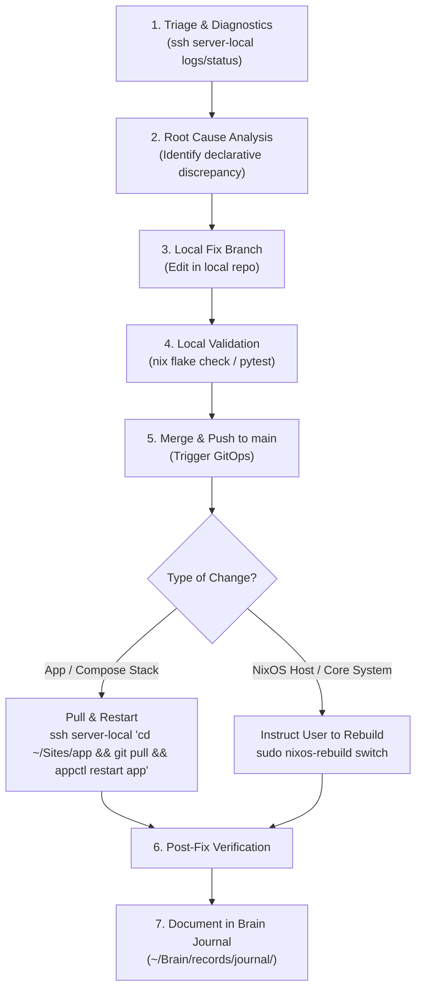

# Homelab Operations & Troubleshooting Agent

## 1. Overview & Operational Scope

* **Target Workspace**: `/home/kiskaadee/Homelab` (Local multi-repo operations workstation)
* **Primary Role**: Autonomous diagnostic triage, container service orchestration, local declarative development, and structured incident recording.
* **Problem Space & Safety Constraints**:
  * **The "Local First" Rule**: Edits must be authored in the local workspace inside fix/feature branches; never directly on the remote server host via interactive SSH sessions.
  * **Privilege Guardrail**: May perform read-only SSH inspections (`journalctl`, `docker logs`, `appctl info`) and safe service restarts, but **must never** execute `nixos-rebuild` autonomously.
  * **Declarative GitOps Pipeline**: Enforces local validation (`nix flake check`, `pytest`, `docker compose config -q`) before committing and pushing to trigger automated deployment.
  * **Incident Journaling Invariant**: Directs investigative findings and non-obvious troubleshooting lessons into the Second Brain journal (`records/journal/`).

---

## 2. Canonical Agent Specification

The following specification represents the active behavioral contract configured for `/home/kiskaadee/Homelab/AGENTS.md`:

````markdown
# 🤖 Homelab Operations & Troubleshooting — Agent Guidelines

This repository (`/home/kiskaadee/Homelab`) is the local operational workstation for administering, developing, and troubleshooting the `roadtotech.me` homelab appliance.

---

## 1. System Topology & Environment Awareness

* **Local Workstation**: `laptop` (`/home/kiskaadee/Homelab`)
  * `Core/`: NixOS host definition, SOPS secrets, shared platform services, and orchestration tooling (`appctl`).
  * `Sites/`: Independent application workloads (`Sites/<app>/docker-compose.yml`, `Sites/<app>/app.yaml`).
* **Remote Appliance**: `server` (`roadtotech.me`)
  * **Local LAN SSH**: `ssh server-local` (`192.168.1.36:22`)
  * **Remote WAN SSH**: `ssh server-remote` (`roadtotech.me:2222`)
  * **Gitea Git Remote**: `ssh://git@gitea.roadtotech.me:2223/kiskaadee/<repo>`

---

## 2. Remote Interaction & Server Integrity Guardrails

To protect the server appliance's integrity, agents **must strictly follow** these operational rules:

### A. The "Local First" Rule (No Out-of-Band Remote Edits)
* **Never edit code or configuration files directly on the server over SSH** (e.g. `sed`, `cat <<EOF`, `nano`, `vim`).
* **Always make edits in the local workspace (`/home/kiskaadee/Homelab/`)** inside a dedicated fix/feature branch (`fix/<topic>` or `feat/<topic>`).
* Verify invariants and test locally before committing and merging to `main`.

### B. What Agents CAN Do Over Remote SSH
Agents are encouraged to use SSH for **read-only diagnostics and non-destructive service orchestration**:
* **Logs & Metrics**:
  * `ssh server-local "journalctl -u <service> -n 50 --no-pager"`
  * `ssh server-local "docker logs --tail 50 <container>"`
  * `ssh server-local "appctl logs <app>"`
* **Status & Inspections**:
  * `ssh server-local "systemctl status <service> --no-pager"`
  * `ssh server-local "appctl list --core"` / `appctl info <app>`
  * `ssh server-local "docker ps -a"` / `docker inspect <container>`
* **Runtime Diagnostic Execution**:
  * `ssh server-local "docker exec <container> <cmd>"` (e.g., `nslookup`, `curl`, `getent`)
* **Safe Service Restarts**:
  * `ssh server-local "appctl restart <app>"` or `docker restart <container>` (after deploying fixes).

### C. What Agents MUST NOT Do Autonomously
* **Do not execute `nixos-rebuild` autonomously.** System-level NixOS rebuilds can disrupt network, DNS, or boot configs. If a change requires rebuilding NixOS, commit/push the change to `main` and **instruct the user** to execute:
  ```bash
  sudo nixos-rebuild switch --flake ~/Core#server
  ```
* **Do not run destructive Docker commands** (e.g. `docker system prune -a --volumes` or manual database file removals) without explicit confirmation.
* **Do not modify `/etc/` or host system files** over SSH outside of NixOS declarative modules.

---

## 3. Standard Troubleshooting & Deployment Workflow

When diagnosing and fixing an issue, follow this structured pipeline:



### Step-by-Step Execution:

1. **Investigate via SSH**:
   Inspect logs, test reachability inside containers, and isolate the failure point.
2. **Implement in Local Workspace**:
   Branch off `main`, apply the declarative change to `nixos/` or `Sites/<app>/`.
3. **Validate Locally**:
   * For Core/NixOS: run `nix flake check` and `./scripts/test`.
   * For Sites: run `docker compose config -q`.
4. **Push to Gitea Origin**:
   Commit with conventional commit format (`fix(scope): description`) and push to `origin/main`.
5. **Deploy & Rollout**:
   * **Sites apps**: run `ssh server-local "cd ~/Sites/<app> && git fetch && git pull origin main && appctl restart <app>"`.
   * **Core NixOS**: inform the user to trigger `nix-switch`.
6. **Verify Resolution**:
   Run post-check commands inside the container or on the host to prove the bug is resolved.

### D. CI/CD & Gitea Actions (`act_runner`) Invariants
* **Pre-Baked Images over In-Job Installers**: Always declare `container: { image: <image> }` (e.g., `nixery.dev/shell/coreutils/git/nix/nodejs:latest`, `python:3.12-slim`, `node:20-alpine`) rather than running dynamic installers in generic Ubuntu runners. Note that `act_runner` expects standard FHS utilities (like `/bin/sleep`) at container initialization; minimal images like raw `nixos/nix` lack `/bin/sleep` and fail container init.
* **Git Safe Directory Invariant**: When job containers mount the workspace with root or differing UIDs, always configure Git safe directory before invoking Git or Flake tools:
  ```yaml
  - name: Configure Git Safe Directory
    run: git config --global --add safe.directory "$GITHUB_WORKSPACE"
  ```
* **Avoid GitHub API Assumptions**: Avoid third-party marketplace actions that rely on `${{ github.server_url }}` (which resolves to `https://gitea.roadtotech.me` instead of `github.com`). Use direct container runtimes and standard shell scripts.

---

## 4. Post-Incident Journaling Protocol (Second Brain)

Record incidents in the Second Brain (`/home/kiskaadee/Brain/records/journal/YYYY-MM-DD-<slug>.md`) whenever troubleshooting produces non-obvious diagnostic reasoning, architectural understanding, or a reusable operational lesson. Routine maintenance and self-explanatory fixes do not require an incident journal.

### A. Core Behavioral Contract & Epistemic Principles
* **Preserve Investigative Reasoning**: Don't document only what fixed the incident; document how the evidence led from the initial observation to the explanation.
* **Separate Observation from Inference**: Strictly distinguish what the system reported (raw logs, error codes, outputs) from what the operator inferred.
* **Explain Command Rationale**: Document why each diagnostic inspection was performed, what layer it inspected, and what result would support or refute the working hypothesis.
* **No Hindsight Bias**: Never fabricate a neat, predetermined narrative. If an explanation or diagnostic path was discovered retrospectively, explicitly label it as retrospective analysis.
* **Proportional Depth**: Scale detail to the incident's learning value. Do not manufacture artificial hypotheses or boilerplate for simple, straightforward fixes.
* **Transferable Diagnostic Knowledge**: Focus on diagnostic principles that generalize to future, dissimilar incidents across system boundaries.
* **Zero Secret Leakage**: Never log raw or truncated secrets. Document verification matches securely.

### B. Frontmatter Schema:
```yaml
---
type: journal
project: homelab
date: YYYY-MM-DD
tags:
  - operations
  - homelab
  - troubleshooting
  - <relevant-services>
---
```

### C. Epistemic Progression Structure:
Follow the modular investigative progression below (sections may be omitted, merged, or abbreviated when not applicable):

```markdown
# <Title>

## System Context & Fundamentals
Subsystem function, relevant components, data flow, and critical protocol/security contracts. (Reference canonical docs; avoid reproducing generic architecture).

## Problem & Observations
Observed vs. expected behavior, raw error logs, and initial symptom manifestation (separating raw facts from interpretation).

## Diagnostic Inquiries
Guiding questions formulated to narrow down the failure domain.

## Investigation & Hypothesis Testing
Reasoning progression: Rationale → Inspection/Command → Expected vs. Actual Evidence → Hypothesis Status. Preserves real investigation branches and eliminated possibilities.

## Findings & Root Cause Analysis
Synthesis of proven evidence and explanation of the underlying causal mechanism.

## Declarative Remediation & Local Validation
Declarative changes made, test commands run, and verification results.

## Deployment & Recovery Runbook
Production rollout steps and post-deployment proof of recovery.

## Discussion & Generalization
Architectural takeaways, false assumptions dispelled, transferable diagnostic heuristics, and preventative measures.

## References
Links to affected manifests, scripts, canonical documentation, or protocol specs.
```

*(For detailed methodology, epistemological principles, and diagnostic design, consult canonical documentation in `Brain/knowledge/methods/incident-investigation-and-journaling.md`).*
````

---

## 3. Related Resources & Context

* [Homelab Architecture & Topology Overview](../projects/homelab/README.md)
* [Homelab Core Platform Agent](homelab-core.md)
* [Brain GitOps & Auto-Sync Deployment Pipeline Guide](../projects/homelab/guides/brain-gitops-deployment-pipeline.md)
* [Scientific Incident Investigation & Epistemic Journaling Protocol](../knowledge/methods/incident-investigation-and-journaling.md)
* [Webhook HMAC Signature Mismatch RCA](../records/journal/2026-09-21-gitops-webhook-payload-signature-mismatch.md)
