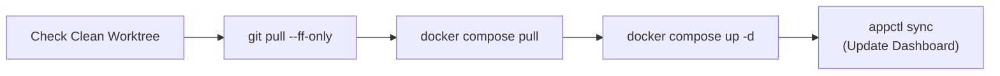

# 🔄 appctl Git Synchronization & Full-Stack Lifecycle Strategy

## 🎯 Motivation & Rationale
In a decentralized homelab architecture where [`~/Core`](file:///home/kiskaadee/Core) and every application stack in [`~/Sites`](file:///home/kiskaadee/Sites) are independent Git repositories:
1. **Prevent Configuration Drift**: Developers frequently push edits (compose labels, `app.yaml` metadata, Dockerfile changes) from laptops or secondary workstations. The production server needs instant visibility into repositories that are behind remote (`git pull` needed) or ahead of remote (`git push` pending).
2. **Prevent Forgotten Uncommitted State**: Dirty working trees on production need to be surfaced prominently to avoid accidental overwrites or uncommitted production hotfixes.
3. **Atomic Stack Updates (`appctl update`)**: Provide a single command that pulls Git repository changes, pulls new Docker container images, recreates the stack, and synchronizes the Homepage dashboard.

---

## 🏛️ Architecture & Display Schema

### 1. Enhanced `appctl list` Table Format
`appctl list` includes a dedicated `GIT / SYNC` column alongside runtime container health:

```text
SERVICE            STATUS           GIT SYNC         DOMAIN                         DIRECTORY
-------            ------           --------         ------                         ---------
dashboard          🟢 Running (2)    ⬆ 1 Ahead        dashboard.roadtotech.me        ~/Sites/homelab-dashboard
docs               🟢 Running (1)    ✓ Synced         docs.roadtotech.me             ~/Sites/homelab-doc2site
excalidraw         🟢 Running (2)    ✓ Synced         excalidraw.roadtotech.me       ~/Sites/homelab-excalidraw
gitea              🔴 Stopped        ⬇ 1 Behind       gitea.roadtotech.me            ~/Sites/homelab-gitea
jellyfin           🟢 Running (1)    ✓ Synced         jellyfin.roadtotech.me         ~/Sites/homelab-jellyfin
...
```

### 2. Status Badge Legend
* `✓ Synced`: Local branch is clean and fully in sync with upstream.
* `⬆ N Ahead`: Local branch has `N` unpushed commits.
* `⬇ N Behind`: Remote tracking branch has `N` new commits ready to pull.
* `⚡ Diverged (NA NB)`: Local and remote branches have diverged.
* `* Dirty`: Working directory has uncommitted or modified files (e.g. `✓ Synced *`, `⬆ 1 *`).
* `⚪ Untracked`: No upstream remote branch configured.

### 3. Execution Performance Model
* **Instant Local Mode (Default)**: `appctl list` executes instant local Git rev-list checks against existing tracking branches (`HEAD` vs `@{upstream}`), completing in milliseconds.
* **Live Network Mode (`--fetch` / `-f`)**: `appctl list --fetch` performs concurrent, background `git fetch` across repositories before evaluating status.

---

## 🚀 Commands & Workflows

### 1. `appctl list [--fetch] [--core]`
- `appctl list`: Lists all apps with container and local Git sync status.
- `appctl list --fetch` (or `-f`): Fetches remote refs first to report real-time upstream changes.
- `appctl list --core` (or `-c` / `--all`): Includes Core infrastructure services and the `Core` repository Git sync status.

### 2. `appctl info <service>`
Includes detailed Git repository diagnostics:
```text
Git Repository:
  Branch:       main
  Upstream:     origin/main
  Sync Status:  ⬆ 1 Ahead (1 unpushed commit)
  Working Tree: Clean
```

### 3. Full Stack Upgrade (`appctl update <service>`)
Executes an atomic 5-step upgrade pipeline:


```bash
# Update a single application stack
appctl update docs

# Update all running application stacks
appctl update --all
```

---

## 🔒 Safety & Error Handling Rules
1. **Safety First on Pulls**: `appctl update` uses `git pull --ff-only`. If merge conflicts or diverging histories exist, execution halts immediately with a clear error prompt rather than corrupting repository state.
2. **Dirty Tree Protection**: If uncommitted local edits are present in an app repo, `appctl update` warns the user and aborts unless `--force` is explicitly provided.
