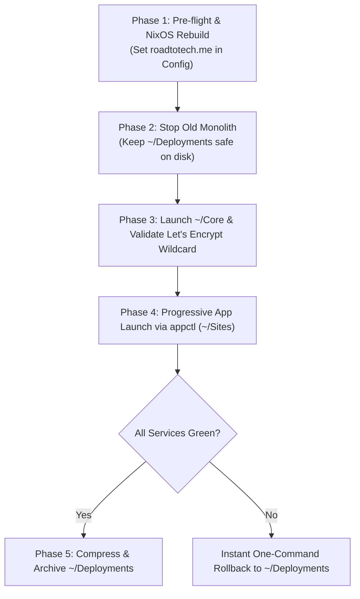

# 🚀 Migration, Testing & Safe Cutover Plan: `~/Deployments` ➔ `~/Core` + `~/Sites`

## 🎯 Objective
Safely switch all running homelab services from the legacy monolithic `~/Deployments` structure over to the newly refactored architecture (`~/Core` control plane + `~/Sites/*` decoupled micro-repos) while executing the domain cutover from `arch-services.mywire.org` to `roadtotech.me` in a single coordinated operation.

---

## 🏗️ Architecture Transition

| Component | Legacy Monolith (`~/Deployments`) | New Refactored Architecture (`~/Core` & `~/Sites`) |
| :--- | :--- | :--- |
| **Ingress & Auth** | `~/Deployments/homeserver` | `~/Core` (Traefik v3, Authelia, Portainer, Dozzle, Diun) |
| **User Applications** | `~/Deployments/traefik-deployments/*` | `~/Sites/*` (Dedicated git repos with per-app compose) |
| **Orchestrator** | Monolithic `appctl` in Deployments | Infrastructure-level `~/Core/scripts/appctl` |
| **Domain & Certs** | `arch-services.mywire.org` (Dynu subdomain) | `roadtotech.me` & `*.roadtotech.me` (Custom Domain Wildcard) |
| **Secrets Engine** | SOPS NixOS template (`traefik-deployments.env`) | SOPS NixOS template (`homeserver.env` & `traefik-deployments.env`) |

---

## 🛡️ Cutover Workflow & Safeguards



---

## 📋 Step-by-Step Execution Plan

### Phase 1: Declarative Configuration & Domain Update
Update NixOS declarations to define `roadtotech.me` globally and point the systemd service to `/home/kiskaadee/Core`:

1. **Update NixOS Declarations**:
   - `~/Config/hosts/desktop/homeserver.nix`:
     ```nix
     DOMAIN = "roadtotech.me";
     ```
   - `~/Config/hosts/desktop/traefik-deployments.nix`:
     Replace `arch-services.mywire.org` with `roadtotech.me` for all subdomain variables (`DOMAIN_SUFFIX`, `DOCS_DOMAIN`, `GITEA_DOMAIN`, `JELLYFIN_DOMAIN`, etc.).
   - `~/Core/scripts/appctl`:
     Update fallback domain suffix default:
     ```bash
     export DOMAIN_SUFFIX="${DOMAIN_SUFFIX:-roadtotech.me}"
     ```

2. **Rebuild NixOS**:
   ```bash
   sudo nixos-rebuild switch --flake ~/Config#desktop
   ```
   *Generates decrypted runtime secrets at `/run/secrets/rendered/homeserver.env` and `/run/secrets/rendered/traefik-deployments.env` and configures `homeserver-core.service`.*

---

### Phase 2: Graceful Shutdown of Legacy Monolith
Shut down the existing containers while keeping the directory intact on disk as an instant rollback guarantee:

```bash
# 1. Stop old monolithic apps
cd ~/Deployments/traefik-deployments && docker compose down

# 2. Stop old core ingress stack
cd ~/Deployments/homeserver && docker compose down
```

> [!IMPORTANT]
> Do **NOT** remove or modify `~/Deployments` during testing. It serves as your immediate fallback target.

---

### Phase 3: Launch & Validate Core Ingress (`~/Core`)

1. **Start Core Infrastructure**:
   ```bash
   cd ~/Core
   docker compose up -d --remove-orphans
   ```

2. **Verify DNS-01 ACME Certificate Challenge**:
   ```bash
   docker logs -f traefik
   ```
   *Look for: `Certificates obtained successfully for domains [roadtotech.me *.roadtotech.me]`.*

3. **Verify Core Endpoints**:
   - `https://traefik.roadtotech.me` (Traefik dashboard protected by Authelia)
   - `https://auth.roadtotech.me` (Authelia SSO login page)
   - `https://portainer.roadtotech.me` (Portainer UI)
   - `https://logs.roadtotech.me` (Dozzle live log viewer)

---

### Phase 4: Progressive Application Launch & Ingress Testing (`~/Sites`)

Bring up applications progressively using `appctl` and verify each:

```bash
# 1. Root Landing Page & Dashboard Hub
appctl up homelab-landing
appctl up homelab-dashboard

# 2. Media & Productivity Services
appctl up homelab-jellyfin
appctl up homelab-excalidraw
appctl up homelab-doc2site
appctl up homelab-mermaid
appctl up homelab-minecraft

# 3. Internal / Database Stacks (if needed)
appctl up homelab-pgsql
appctl up homelab-gitea
appctl up homelab-mongodb
appctl up homelab-ollama
```

#### Verification Matrix:
| Endpoint | Expected Result | Verified |
| :--- | :--- | :---: |
| `https://roadtotech.me` | Custom Landing Page | [x] |
| `https://dashboard.roadtotech.me` | getHomepage + Learning Hub | [x] |
| `https://auth.roadtotech.me` | Authelia SSO portal & 2FA | [x] |
| `https://jellyfin.roadtotech.me` | Jellyfin Media library & streaming | [x] |
| `https://excalidraw.roadtotech.me` | Excalidraw whiteboarding app | [x] |
| `https://docs.roadtotech.me` | Doc2site documentation viewer (Brain) | [x] |
| `https://traefik.roadtotech.me` | Traefik routers & middleware overview | [x] |

---

### Phase 5: Post-Validation Archival (or Rollback)

#### 🟢 Success Path: Archive Old Monolith
Once all services in Phase 4 pass validation:
```bash
# 1. Create timestamped tarball backup of legacy deployments
tar -czf ~/deployments_backup_$(date +%F).tar.gz ~/Deployments

# 2. Remove legacy deployments directory
rm -rf ~/Deployments
```

#### 🔴 Rollback Path: Instant Recovery
If unexpected issues arise during testing:
```bash
# 1. Stop all ~/Sites stacks
cd ~/Sites && for d in *; do [ -d "$d" ] && (cd "$d" && docker compose down); done

# 2. Stop new ~/Core stack
cd ~/Core && docker compose down

# 3. Bring back legacy monolithic deployments
cd ~/Deployments/homeserver && docker compose up -d
cd ~/Deployments/traefik-deployments && docker compose up -d
```
