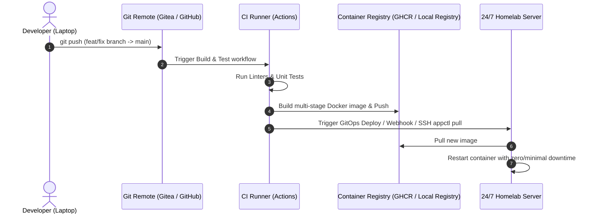

# 🚀 Deployment & CI/CD Strategy

## 🎯 Objective
Automate the build, test, containerization, and deployment lifecycle for services hosted in the homelab.

---

## 🔄 CI/CD Pipelines Overview

---

## 🛠️ Implementation Approaches

### 1. Webhooks & Watchtower / Diun (Pull Model - Recommended)
- **Approach**: CI pushes tagged images to GHCR. Watchtower/Diun running on the server detects new digest and automatically updates containers.
- **Pros**: Zero inbound SSH keys or open firewall ports needed from CI into homelab.
- **Cons**: Less granular control over immediate rollbacks.

### 2. GitOps with Gitea Actions / GitHub Actions Runner
- **Approach**: Run a self-hosted lightweight Gitea runner on the server. On release/push to `main`, the runner executes `appctl pull <service> && appctl restart <service>`.
- **Pros**: Full visibility, reproducible deployments, direct log output in CI UI.

---

## 🎯 Candidate Pilot Services for CI/CD

The following micro-repos are selected as prioritized pilot targets for automated CI/CD pipelines:

1. **`homelab-landing`** (`~/Sites/homelab-landing`):
   - Pure static/nginx web portal (`roadtotech.me`).
   - Fast, low-risk playground to test multi-stage Docker build, GHCR push, and automated deployment.
2. **`homelab-dashboard`** (`~/Sites/homelab-dashboard`):
   - Fast-evolving Learning Hub API backend & Homepage customization.
   - Ideal for testing pytest/linting pipelines before publishing.
3. **`homelab-minecraft`** (`~/Sites/homelab-minecraft`):
   - Custom FastAPI Identity Manager Web Admin.
   - Ideal for testing Python security linters, JWT validation, and container packaging.

