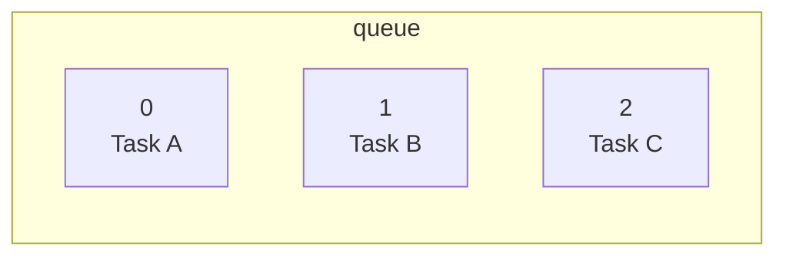
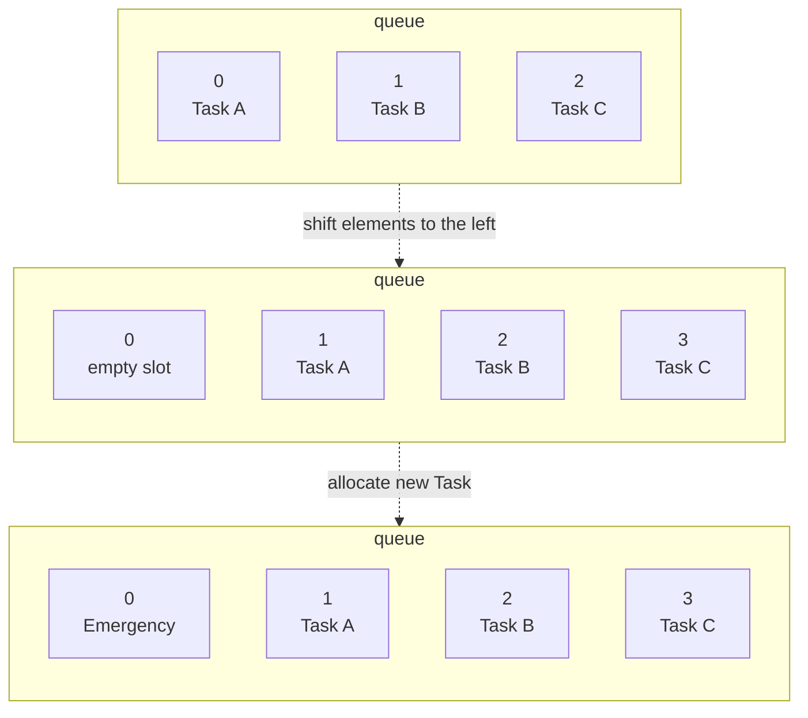
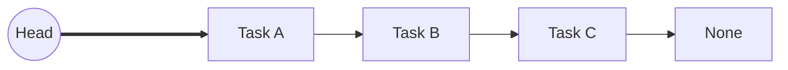
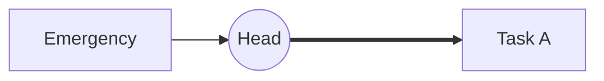
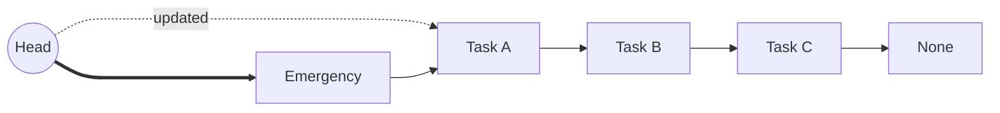
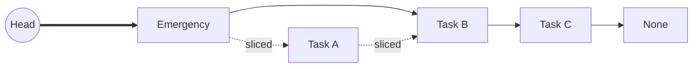

# Linked Lists: Designing a Dynamic Task Queue

Imagine you are implementing the scheduler of an operating system. New high-priority jobs can appear at any moment, completed jobs dissappear constantly, and the queue changes hundreds of times per second.

The question is no longer "How do I store these tasks?", but rather, "Which data structure lets me modify the sequence efficiently?"

## The First Solution Most People Use
Your first instinct is likely to use a standard array (or a Python `list`). Arrays allocate a single, continuous block of memory to store elements side-by-side.

```python
queue = ["Task A", "Task B", "Task C"]
```

You can think of our list as a contiguous space where every task is assembled, one right next to the following. 



This is highly efficient if you only ever add or remove items at the very end of the list. But it introduces a massive performance bottleneck if you need to modify the beginning or the middle of the sequence. 

Suppose a high-priority task arrives.

```python
queue.insert(0, "Emergency")
```

Internally, Python modifies the existing list in place. Because a Python list stores a contiguous array of object references, every reference from the insertion point onward must be shifted one position to the right to make room. 




That works. But a few milliseconds later, another arrives.

```Python
queue.insert(0, "Database Failure")
```

Then another.

```Python
queue.insert(0, "Security Alert")
```


Then, a user cancels a task in the middle of the queue. 

```Python
queue.pop(4)
```

Again, everything after that index must shift left to close the gap. 

Notice what's happening: **We are not spending time managing tasks. We are spending time reorganizing memory**.

Every time an element is inserted or removed at the front of a 10,000-item array, 10,000 references must be moved. The work grows proportionally with the number of elements, giving these operations a time complexity of $O(N)$.

Can we avoid moving everything? 
## Meeting the Linked List

A linked list abandons the requirement of contiguous memory. Instead of forcing elements to sit side-by-side, it stores them wherever there is free space in memory. 

To maintain the sequence, each element is wrapped in a container called a **Node**. A Node holds two pieces of information: 

1. The actual data (the value)
2. A pointer (or reference) to the exact memory address of the next Node. 

Since each Node explicitly points to the next one, the items can be scattered anywhere. You only need to keep track of the very first Node, known as the Head. Every other node is discovered by following the chain of next references.
### How it looks in code
In Python, a singly linked list is typically implemented using a simple class to represent the Node.

```python
class ListNode:
	def __init__(self, val=0, next=None):
		self.val = val
		self.next = next
		
```

This `ListNode` is the building block of your linked list, it's the minimal implementation you will find in algorithms or LeetCode problems.

### **Extra Mile — making nodes easier to inspect**: 

While learning the data structure, it is useful to enrich the class with debugging helpers. These additions are not part of the data structure itself; they simply make it easier to visualize the chain of nodes in memory.

```python
from typing import Any
class ListNode:
    def __init__(self, val: Any = 0, next: 'ListNode | None' = None):
        if next is not None and not isinstance(next, ListNode):
            raise TypeError("`next` must be a ListNode or None.")
            
        self.val = val
        self.next = next
        
    def __repr__(self) -> str:
        next_id = hex(id(self.next)) if self.next else None
        return f"ListNode(id={hex(id(self))}, val={self.val}: {type(self.val)}, next={next_id})"

    
    def inspect(self):
        current = self
        while current:
            print(current)
            current = current.next
```

The runtime validation guarantees that `next` is either always a valid node or `None`. The custom `__repr__` exposes the underlying memory addresses, making pointer updates much easier to follow.

```python
>>> head = ListNode("Task A")
>>> print(head)
ListNode(id=0x78668c37e210, val='Task A', next=None)

```

Finally, the `inspect()` helper traverses the chain beginning at the current node. We make use of the `next` attribute to assing new nodes to our chain:

```python
>>> head.next = ListNode("Task B")
>>> head.next.next = ListNode("Task C")
>>> head.inspect()
ListNode(id=0x78668c37e210, val='Task A', next=0x78668c37e850)
ListNode(id=0x78668c37e850, val='Task B', next=0x78668c37e990)
ListNode(id=0x78668c37e990, val='Task C', next=None)
```

### Building the Task Queue

Let us apply this structure to our original OS scheduler problem. Instead of a continuous array, our tasks now exist as a chain:  



Now, a new urgent task arrives. Instead of shifting thousands of existing tasks, we simply allocate one new node in memory.  

```python
>>> new_task = ListNode("Emergency")
>>> print(new_task)
ListNode(id=0x78668c37ec10, val='Emergency', next=None)
```

We point its `next` reference to the current head of the queue.

```python
>>> new_task.next = head
>>> print(new_task)
ListNode(id=0x78668c37ec10, val='Emergency', next=0x78668c37e210)
```




Then, we update our system's Head reference to point this new node.

```python
>>> head = new_task
>>> head.inspect()
ListNode(id=0x78668c37e350, val='Emergency', next=0x78668c35f380)
ListNode(id=0x78668c35f380, val='Task A', next=0x78668c37e490)
ListNode(id=0x78668c37e490, val='Task B', next=0x78668c37e710)
ListNode(id=0x78668c37e710, val='Task C', next=None)
```


Only two references changed. Nothing else moved. The remaining nodes stayed exactly where they were in memory. 



Likewise, deleting a taks in the middle of the chain does not require shifting elements left. If we want to remove "Task A", and we have a reference to the node before it ("Emergency"), we simply bypass it: 

```python
>>> head.next = head.next.next
>>> head.inspect()
ListNode(id=0x78668c37ec10, val='Emergency', next=0x78668c37e850)
ListNode(id=0x78668c37e850, val='Task B', next=0x78668c37e990)
ListNode(id=0x78668c37e990, val='Task C', next=None)
```



### Traversing the List

The variable `head` always points to the beginning of the list. To visit later nodes without hardconging multiple `.next` attributes, we introduce another variable, conventionally called `current`.

```python
>>> current = head
>>> while current:
...     print(current.val)
...     current = current.next
...
Emergency
Task B
Task C
```

Notice that `current = current.next` does not modify the list or any objects in memory. It simply rebinds the local variable `current` to point to the next node, allowing us to walk the chain one node at the time. 

Likewise, if you wanted to remove "Task C" from an arbitrary list, you don't need to write `head.next.next.next = ...`. Instead, you walk until you are one node before the target.

```python
>>> current = head
>>> while current.next and current.next.val != "Task C":
...     current = current.next
...
# current is now the node immediately preceding "Task C" 
>>> current.next = current.next.next
>>> head.inspect()
ListNode(id=0x78668c37ec10, val='Emergency', next=0x78668c37e850)
ListNode(id=0x78668c37e850, val='Task B', next=None)

```

These variables act as  **cursors**. Think of them as fingers pointing at different nodes while the underlying structure stays exactly where it is. 

**Something tricky**: while modifying `current` earlier did not have an impact on the actual values on our list, this time, `current.next` is no longer acting upon a reference value, but performing a job on an actual attribute (`.next`) of our ListNode class instance. 
## The Mental Picture

Think of a linked list as a **scavenger hunt**.

You are given the first envelope (the Head). That envelope does not contain a map of where _all_ the other envelopes are located. It only contains the current clue (the data) and the address of the _next_ envelope (the pointer).

Because of this design, you cannot instantly jump to clue #50. You must open envelope #1 to find #2, open #2 to find #3, and traverse the path sequentially until you reach your destination.
## The Complexity Trade-off

Choosing between an array and a linked list is a classic engineering trade-off between **access speed** and **modification speed**.

| **Operation**                    | **Array (Python list)** | **Linked List** |
| -------------------------------- | ----------------------- | --------------- |
| **Access (Find the _n_th item)** | $O(1)$                  | $O(N)$          |
| **Insert/Delete at the start**   | $O(N)$                  | $O(1)$          |
| **Insert/Delete in the middle**  | $O(N)$                  | $O(1)$*         |

_*Note: While the pointer rewiring for an insertion or deletion is O(1), you incur an O(N) cost if you first have to traverse the list sequentially to find that specific middle position._
### Doubly Linked Lists

Standard linked lists only point forward. A Doubly Linked List adds a `prev` pointer to each Node, allowing you to traverse the sequence backward. This is the underlying data structure used for features like a web browser's Back/Forward history, or an application's undo/redo stack.
### One Principle to Remember

You do not need a linked list for standard data storage. Rely on this heuristic to decide when to use one:

Whenever you are designing a system where you rarely search by index, but you constantly insert or delete items at the extremities, pause and ask: **"Am I paying a heavy tax for shifting elements in memory?"**

If the answer is yes, a linked list is the correct architectural choice.
