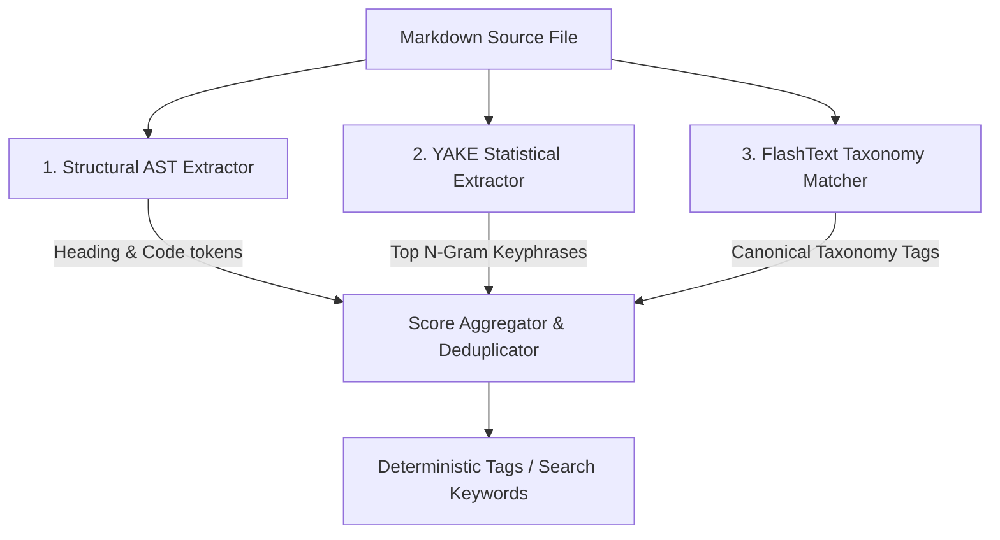

# Deterministic Tag & Key Term Extraction for Markdown Documents

To replace non-deterministic or manual tag assignment with a repeatable, deterministic pipeline, several algorithmic and heuristic strategies can be employed. The ideal approach depends on whether extraction is performed across a single document in isolation or over an entire knowledge corpus.

---

## 1. Single-Document Statistical Extraction

These algorithms extract keywords from individual documents without requiring corpus-wide statistics or model training.

### A. YAKE! (Yet Another Keyword Extractor)
- **Mechanism**: Unsupervised feature-based statistical heuristic. Evaluates words based on 5 features: casing, word position (early occurrences weighted higher), word frequency, word-to-context relatedness (dispersion across sentences), and sentence differences.
- **Key Characteristics**:
  - **100% Deterministic**: Same input text always produces the exact same ranked keyphrases and scores.
  - **Multi-word phrases (n-grams)**: Extracts 1-gram to 3-gram key terms (e.g., `"reverse proxy"`, `"systemd service"`).
  - **Zero Corpus Dependency**: Operates on a single document without prior training or IDF tables.
- **Tooling**: `yake` (Python library).

### B. Graph-Based Centrality (TextRank & PositionRank)
- **Mechanism**: Builds a graph where words/lemmas are nodes and edges represent co-occurrence within a sliding window (e.g., 3–5 tokens). It then computes node importance using PageRank.
  - **PositionRank**: Extends TextRank by incorporating structural bias, weighting words appearing early or in headings more heavily.
- **Key Characteristics**:
  - Robust against repetitive "keyword stuffing".
  - Identifies central concept clusters rather than isolated frequent words.
- **Tooling**: `pytextrank`, `pke` (Python Keyphrase Extraction toolkit).

---

## 2. Corpus-Aware Retrieval Weighting

If processing a collection of documents (e.g., an entire repository or search index), corpus statistics significantly improve relevance.

### A. TF-IDF & Okapi BM25
- **Mechanism**:
  - **TF (Term Frequency)** measures how often a term appears in a document.
  - **IDF (Inverse Document Frequency)** penalizes terms that appear broadly across all documents (e.g., common words like "guide", "setup", "example").
  - **BM25**: Incorporates non-linear term frequency saturation and document length normalization.
- **Search Engine Synergies**: This directly mirrors how lexical search engines (e.g., Pagefind, Tantivy, Meilisearch, Elasticsearch) index documents. Top TF-IDF / BM25 terms are mathematically the highest-discriminating query terms for that document.

---

## 3. Markdown-Aware Structural AST Parsing

Markdown files possess strong structural signals that standard NLP tokenizers discard (frontmatter, headings, code spans, emphasis).

### Structural Weighting Matrix
A custom deterministic AST parser (using `markdown-it-py`, `mistletoe`, or `tree-sitter-markdown`) assigns hierarchical multipliers to extracted tokens:

| Element | Structural Multiplier | Purpose |
| :--- | :--- | :--- |
| **Document Title (`# H1`)** | `5.0x` | Primary topic identification |
| **Section Headings (`## H2`, `### H3`)** | `3.0x` | Sub-topic boundaries |
| **Inline Code & Code Fences (`\`code\``)** | `2.5x` | Specific tools, commands, symbols (e.g., `pg_dump`, `nix-shell`) |
| **Emphasis / Bold (`**term**`)** | `2.0x` | Author-highlighted key phrases |
| **Link Anchor Text (`[text](#)`)** | `2.0x` | Linked entity names |
| **Body Noun Phrases** | `1.0x` | Baseline content |

---

## 4. Controlled Vocabulary & Dictionary Matching

To avoid tag fragmentation (e.g., generating `postgres`, `postgresql`, and `psql` for the same concept), extraction can be anchored against a controlled dictionary.

### A. FlashText / Aho-Corasick Automaton
- **Mechanism**: Builds a deterministic finite automaton (trie) over a predefined taxonomy or keyword list. Scans the document in linear time $O(N)$.
- **Synonym Normalization**: Automatically maps variations and aliases to canonical tags (e.g., `pg` $\to$ `postgresql`, `k8s` $\to$ `kubernetes`).
- **Tooling**: `flashtext` (Python).

---

## 5. Fixed-Seed Dense Representation (KeyBERT)

- **Mechanism**: Uses sentence/sub-word transformer embeddings (e.g., `all-MiniLM-L6-v2`) to compute cosine similarity between candidate n-gram phrases and the whole document embedding.
- **Determinism**: Fully deterministic when using fixed model weights and greedy selection / Maximal Marginal Relevance (MMR) with temperature = 0.
- **Strengths**: Captures semantic synonyms even if exact wording differs slightly.

---

## Recommended Hybrid Architecture

For a technical knowledge base or Markdown documentation repository, the most effective deterministic tagging pipeline combines **Structural Parsing**, **Single-Doc Keyphrases (YAKE)**, and **Controlled Taxonomy Matching (FlashText)**:

### Pipeline Flow:
1. **FlashText** matches known technologies/concepts from a dictionary, ensuring clean canonical tags.
2. **AST Parser** extracts prominent heading keywords and backtick symbols (`code identifiers`).
3. **YAKE!** captures novel high-salience multi-word phrases from the body text.
4. **Aggregator** sums structural weights, filters stopwords, normalizes to lowercase kebab-case, and selects the top $K$ key terms.

---

## Related Knowledge & Documentation

* [From Notes to Technical Documentation](notes-to-docs.md)
* [Second Brain Governance & Agent Guide](../../AGENTS.md)
