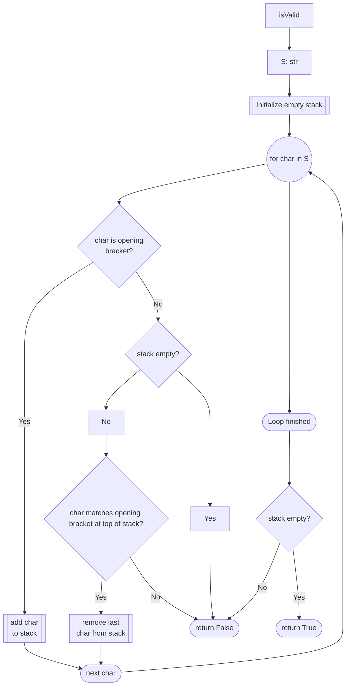

# [20. Valid Parentheses](https://leetcode.com/problems/valid-parentheses/)

**Status**: Solved
**Difficulty**: Easy

## Problem Statement
Given a string `s` containing just the characters `'('`, `')'`, `'{'`, `'}'`, `'['` and `']'`, determine if the input string is valid.

An input string is valid if:

1. Open brackets must be closed by the same type of brackets.
2. Open brackets must be closed in the correct order.
3. Every close bracket has a corresponding open bracket of the same type.

**Example 1:**
- **Input:** `s = "()"`
- **Output:** `True`

**Example 2:**

- **Input:** `s = "()[]{}"`
- **Output:** `True`

**Example 3:**
- **Input:** `s = "(]"`
- **Output:** `False`

**Example 4:**
- **Input:** `s = "([])"`
- **Output:** `True`

**Example 5:**
- **Input:** `s = "([)]"`
- **Output:** `False`

**Constraints:**
- `1 <= s.length <= 104`
- `s` consists of parentheses only `'()[]{}'`.

---

## Intuition

Reading the string from left to right, at any point of the string, the next character of a valid input string must be an opening bracket, or the closing bracket matching the type of the last recorded opening.

Think of this as a nsted structure where the most recent openend bracket is the first one that must be closed. This inherent "Last In/First Out" dependency indicates that we should track pending openings using a stack. 

As we iterate thoguh the string, we "push" opening brackets onto the stack. When we encounter a closing bracket, we check if it balances the most recent opening (the top of our stack)

## Algorithm




## Implementation

The initial implementation uses two parallel strings—`op` (openers) and `cl` (closers)—to track state. As we iterate through the input string, we push opening brackets onto a stack. When a closing bracket is encountered, we find its index in the `cl` string and verify if the corresponding character from the `op` string matches the last element on our stack. This approach relies on index synchronization between two independent structures to validate the LIFO order.

```python

class Solution:
    def isValid(self, s: str) -> bool:
        op = "{[("
        cl = "}])"

        stack = []

        for char in s:
            if char in op:
                stack.append(char)
            elif stack and op[cl.find(char)] == stack[-1]:
                stack.pop()
            else:    
                return False
        return not stack
```


### Refactor

The refactor optimizes this logic by utilizing a dictionary (pairs) to represent the relationship between brackets as explicit key-value pairs. Instead of searching for indices, the loop now pushes the expected closing bracket directly onto the stack when an opener is found. This simplifies the validation step: for every closing character encountered, we simply pop the stack and check for an exact match. This shift eliminates the need for expensive index lookups and makes the code more resilient by encoding the rules of the problem directly into the data structure.

```python
class Solution:
    def isValid(self, s: str) -> bool:
        pairs = {
                "(": ")",
                "[": "]",
                "{": "}"
            }

        stack = []

        for char in s:
            if char in pairs:
                stack.append(pairs[char])
            elif not stack or stack.pop() != char:
                return False

        return not stack
```

**Summary of Improvements**:
- **Reduced Complexity:** Replaces string searching (linear time $O(k)$ for each closer) with $O(1)$ dictionary lookups.
- **Improved Readability:** The `pairs` dictionary makes the relationship between opening and closing symbols explicit and easy to maintain.
- **Simplified Logic:** By pushing the "expected" closer to the stack, the comparison logic becomes a direct equality check (`stack.pop() != char`), removing the need for auxiliary index calculations.
- **Enhanced Maintainability:** Adding new bracket types (e.g., `< >`) now requires updating only the dictionary definition, rather than modifying parallel strings and lookup indices.

## Complexity
- **Time Complexity:** $O(n)$, where $n$ is the length of the string $s$. We traverse the string exactly once, and each stack operation (push and pop) takes $O(1)$ time.
    
- **Space Complexity:** $O(n)$. In the worst-case scenario—where the string consists only of opening brackets (e.g., `(((((`)—we store all $n$ characters in the stack.

## Takeaways

- **LIFO Patterns**: Whenever a problem requires matching pairs in a nested or sequential manner where the most recently opened structure must be closed first, a **Stack** is the canonical data structure
- **Mapping Relationships**: Using a hash map (dictionary) to store key-value pairs (openning to closing) is often cleaner than parallel lists or index lookups. It improves readability and provides $O(1)$ lookup time. 
- **Early Returns**: Checking for failure conditions (e.g., encountering a closing bracket when the stack is empty, or a mismatch with the top of the stack) allows for early exit, which is more efficient than processing the entire string when a invalid state is detected. 
- **Post-processing State**: Always remember that a stack being non-empty at the end of the iteration is a failure state. It implies that at least one opening bracket was never matched with a closing bracket. 

