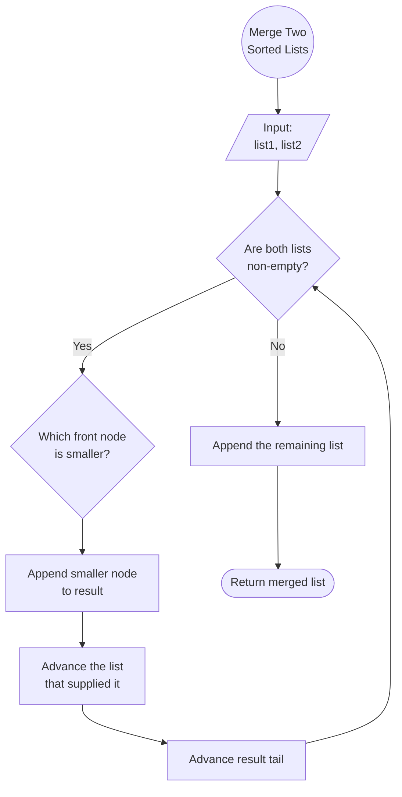

# [21. Merge Two Sorted Lists](https://leetcode.com/problems/merge-two-sorted-lists/)

Status: Solved

Difficulty: Easy

**Relevant Guides:** [Linked List Guide](../../knowledge/dsa/linked-list.md)

## Problem Statement 

You are given the heads of two sorted linked lists `list1` and `list2`.

Merge the two lists into one **sorted** list. The list should be made by splicing together the nodes of the first two lists.

Return _the head of the merged linked list_.

**Example 1:**


**Input:** list1 = [1,2,4], list2 = [1,3,4]
**Output:** [1,1,2,3,4,4]

**Example 2:**

**Input:** list1 = [], list2 = []
**Output:** []

**Example 3:**

**Input:** list1 = [], list2 = [0]
**Output:** [0]

**Constraints:**

- The number of nodes in both lists is in the range `[0, 50]`.
- `-100 <= Node.val <= 100`
- Both `list1` and `list2` are sorted in **non-decreasing** order.

---

## Intuition

Both lists are already sorted in non-decreasing order.
The key constraint is not to copy values in memory but to reuse the existing nodes from the input lists. That means we need to sequentially rewire each node up to the next sorted position. 

The strategy is to repeatedly compare the front node of each list and attach the smaller one to the tail of the merged list. A dummy node provides a stable starting point so every insertion follows the same logic, including the first one.



### Implementation

1. Create a dummy node and a current pointer
2. While both lists have nodes:
	* compare the current values
	* attatch the smaller node to current.next 
	* advance the pointer of the list we took the node from
	* move current forward
3. When once lists is empty, attatch the rest of the other list
4. Return dummy.next (the real head of the merged list)

```python

from typing import Optional, Any
# Definition for singly-linked list (expanded).
class ListNode:
    def __init__(self, val: Any = 0, next=None):
        if next is not None and not isinstance(next, ListNode):
            raise TypeError("`next` must be a linked list or None")
        self.val = val
        self.next = next
        
    def __repr__(self) -> str:
        next_id = hex(id(self.next)) if self.next else None
        return f"ListNode(id={hex(id(self))}, val={self.val}: {type(self.val)}, next={next_id})"

    def inspect(self):
        current = self
        while current:
            print(current)
            current = current.next
        

class Solution:
    def mergeTwoLists(self, list1: Optional[ListNode], list2: Optional[ListNode]) -> Optional[ListNode]:
        dummy = ListNode()
        current = dummy

        while list1 and list2:
            if list1.val <= list2.val:
                current.next = list1
                list1 = list1.next
            else:
                current.next = list2
                list2 = list2.next
            current = current.next
        current.next = list1 or list2
        return dummy.next

```

## Complexity

- **Time:** $O(n + m)$

  Each node from both lists is visited exactly once.

- **Space:** $O(1)$

  The algorithm only uses a few pointers (`dummy`, `current`, `list1`, `list2`).
  No new list is allocated—the existing nodes are reused.

## Key Takeaways
- A dummy node removes the special case for inserting the first element
- The `current` pointer always represents the tail of the merged list.
- Moving a pointer (`list1 = list1.next`) does **not** modify the list; it only changes where our local reference points.
- Reassigning `current.next` rewires the linked structure without creating new nodes
- Once one list is exhausted, the remaining nodes of the other list are already sorted and can be appended directly.
- Advancing a pointer never changes the underlying linked list—it only changes which node your variable refers to.

## Common Mistakes

- Creating new nodes instead of reusing existing ones.
- Comparing `ListNode` objects instead of their values.
- Forgetting to advance `current`.
- Forgetting to advance the list whose node was consumed.
- Returning `dummy` instead of `dummy.next`.
- Forgetting to append the remaining nodes after one list is exhausted.


