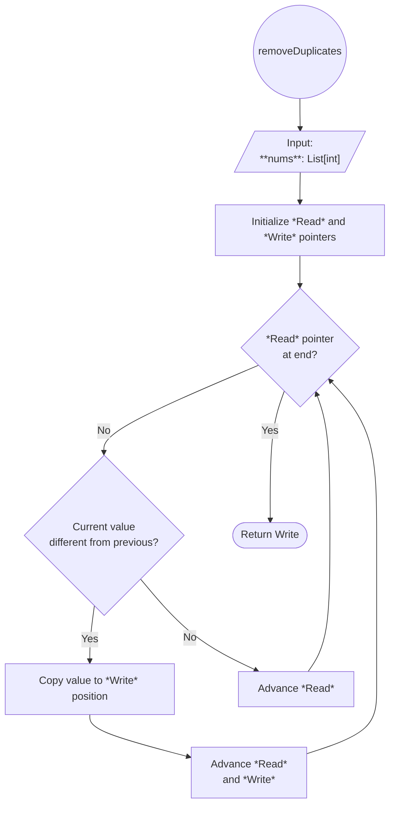

# [26. Remove Duplicates from Sorted Array](https://leetcode.com/problems/remove-duplicates-from-sorted-array/)

**Difficulty**: Easy

**Status**: Pending

---
## Problem Statement

Given an integer array `nums` sorted in **non-decreasing order**, remove the duplicates [**in-place**](https://en.wikipedia.org/wiki/In-place_algorithm) such that each unique element appears only **once**. The **relative order** of the elements should be kept the **same**.

Consider the number of _unique elements_ in `nums` to be `k**​​​​​​​**`​​​​​​​. After removing duplicates, return the number of unique elements `k`.

The first `k` elements of `nums` should contain the unique numbers in **sorted order**. The remaining elements beyond index `k - 1` can be ignored.

**Custom Judge:**

The judge will test your solution with the following code:

```python
int[] nums = [...]; // Input array
int[] expectedNums = [...]; // The expected answer with correct length

int k = removeDuplicates(nums); // Calls your implementation

assert k == expectedNums.length;
for (int i = 0; i < k; i++) {
    assert nums[i] == expectedNums[i];
}

```

If all assertions pass, then your solution will be **accepted**.

--- 
**Example 1:**

**Input:** nums = [1,1,2]

**Output:** 2, nums = [1,2,_]

**Explanation:** Your function should return k = 2, with the first two elements of nums being 1 and 2 respectively.

It does not matter what you leave beyond the returned k (hence they are underscores).

---
**Example 2:**

**Input:** nums = [0,0,1,1,1,2,2,3,3,4]
**Output:** 5, nums = [0,1,2,3,4,_,_,_,_,_]
**Explanation:** Your function should return k = 5, with the first five elements of nums being 0, 1, 2, 3, and 4 respectively.
It does not matter what you leave beyond the returned k (hence they are underscores).

## Intuition

Because the input array is already sorted, every duplicate appears immediately after its first occurrence. Then, the criteria for discriminating duplicates can be reduced to whether the current number equals their last neighbor.

```Plaintext
nums = [1, 2, 2, 3, 4]
			  ↑
		(nums[2] == nums[1]) → Duplicate
		
```

My earliest attempts were to iterate over the array and delete a duplicate number once encountered, by using either `List.pop(index)` or `List.remove(value)`. But this approach modifies the list that is used as base for the iterator on every deletion, which shift every following index. Completing this approach would require iterating over a copy of the original array, which defeats the constraint of editing the lists in place of the exercise. 

Instead of deleting elements, we can overwrite duplicates with the next unique value. 

This approach uses two moving pointers: 
- **Read pointer ($i$)**: scans every element
- **Write pointer ($w$)**: marks where the next unique value should be written

Whenever the read pointer finds a value different from the previous one, that value belongs in the unique prefix of the array, so it is copied to the write position.

For example,

```Plaintext
# Iteration 1
	nums = [1, 2, 2, 3, 4]
i:          ^      
w:          ^
```

The first element is never considered a duplicate because there is no previous value to compare against, so we copy this value in place and move both of our pointers (or simply start iterating from the next index). Notice that we're overriding the actual value from `nums[0]`, even though the new value is equal to the original.

```Plaintext
# Iteration 2
	nums = [1, 2, 2, 3, 4]
i:             ^      
w:             ^
```

We've found a unique value (different from the previous one), so we copy the value and move our pointers.

```Plaintext
# Iteration 3
	nums = [1, 2, 2, 3, 4]
i:                ^      
w:                ^
```

This is a duplicate, so we won't write anything, position `nums[1]` keeps holding our last unique value. We'll move only our Read pointer.

```Plaintext
# Iteration 4
	nums = [1, 2, 2, 3, 4]
i:                   ^      
w:                ^
```

The number 3 is a unique value, so we'll copy its value into our Write pointer and advance both pointers. This is the first actual modification of our list, the value from our Read pointer at `nums[3]` is assigned to the position of our Write pointer at `nums[2]`. Then we advance both pointers. 

```Plaintext
# Iteration 5
	nums = [1, 2, 3, 3, 4]
i:                      ^      
w:                   ^
```

The number 4 is another unique value so we'll close the loop with the following results: 

```Python
nums = [1, 2, 3, 4, 4]
w = 4
```

At the end of the scan, `w` equals the number of unique elements. The first `w` positions already contain the required result. Since the problem explicitly states that every element after index `w - 1` can be ignored, no additional cleanup is necessary. We simply return `w`.

## Algorithm 




## Implementation

Since the read pointer advances sequentially through the array, a `for` loop naturally manages it. The write pointer is the only index we update manually.

```python
from typing import List


class Solution:
	def removeDuplicates(self, nums: List[int]) -> int:
		if not nums:
		    return 0
		
		w = 1

		for i in range(1, len(nums)):
		    if nums[i] != nums[i - 1]:
		        nums[w] = nums[i]
		        w += 1
		
		return w

```


### Complexity Analysis

- **Time Complexity:** $O(n)$, where $n$ is the number of elements in the array `nums`. The algorithm scans the array exactly once using a single `for` loop. Each comparison and assignment operation runs in constant time $O(1)$.
    
- **Space Complexity:** $O(1)$. The operation modifies the array in place using a fixed number of scalar pointers (`w` and the loop variable `i`), requiring no auxiliary data structures or memory scaling with input size.

## Takeaways

- **Mutation and Iteration Hazards:** Mutating a collection (via `pop()` or `remove()`) while iterating over its index or iterator shifts subsequent elements unpredictably. This invalidates remaining loop bounds or skips elements unless working on a copy.
    
- **In-Place Transformation via Two Pointers:** When memory constraints prohibit auxiliary data structures or copies, a read-write pointer pattern allows linear $O(n)$ time and $O(1)$ space restructuring by partitioning the array into processed (unique) and unprocessed regions.
    
- **Interface vs. Implementation Constraints:** Solving the algorithm is only part of the task. Competitive programming platforms often define a precise interface that the implementation must satisfy. In this problem, the array is modified in place, while the function returns only the number of valid elements (`k`).
- **The specification is part of the problem.** Verify what must be returned before reasoning about implementation details.