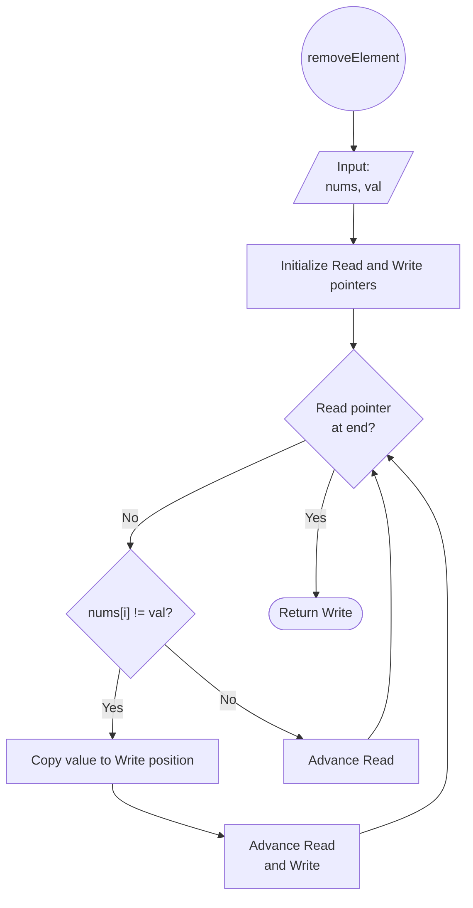

# [27. Remove Element](https://leetcode.com/problems/remove-element/)

Difficulty: Easy

## Problem Statement

Given an integer array `nums` and an integer `val`, remove all occurrences of `val` in `nums` [**in-place**](https://en.wikipedia.org/wiki/In-place_algorithm). The order of the elements may be changed. Then return _the number of elements in_ `nums` _which are not equal to_ `val`.

Consider the number of elements in `nums` which are not equal to `val` be `k`, to get accepted, you need to do the following things:

- Change the array `nums` such that the first `k` elements of `nums` contain the elements which are not equal to `val`. The remaining elements of `nums` are not important as well as the size of `nums`.
- Return `k`.

**Custom Judge:**

The judge will test your solution with the following code:

int[] nums = [...]; // Input array
int val = ...; // Value to remove
int[] expectedNums = [...]; // The expected answer with correct length.
                            // It is sorted with no values equaling val.

int k = removeElement(nums, val); // Calls your implementation

assert k == expectedNums.length;
sort(nums, 0, k); // Sort the first k elements of nums
for (int i = 0; i < actualLength; i++) {
    assert nums[i] == expectedNums[i];
}

If all assertions pass, then your solution will be **accepted**.

**Example 1:**

**Input:** nums = [3,2,2,3], val = 3
**Output:** 2, nums = [2,2,_,_]
**Explanation:** Your function should return k = 2, with the first two elements of nums being 2.
It does not matter what you leave beyond the returned k (hence they are underscores).

**Example 2:**

**Input:** nums = [0,1,2,2,3,0,4,2], val = 2
**Output:** 5, nums = [0,1,4,0,3,_,_,_]
**Explanation:** Your function should return k = 5, with the first five elements of nums containing 0, 0, 1, 3, and 4.
Note that the five elements can be returned in any order.
It does not matter what you leave beyond the returned k (hence they are underscores).

**Constraints:**

- `0 <= nums.length <= 100`
- `0 <= nums[i] <= 50`
- `0 <= val <= 100`

--- 
## Intuition

Unlike the previous problem, the array is **not sorted**, so we cannot detect unwanted elements by comparing neighbors. Instead, we are given the exact value to remove.

The same two-pointer strategy still applies:

- **Read pointer (`i`)** scans every element.
- **Write pointer (`w`)** tracks where the next valid element should be placed.

Whenever the read pointer encounters a value **different from `val`**, that value is copied to the write position, and both pointers advance. Otherwise, only the read pointer moves forward.

At the end of the scan, `w` equals the number of elements that are not equal to `val`. The first `w` positions contain the required values, while everything beyond `w - 1` can be ignored according to the problem statement.

## Algorithm



## Implementation

```python
class Solution:
    def removeElement(self, nums: List[int], val: int) -> int:
        w = 0

        for i in range(len(nums)):
            if nums[i] != val:
                nums[w] = nums[i]
                w += 1

        return w
```

## Complexity Analysis

- **Time Complexity:** $O(n)$, where $n$ is the number of elements in the array `nums`. The algorithm iterates through the array exactly once. Each comparison and assignment executes in constant time $O(1)$.
    
- **Space Complexity:** $O(1)$. The transformation is performed entirely in place using a fixed set of scalar variables (`w` and the loop iterator), requiring no auxiliary memory scaling with the input size.
## Takeaways

- The two-pointer pattern is not limited to sorted arrays. It also works as a general **filtering** technique for in-place array transformations.
    
- The write pointer always represents both the position of the next valid element and the number of valid elements processed so far.
    
