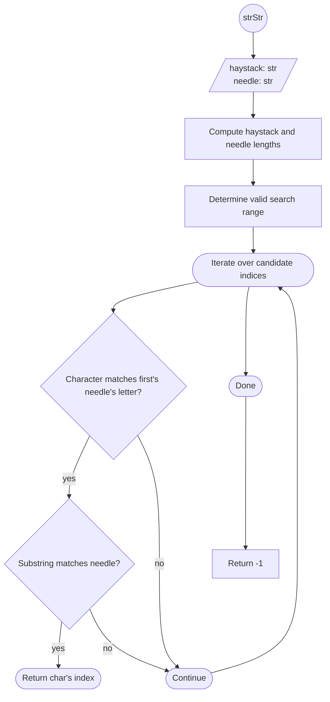

# [28. Find the Index of the First Occurrence in a String](https://leetcode.com/problems/find-the-index-of-the-first-occurrence-in-a-string/)

Difficulty: Easy

----
## Problem Statement: 

Given two strings `needle` and `haystack`, return the index of the first occurrence of `needle` in `haystack`, or `-1` if `needle` is not part of `haystack`.

**Example 1:**

**Input:** haystack = "sadbutsad", needle = "sad"
**Output:** 0
**Explanation:** "sad" occurs at index 0 and 6.
The first occurrence is at index 0, so we return 0.

**Example 2:**

**Input:** haystack = "leetcode", needle = "leeto"
**Output:** -1
**Explanation:** "leeto" did not occur in "leetcode", so we return -1.

---

## Intuition

We are asked to determine whether `needle` occurs within `haystack` and, if so, return the index of its first occurrence. A natural approach is to scan the haystack looking for the first character of the needle. Only when that character matches do we compare the entire substring. Since a match is impossible when fewer than `len(needle)` characters remain, the search only considers starting positions where the remaining substring is at least as long as the needle.

## Algorithm



## Implementation

```python
class Solution:
    def strStr(self, haystack: str, needle: str)-> int:
        if not needle:
           return 0
        L = len(haystack)
        N = len(needle)

        for i in range(L - N +1):
            if haystack[i] == needle[0]:
                if haystack[i:i+N] == needle:
                    return i

        return -1
```


## Testing

```Python
if __name__ == "__main__":
    sol = Solution()
    test_cases = [
        ("sadbutsad", "sad", 0),
        ("leetcode", "leeto", -1),
        ("shakespeare", "pea", 6),
        ("", "", 0),           # empty in empty
        ("abc", "", 0),        # empty needle
        ("", "a", -1),         # empty haystack
        ("aaaaa", "aa", 0),    # overlapping matches
        ("abc", "c", 2),       # match at end
    ]

    for i, (haystack, needle, expected_index) in enumerate(test_cases, start=1):
        index = sol.strStr(haystack, needle)

        if index == expected_index:
            print(f"Test {i} PASSED")
        else:
            print(f"Test {i} FAILED")
            print(f"haystack: '{haystack}', needle: '{needle}'")
            print(f"Expected return: {expected_index}, got: {index}")

```

## Complexity Analysis

- **Time Complexity:** $O((L−N+1)⋅N)$, where $L$ is the length of `haystack` and $N$ is the length of `needle`. In the worst case, every possible starting position is examined, and each candidate comparison may inspect up to `N` characters.

- **Space Complexity:** $O(1)$. The algorithm uses only a fixed number of scalar variables and performs all comparisons directly on the input strings.
## Takeaways

- **Reduce unnecessary work:** Before comparing the entire substring, checking whether the first character matches quickly eliminates most candidate positions.

- **Constrain the search space:** There is no need to begin a comparison if the remaining portion of the haystack is shorter than the needle. Limiting the loop to `range(L - N + 1)` avoids impossible comparisons.

- **Leverage language features:** Python's slicing (`haystack[i:i+N]`) provides a concise way to compare candidate substrings without manually iterating over each character. While this is not the most efficient possible string-search algorithm, it is simple, readable, and satisfies the problem constraints.
