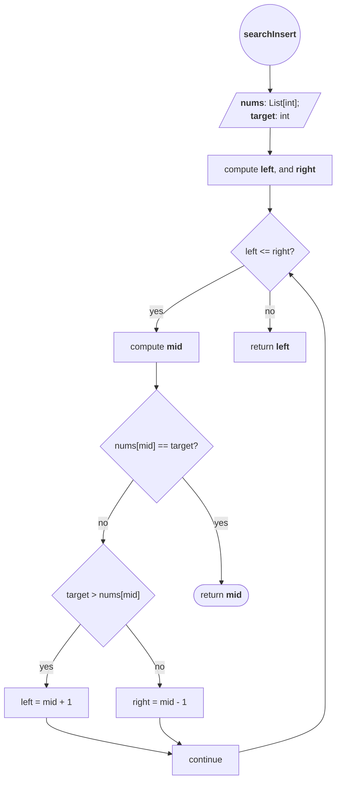

# [35. Search Insert Position](https://leetcode.com/problems/search-insert-position/)

Difficulty: Easy

## Problem Statement

Given a sorted array of distinct integers and a target value, return the index if the target is found. If not, return the index where it would be if it were inserted in order.

You must write an algorithm with `O(log n)` runtime complexity.

**Example 1:**

**Input:** nums = [1,3,5,6], target = 5
**Output:** 2

**Example 2:**

**Input:** nums = [1,3,5,6], target = 2
**Output:** 1

**Example 3:**

**Input:** nums = [1,3,5,6], target = 7
**Output:** 4

**Constraints:**

- `1 <= nums.length <= 104`
- `-104 <= nums[i] <= 104`
- `nums` contains **distinct** values sorted in **ascending** order.
- `-104 <= target <= 104`

## Intuition
When I saw that an $O(\log N)$ solution is explicitly required, I immediately thought back to [#14](14-longest-common-prefix.md), where **[binary search](../../knowledge/dsa/binary-search.md)** was used to progressively discard parts of the search space that could not contain the answer.

Since the array is already sorted, we can use binary search instead of scanning every element. At each step, we compare the target with the middle element. If the target is larger, we know it cannot appear in the left half, so we discard it. Otherwise, we discard the right half. If the target is found, we return its index immediately. If the search space becomes empty, the `left` pointer indicates the position where the target should be inserted while preserving the sorted order.
## Algorithm




## Testing

The test approach is classic **expected** vs **yielded** values for the returning `int`. We cover key case examples where the number is and isn' t found in the original array, as well as the case where the input array is empty. 

```Python

if __name__ == "__main__":

    sol = Solution()

    test_cases = [
	    ([1, 2, 3, 4, 5], 5, 4),
        ([1, 3, 5, 6], 5, 2),
        ([1, 3, 5, 6], 2, 1),
        ([1, 3, 5, 6], 7, 4),
        ([1, 2, 3, 5, 6], 4, 3),
        ([], 1, 0)
    ]

    for i, (nums, target, expected_output) in enumerate(test_cases, start=1):
        res = sol.searchInsert(nums, target)
        if res == expected_output:
            print(f"Test {i} PASSED")
        else:
            print(f"Test {i} FAILED:")
            print(f"    Expected output: {expected_output}, got {res}")
```

## Implementation

Included guardrail for edge case where the input Python list is empty, returning zero immediately. Utmost right position computed as the lenght of the List minus 1. 


```Python
from typing import List

class Solution:
    def searchInsert(self, nums: List[int], target: int) -> int:
        if not nums:
            return 0
        
        left = 0
        right = len(nums) - 1

        while left <= right:
            mid = left + (right - left) // 2
            if target == nums[mid]:
                return mid
            elif target > nums[mid]:
                left = mid + 1
            else:
                right = mid - 1
        return left

```

Local testing and LeetCode tests were passed. 

## Complexity Analysis

- **Time Complexity:** $O(\log n)$. Each iteration discards half of the remaining search space, so the number of iterations grows logarithmically with the size of the input.

- **Space Complexity:** $O(1)$. The algorithm uses a fixed number of variables (`left`, `right`, and `mid`) regardless of the input size.

## Takeaways

- **Binary search is about maintaining an invariant.** At every step, the target (or its insertion position) must lie within the current search interval.

- **Think in terms of search spaces, not arrays.** We never modify or slice the array; we only move the `left` and `right` boundaries.

- **The insertion position emerges naturally.** When the loop finishes, `left` points to the first position where the target could be inserted while preserving sorted order. This eliminates the need for additional checks after the search.