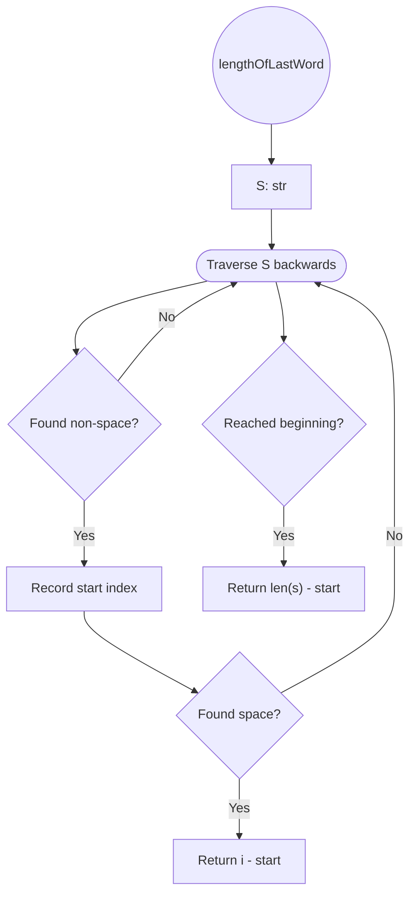

# [58. Length of Last Word](https://leetcode.com/problems/length-of-last-word/)

**Difficulty**: Easy
## Problem Statement

Given a string `s` consisting of words and spaces, return _the length of the_ _**last**_ _word in the string._

A **word** is a maximal sequence of non-space characters.

**Example 1:**

**Input:** `s = "Hello World"`  
**Output:** `5`  
**Explanation:** The last word is `"World"` with length 5.

**Example 2:**

**Input:** `s = " fly me to the moon "`  
**Output:** `4`  
**Explanation:** The last word is `"moon"` with length 4.

**Example 3:**

**Input:** `s = "luffy is still joyboy"`  
**Output:** `6`  
**Explanation:** The last word is `"joyboy"` with length 6.

**Constraints:**

- `1 <= s.length <= 104`
    
- `s` consists of only English letters and spaces `' '`.
    
- There will be at least one word.
    

---

## Intuition

The constraints cut away most of the complexity of the problem.

The string can contain only **letters and spaces**, and a word is simply a sequence of consecutive non-space characters. Therefore, the most direct way to find the last word is  to start at the **end of the string** and work backwards.

There are two things to account for:

1. There may be trailing spaces, so the first characters encountered from the right may not belong to the last word. Our word starts where the first non-space character is encountered.
2. Once the last word is found, the word ends when we encounter a space.

For example:

```python
"   fly me   to   the moon  " ← backwards read 
                     ↑   ↑ 
		             |   |
			         |   first letter encountered: last word start 
		            first space after start: end of the last word
```

This gives us two important events:

- **First non-space character:** marks the beginning of the last word when traversing backwards.
    
- **First space after finding that character:** marks the end of the last word.
    

There is one additional case to consider: the last word may extend all the way to the beginning of the string.

For example:

```text
"Hello"
```

There is no space after `"Hello"`, so the loop finishes naturally. In that case, the length of the string minus the starting index gives us the answer.

---

## Algorithm



More precisely:

1. Traverse the string from right to left.
2. Ignore spaces until the first non-space character is encountered.
3. Record the index of that character in the reversed string.
4. Continue traversing.
5. When a space is encountered after the last word has been found, calculate the length of the word.
6. If the traversal reaches the beginning of the string without encountering a space, calculate the length using the string's total length.
    

The important detail is that **the loop has two possible ways to terminate**:

```text
1. Encounter a space
   → return i - start

2. Reach the beginning of the string
   → return len(s) - start
```

This second case is easy to overlook. It was also the reason the original implementation triggered a type-checking warning: there was initially a possible execution path where the function reached its end without returning an `int`.

---

## Testing

The pattern used in the previous exercise is applicable here. The test harness compares the expected output with the result of passing each test string to the function.

```python
if __name__ == "__main__":
    sol = Solution()

    test_cases = [
        ("Hello World", 5),
        ("   fly me   to   the moon  ", 4),
        ("luffy is still joyboy", 6),
        ("", 0),
        ("H     ", 1),
    ]

    for i, (s, expected_output) in enumerate(test_cases, start=1):
        res = sol.lengthOfLastWord(s)

        if res == expected_output:
            print("TEST PASSED")
        else:
            print(f"Test {i} FAILED:")
            print(f"    Expected output: {expected_output}, got: {res}")
```

The additional cases are useful because they exercise the two less obvious termination conditions:

```text
""
```

Tests the empty-string guard.

```text
"H     "
```

Tests a last word followed entirely by trailing spaces.

I would also add:

```python
("Hello", 5),
```

because it tests the case where the last word reaches the **beginning of the string** and there is therefore no terminating space.

One caveat: the empty string is **not permitted by the LeetCode constraints**, so that test is outside the actual problem specification. It is still useful for testing the robustness of the implementation.

---

## Implementation

```python
class Solution:
    def lengthOfLastWord(self, s: str) -> int:
        if not s:
            return 0

        return self.traverse_backwards(s)

    def split_words(self, s: str) -> int:
        words = s.split()
        return len(words[-1]) if words else 0

    def traverse_backwards(self, s: str) -> int:
        start = None

        for i, char in enumerate(s[::-1]):
            if start is None and char != " ":
                # Found the beginning of the last word.
                start = i

            if start is not None:
                if char == " ":
                    # Found the end of the last word.
                    return i - start

        # The last word reaches the beginning of the string.
        return len(s) - start if start is not None else 0
```

### Alternative: Python's built-in `split()`

There is also a much simpler implementation:

```python
class Solution: 
	...

	def split_words(self, s: str) -> int:
	    words = s.split()
	    return len(words[-1]) if words else 0
```

This is perfectly valid Python and solves the problem efficiently enough for the given constraints.

However, the backward-traversal implementation is useful as an exercise because it makes the underlying algorithm explicit rather than delegating the problem to `str.split()`.

---
## Complexity

For the current implementation:

```python
for i, char in enumerate(s[::-1]):
```

the algorithm takes:

**Time: O(n)**

Every character may need to be examined once.

**Space: O(n)**

**Small improvement: `s[::-1]` vs. `reversed(s)`**: 

String slicing by  `-1` steps is a classic pythonic trick that produces a copy of an array with inverted indices. This was what I used in first place to create the iterator but there are a few reasons why using [`reversed()`](https://www.w3schools.com/python/ref_func_reversed.asp) works better here.

- - **Behavior:** Forces Python to traverse the entire string immediately to allocate and build a complete, reversed string in memory before the loop even begins.
        
    - **Space Complexity:** $O(N)$, where $N$ is the total length of the string.
        
    - **Time Complexity:** $O(N)$ to create the copy, plus $O(K)$ to iterate, where $K$ is the number of trailing spaces plus the length of the last word.
        
- **`reversed(s)` (Iterator)**
    
    - **Behavior:** Returns a lazy iterator that yields characters from the end of the original string one by one.
        
    - **Space Complexity:** $O(1)$. No new string is allocated.
        
    - **Time Complexity:** $O(K)$ to iterate. Because your logic returns early once the word ends, the best-case time complexity drops to $O(1)$ (if the word is at the very end). It completely bypasses the $O(N)$ traversal overhead.


```python
for i, char in enumerate(reversed(s)):
```

which would preserve the same **O(n) time** complexity while reducing the auxiliary space to:

**Space: O(1)**

The resulting implementation would be:

```python
def traverse_backwards(self, s: str) -> int:
    start = None

    for i, char in enumerate(reversed(s)):
        if start is None and char != " ":
            start = i

        if start is not None and char == " ":
            return i - start

    return len(s) - start if start is not None else 0
```

---

## Takeaways

### 1. Start from the direction that makes the problem simpler

The problem asks for the **last** word, so traversing from the end eliminates the need to inspect irrelevant words.

Instead of:

```text
Hello → World → find last word
```

we can do:

```text
World ← start here
```

The direction of traversal can eliminate unnecessary work.

### 2. Constraints can dramatically simplify an algorithm

Because the input contains only letters and spaces, determining where a word begins and ends is simply a matter of looking for spaces.

No punctuation handling, tokenization rules, or other character classes are required.

### 3. An algorithm can have more than one termination condition

The backward traversal can finish in two different ways:

```text
encounter a space
        OR
reach the beginning of the string
```

Thinking explicitly about **how a loop can terminate** is important when implementing algorithms. It also prevents exactly the kind of incomplete return path that your type checker caught.

### 4. Built-in abstractions and algorithmic understanding are different things

`split()` gives a very short solution:

```python
len(s.split()[-1])
```

But implementing the traversal manually exposes the underlying structure of the problem.

For learning purposes, the manual implementation is more valuable here because you had to reason about:

- traversal direction,
    
- trailing spaces,
    
- detecting the word boundary,
    
- indexing,
    
- termination conditions,
    
- and edge cases.
    

### 5. The type checker caught a real control-flow problem

The original version could reach the end of `traverse_backwards()` without executing a `return`, which means Python would implicitly return `None`.

The warning wasn't merely being pedantic about types. It pointed to an actual input case your tests hadn't covered.
