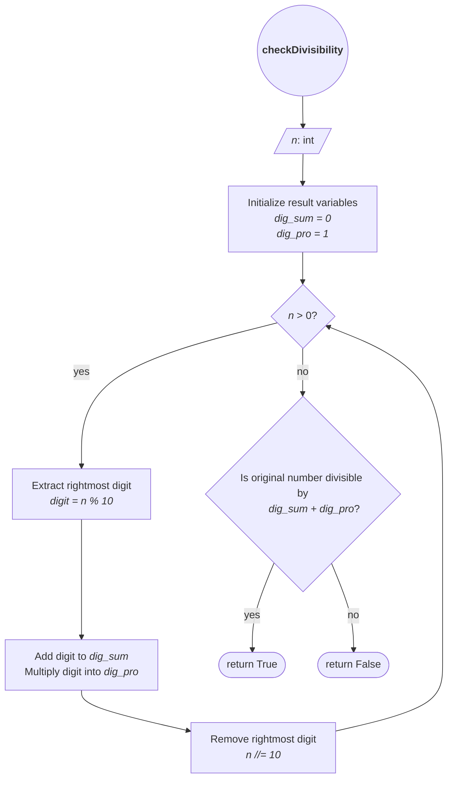

# [3622. Check Divisibility by Digit Sum and Product](https://leetcode.com/problems/check-divisibility-by-digit-sum-and-product/)

**Difficulty**: Easy

# Problem Statement

You are given a positive integer `n`. Determine whether `n` is divisible by the **sum** of the following two values:

- The **digit sum** of `n` (the sum of its digits).
    
- The **digit** **product** of `n` (the product of its digits).
    

Return `true` if `n` is divisible by this sum; otherwise, return `false`.

**Example 1:**

**Input:** n = 99

**Output:** true

**Explanation:**

Since 99 is divisible by the sum (9 + 9 = 18) plus product (9 * 9 = 81) of its digits (total 99), the output is true.

**Example 2:**

**Input:** n = 23

**Output:** false

**Explanation:**

Since 23 is not divisible by the sum (2 + 3 = 5) plus product (2 * 3 = 6) of its digits (total 11), the output is false.

**Constraints:**

- `1 <= n <= 106`
---

## Hint 1

Compute the digits' sum and product, then check if `n % (sum + product) == 0`.

---

## Intuition

The constraints rule out many edge cases that would require consideration otherwise. The input is always a positive integer, so we don't need to handle any negative numbers or division by zero.

The problem can be divided into two steps:

1. Find the **digit sum** and **digit product** of `n`.
2. Determine whether `n` is divisible by their sum.

We can extract the digits of an integer from right to left using the modulo (`%`) and floor division (`//`) operations by `10`.

For example:

```text
123
 ↓
123 % 10 = 3
123 // 10 = 12

12 % 10 = 2
12 // 10 = 1

1 % 10 = 1
1 // 10 = 0
```

This gives us each digit exactly once.

We initialize two variables to accumulate the results of processing each digit:

```python
dig_sum = 0
dig_pro = 1
```

Note that initializing the product as  `0` would cause every further multiplication to be `0`. Therefore our base product is 1 ([multiplicative identity](https://mathworld.wolfram.com/MultiplicativeIdentity.html)). 

Once the digit sum and product have been calculated, we can evaluate:

```python
n % (digit_sum + digit_product) == 0
```

---

## Algorithm



---

## Testing

The pattern used in the previous exercises is applicable here as well. The test harness passes each input to the solution and compares the returned value with the expected result. The constraints cut off most of the complex edge cases so we don't need to add additional test cases. 

```python
if __name__ == "__main__":
    sol = Solution()

    test_cases = [
        (99, True),
        (23, False),
    ]

    for i, (n, expected) in enumerate(test_cases, start=1):
        res = sol.checkDivisibility(n)

        if res == expected:
            print("TEST PASSED")
        else:
            print(f"TEST {i} FAILED:")
            print(f"    Expected: {expected}, got: {res}")
```

---

## Implementation

```python
class Solution:
    def checkDivisibility(self, number: int) -> bool:
        n = number
        dig_pro = 1
        dig_sum = 0

        while n > 0:
            digit = n % 10
            dig_pro *= digit
            dig_sum += digit
            n //= 10

        return number % (dig_pro + dig_sum) == 0
```

The variable `n` is used for value for digit extraction. The loop progressively reduces it with `n //= 10` until no digits are left. The original `number` remains unchanged so that it can be used in the final divisibility check.

---

## Complexity

The loop processes every digit of `n` exactly once. Therefore, if `D` is the number of digits in `n`, the time complexity is $O(D)$. Since `D` grows logarithmically with the value of `n`, this can also be expressed as $O(log n)$.

We keep a fixed number of integer variables at runtime regardless of the number of digits so the space complexity is $O(1)$.

---

## Takeaways
- `% 10` extracts the rightmost digit of an integer.
- `// 10` removes the rightmost digit.
- A running product should be initialized to `1`, the multiplicative identity.
- When an algorithm progressively modifies a value during processing but still needs the original value later, we keep the original value available separately.
- The complexity of digit-processing algorithms is better expressed in terms of the **number of digits**, `d`, rather than the numeric value of `n`.
