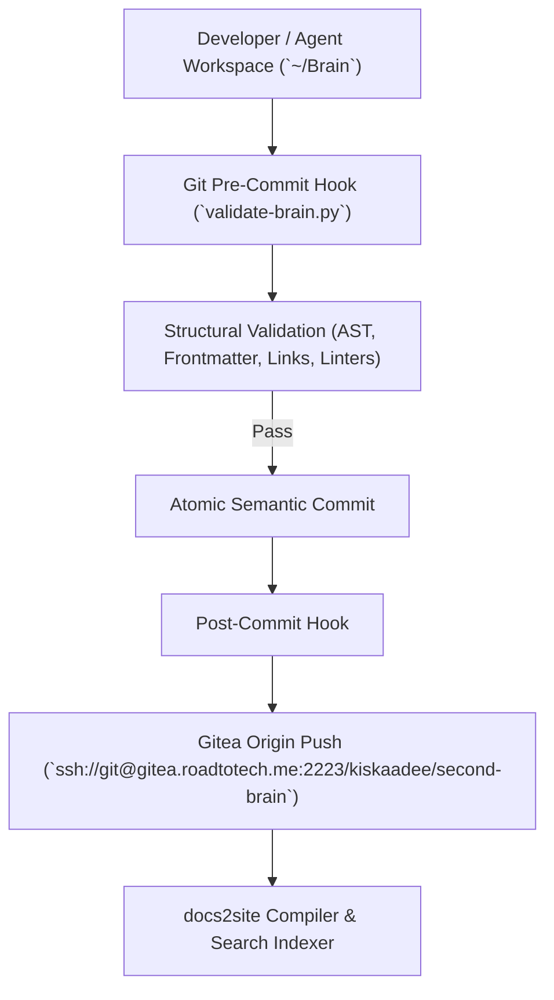

# 🧠 Second Brain Platform & Tooling (`brain`)

The **Second Brain Platform** comprises the core infrastructure, structural validators, automation toolchains, and metadata extraction pipelines that maintain the personal knowledge graph and compile documentation artifacts.

---

## 🏛️ Overview & System Topology

The Second Brain platform operates through declarative schema enforcement, automated pre-commit integrity hooks, and downstream static site compilation:

1. **Schema & Integrity Engine**: Python-based structural validation enforcing frontmatter presence, type contracts, relative link resolution, and Ruff/Pyright quality.
2. **Deterministic Extraction & Indexing Pipeline**: Planned standalone extraction utilities providing lexical signals, BM25/AST weights, and key terms without external API dependencies.
3. **Distribution & GitOps Pipeline**: Automated post-commit synchronization with the private Gitea forge and downstream documentation publishers.

---

## 📍 Source Code & Locations

| Target | Location / URL | Description |
| :--- | :--- | :--- |
| **Local Workspace** | `/home/kiskaadee/Brain` | Version-controlled knowledge repository and tooling scripts |
| **Gitea Forge** | `ssh://git@gitea.roadtotech.me:2223/kiskaadee/second-brain` | Canonical remote Git repository on Homelab Core |
| **Agent Spec** | [Second Brain Agent Spec](../../agents/second-brain.md) | Behavioral contract and curation protocol for Brain agents |

---

## 💬 Open Discussions

*None currently open.*

---

## 🚧 Work in Progress (Active Plans)

1. 🟡 [**Deterministic Term Extraction for Brain Documents**](plans/deterministic-term-extraction.md) `[Active]`
   - Cheap, reproducible, auditable lexical extraction pipeline (`scripts/extract-terms.py`, `scripts/patch-terms.py`, `scripts/stopwords.txt`) to replace non-deterministic tag generation with structural AST weighting.
2. 🟡 [**Structural Refactoring for validate-brain.py Pipeline**](plans/validate-brain-refactoring.md) `[Active]`
   - Multi-phase refactoring of the pre-commit integrity validator into a single-pass `Document`/`Issue` pipeline with line-numbered diagnostics and robust Markdown fence handling. (Phase 1 complete).

---

## 🛠️ Canonical Guides & Runbooks

* [**Deterministic Tag & Key Term Extraction Guide**](../../knowledge/methods/deterministic-tag-extraction.md) — Algorithmic approaches and architectural comparison across statistical heuristics, AST parsers, and taxonomy matchers.

---

## 🏛️ Completed Milestones & Resolved Discussions

* 🟢 **Validation & Taxonomy Foundation** — Implementation of `scripts/validate-brain.py`, pre-commit hook enforcement, and five-category semantic schema.
* 🟢 **Multi-Agent Catalog** — Formalization of `agents/` store and operational profiles.
* 🟢 [**Incident Debug Records & Daily Journal Workflow Reorganization**](plans/incident-debug-and-journal-workflow.md) — Established first-class `type: debug` records in `records/debug/`, strictly one daily journal per date in `records/journal/YYYY-MM-DD.md`, and automated inbox curation protocol.
