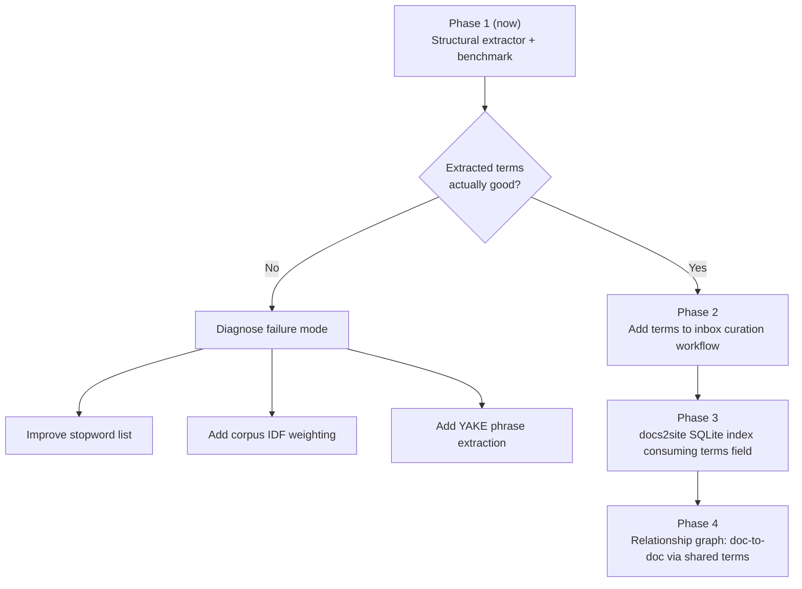

# Plan: Deterministic Term Extraction for Brain Documents

## Goal

Replace or augment AI-generated tags with a **cheap, reproducible, auditable term extraction pipeline** that runs at document ingestion time and produces lexical signals optimized for search and relationship discovery.

This plan is grounded in the feedback agent's revised assessment: **the architecture is correct; the complexity must be earned by demonstrated failure.** We start with the simplest extractor that could possibly work, measure it against the existing corpus, and only escalate when a concrete retrieval failure justifies it.

---

## Background & Corpus State

A pre-plan corpus analysis reveals the current tag situation:

| Metric | Value |
|:---|---:|
| Total documents (ex. inbox) | 132 |
| Docs with `tags:` field | 94 (71%) |
| Docs without any tags | 38 (29%) |
| Unique tags across corpus | 149 |
| Avg tags per document | 5.8 |
| **Singleton tags (appear in only 1 doc)** | **75 (50%)** |
| Tags appearing in >50% of all tagged docs | 3 |

**Key finding: The existing tags have a discriminability problem at both extremes.**

- `homelab` (65%), `operations` (54%), `architecture` (51%) are so pervasive they are essentially noise — they don't help distinguish *which* homelab document you want.
- Meanwhile, 75 of 149 unique tags appear only once, making them nearly useless for cross-document relationships.

The effective discriminating vocabulary sits in a narrow middle band. The term extraction system targets that band directly.

---

## Design Decisions

> [!IMPORTANT]
> **`terms` does not replace `tags`**. They are semantically distinct fields. `tags` are curated, human-assigned classifications. `terms` are machine-extracted retrieval signals. Both can coexist:
> ```yaml
> tags: [homelab, operations, troubleshooting]
> terms: [docker.service, network-online.target, dns, resolv.conf]
> ```

> [!NOTE]
> The feedback agent proposed calling these `terms` or `keywords` rather than `tags` to avoid conflating manually curated classifiers with machine-extracted retrieval signals. This plan follows that recommendation exactly.

> [!IMPORTANT]
> **Scope decision**: The extractor runs as a **standalone CLI script** (`scripts/extract-terms.py`). It does not modify documents in place. It outputs JSON to stdout and optionally proposes a frontmatter patch. Integration into a curation hook or docs2site pipeline is left to a future phase once the quality is validated.

---

## Open Questions

> [!IMPORTANT]
> **Do you want `terms` to be written into frontmatter of existing documents, or only applied to new inbox documents during curation?**
> The recommended path is: output only, inspect manually first, then decide if bulk-patching is warranted.

> [!IMPORTANT]
> **What is the target `K`?** How many terms per document should the extractor emit? The plan defaults to **top 8–12 terms**, but this is configurable.

---

## Proposed Changes

### Component: `scripts/extract-terms.py`

A new self-contained Python script that performs Markdown-aware lexical extraction. No dependencies beyond the Python standard library (stdlib regex + collections), making it viable in any Nix devShell without a pip install.

#### Algorithm

```
Markdown document
       │
       ├── 1. Frontmatter strip (extract raw body)
       ├── 2. Structural AST token extraction
       │       ├── H1 title tokens        × 5.0
       │       ├── H2/H3 heading tokens   × 3.0
       │       ├── Inline code `tokens`   × 3.0
       │       ├── Code fence identifiers × 2.0
       │       └── Body noun tokens       × 1.0
       ├── 3. Token normalization
       │       ├── Lowercase
       │       ├── Strip punctuation (preserve . and - for identifiers like network-online.target)
       │       └── Remove stopwords (English + domain-specific generic terms)
       └── 4. Score aggregation → sort → top K
```

The structural weight formula:

```
score(term) = Σ structural_weight(occurrence_type)
              + log(1 + frequency_in_doc)
```

#### [NEW] `scripts/extract-terms.py`

```python
#!/usr/bin/env python3
"""
Brain Term Extractor
Usage:
    python scripts/extract-terms.py <file.md>          # single doc, print JSON
    python scripts/extract-terms.py --corpus           # all docs, print report
    python scripts/extract-terms.py --bench            # compare vs existing tags

Output (single doc):
    {
      "file": "records/journal/...",
      "terms": ["docker", "dns", "network-online.target", ...]
    }
"""

import re, sys, json, math
from collections import Counter, defaultdict
from pathlib import Path

# ── Configuration ─────────────────────────────────────────────────────────────

BRAIN_ROOT  = Path(__file__).parent.parent
TOP_K       = 10    # terms to emit per document
MIN_TERM_LEN = 2    # minimum token character length

STRUCTURAL_WEIGHTS = {
    "h1":         5.0,
    "h2":         3.0,
    "h3":         3.0,
    "code_inline": 3.0,
    "code_fence":  2.0,
    "emphasis":    2.0,
    "link_text":   2.0,
    "body":        1.0,
}

# Generic terms that are never useful as retrieval signals in this corpus
STOPWORDS = {
    # English function words
    "the", "a", "an", "and", "or", "but", "in", "on", "at", "to", "for",
    "of", "with", "by", "from", "is", "are", "was", "were", "be", "been",
    "this", "that", "it", "its", "not", "no", "as", "if", "so", "then",
    "when", "where", "how", "what", "which", "who", "we", "i", "you",
    # Domain-generic terms (corpus-specific)
    "homelab", "operations", "architecture", "note", "guide", "notes",
    "overview", "summary", "example", "configuration", "setup", "service",
    "file", "step", "section", "see", "also", "use", "using", "run",
    # Markdown structural artifacts
    "md", "yaml", "http", "https", "true", "false", "null",
}


def extract_terms(text: str, top_k: int = TOP_K) -> list[str]:
    """Return top_k terms from a Markdown document, deterministically."""
    # Strip frontmatter
    body = re.sub(r'^---\n.*?\n---\n?', '', text, flags=re.DOTALL)

    scores: Counter = Counter()

    def add_tokens(fragment: str, weight: float) -> None:
        """Tokenize a text fragment, score each token."""
        # Preserve technical identifiers like network-online.target, pg_dump
        tokens = re.findall(r'[\w][\w.\-]*[\w]|[\w]{2,}', fragment.lower())
        for tok in tokens:
            if len(tok) < MIN_TERM_LEN or tok in STOPWORDS:
                continue
            # Skip pure numbers
            if re.fullmatch(r'\d+', tok):
                continue
            scores[tok] += weight

    # ── H1 ──────────────────────────────────────────────────────────────────
    for m in re.finditer(r'^#\s+(.+)', body, re.MULTILINE):
        add_tokens(m.group(1), STRUCTURAL_WEIGHTS["h1"])

    # ── H2 ──────────────────────────────────────────────────────────────────
    for m in re.finditer(r'^##\s+(.+)', body, re.MULTILINE):
        add_tokens(m.group(1), STRUCTURAL_WEIGHTS["h2"])

    # ── H3 ──────────────────────────────────────────────────────────────────
    for m in re.finditer(r'^###\s+(.+)', body, re.MULTILINE):
        add_tokens(m.group(1), STRUCTURAL_WEIGHTS["h3"])

    # ── Inline code `token` ─────────────────────────────────────────────────
    for m in re.finditer(r'`([^`\n]+)`', body):
        add_tokens(m.group(1), STRUCTURAL_WEIGHTS["code_inline"])

    # ── Code fence (first identifier per fence) ──────────────────────────────
    for m in re.finditer(r'```[\w]*\n(.*?)```', body, re.DOTALL):
        # Extract identifiers from code (first 5 lines)
        fence_lines = m.group(1).split('\n')[:5]
        for line in fence_lines:
            add_tokens(line, STRUCTURAL_WEIGHTS["code_fence"])

    # ── Emphasis **term** and *term* ─────────────────────────────────────────
    for m in re.finditer(r'\*{1,2}([^*\n]+)\*{1,2}', body):
        add_tokens(m.group(1), STRUCTURAL_WEIGHTS["emphasis"])

    # ── Link anchor text [text](#) ─────────────────────────────────────────
    for m in re.finditer(r'\[([^\]]+)\]\([^)]+\)', body):
        add_tokens(m.group(1), STRUCTURAL_WEIGHTS["link_text"])

    # ── Body prose (remaining text after stripping markup) ───────────────────
    prose = re.sub(r'`[^`\n]+`', '', body)           # strip inline code
    prose = re.sub(r'```.*?```', '', prose, flags=re.DOTALL)  # strip fences
    prose = re.sub(r'\*{1,2}[^*\n]+\*{1,2}', '', prose)      # strip emphasis
    prose = re.sub(r'\[([^\]]+)\]\([^)]+\)', r'\1', prose)    # keep link text
    prose = re.sub(r'^#{1,6}\s+.+', '', prose, flags=re.MULTILINE)  # strip headings
    add_tokens(prose, STRUCTURAL_WEIGHTS["body"])

    # Add log-frequency boost for terms that appear multiple times in body
    for term, count in Counter(
        re.findall(r'[\w][\w.\-]*[\w]|[\w]{2,}', prose.lower())
    ).items():
        if count > 1 and term in scores:
            scores[term] += math.log(1 + count) * 0.5

    return [term for term, _ in scores.most_common(top_k)]


def parse_existing_tags(text: str) -> list[str]:
    m = re.match(r'^---\n(.*?)\n---', text, re.DOTALL)
    if not m:
        return []
    fm = m.group(1)
    inline = re.search(r'^tags:\s*\[([^\]]+)\]', fm, re.MULTILINE)
    if inline:
        return [t.strip().strip('"\'') for t in inline.group(1).split(',')]
    block = re.search(r'^tags:\s*\n((?:\s*-\s*.+\n?)+)', fm, re.MULTILINE)
    if block:
        return [t.strip() for t in re.findall(r'-\s*(.+)', block.group(1))]
    return []


def cmd_single(path: Path) -> None:
    text = path.read_text()
    terms = extract_terms(text)
    print(json.dumps({"file": str(path.relative_to(BRAIN_ROOT)), "terms": terms}, indent=2))


def cmd_corpus() -> None:
    """Run extractor over all committed docs and print a term frequency report."""
    term_counter: Counter = Counter()
    doc_count = 0

    for md in sorted(BRAIN_ROOT.rglob("*.md")):
        if any(x in str(md) for x in ["inbox", ".git", "scripts"]):
            continue
        text = md.read_text()
        terms = extract_terms(text)
        term_counter.update(terms)
        doc_count += 1
        print(f"  {md.relative_to(BRAIN_ROOT)}: {terms}", file=sys.stderr)

    print(f"\nCorpus: {doc_count} docs, {len(term_counter)} unique extracted terms\n")
    print("Top 30 extracted terms:")
    for term, count in term_counter.most_common(30):
        print(f"  {count:3d}  {term}")


def cmd_bench() -> None:
    """Compare extracted terms vs existing tags for each document."""
    results = []
    for md in sorted(BRAIN_ROOT.rglob("*.md")):
        if any(x in str(md) for x in ["inbox", ".git", "scripts"]):
            continue
        text = md.read_text()
        existing = parse_existing_tags(text)
        if not existing:
            continue
        extracted = extract_terms(text, top_k=15)
        overlap = set(existing) & set(extracted)
        results.append({
            "file": str(md.relative_to(BRAIN_ROOT)),
            "existing_tags": existing,
            "extracted_terms": extracted[:10],
            "overlap": sorted(overlap),
            "overlap_pct": len(overlap) / len(existing) * 100 if existing else 0,
        })

    avg_overlap = sum(r["overlap_pct"] for r in results) / len(results) if results else 0
    print(f"Benchmark: {len(results)} docs, avg tag overlap: {avg_overlap:.1f}%\n")

    # Show 10 worst-overlap docs (most novel extraction vs tags)
    results.sort(key=lambda r: r["overlap_pct"])
    print("== Lowest overlap (most divergent from existing tags) ==")
    for r in results[:10]:
        print(f"\n  {r['file']}")
        print(f"  Existing tags: {r['existing_tags']}")
        print(f"  Extracted:     {r['extracted_terms']}")
        print(f"  Overlap:       {r['overlap']} ({r['overlap_pct']:.0f}%)")


if __name__ == "__main__":
    if "--corpus" in sys.argv:
        cmd_corpus()
    elif "--bench" in sys.argv:
        cmd_bench()
    elif len(sys.argv) > 1:
        cmd_single(Path(sys.argv[1]))
    else:
        print(__doc__)
```

---

### Component: Frontmatter Patch Script

A second utility to apply extracted terms to a single document's frontmatter as a `terms:` field, **preserving all existing fields**. Used manually after inspection.

#### [NEW] `scripts/patch-terms.py`

```python
#!/usr/bin/env python3
"""
Patch a Markdown document with extracted terms.
Usage:
    python scripts/patch-terms.py <file.md> [--dry-run]

Adds or replaces the `terms:` field in the document's YAML frontmatter.
Does NOT modify the `tags:` field.
"""

import re, sys
from pathlib import Path
from extract_terms import extract_terms   # import sibling

BRAIN_ROOT = Path(__file__).parent.parent

def patch_frontmatter(path: Path, terms: list[str], dry_run: bool = False) -> None:
    text = path.read_text()
    m = re.match(r'^(---\n)(.*?)(\n---)', text, re.DOTALL)
    if not m:
        print(f"No frontmatter found in {path}", file=sys.stderr)
        return

    prefix, fm_body, suffix = m.group(1), m.group(2), m.group(3)
    rest = text[m.end():]

    # Remove existing terms field if present
    fm_body = re.sub(r'^terms:.*?(?=\n\S|\Z)', '', fm_body, flags=re.MULTILINE | re.DOTALL).strip()

    terms_yaml = "terms:\n" + "\n".join(f"  - {t}" for t in terms)
    new_fm = prefix + fm_body + "\n" + terms_yaml + suffix
    new_text = new_fm + rest

    if dry_run:
        print(new_text)
    else:
        path.write_text(new_text)
        print(f"Patched {path.relative_to(BRAIN_ROOT)}: terms = {terms}")

if __name__ == "__main__":
    if len(sys.argv) < 2:
        print(__doc__)
        sys.exit(1)
    path = Path(sys.argv[1])
    dry_run = "--dry-run" in sys.argv
    terms = extract_terms(path.read_text())
    patch_frontmatter(path, terms, dry_run=dry_run)
```

---

### Component: Stopword Tuning File

A plaintext file that lets you extend the stopword list per-corpus without editing code. Loaded by the extractor at startup.

#### [NEW] `scripts/stopwords.txt`

```text
# Brain-specific stopwords — generic terms that add no retrieval value
homelab
operations
architecture
overview
summary
notes
guide
example
setup
configuration
service
section
step
see
also
using
use
run
```

---

## Verification Plan

### Phase 1 — Corpus Smoke Test (runs immediately after implementation)

```bash
# Run extractor over all docs; inspect term distribution
python scripts/extract-terms.py --corpus 2>/dev/null

# Expected: top extracted terms should look meaningfully different
# from the top tags (less dominated by homelab/operations/architecture)
```

### Phase 2 — Benchmark Against Existing Tags

```bash
python scripts/extract-terms.py --bench 2>/dev/null
```

**Evaluation questions** (manually inspect results):

1. Are the top extracted terms obviously descriptive of their document?
2. Are highly generic terms (`homelab`, `operations`) suppressed?
3. Are technical identifiers preserved (`docker.service`, `network-online.target`)?
4. Do the extracted terms for related documents share meaningful overlap?
5. Do unrelated documents *not* share too many terms?

### Phase 3 — Single Document Spot Check

```bash
python scripts/extract-terms.py records/debug/2026-09-18-gitea-github-mirror-dns-resolution-failure.md
```

Expected output should contain terms like: `docker`, `dns`, `resolv.conf`, `mirror`, `network-online.target`, `gitea` — not generic terms like `operations` or `homelab`.

### Manual Verification Checklist

- [ ] Script runs with no pip dependencies
- [ ] Same input always produces identical output (determinism)
- [ ] Benchmark avg overlap with existing tags is reported
- [ ] `--dry-run` on patch script produces valid frontmatter
- [ ] Validator (`scripts/validate-brain.py`) still passes after any patches

---

## Phased Evolution (post-validation)



> [!NOTE]
> YAKE, TF-IDF corpus weighting, and synonym normalization (FlashText) are deferred until Phase 1 benchmark reveals a concrete failure that requires them. Complexity is **earned**, not assumed.


---

## Related Documentation

* [Second Brain Platform Overview](../README.md)
* [Deterministic Tag & Key Term Extraction Methodology](../../../knowledge/methods/deterministic-tag-extraction.md)
* [Second Brain Curation Agent Specification](../../../agents/second-brain.md)
