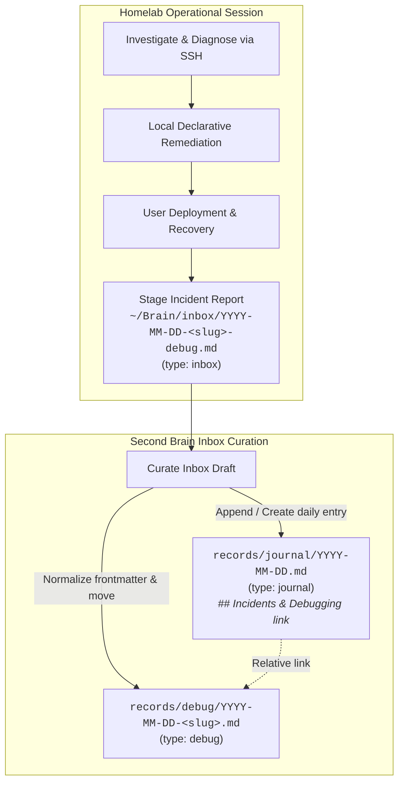

# Implementation Plan: Incident Debug Records & Daily Journal Workflow Reorganization

## Goal Description

Establish a clean separation of concerns across the Second Brain (`~/Brain`) and operational homelab repository (`~/Homelab`):
1. **Daily Journals (`records/journal/YYYY-MM-DD.md`)**: Strictly one entry per day serving as a cohesive daily log across all projects, tracking wins, progress, reflections, mistakes/lessons learned, and linking to specialized debug reports.
2. **Epistemic Incident Reports (`records/debug/YYYY-MM-DD-<slug>.md`)**: First-class technical artifacts (`type: debug`) capturing scientific root cause analyses (RCAs), protocol investigations, and operational post-mortems following the modular epistemic progression.
3. **Inbox Staging Lifecycle**: Operational agents stage incident reports into `~/Brain/inbox/YYYY-MM-DD-<slug>-debug.md` (`type: inbox`). During curation, the report is normalized into `records/debug/`, and the daily journal for that date (`records/journal/YYYY-MM-DD.md`) is updated with a summary and relative link in a dedicated `## Incidents & Debugging` section.



---

## Canonical Decisions & Invariants

- **`type: debug`**: First-class citizen in the Brain taxonomy, validated by `scripts/validate-brain.py`.
- **Daily Journal Invariant**: `records/journal/` strictly contains one file per date formatted as `YYYY-MM-DD.md`.
- **Journal Integration**: A dedicated `## Incidents & Debugging` section in `records/journal/YYYY-MM-DD.md` summarizes root causes and remediation actions with relative links to `../debug/YYYY-MM-DD-<slug>.md`.
- **Semantic Commit Type**: `debug` added to repository semantic commit standards (`debug(<scope>): <short description>`).

---

## Implemented Changes

### 1. Second Brain Governance & Validator (`~/Brain`)
- **First-Class `type: debug`**:
  - Added `"debug"` to `VALID_TYPES` in [`scripts/validate-brain.py`](../../../scripts/validate-brain.py).
  - Documented `records/debug/` in the semantic contract table and directory definitions of [`AGENTS.md`](../../../AGENTS.md).
  - Added `# debug` frontmatter template and documented the `debug` commit type.
  - Formalized inbox curation processing rules for `*-debug.md` files.
- **Methodology & Agent Profiles**:
  - Updated [`knowledge/methods/incident-investigation-and-journaling.md`](../../../knowledge/methods/incident-investigation-and-journaling.md) to reference `records/debug/YYYY-MM-DD-<slug>.md` with `type: debug`.
  - Updated [`agents/homelab-operations.md`](../../../agents/homelab-operations.md) to reflect the operational staging workflow into `inbox/YYYY-MM-DD-<slug>-debug.md`.

### 2. Homelab Operations Contract (`~/Homelab`)
- **Operational Staging**:
  - Updated workflow diagram and operational steps in `Homelab/AGENTS.md` to stage post-incident RCA artifacts to `~/Brain/inbox/YYYY-MM-DD-<slug>-debug.md`.
  - Updated Section 4 to "Post-Incident Debugging & Epistemic Reporting" defining staging schema and handoff to Brain curation.

### 3. Records Migration & Partitioning (`~/Brain/records/`)
- **Migrated Incident Reports to `records/debug/` (`type: debug`)**:
  1. [`records/debug/2026-09-14-server-unexpected-shutdown-rca.md`](../../../records/debug/2026-09-14-server-unexpected-shutdown-rca.md)
  2. [`records/debug/2026-09-18-gitea-actions-nix-runner-fix.md`](../../../records/debug/2026-09-18-gitea-actions-nix-runner-fix.md)
  3. [`records/debug/2026-09-18-gitea-github-mirror-dns-resolution-failure.md`](../../../records/debug/2026-09-18-gitea-github-mirror-dns-resolution-failure.md)
  4. [`records/debug/2026-09-21-gitea-actions-fhs-nix-container-fix.md`](../../../records/debug/2026-09-21-gitea-actions-fhs-nix-container-fix.md)
  5. [`records/debug/2026-09-21-gitops-webhook-payload-signature-mismatch.md`](../../../records/debug/2026-09-21-gitops-webhook-payload-signature-mismatch.md)
  6. [`records/debug/2026-09-22-diun-socket-proxy-integration-and-stalwart-alerting.md`](../../../records/debug/2026-09-22-diun-socket-proxy-integration-and-stalwart-alerting.md)

- **Unified Daily Journals Created in `records/journal/` (`type: journal`, strictly `YYYY-MM-DD.md`)**:
  1. [`records/journal/2026-09-11.md`](../../../records/journal/2026-09-11.md) — NixOS appliance cutover and documentation overhaul.
  2. [`records/journal/2026-09-13.md`](../../../records/journal/2026-09-13.md) — Milestone P0: GitOps Trust Boundary Implementation deliverables and invariant proofs.
  3. [`records/journal/2026-09-14.md`](../../../records/journal/2026-09-14.md) — Milestone P0 closure & P1 transition (Wins) + Server Unexpected Shutdown RCA link.
  4. [`records/journal/2026-09-15.md`](../../../records/journal/2026-09-15.md) — Stalwart email infrastructure, deliverability architecture, Brevo relay, and webmail deployment.
  5. [`records/journal/2026-09-18.md`](../../../records/journal/2026-09-18.md) — Daily wins + links to Nix runner hang and Docker mirror DNS failure debug records.
  6. [`records/journal/2026-09-21.md`](../../../records/journal/2026-09-21.md) — appctl Engine V2 rework & TDD scaffold (Wins) + links to Gitea Actions FHS container fix and Webhook signature mismatch RCAs.
  7. [`records/journal/2026-09-22.md`](../../../records/journal/2026-09-22.md) — Diun socket proxy integration and Stalwart alerting (Wins) + link to Diun provider RCA.

- **Cross-References Updated**:
  - [`projects/homelab/guides/brain-gitops-deployment-pipeline.md`](../../../projects/homelab/guides/brain-gitops-deployment-pipeline.md)
  - [`projects/brain/plans/deterministic-term-extraction.md`](deterministic-term-extraction.md)

---

## Directory Layout Comparison

### Before
```
records/
├── debug/              (empty)
├── decisions/
├── discussions/
└── journal/
    ├── 2026-06-25.md
    ├── 2026-06-26.md
    ├── ...
    ├── 2026-09-11-homelab-core-nixos-appliance-cutover.md
    ├── 2026-09-13-homelab-core-p0-gitops-trust-boundary.md
    ├── 2026-09-14-homelab-core-p0-closure-and-p1-transition.md
    ├── 2026-09-14-server-unexpected-shutdown-rca.md
    ├── 2026-09-15-stalwart-email-server-and-webmail-deployment.md
    ├── 2026-09-18-gitea-actions-nix-runner-fix.md
    ├── 2026-09-18-gitea-github-mirror-dns-resolution-failure.md
    ├── 2026-09-21-appctl-engine-v2-rework-and-tdd-scaffold.md
    ├── 2026-09-21-gitea-actions-fhs-nix-container-fix.md
    ├── 2026-09-21-gitops-webhook-payload-signature-mismatch.md
    └── 2026-09-22-diun-socket-proxy-integration-and-stalwart-alerting.md
```

### After
```
records/
├── debug/                                  # Epistemic RCAs & postmortems (type: debug)
│   ├── 2026-09-14-server-unexpected-shutdown-rca.md
│   ├── 2026-09-18-gitea-actions-nix-runner-fix.md
│   ├── 2026-09-18-gitea-github-mirror-dns-resolution-failure.md
│   ├── 2026-09-21-gitea-actions-fhs-nix-container-fix.md
│   ├── 2026-09-21-gitops-webhook-payload-signature-mismatch.md
│   └── 2026-09-22-diun-socket-proxy-integration-and-stalwart-alerting.md
├── decisions/
├── discussions/
└── journal/                                # Strictly 1 file per day (type: journal)
    ├── 2026-06-25.md
    ├── 2026-06-26.md
    ├── 2026-06-29.md
    ├── 2026-06-30.md
    ├── 2026-07-01.md
    ├── 2026-08-10.md
    ├── 2026-08-16.md
    ├── 2026-09-11.md
    ├── 2026-09-13.md
    ├── 2026-09-14.md
    ├── 2026-09-15.md
    ├── 2026-09-18.md
    ├── 2026-09-21.md
    └── 2026-09-22.md
```

---

## Verification & Validation

Execution of `python scripts/validate-brain.py`:
```text
Checking deprecated directories...
  ✓ Done.

Checking required root files...
  ✓ Done.

Checking frontmatter...
  ✓ Done (0 issues).

Checking relative links...
  ✓ Done (0 broken links).

Checking markdown code fences...
  ✓ Done (0 issues).

Checking Mermaid diagrams...
  ✓ Done (0 issues).

Checking Python code quality (Ruff)...
  ✓ Done (0 lint issues).

Checking Python type consistency (Pyright)...
  ✓ Done (0 type errors).

✅ All checks passed. Brain structure is valid.
```
