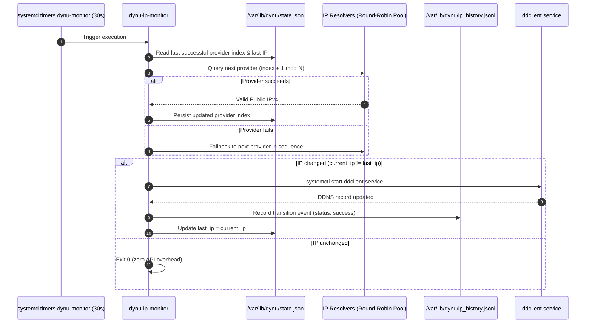

# 🔄 dynu-monitor — High-Frequency Smart DDNS Monitor

## 🎯 Project Overview

`dynu-monitor` is a lightweight, local-first dynamic DNS change detector and smart trigger daemon. It monitors the machine's public IPv4 address and triggers dynamic DNS updates (via `ddclient.service`) only when a verified IP change has occurred.

By acting as a local gatekeeper in front of the DNS updater, it prevents unnecessary API spam to DNS providers, avoids IP change detection latency, and distributes external IP lookup queries across multiple external echo services using a stateful round-robin rotation strategy.

---

## 🏛️ System Architecture

---

## 🗺️ Implementation Tracks

The project spans two iterative phases:

### 1. Python / NixOS Implementation *(Completed)*
- **Status**: Completed and verified on branch `refactor/dynu-monitor`.
- **Key Features**:
  - 30-second polling interval via `systemd.timers.dynu-monitor`.
  - Stateful round-robin rotation across 5 public providers (`api.ipify.org`, `icanhazip.com`, `ifconfig.me`, `checkip.dynu.com`, `wtfismyip.com`).
  - Atomic persistence to `/var/lib/dynu/state.json`.
  - Modernized UTC timezone handling (`datetime.now(timezone.utc)`).
- **Documentation**: [**High-Frequency Provider-Rotating Monitor Plan**](plans/provider-rotating-monitor-plan.md)

### 2. Standalone Rust Binary *(Active / In Planning)*
- **Status**: Planning and domain modeling phase at `/home/kiskaadee/Projects/active/dynu-monitor`.
- **Goals**:
  - Clean separation between domain orchestration (`IpMonitorService`) and external infrastructure (`IpResolver`, `StateRepository`, `DdnsUpdater`).
  - Zero Python runtime dependencies for minimal footprint on headless servers.
  - Comprehensive unit test coverage with dependency injection and trait mocks.
- **Documentation**: [**Rust Migration Plan & Milestones**](plans/rust-migration-plan.md)

---

## 📑 Project Documents & Plans

- [**High-Frequency Provider-Rotating Monitor Plan & Walkthrough**](plans/provider-rotating-monitor-plan.md) — Architectural design, 5-provider pool, systemd timer config, and verification results for the Python implementation.
- [**Rust Migration Plan**](plans/rust-migration-plan.md) — Architecture, domain entities, invariants, and phased milestones for the native Rust daemon.
