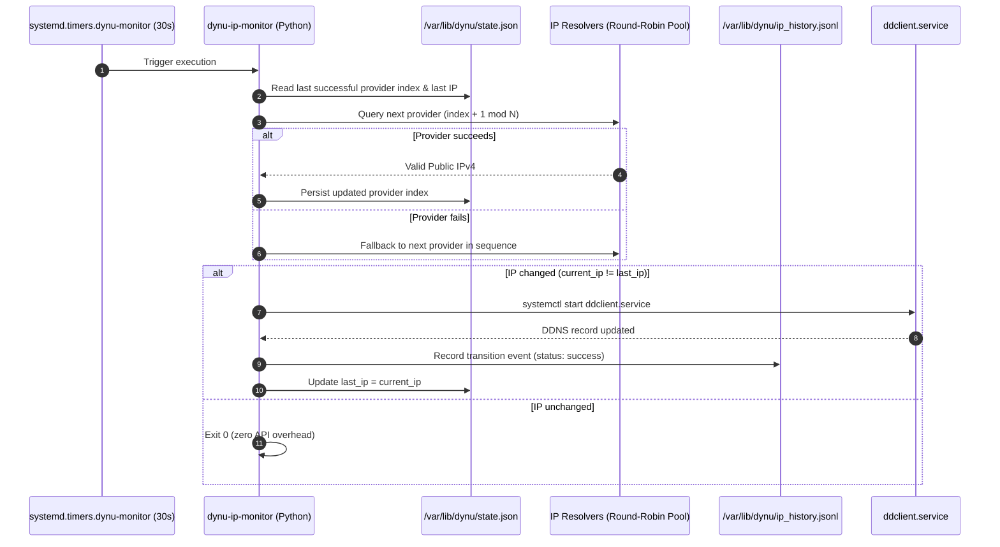

# 🔄 High-Frequency Provider-Rotating Dynu DDNS Monitor

## 🎯 Motivation & Goals

The default Dynu DDNS change detection mechanism operated on a 30-minute interval and queried a single external IP discovery provider. During ISP WAN IP rotations, services on `roadtotech.me` remained inaccessible for extended durations before the rotation was detected.

### Architectural Objectives:
1. **Near-Instant WAN Change Detection**: Reduce the polling interval from 30 minutes to **30 seconds** so that WAN rotations are detected in seconds.
2. **Stateful Round-Robin Provider Rotation**: Query an expanded pool of 5 reputable echo providers sequentially. This distributes requests such that each provider is queried at most once every 2.5 minutes (~24 requests/hour), well within public terms of service.
3. **Atomic State Persistence**: Save current IP and resolver rotation index to `/var/lib/dynu/state.json`.
4. **Modernized Datetime Handling**: Replace deprecated `datetime.utcnow()` with `datetime.now(timezone.utc)`.

---

## 🏛️ Architecture & Sequence



---

## 🛠️ Implementation Details

### 1. Resolver Pool & Script (`hosts/server/monitor.py`)
- **Configured Resolver Providers**:
  1. `https://api.ipify.org`
  2. `https://icanhazip.com`
  3. `https://ifconfig.me/ip`
  4. `https://checkip.dynu.com`
  5. `https://wtfismyip.com/text`
- **State Persistence**: Atomic read and write to `STATE_FILE` (`/var/lib/dynu/state.json`):
  ```json
  {
    "last_provider_index": 2,
    "last_ip": "186.168.137.93"
  }
  ```
- **Fallback Ring Buffer**: Circular traversal starting at `(last_provider_index + 1) % len(PROVIDERS)` with automatic fallback to next providers upon timeout or connection errors.

### 2. Declarative Systemd Units (`hosts/server/dynu.nix`)
- **Timer Configuration**:
  ```nix
  systemd.timers.dynu-monitor = {
    description = "Timer for Dynu DDNS Smart IP Change Monitor";
    timerConfig = {
      OnBootSec = "10s";
      OnUnitActiveSec = "30s";
      AccuracySec = "1s";
      Persistent = true;
    };
    wantedBy = [ "timers.target" ];
  };
  ```
- **Service Environment**:
  ```nix
  systemd.services.dynu-monitor.serviceConfig.Environment = [
    "STATE_FILE=/var/lib/dynu/state.json"
  ];
  ```

---

## 🔄 Verification & Testing

### 1. Flake & Derivation Builds
```bash
# Validate flake expressions
nix flake check

# Dry build server host configuration
nix build .#nixosConfigurations.server.config.system.build.toplevel --no-link

# Dry build workstation configurations
nix build .#nixosConfigurations.desktop.config.system.build.toplevel --no-link
nix build .#nixosConfigurations.laptop.config.system.build.toplevel --no-link
```

### 2. Runtime Verification
- **Timer Frequency**: `systemctl list-timers dynu-monitor.timer` shows active 30s recurrence.
- **Provider Rotation**: `journalctl -u dynu-monitor.service -f` logs successive queries rotating cleanly across the 5 resolvers.
- **State File**: `/var/lib/dynu/state.json` updates atomically after each successful poll.
