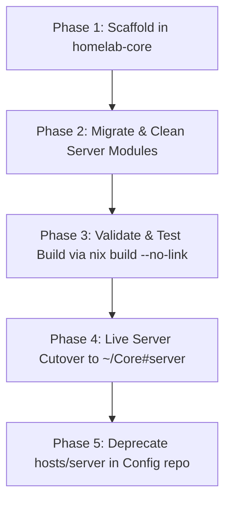

# Implementation Plan: Turn `homelab-core` into a Declarative NixOS Appliance

## Goal Description

Transform **`homelab-core`** from a standalone Docker Compose project into a complete, self-contained **NixOS system appliance**.

### The Primary Objective (Disaster Recovery & Turnkey Provisioning)
If the server hardware fails or is wiped tomorrow, any x86_64 machine can be transformed into the identical production homelab node immediately after a minimal NixOS base install by running:

```bash
git clone ssh://git@gitea.roadtotech.me:2223/kiskaadee/homelab-core ~/Core
sudo nixos-rebuild switch --flake ~/Core#server
```

Once `homelab-core` is established and validated, the legacy `hosts/server/` directory in `Config` will be deprecated and removed, completing the architectural separation of concerns between **personal workstation** (`Config`) and **infrastructure appliance** (`homelab-core`).

---

## Architecture of `homelab-core` as a NixOS Appliance

```text
homelab-core/
├── flake.nix                  # Minimal server flake (inputs: nixpkgs + sops-nix)
├── flake.lock                 # Pinned server channel dependencies
├── .sops.yaml                 # SOPS creation rules (server age key + user age key)
│
├── nixos/                     # ⚙️ Declarative OS & Infrastructure Modules
│   ├── configuration.nix      # Pure headless OS (Docker, SSH, user, power tuning)
│   ├── hardware-configuration.nix # Server storage, EFI, and CPU definitions
│   ├── secrets.yaml           # Encrypted server secrets (Authelia, Dynu, tokens)
│   ├── modules/
│   │   ├── homeserver.nix     # Systemd lifecycle for Docker Compose & runtime envs
│   │   ├── traefik.nix        # Traefik deployment secrets & dynamic config bridges
│   │   ├── dynu.nix           # Smart DDNS monitor service & systemd timers
│   │   └── gitops.nix         # Declarative webhook dispatcher on port 9000
│   └── scripts/
│       ├── monitor.py         # Smart IP rotation monitor daemon
│       └── ddclient.conf      # DDNS configuration template
│
├── docker-compose.yml         # Core container stack (Traefik, Authelia, Socket-Proxy, etc.)
├── config/                    # Static service configs (Traefik dynamic yaml, Authelia config)
├── scripts/                   # Operations & automation (appctl, gitops_dispatcher.py)
└── docs/                      # Homelab operational guides & runbooks
```

---

## User Review Required

> [!IMPORTANT]
> **Channel Selection for Homelab Server**:
> - **Option A (Recommended)**: Official `nixos-unstable` channel tarball (`https://channels.nixos.org/nixos-unstable/nixexprs.tar.zst`), keeping packages identical to current server deployments.
> - **Option B**: Official `nixos-24.11` (or current stable release), maximizing stability and minimizing kernel/Docker churn for production uptime.

> [!NOTE]
> **No Home Manager on the Server**:
> In `homelab-core`, we eliminate Home Manager entirely. The server relies on native NixOS system configurations:
> - `programs.tmux.enable = true;` (stock `Ctrl+b` prefix, avoiding nested session collisions).
> - `programs.neovim = { enable = true; defaultEditor = true; };` (zero plugin lag, instant startup).
> - `environment.systemPackages = with pkgs; [ git htop iotop iftop ncdu curl jq age sops docker-compose ];`

---

## Step-by-Step Implementation Roadmap



### Phase 1: Repository Scaffolding in `homelab-core`
1. Create a dedicated branch in `/home/kiskaadee/Projects/active/homelab/homelab-core`:
   `feat/nixos-appliance`
2. Create directory `nixos/` with subdirectories `nixos/modules/` and `nixos/scripts/`.
3. Create `.sops.yaml` in `homelab-core` containing the server's age key (`*server`) and user's key (`*kiskaadee`).

### Phase 2: Module Migration & Cleansing
1. **Transfer Files**:
   - Copy `hosts/server/secrets.yaml` → `homelab-core/nixos/secrets.yaml`
   - Copy `hosts/server/hardware-configuration.nix` → `homelab-core/nixos/hardware-configuration.nix`
   - Copy `hosts/server/dynu.nix`, `monitor.py`, `ddclient.conf` → `homelab-core/nixos/modules/` & `nixos/scripts/`
   - Copy `hosts/server/homeserver.nix` and `traefik-deployments.nix` → `homelab-core/nixos/modules/`
2. **Clean Up `configuration.nix`**:
   - **Eliminate desktop inheritance**: Remove import of `modules/system/base.nix`.
   - **Eliminate `lib.mkForce false` hacks**: Remove overrides disabling PipeWire, printing, Bluetooth, and greetd, since none of them are imported.
   - Include pure server essentials:
     - Timezone (`America/Bogota`), Locale (`en_US.UTF-8`).
     - OpenSSH daemon with authorized keys.
     - Docker virtualization (`virtualisation.docker.enable = true`).
     - Systemd power tuning (no suspend/sleep).
     - Standard CLI packages (`tmux`, `neovim`, `git`, `htop`, `iotop`, `ncdu`, `curl`, `jq`).
3. **Draft Minimal `flake.nix` in `homelab-core`**:
   ```nix
   {
     description = "Homelab Core - Turnkey Declarative NixOS Appliance";

     inputs = {
       nixpkgs.url = "https://channels.nixos.org/nixos-unstable/nixexprs.tar.zst";
       sops-nix = {
         url = "github:Mic92/sops-nix";
         inputs.nixpkgs.follows = "nixpkgs";
       };
     };

     outputs = { self, nixpkgs, sops-nix, ... }@inputs: {
       nixosConfigurations.server = nixpkgs.lib.nixosSystem {
         system = "x86_64-linux";
         specialArgs = { inherit inputs; };
         modules = [
           ./nixos/configuration.nix
           sops-nix.nixosModules.sops
         ];
       };
     };
   }
   ```

### Phase 3: Dry-Build Validation
1. Run `nix flake check` inside `homelab-core`.
2. Execute dry system build:
   ```bash
   nix build .#nixosConfigurations.server.config.system.build.toplevel --no-link
   ```
3. Verify evaluation completes with zero errors and matches the production server environment.

### Phase 4: Live Server Cutover
1. Push branch `feat/nixos-appliance` to Gitea.
2. On the server host (`server`):
   ```bash
   cd ~/Core
   git fetch && git checkout feat/nixos-appliance
   sudo nixos-rebuild switch --flake .#server
   ```
3. Validate services:
   - `systemctl status homeserver-core.service`
   - `systemctl status dynu-monitor.timer`
   - `systemctl status homelab-gitops.service`
   - Docker containers running via `docker ps`.
4. Merge `feat/nixos-appliance` into `main` in `homelab-core`.

### Phase 5: Deprecate & Purge `hosts/server/` from `Config`
1. On `Config`, create branch `refactor/purge-server-to-homelab-core`.
2. Remove `nixosConfigurations.server` from `Config/flake.nix`.
3. Delete `hosts/server/` directory completely.
4. Remove `server` age key from `Config/.sops.yaml`.
5. Update `Config/README.md` and `Config/architecture.md` to establish `Config` as the dedicated Workstation/Laptop repository.
6. Verify `laptop` dry build and commit.

---

## Disaster Recovery & New Machine Runbook

Document this exact runbook in `homelab-core/docs/disaster-recovery.md`:

```bash
# ==============================================================================
# 🚨 DISASTER RECOVERY RUNBOOK: PROVISIONING A FRESH HOMELAB SERVER
# ==============================================================================

# 1. Boot any machine with standard NixOS Minimal ISO (x86_64)
# 2. Partition and format root (Btrfs or Ext4) + EFI (vfat)
# 3. Mount filesystems and generate initial hardware config:
nixos-generate-config --root /mnt

# 4. Clone homelab-core into target root:
git clone https://github.com/kiskaadee/homelab-core.git /mnt/home/kiskaadee/Core
# (or via local USB backup / Gitea)

# 5. Copy the generated hardware-configuration.nix into the repo:
cp /mnt/etc/nixos/hardware-configuration.nix /mnt/home/kiskaadee/Core/nixos/hardware-configuration.nix

# 6. Restore the server age secret key (from offline password manager/backup):
mkdir -p /mnt/var/lib/sops-nix
# Place key at /mnt/var/lib/sops-nix/key.txt or /mnt/etc/ssh/ssh_host_ed25519_key

# 7. Install system directly from homelab-core:
nixos-install --flake /mnt/home/kiskaadee/Core#server

# 8. Reboot: The entire homelab, Traefik, Docker services, and GitOps wake up automatically!
reboot
```

---

## Verification Plan

### Automated Tests
1. `nix flake check` in `homelab-core`.
2. Dry system build:
   `nix build .#nixosConfigurations.server.config.system.build.toplevel --no-link`
3. Verification of systemd services declared:
   `nix eval .#nixosConfigurations.server.config.systemd.services --apply builtins.attrNames`
   Ensure `homeserver-core`, `dynu-monitor`, and `homelab-gitops` are registered.

### Manual Verification
1. Inspect decrypted `/run/secrets/` on server post-switch.
2. Confirm container reachability across `https://roadtotech.me`, `https://gitea.roadtotech.me`, etc.
