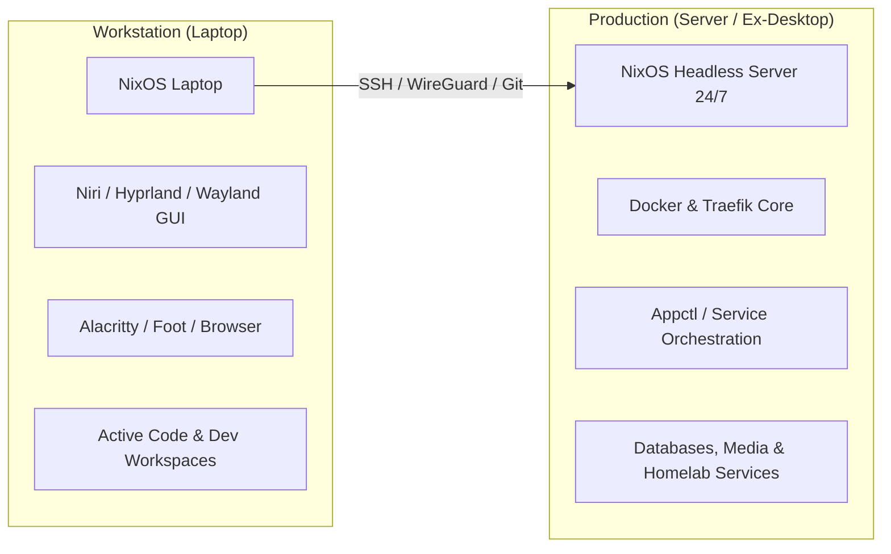

# 🖥️ NixOS Server & Laptop Workstation Migration

## 🎯 Executive Summary
Transition the physical machine (`desktop`) into a dedicated, headless, 24/7 homelab production server (`server`). Transfer all GUI workflows, desktop environments, and active development workspaces to the `laptop`.

---

## 🏗️ Architectural Topology

---

## 📋 Phased Execution Roadmap

### Phase 1: Laptop NixOS Baseline & Graphical Parity
- [x] Install NixOS on the target laptop.
- [x] Pull and configure `hosts/laptop/` from `nixos-config`.
- [x] Move graphical stack definitions (Niri, Hyprland, Waybar, Mako, Rofi/Fuzzel, audio tools) to be enabled on `hosts/laptop/`.
- [x] Verify GPU hardware acceleration (Intel/AMD/Nvidia drivers on laptop).
- [x] Test user applications and shell environments on the laptop.

### Phase 2: Workspaces & Project Data Transfer
- [x] Migrate local development repositories from desktop to laptop:
  - Working trees in `Projects/`, `Learn/`, `Experiments/`.
- [x] Configure SSH keys, GPG keys, and GitHub/Gitea credentials on the laptop.
- [x] Verify that all ongoing development compiles and runs natively on the laptop.

### Phase 3: Server Configuration & Headless Conversion
- [x] Refactor NixOS configuration repository:
  - Establish `hosts/server` as dedicated headless configuration.
  - Remove graphical packages, desktop managers, display managers (`greetd`), and desktop-only daemons from the server host.
  - Maintain homelab modules: `homeserver.nix`, `traefik-deployments.nix`, `dynu.nix`, Docker daemon, SOPS secrets.
- [x] Set up robust unattended boot, power management (disable sleep/suspend on idle), and wake-on-LAN/systemd watchdog if applicable.
- [x] Dry-build and validate server configuration (`nix build .#nixosConfigurations.server.config.system.build.toplevel --no-link`).

### Phase 4: Production Hygiene & Decommissioning
- [x] Clean up redundant folders on the server (e.g. personal browser profiles, desktop scratchpads, non-production experiments).
- [x] Verify 24/7 stability, monitoring, and auto-restart of all Docker containers on boot.

---

## 🏁 Outcome & Operational State
* **Headless Server (`server`)**: Operating 24/7 at `192.168.1.36` (port 2222), hosting `Core/`, `Sites/`, `Brain/`, and `Config/`.
* **Laptop Workstation (`laptop`)**: Primary daily development machine managing repositories locally and syncing declaratively via Git and SSH.
