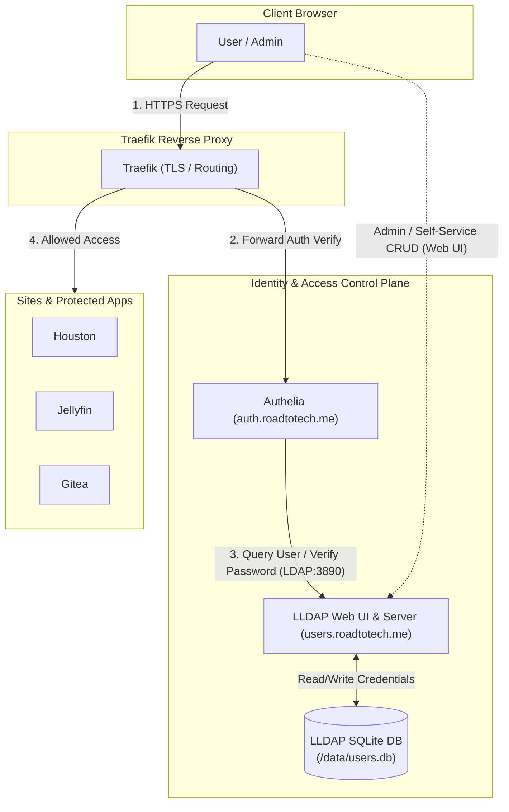

# Decoupling User Management from Secrets: Authelia + LLDAP Architecture

## Overview

Currently, Authelia uses a static `file` authentication backend (`/config/users.yml:ro`), decrypted and mounted from SOPS secrets via NixOS (`/run/secrets/rendered/users.yml`). 

While this ensures that initial user definitions are encrypted in git, it introduces major operational friction:
- **No CRUD Operations**: Adding, modifying, or deleting users requires manually editing SOPS secrets, running `nixos-rebuild`, and restarting Authelia.
- **No Self-Service**: Users cannot change or reset passwords without administrator intervention in secrets files.
- **Coupled Concerns**: User accounts (dynamic identity data) are conflated with infrastructure configuration (static secrets).

---

## The Solution: LDAP Authentication Backend via LLDAP

Authelia does not maintain its own internal user database with a CRUD API; by design, it delegates dynamic identity management to **LDAP** (Lightweight Directory Access Protocol).

The homelab and small-organization standard for this is **LLDAP** (*Lightweight LDAP*).



---

## Why LLDAP?

| Feature | Authelia `file` Backend (Current) | Authelia + LLDAP (Proposed) | OpenLDAP / FreeIPA |
| :--- | :--- | :--- | :--- |
| **User CRUD** | ❌ None (Manual YAML edit) |  **Web UI & REST/GraphQL API** |  CLI / phpLDAPadmin (Complex) |
| **Secret Updates** | ❌ Required for every change |  **Never touched after bootstrap** |  Never touched after bootstrap |
| **Memory Footprint** | ~30 MB | **~15–25 MB (Rust binary)** | 150 MB – 1.5 GB |
| **Storage Backend** | Flat YAML | Single SQLite file (or PostgreSQL) | BDB / MDB flat files |
| **Self-Service** | ❌ No |  Users can change passwords / emails |  Needs third-party portal |
| **Group RBAC** | Static YAML list |  Dynamic groups (Admins, Family, Devs) |  Standard LDAP groups |
| **External Integrations** | Authelia only |  Direct LDAP for apps (Gitea, Jellyfin, Nextcloud) |  Universal LDAP |

---

## How Secrets Are Completely Decoupled

Under the LLDAP architecture, **SOPS only manages infrastructure bootstrap secrets once**:

1. `LLDAP_JWT_SECRET`: Used by LLDAP to sign authentication tokens for its Web UI.
2. `LLDAP_LDAP_USER_PASS`: A dedicated read-only bind account password used by Authelia to query the directory (`uid=authelia,ou=people,dc=roadtotech,dc=me`).

Once these two secrets are set, **you never touch SOPS or run `nixos-rebuild` again for identity operations**:
- Adding a new family member, team member, or bot account is done via `https://users.roadtotech.me` (or via `curl` against LLDAP's REST API).
- Passwords, 2FA registration, and group memberships are saved instantly to persistent storage (`./data/users.db`).
- Authelia validates credentials dynamically against LLDAP in real time.

---

## Authelia Configuration Comparison

### Current (`file` backend)
```yaml
authentication_backend:
  file:
    path: /config/users.yml
```

### Proposed (`ldap` backend with LLDAP)
```yaml
authentication_backend:
  ldap:
    implementation: lldap
    address: 'ldap://lldap:3890'
    timeout: 5s
    start_tls: false
    base_dn: 'dc=roadtotech,dc=me'
    additional_users_dn: 'ou=people'
    users_filter: '(&({username_attribute}={input})(objectClass=person))'
    additional_groups_dn: 'ou=groups'
    groups_filter: '(member={dn})'
    user: 'uid=authelia,ou=people,dc=roadtotech,dc=me'
    password: '{{ env "AUTHELIA_LDAP_BIND_PASSWORD" }}'
```

---

## Integration Plan into Core

1. **Add `lldap` Service to `Core/docker-compose.yml`**:
   - Image: `nitnelave/lldap:stable`
   - Network: `proxy-net` (for Traefik web UI) and `internal-net` or `socket-net` (for Authelia LDAP communication).
   - Domain: `users.roadtotech.me` (protected by Traefik + optional 2FA).
   - Storage: Persistent volume `./config/lldap/data:/data`.

2. **Bootstrap Secrets in SOPS**:
   - Generate `LLDAP_JWT_SECRET` and `AUTHELIA_LDAP_BIND_PASSWORD`.
   - Store them in `traefik-deployments.env` via sops-nix.

3. **Migrate Users**:
   - Create initial users in LLDAP with their respective groups (`admin`, `users`).

4. **Switch Authelia Backend**:
   - Switch `authentication_backend` from `file` to `ldap` in `Core/config/authelia/configuration.yml`.
   - Remove `/run/secrets/rendered/users.yml` volume mount from `authelia`.

5. **Register on Dashboard**:
   - Expose LLDAP as "Identity & User Directory" under Core Infrastructure on Homepage.
