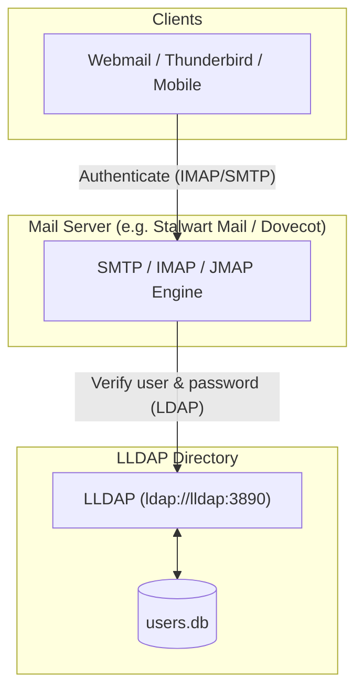

# Homelab Architecture: Authelia Session Lifetimes, Perimeter Security, and Self-Hosted Mail with LLDAP

## 1. Authelia Session & Expiration Dynamics

In Authelia, authentication sessions are managed via signed, encrypted session cookies and tokens.

### Configuration Overview
```yaml
session:
  name: authelia_session
  secret: '{{ env "AUTHELIA_SESSION_SECRET" }}'
  expiration: 43200  # 12 hours (overall lifetime)
  inactivity: 3600   # 1 hour (rolling idle timeout)
  remember_me: 1M    # 1 month (if "Remember Me" is checked)
```

- **Inactivity Timeout (`inactivity: 3600`)**: If the user leaves browser tabs open but does not generate HTTP requests through Traefik forward-auth for 1 hour, the session is invalidated for security.
- **Hard Expiration (`expiration: 43200`)**: Without checking "Remember Me", the session expires after 12 hours regardless of activity.
- **Remember Me (`remember_me: 1M`)**: When the user checks "Remember Me" at login, Authelia issues a persistent cookie valid for 1 month, bypassing the short inactivity timeout.

---

## 2. Dashboard & LLDAP Perimeter Security (Authelia Forward-Auth)

### Dashboard (`dashboard.roadtotech.me`)
- **Risk**: Homepage exposes internal service names, backend IPs, container health metrics, and direct links to administrative portals.
- **Protection**: Bound to Traefik router middleware `authelia-auth@docker`. Unauthenticated requests immediately receive `302 Found` redirecting to `https://auth.roadtotech.me`.

### LLDAP Admin UI (`users.roadtotech.me`)
- **Protection**: Bound to `authelia-auth@docker` with `policy: one_factor`.
- **Defense in Depth**: Even though LLDAP has its own internal login screen and optional TOTP 2FA, placing it behind Authelia prevents public internet scanners and automated bots from probing the LLDAP port directly.

---

## 3. Self-Hosted Email Server Architecture

### Should Mail be an "App" or part of "Core"?
**Recommendation**: **Core Infrastructure**.

#### Rationale:
1. **Foundational Service**: Mail is not just a user-facing app (like a webmail frontend); it is a core control plane dependency. Authelia (password resets), Diun (container updates), Gitea (collaboration), and Nextcloud all rely on SMTP to function.
2. **Network Requirements**: An email server requires host port bindings that bypass Traefik:
   - Port 25 (SMTP incoming/relay)
   - Port 587 (Submission / STARTTLS)
   - Port 465 (SMTPS)
   - Port 993 (IMAPS)
3. **Domain & DNS Invariants**: Email relies on root-domain DNS records: MX, SPF, DKIM (cryptographic keys in Core), and DMARC. Managing this inside Core ensures tight cohesion with Traefik TLS and DNS automation.

### Integrating Email with LLDAP Directory
**Can LLDAP serve as the user database for a mail server? Yes, 100%.**

Modern self-hosted mail servers (such as **Stalwart Mail Server**, **Mailcow**, or **Dovecot + Postfix**) natively support LDAP:



#### Key Advantages:
1. **Single Source of Truth**: Creating `jane` in LLDAP (`users.roadtotech.me`) with `jane@roadtotech.me` instantly provisions her mailbox in the mail server.
2. **Unified Passwords**: Users log into Authelia SSO, Gitea, Nextcloud, and their Email using the exact same password.
3. **Automated Groups**: LLDAP groups (e.g., `team@roadtotech.me`) can map to mail distribution lists or aliases.
