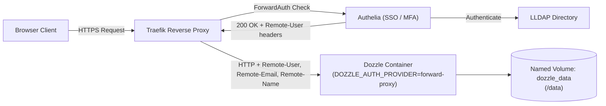

# Dozzle Authentication & Storage Architecture Recommendation

> [!NOTE] Status: Implemented
> Implemented in homelab Core repository (`docker-compose.yml`) via commit `22d3a649eae9166d03a12358e5e5058070b05888` on 2026-09-23.

```shell
commit 22d3a649eae9166d03a12358e5e5058070b05888
Author: kiskaadee <fcortesbio@gmail.com>
Date:   Wed Sep 23 12:09:13 2026 -0500

    feat(dozzle): configure forward-proxy authentication and persistent data volume
    
    - Enable DOZZLE_AUTH_PROVIDER=forward-proxy to natively ingest identity
    headers (Remote-User, Remote-Email, Remote-Name) injected by Authelia.
    
    - Set DOZZLE_AUTH_LOGOUT_URL to wire the UI logout button to the SSO
    provider. Mount the persistent named volume dozzle_data to /data to
    preserve user settings and UI preferences across container lifecycles.

diff --git a/docker-compose.yml b/docker-compose.yml
index 3d3055d..d42b5ac 100644
--- a/docker-compose.yml
+++ b/docker-compose.yml
@@ -196,6 +196,10 @@ services:
     environment:
       - DOCKER_HOST=tcp://socket-proxy:2375
       - DOCKER_API_VERSION=${DOCKER_API_VERSION:-1.40}
+      - DOZZLE_AUTH_PROVIDER=forward-proxy
+      - DOZZLE_AUTH_LOGOUT_URL=https://auth.${DOMAIN}/logout
+    volumes:
+      - dozzle_data:/data
     networks:
       - proxy-net
       - socket-net
@@ -351,3 +355,5 @@ networks:
 
 volumes:
   portainer_data:
+  dozzle_data:
```

---

## Context & Symptoms

Following a recent Dozzle image update, accessing `logs.roadtotech.me` presents a first-run setup wizard:
1. **"Turn on login"**: *"Anyone who can reach Dozzle can read your logs. Lock it down before anything else."*
2. **"/data is not mounted"**: *"Users and settings are saved to /data. Without a volume they are gone the next time the container is recreated."*

Currently, Dozzle is protected at the edge by Traefik using the `authelia-auth@docker` ForwardAuth middleware, backed by LLDAP.

---

## Architectural Evaluation of Options

### Option 1: Remove Authelia, Set Up Internal Login & Connect to LLDAP
* **Feasibility**: **Not natively supported.** Dozzle does not have an LDAP client. Its supported authentication providers (`DOZZLE_AUTH_PROVIDER`) are strictly:
  * `none` (default, no authentication)
  * `simple` (flat file `users.yml` or OIDC client credentials)
  * `forward-proxy` (trusts reverse proxy authentication headers)
* **Security & Operability**: Removing Authelia would downgrade homelab security. It would eliminate centralized Single Sign-On (SSO), two-factor authentication (TOTP/WebAuthn), and uniform session management across `*.roadtotech.me`.
* **Verdict**: **Anti-pattern and technically unworkable** without introducing an intermediate OIDC bridge.

### Option 2: "Let It Be" (Dismiss the Wizard / Continue Without Login)
* **Feasibility**: Works for basic log viewing, but with ongoing friction.
* **Drawbacks**:
  * Clicking "Continue without login" leaves Dozzle in unauthenticated mode.
  * Because `/data` is ephemeral, user preferences (pinned containers, search regexes, custom stream filters, UI themes) are wiped on every container restart or image update.
  * The setup banner or modal may re-appear across different browser sessions.
  * Dozzle remains unaware of the authenticated user identity passed by Authelia.
* **Verdict**: Suboptimal band-aid.

---

## The First-Grade Solution: Forward-Proxy Mode + Persistent Volume

The industry-standard, cleanest pattern for this architecture is **Forward-Proxy Authentication (`DOZZLE_AUTH_PROVIDER=forward-proxy`) paired with a persistent `/data` volume**.



### Why this is the First-Grade Solution

1. **Native ForwardAuth Ingestion**:
   In `Core/docker-compose.yml`, Traefik's `authelia-auth` middleware is already configured with:
   ```yaml
   traefik.http.middlewares.authelia-auth.forwardauth.authResponseHeaders=Remote-User,Remote-Groups,Remote-Email,Remote-Name
   ```
   Dozzle's `forward-proxy` mode is purpose-built to read these exact headers (`Remote-User`, `Remote-Name`, `Remote-Email`).

2. **Zero Duplicate Logins & Single Sign-On**:
   When you authenticate through Authelia using your LLDAP credentials, Traefik injects your user headers into the upstream request. Dozzle consumes them automatically. You are immediately logged into Dozzle under your LLDAP identity with your avatar and name, without seeing any login prompt or wizard.

3. **Persistent User State**:
   Mounting a named volume to `/data` gives Dozzle a durable store for:
   * Pinned and favorited containers
   * Custom log search queries and filters
   * UI display preferences
   * Session state across Watchtower / image updates

4. **Clean Logout Lifecycle**:
   Configuring `DOZZLE_AUTH_LOGOUT_URL=https://auth.${DOMAIN}/logout` wires Dozzle's logout button directly into Authelia's single-sign-out endpoint.

---

## Declarative Changes Required

Only two declarative modifications are needed in `Core/docker-compose.yml`:

```diff
   dozzle:
     image: amir20/dozzle:latest
     container_name: dozzle
     restart: always
     environment:
       - DOCKER_HOST=tcp://socket-proxy:2375
       - DOCKER_API_VERSION=${DOCKER_API_VERSION:-1.40}
+      - DOZZLE_AUTH_PROVIDER=forward-proxy
+      - DOZZLE_AUTH_LOGOUT_URL=https://auth.${DOMAIN}/logout
+    volumes:
+      - dozzle_data:/data
     networks:
       - proxy-net
       - socket-net
     labels:
       - "traefik.enable=true"
...
 volumes:
   portainer_data:
+  dozzle_data:
```

---

## Summary & Recommendation

| Criteria | Connect Dozzle to LLDAP directly | Leave As-Is (No change) | Forward-Proxy + Persistent Volume (Recommended) |
| :--- | :--- | :--- | :--- |
| **Supported by Dozzle** | ❌ No (No LDAP client) | ⚠️ Partial (Unconfigured state) | Yes (First-class native feature) |
| **Setup Complexity** | ❌ Requires OIDC provider setup | Zero effort | Low (2 environment variables + 1 volume) |
| **User Experience** | Fragmented login | Repeated setup prompt / lost settings | Seamless SSO, user avatar, persistent preferences |
| **Security Posture** | Potential exposure | Protected by Authelia edge | Defense-in-depth: Authelia edge + Dozzle identity context |
