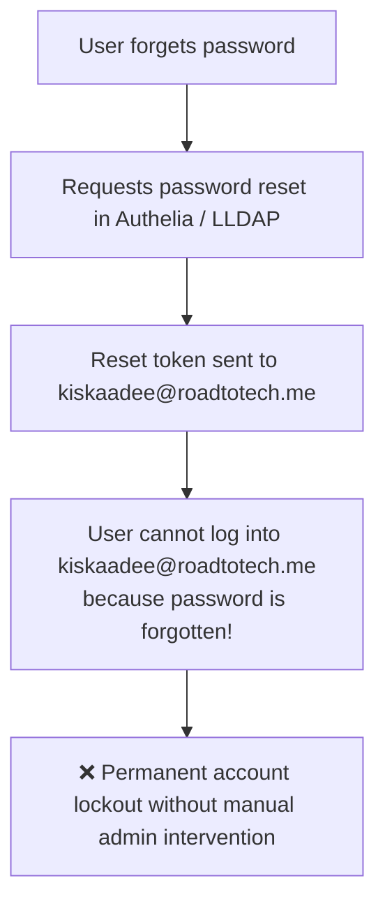

# Dual-Email Architecture: Internal Mailboxes (`@roadtotech.me`) vs. External Recovery (`@gmail.com`)

## The Problem: The "Locked Inbox" Chicken-and-Egg Catch-22

If a self-hosted mail server (Stalwart) is paired with an identity directory (LLDAP), setting `mail` exclusively to the internal domain (`kiskaadee@roadtotech.me`) creates a critical failure mode:



---

## The Solution: Dual-Email Schema

Every production identity directory (Google Workspace, Microsoft Entra ID, Okta) separates the **Primary Organizational Mailbox** from the **Secondary Recovery Email**.

### Role Separation

| Attribute | Field Name | Example | Purpose & Consumers |
| :--- | :--- | :--- | :--- |
| **Primary Mail** | `mail` | `kiskaadee@roadtotech.me` | **Stalwart Mailbox**, internal homelab communications, Gitea notifications, Git commit author. |
| **Recovery Mail** | `recovery_email` | `fcortesbio@gmail.com` | **Authelia Password Resets**, out-of-band security alerts, emergency admin contacts when the homelab server is offline. |

---

## How to Implement in LLDAP

LLDAP supports dynamic user schema extension via its GraphQL API:

```graphql
mutation {
  addUserAttribute(
    name: "recovery_email",
    attributeType: STRING,
    isList: false,
    isVisible: true,
    isEditable: true
  ) {
    ok
  }
}
```

### Result in LLDAP Web UI (`users.roadtotech.me`)
When administrators or users view profile settings in `users.roadtotech.me`:
- **`Email`**: `kiskaadee@roadtotech.me` (Used by Stalwart Mailbox & LDAP queries).
- **`Recovery Email`**: `fcortesbio@gmail.com` (Used for emergency recovery and out-of-band notifications).

---

## Configuration Mapping

### 1. Stalwart Mail Server
- **Mailbox User ID**: `uid` (e.g. `kiskaadee`)
- **Primary Address**: `mail` (e.g. `kiskaadee@roadtotech.me`)
- Stalwart routes all incoming mail for `*@roadtotech.me` to the corresponding user mailbox.

### 2. Authelia
- When configuring Authelia password reset via email (`notifier.smtp`):
  - Authelia queries LDAP for the user's email.
  - Can map Authelia's `mail` attribute query to `recovery_email` (or fallback to `mail`).
  - Password reset links are safely delivered to `fcortesbio@gmail.com` outside of the self-hosted mail infrastructure.

### 3. Git & Developer Tools (Gitea)
- Gitea authenticates against LLDAP and uses `mail` (`kiskaadee@roadtotech.me`) as the primary commit and notification email.
